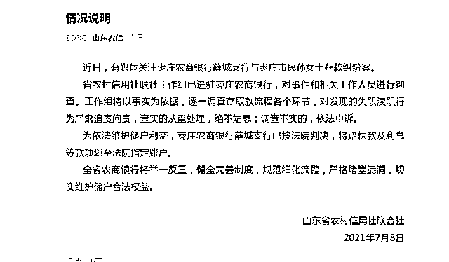
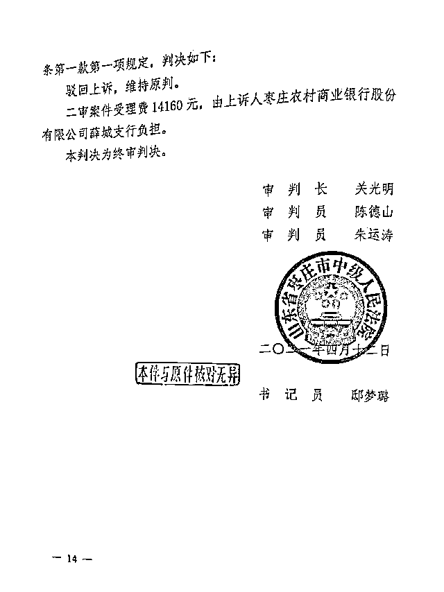
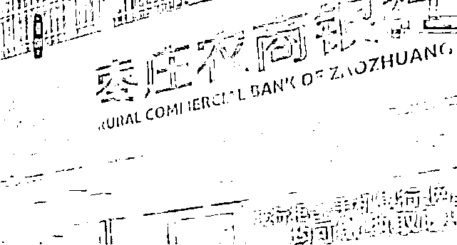
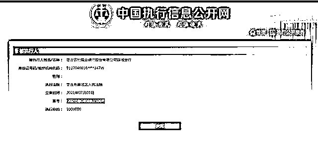
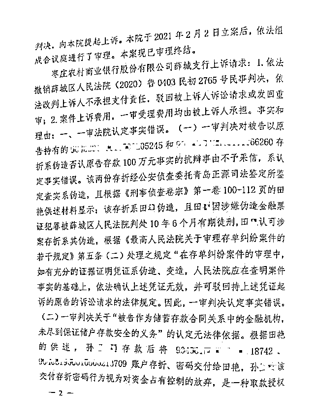

# 女子银行存 100 万 5 年后只剩 1 元！内幕曝光：竟是前职员冒领，涉案超 600 万！

> 原文：[`mp.weixin.qq.com/s?__biz=MzIyMDYwMTk0Mw==&mid=2247516879&idx=3&sn=3ba7f954c8020e91abb882e4a43e265d&chksm=97cb49f7a0bcc0e1aca7f77ef55856f22277e4edb691e53c0919d276bdc1547aecf5f7e319fe&scene=27#wechat_redirect`](http://mp.weixin.qq.com/s?__biz=MzIyMDYwMTk0Mw==&mid=2247516879&idx=3&sn=3ba7f954c8020e91abb882e4a43e265d&chksm=97cb49f7a0bcc0e1aca7f77ef55856f22277e4edb691e53c0919d276bdc1547aecf5f7e319fe&scene=27#wechat_redirect)

[`mp.weixin.qq.com/mp/readtemplate?t=pages/video_player_tmpl&action=mpvideo&auto=0&vid=wxv_1948523827710296068`](https://mp.weixin.qq.com/mp/readtemplate?t=pages/video_player_tmpl&action=mpvideo&auto=0&vid=wxv_1948523827710296068)

近日，山东女子存银行百万元多年后仅剩 1 块钱事件引爆网络，涉事的枣庄农商行薛城支行被判赔偿百万及利息。

2009 年 7 月和 9 月，山东枣庄市民孙女士枣庄农商银行薛城支行分两次共存入 100 万元。2014 年，孙女士持两张存折到银行取钱，虽然存折单上写着存有 100 万，但银行系统余额显示两张存折账上只有 1 元。

枣庄农商银行薛城支行被孙女士告上法庭，银行提出存折系伪造，这使孙女士一度被警方刑拘，但警方调查后认为，没有证据显示孙女士参与伪造存折。

2020 年，孙女士再次状告枣庄农商银行薛城支行，法院认为，银行没有做到应尽的审核义务，应当支付孙女士 100 万元及利息。

7 月 8 日，此事有了最新进展，山东省农村信用社联社发布消息，枣庄农商银行薛城支行已按法院判决，将赔偿款及利息等款项划至法院指定账户。

日前，孙女士代理律师刘焕平向媒体透露，这起事件实际涉及到一起重大刑事案件：孙女士存入了一百万元后，两张存折被另一家银行的女职员田某换掉，田某在孙女士存款当日以孙女士名义开出了两张存有一块钱的存折，伪造存款记录黏在了这两张存折上交给孙女士，孙女士真正的存款被田某分多次支取。

律师透露，田某是枣庄当地另一家国有大型银行的女职工，除了冒领孙女士的存折账户，她还用用类似手法冒领多个储蓄账户的资金，据不完全统计，包括孙女士在内，受害人为 10 人，涉案金额超过 600 万，时间在 2008 年到 2010 年间。这些被冒领的储户在 2014 年陆续将银行告上法庭，要求银行支付存款及利息的诉求被法院支持。

田某曾一度失踪，后被当地警方抓获，因涉嫌伪造金融票证罪等被判刑 10 年 6 个月。

记者发现，孙女士与枣庄农商银行薛城支行的诉讼相关判决文书中，枣庄农商银行薛城支行的上诉理由里亦提及上述细节：田某因在真实的金融票证上对所记载内容进行更改，情节特别严重，其行为已经构成变造金融票证罪，被判处有期徒刑 10 年 6 个月。

潇湘晨报记者登录中国裁判文书网发现，田某除了冒领孙女士的 170 万元外，在 2008 年到 2009 年期间，其还在枣庄当地某银行任职期间冒领了另外 9 位储户共计约 500 万元。加上孙女士存款，被田某冒领的资金超过 600 万。

来源 ： 潇湘晨报综合报道

← 向右滑动与灰产圈互动交流 →

