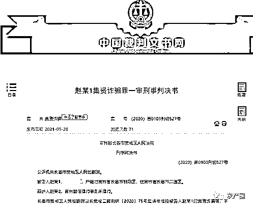
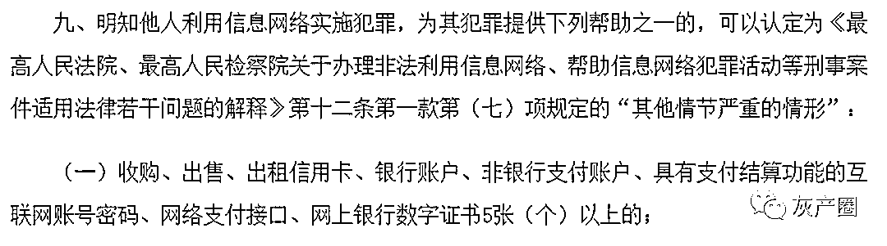

# 农行员工虚构高息理财诈骗 45 位亲友共计 3300 万！

> 原文：[`mp.weixin.qq.com/s?__biz=MzIyMDYwMTk0Mw==&mid=2247516879&idx=5&sn=e4dfc6e2012d5b06f77162d7bf067982&chksm=97cb49f7a0bcc0e195a7ecc388c1a68b669deff37035a991ba815e5d9c4f17d48f27d433311e&scene=27#wechat_redirect`](http://mp.weixin.qq.com/s?__biz=MzIyMDYwMTk0Mw==&mid=2247516879&idx=5&sn=e4dfc6e2012d5b06f77162d7bf067982&chksm=97cb49f7a0bcc0e195a7ecc388c1a68b669deff37035a991ba815e5d9c4f17d48f27d433311e&scene=27#wechat_redirect)

近日，我在裁判文书网看到一则银行内部员工因集资诈骗而获刑的判决书。

判决书截图

中国农业银行员工赵某谎称银行内部有高息理财产品，以年利率 15%和 10%的高额利息为诱饵，在 2008 年至 2020 年 2 月间，骗取弟弟妹妹等 45 名集资人 3353.6 万元，造成集资人损失高达 2323.8 万元。经法院审理，责令赵某返还各集资参与人违法所得 2323.8 万元，判处执行有期徒刑十二年，并处罚金人民币四十万元。

赵某是如何诈骗的、为何诈骗多年无人发现、大家遇到同样的情况要如何防骗？这是本案例最值得思考的问题。本期凰家反骗局我们就来给大家拆解赵某诈骗的套路，希望能够警醒广大网友，避免遇到同类情况时遭受重大财产损失。

一、虚构“高息理财”诈骗亲友 3300 万

判决书显示，赵某是吉林长春人，案发前为中国农业银行吉林省分行职员。赵某供述称：“我于 2008 年起想炒股票挣钱，但手里没有钱，于是我谎造了高息理财协议，骗取了几个亲属的信任，他们将钱直接转入我的账户，我用于炒股票、外汇和黄金。直到 2014 年我炒股票、外汇和黄金一直亏空，感觉资金偿付有困难，我就伪造公章，制造新的协议，向很多人推销虚构的理财产品。”

赵某先从亲戚入手，采用简单的理财协议诈骗。然后赵某于 2014 年通过路边打野广告找到非法刻章的人，刻了中国农业银行股份有限公司吉林省分行的印章。再上网找到相关理财协议为模板，编造高息理财协议，针对不同的人随机给利率，协议分一年和半年，年利率分别是 15%、10%，半年 10%。赵某先从弟弟和妹妹入手开始诈骗，然后再介绍给他的同学和朋友推销。

赵某承诺这份理财协议保本保息，引诱他们购买赵某的虚假产品。赵某介绍高息保本理财产品是单位内部发行，只有内部员工或者员工亲属可以购买，购买没有上限。钱财的接收方式主要是先由集资人在农行开通网上银行，然后将网上银行密码交给赵某。集资人将资金存入银行卡内，赵某自行通过网上银行将资金多次跨行转账，并最终划进他自己的账户。

据法院认定， 2008 年至 2020 年 2 月期间，赵某集资诈骗犯罪数额为 3353.6 万元。

我们从以上事实总结出赵某诈骗的四个步骤：

1、 利用其农行内部员工的身份取得集资人信任；

2、 谎报高息保本理财产品，引诱亲朋好友购买；

3、 伪造公章、伪造合同，与集资人签订虚假投资理财协议；

4、 利用亲属的银行卡进行转款，逃避银行监控，骗取集资人财产。

以上步骤中的“1,3,4”或多或少均与赵某农行职工的身份有关，集资人受其蒙蔽的可能性较大。但在步骤 2 中，赵某谎报的“高息保本理财”却存在明显的疑点。

众所周知，高收益与高风险往往是同时存在的。关于高收益产品的风险预警，郭树清、楼继伟也早有提醒。

2018 年 6 月 14 日，中国人民银行党委书记、中国银行保险监督管理委员会主席郭树清曾这样提示非法集资风险，“收益率超过 6%就要打问号，超过 8%就很危险，10%以上就要准备损失全部本金。”

今年 6 月 10 日，郭树清在 2021 年陆家嘴论坛上再次重申，要时刻警惕各种变换花样的“庞氏骗局”。他表示：“当下，各种以高息回报为诱饵，打着所谓的金融科技、互联网金融等旗号的骗局层出不穷，其实质都是击鼓传花式的非法集资活动。大家一定要牢记，天上不会掉馅饼，宣扬“保本高收益”就是金融诈骗。要自觉提高警惕，增强风险防范意识和识别能力，远离各类非法金融活动”。

据北青报报道，全国政协委员楼继伟在 2018 年 3 月 4 日表示，老百姓要加强风险意识，不能一看收益高就被“忽悠”进去了，他说，“保证 6%以上回报率的就别买，那是骗子”。

二、集资诈骗 45 人 弟弟妹妹都不放过

据赵某供述，本次集资诈骗对象共 45 人。其中他的亲属，包括弟弟、堂妹以及其他亲戚共 8 人，朋友共 37 人。

根据判决书赵某供述，他先从弟弟和妹妹入手开始诈骗。2008 年，赵某找到他的弟弟说农行有高息理财，弟弟什么也没问就给赵某存了 10 万。2008 年左右赵某又以同样的方式劝说亲属赵某元存了 7 万，2009 年赵某又劝说亲属赵某菊存了 8 万，一直到 2014 年赵某都是通过高息理财的方式对几个亲属进行诈骗。当时涉及的都是亲属，人不多，数额也不大，与亲属签订的简易协议也没有用公章。

从 2014 年起，赵某为了骗更多的钱让更多人相信，刻公章后规范理财协议书，仍然以银行高息为诱饵从亲属扩大到朋友之间，一共对 45 人进行诈骗。

集资人之一李某证实：“我被骗了一共五笔钱共 110 万元，第一笔是 2019 年 2 月 11 日存 17 万，第二笔是 2019 年 5 月 31 日存 25 万，第三笔是 2019 年 9 月 4 日存 40 万，第四笔是 2019 年 9 月 24 日存 23 万，第五笔是 2019 年 12 月 17 日存 5 万。”

从以上供述来看，赵某这起集资诈骗的案例是典型的“杀熟”行为，优先从最亲近的弟弟妹妹开始诈骗，基因亲属之间的信任，使赵某轻易得手。品尝过不劳而获的滋味，赵某迅速将诈骗亲属的经验复用到骗取朋友财产的路上。

“杀熟”行为不难理解，因为两个不熟的人彼此缺乏信任，不会有钱财往来的机会。越是知根知底，信任感便越强烈，熟人实施诈骗也就更容易成功。

三、炒股、赌博挥霍 3000 万 结果亏了一半

赵某诈骗得来的 3300 多万，都用在哪些地方？

经长春市公安局司法鉴定，赵某骗取金额使用情况如下：

1、赵某共计投入证券 23002973.23 元，收到回款 8878198.11 元，差额 14124775.12 元。

2、赵某赌博共计收入 4564978.00 元，支出 6284334.00 元，差额 1719356.00 元。

3、乔某（赵某前妻）收到赵某 11393670.21 元，乔某返还赵某 1325000.00 元，差额 1068670.21 元。

4、整理出无法分辨具体款项性质，进账金额 21573213.59 元，出账金额 13299188.59 元，差额 8274025.00 元。

5、整理出无对方转账信息情况，交易金额差额 4578886.83 元。

根据以上数据可以看出，赵某诈骗的 3300 多万中有近 3000 万被用于炒股、赌博，其中购买证券损失 1412 万，赌博损失 171 万，炒股+赌博共损失超过 1583 万。也就是说，赵某诈骗得来的 3300 万，炒股、赌博亏了近一半。

四、诈骗多年为何无人发现

据赵某供述，他于 2008 年开始诈骗，将骗来的钱用于炒股票、外汇和黑彩，赔了很多的钱，直到 2020 年感觉无法偿付即将到期的钱，才清空了股票账户，然后于 2020 年 2 月 12 日到公安机关自首。

赵某的诈骗时间长达十二年之久，在此期间为何无人发现？我们认为有以下四个原因：

1、赵某作为中国农业银行的职员，其邀请集资人去农行办公室签署理财产品购买协议，极大地提升了集资人的安全感，集资人很难想象在银行内部签订的协议居然是诈骗。

2、被骗的人均为赵某的亲戚和朋友，这部分人群天然地对赵某不设防。作为弟弟妹妹，怎么会想到哥哥让自己购买理财竟然是为了诈骗呢。

3、之前到期的理财赵某大多到期兑现承诺了。理财产品能按时收到投资收益，因此也就没有集资人去质疑赵某诈骗。

据赵某供述，他买的股票等产品根本没有赚钱，都是用后面投资者的钱补前面投资者到期的钱。这种“拆东墙补西墙”的诈骗手法是典型的庞氏骗局。

4、赵某利用亲属的银行卡多次进行跨行转款，转移资产的手法较为隐蔽，因此逃避了银行的监控。

五、借用他人银行卡跨行转账 逃避银行风控

为何借用他人银行卡转账？赵某供述称：“我怕单位发现，我们单位能监控到内部员工高额、多频次交易信息。”

对于赵某利用亲属银行多次跨行转款的行为，被“借卡”的亲属均表示不知情。

唐某（赵某亲属）证实：“赵某是我外甥，2016 年 11 月份左右他跟我说要借身份证用一下，办张农行卡办网银，我没多想，就跟他一起到农行的营业网点办了一张卡，办好卡后银行卡让赵某拿走了，我密码没有记，也一直没有用过这张卡”。

王某（赵某亲属）证实：“赵某的母亲是我姨奶，赵某是我叔。赵某跟我说有没有不用的卡，我正好有一张银行卡，就借他使用了。他没跟我说借银行卡干什么，我不知道他用我的银行卡进行诈骗，我要是知道我不会借给他的”。

单独行为人的“贩卡”行为同样是要承担法律责任的。今年 6 月 22 日，最高法、最高检及公安部联合发布了《关于办理电信网络诈骗等刑事案件适用法律若干问题的意见（二）》。

中国法院网截图

《意见二》第九条表示，行为人明知他人利用信息网络实施犯罪，为其犯罪提供 5 张银行卡或 20 张手机卡，将以帮助信息网络犯罪活动罪追究刑事责任。

六、银行职工诈骗屡屡发生 客户损失难以追回

近年来，银行职工诈骗事件屡屡发生，本文中的赵某并不是个例，以下多个银行员工诈骗的案例均来自裁判文书网：

2015 年至 2020 年 5 月期间，吕娜多次在沈阳市和平区等地利用其盛京银行职员的身份，谎称银行内部有为出国人员垫资的投资项目，以高额返利为诱饵，欺骗 20 余人以现金、信用卡、网络贷款等方式向其投资超 2000 万。

2011 年至 2018 年 2 月，吉林银行职员于某以非法占有为目的，虚构能够给他人带来巨额回报等事实，承诺支付借款 2 至 6 分不等的利息骗取 14 人钱款，共造成被害人本金人民币 14251729 元未能偿还。

2012 年 12 月至 2015 年 8 月，史某以其本人及前妻的名义，又以给公司员工办理工资卡等为由骗取 24 名亲戚、朋友等人的身份证复印件，冒用他人的名义，伙同交通银行宁夏分行业务经理刘某，采取使用以虚假的身份证骗领信用卡、恶意透支的手段共同进行信用卡诈骗活动，造成发卡银行共计本金人民币 1086.614996 万元不能归还。

七、如何防范诈骗

如何防骗是永恒的话题，我们认为，最好的防骗方法就是客户自身能提升风险意识。

购买银行理财产品时，去正规的银行网点或对应的手机银行 APP 操作，避免和银行职工私下交易。涉及投资理财、资金转账等操作，对银行内部职员也要保持警惕，不要随意签署空白转账凭证或将网银 U 盾交付他人操作，对缔约、资金转账和回款上的不合常规的迹象要保持警惕，购买理财后要及时查看是否成交，资金转账要及时确认对方是否收到，加强对自身资金安全的风险防范。

另外，对于亲朋好友之前的金钱往来，更需要小心谨慎。高收益与高风险往往是同时存在的，不要因为亲属的“滤镜”而丢失了自己的警惕，以避免个人财产被“杀熟”。

来源：凤凰网财经，利箭在行动

← 向右滑动与灰产圈互动交流 →

