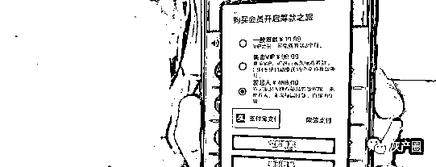
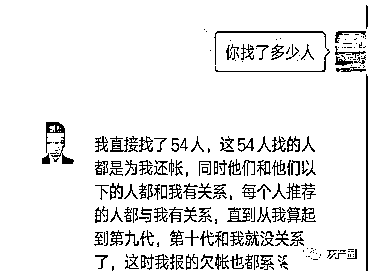

# “众筹还债”生意经

> 原文：[`mp.weixin.qq.com/s?__biz=MzIyMDYwMTk0Mw==&mid=2247516879&idx=6&sn=9d85e369d38caee5f13940df46b79f30&chksm=97cb49f7a0bcc0e1bec03ac01efa0e62314c243bd9b5ab1255874be68ab2e8e7006036f8201e&scene=27#wechat_redirect`](http://mp.weixin.qq.com/s?__biz=MzIyMDYwMTk0Mw==&mid=2247516879&idx=6&sn=9d85e369d38caee5f13940df46b79f30&chksm=97cb49f7a0bcc0e1bec03ac01efa0e62314c243bd9b5ab1255874be68ab2e8e7006036f8201e&scene=27#wechat_redirect)

核心提示：近年来，“众筹”成为热门的词汇，市民可以通过众筹，投资某个项目，也可以加入众筹，帮助需要帮助的人。 

近日，在我市的一些微信群里，有人发布“众筹还债”项目的广告，宣称只要投资 400 元钱，9 个月内，就可以还清百万债务。

那么，事实果真如此吗？

通过连日来的调查，晚报记者发现，所谓的“众筹还债”项目，是通过一个叫“有钱还”的 APP 进行操作，当事人加入后，需要不断拉人头，才能不断进行升级。

所谓的债务，只是一个幌子，众筹者可以随意编造债务数字，并通过平台的审核。该项目符合传销的三大特征，已被外地警方认定为传销。

目前，记者调查的平台已无法正常登录，但同名的类似平台仍有人在推广。

**宣称：投资 400 元**

**9 个月内可还债百万**

****

****家住龙凤区的赵女士，和丈夫经营一家公司。近年来，生意不太好，欠下不少外债。****

****前不久，她在浏览微信群时看到，有人发了一条广告，内容是：想不想花 400 元钱，利用一个合法的平台，在短期内偿还所有债务？“有钱还”众筹还款平台，终生只需投资 400 元钱即可，9 个月内，可以偿还百万债务。****

****这样的信息，让赵女士的眼前一亮。在她看来，投资 400 元钱，9 个月内偿还百万债务，相当于投资几百元钱，9 个月内赚上百万。****

****投资回报率如此之高，世上真有这样的好事吗？****

****赵女士抱着将信将疑的态度，加了对方的微信，很快通过了对方的好友验证。****

****赵女士问对方：如何通过众筹的方式还债？****

****平台操作人告诉赵女士，每位负债者交 400 元钱，获得众筹的资格，然后不断推荐他人加入，大家一起参与众筹还债，属于“相互取暖，众筹还债”。****

****该操作人随后表示，随着人员逐渐增多，团队越来越大，发起众筹的人，“赚”得也越多。****

****赵女士觉得，近年来“众筹”这个词的确很热门，大家不但可以众筹，一起来做一件事，还可以帮助需要帮助的人，如水滴筹等。****

****不过这种拉人头的方式，还是让她有点不理解，感觉有点像传销。****

****赵女士害怕错过赚钱的好机会，又担心此事不靠谱，于是打电话向本报求助。****

******模式：不断拉人头******

******第九层人数近两万******

************

************

******那么，“众筹还债”到底是一个怎样的项目？******

******6 月 10 日上午，记者在一些微信群里，加了多名宣传该项目的人，通过不断沟通，记者了解了该项目的运作模式。******

******原来，该项目共分 9 个级别，当事人付 400 元钱，成为众筹者后，所交的 400 元钱，需把其中的 200 元钱，交给直接上线，剩下的 200 元钱，交给往上数的第九级。******

******之后，这名众筹者，需要拉 3 个人加入，每个人都要交 400 元钱。******

******作为直接下线，每名下线会员，都要将 200 元钱交给众筹者，这样，众筹者可以赚到 600 元钱。******

******接下来，新加入的 3 名会员，每人都要发展 3 名下线会员，他们发展的下线共 9 人，成为众筹者的第三层会员，这样，众筹者也升级为第三级。******

******随着下线不断拉人头，众筹者的下线越来越多，其也会渐渐升到第 9 级。******

******此时，其第九层下线会员，可达 19683 人。******

******按照众筹规则，每名第九层会员，都交给第九级上线 200 元。按照这种方式计算，成为第九级后，其可获利近 400 万元。******

******对于大多数人来说，400 万元简直是天文数字，足够还清巨额债务，具有很大的吸引力。******

******此种众筹方式，均通过一个叫“有钱还”的 APP，进行线上操作。******

******虽然所有众筹者宣称，交 400 元钱，便可以激活该“项目”。实际上，当市民交完 400 元钱，对方才会告知，需要交 600 元，多交的 200 元钱，为平台的使用费。******

******由此可见，只要有人从事所谓的众筹，该平台的“利润”就会惊人。******

******虚拟：所谓的债务******

******个人完全可以捏造******

************

******6 月 15 日，记者与一名从事众筹还债的男子，进行了手机通话。******

******对方告诉记者，他于去年从事该“项目”，一共做了四个多月，还清了所有债务。******

******当时，他报了 20 万的债务，一共找了 54 个人，这些人都帮他还债。同时，这些人推荐的人都和他有关系。******

******沟通的过程中，男子向记者透露，刚开始他对此事将信将疑，所以只报了 20 万。还清债务后，他只能“出局”。******

******他对此十分后悔，觉得自己当时报少了。他建议记者，如果想加入，可以多报钱。******

******那么，男子是如何找到这么多人的呢？******

******对此，男子向记者表示，他从事家政行业，认识的人比较多。但他的子女，都反对他从事该“项目”，即便他已众筹成功，也不支持他。******

******当日中午，记者又联系了另一名从事该“项目”的男子。******

******对方告诉记者，债可以随便报，一般来说，只要有欠条，上传到平台后，就可以审核通过，因此，债务完全可以伪造。******

******由此可见，所谓的偿还债务只是一个幌子，通过该“项目”赚钱，才是真正的目的。******

******调查的过程中，记者发现，该“项目”的运作模式，满足《禁止传销条例》对传销定义的三大特征，即入门费、拉人头和团队计酬。******

******记者通过登录该 APP，发现该平台的背后，并非任何一家公司。也就是说，其只是一个募集资金的工具，一旦出现跑路，新加入的会员，很难维护自己的合法权益。******

******陷阱：定性为传销******

******类似软件层出不穷******

************

******截至记者发稿前，该平台已无法正常登录。******

******据腾讯新闻报道，去年 8 月，鹤岗市民警在工作中发现，有人在当地以“众筹还债”为名，暗中传播“有钱还”的手机软件，大肆发展下线，下载软件的会员多达 300 余人。******

******民警通过对这款软件的调查，发现所谓“众筹还债”的说法，完全子虚乌有。******

******民警迅速出击，将当地和外地的 7 名犯罪嫌疑人一举抓获，该软件也被当地警方定性为“传销软件”，并给予封停。******

******既然该软件已于去年被警方封停，那么，今年为何还有人在从事该“项目”呢？******

******6 月 22 日上午，记者联系了一名推荐该业务的人，对方给记者发来一个二维码，让记者下载一个软件，通过该平台进行众筹还债。******

******对方还向记者表示，可以通过他，开发一个类似的平台，自己来设定规则，让大家通过该平台众筹。******

******记者发现，对方让记者下载的平台也叫“有钱花”，但众筹的规则，和记者调查的 APP，已经有了很大变化。******

******由此可见，每个人都可以通过他人，开发一个平台，取名叫“有钱花”，利用类似的规则，让别人加入众筹项目，进而疯狂敛财。******

******这才是“有钱花”平台仍然在运作的原因。******

******针对此事，民警表示，近年来随着网络的不断发展，骗子的手段层出不穷，花招屡屡翻新，让人防不胜防。******

******作为普通市民，应多了解骗子的套路，不被非法盈利所诱惑，才能有效识别骗局，避免上当受骗。******

******来源：雷达财经、反传防骗联盟、反欺诈平台、反诈骗先锋******

************

******← 向右滑动与灰产圈互动交流 →******

************