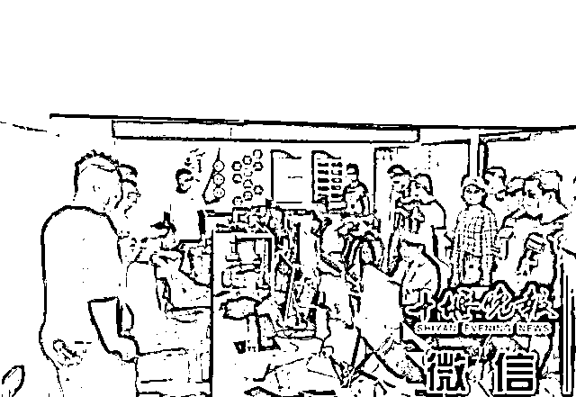
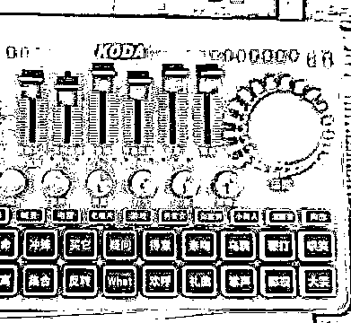
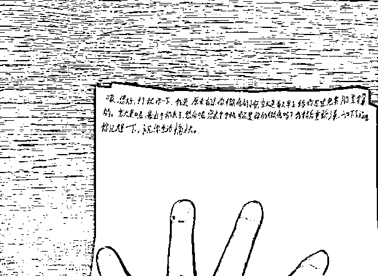
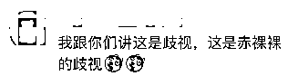
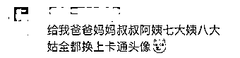

# 诈骗团伙“笔记”曝光：这种微信头像的不下手

> 原文：[`mp.weixin.qq.com/s?__biz=MzIyMDYwMTk0Mw==&mid=2247516879&idx=7&sn=59449fb7f9c9d4c765fb2567deb0cbee&chksm=97cb49f7a0bcc0e1099303e1955c437bfe0fe65bb9e8e59df272c2a2a5fa9612cbb45f2e6ef4&scene=27#wechat_redirect`](http://mp.weixin.qq.com/s?__biz=MzIyMDYwMTk0Mw==&mid=2247516879&idx=7&sn=59449fb7f9c9d4c765fb2567deb0cbee&chksm=97cb49f7a0bcc0e1099303e1955c437bfe0fe65bb9e8e59df272c2a2a5fa9612cbb45f2e6ef4&scene=27#wechat_redirect)

日前

湖北省十堰市公安局茅箭区分局刑侦大队

通过对群众举报线索核查

发现一家非正常经营的

网络科技公司有诈骗嫌疑

这家网络科技公司

位于十堰东岳路一小区内

公司不仅有营业执照

还在门口张贴着

“提供电竞赛事、竞技外设

为广大竞技爱好者

提供一站式服务”等标签

民警突击进入现场看到

一伙人正在进行游戏直播

看上去一副正常经营的样子

然而

经过民警细致查证

发现一些端倪

**该公司其中一名员工的**

**桌子上竟有多张话术单**

笔记上记录着：

**微信头像为卡通头像**

**默认该人不具备被“杀猪”价值**

拉入群聊的人要求“年纪大、有持仓”

同时要观察每天微信步数、朋友圈

是否更新

来判断目标群体的活跃度

对引流进群的人员严格要求

与其他引流荐股诈骗如出一辙

证据确凿

这家打着网络科技公司旗号的

窝点浮出水面

涉案金额高达 500 万元

两人被刑拘

目前

案件在进一步侦办中

网友：

谢谢放过，卡通头像飘过

还有网友迅速换了头像 

来源：中央政法委长安剑，邯郸市反电信网络诈骗中心

← 向右滑动与灰产圈互动交流 →

