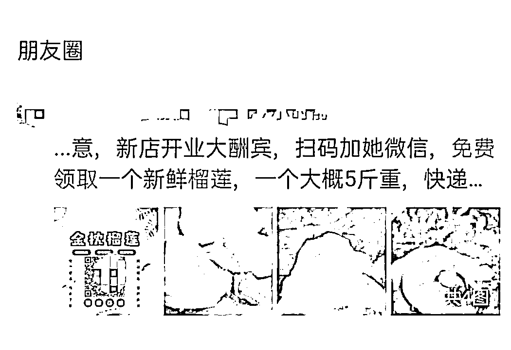
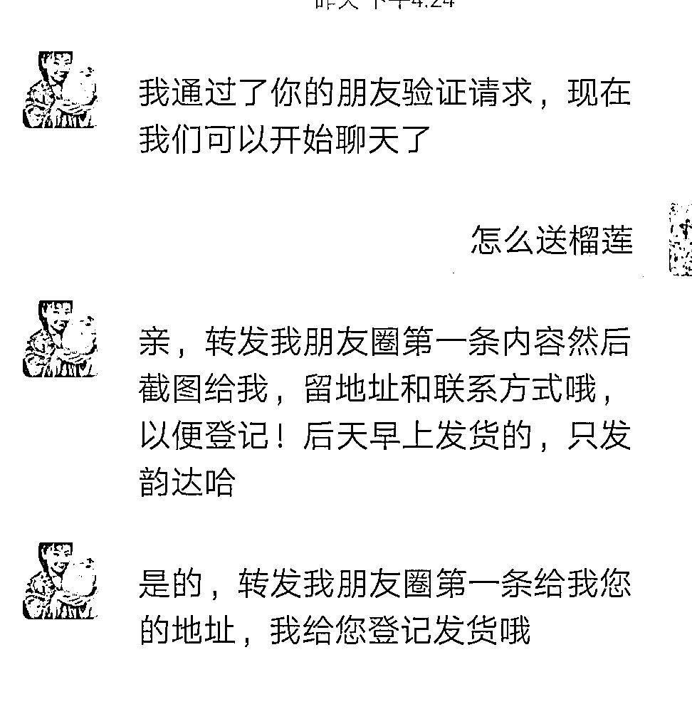
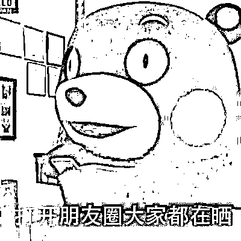
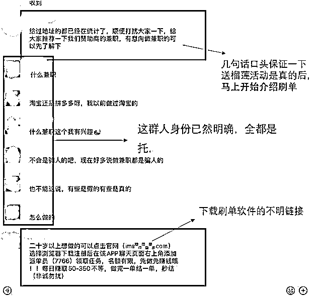

# 免费领的榴莲好吃吗？

> 原文：[`mp.weixin.qq.com/s?__biz=MzIyMDYwMTk0Mw==&mid=2247516879&idx=8&sn=7055017f297d26c78fd23cee8f58ede8&chksm=97cb49f7a0bcc0e147135c7eeca159466a679d8ccc7a1d354f355d0e027791e0c50a2184dc67&scene=27#wechat_redirect`](http://mp.weixin.qq.com/s?__biz=MzIyMDYwMTk0Mw==&mid=2247516879&idx=8&sn=7055017f297d26c78fd23cee8f58ede8&chksm=97cb49f7a0bcc0e147135c7eeca159466a679d8ccc7a1d354f355d0e027791e0c50a2184dc67&scene=27#wechat_redirect)

又到了榴莲飘香的季节。网上各种卖水果的商家都开始活跃起来，甚至还有刷屏的“扫一扫，免费领水果”小广告，榴莲、山竹、车厘子……各种贵价水果应有尽有。免费领的水果到底好不好吃？上周，珠海有两位市民试了，结果让他们后悔不已。

**免费送榴莲，一步步把你骗**

上周五，李女士在家中玩手机时，在朋友圈里看到一条“扫码免费领 5 斤榴莲”的广告。

喜欢吃榴莲的李女士立刻就心动了，二话不说扫码添加客服微信。

随后李女士就被拉入了一个叫“榴莲派送福利群”，客服在群里发了一个链接，让大家在上面填写收货地址、姓名、手机号，然后再把活动图片转发到朋友圈就行。李女士明白活动规则后便按要求照做了。本以为这样就可以领到心心念念的榴莲，没想到对方却说活动人数太多，要第二天统一发货。过了一会儿，免费榴莲派送群却变成了刷单群。群主抛出一个兼职任务，群里就有不少人纷纷试水，然后都晒出了刷单后赚钱的佣金，少则几十元，多则上百元。见到此等好事，李女士也不甘落后，立即开始了刷单工作。刚开始刷第一单时，果然赚钱特别快，垫付 100 元后立马收回 115 元，赚了一杯奶茶钱。当李女士继续刷第二笔 200 元时，又成功返还了 250 元。对方建议她可以刷大单，可以赚更多的钱，李女士毫不犹豫地答应了。然后，转过去 500 元后，发现本金和佣金迟迟没能到账。“这是个三单组合的大任务，需要全部完成才能一次性返还。”在对方的诱导下，李女士又刷了两单，可对方又说任务还没完，始终找借口引诱她继续刷单。李女士只好硬着头皮继续，短短 1 小时先后转账 3 万余元给对方，直到对方把她踢出群聊，拉黑删好友，她才意识到被骗。无独有偶，市民赵女士也因此吃了大亏！上周三下午，赵女士在朋友圈看到一个老同学发了一条“扫码免费领榴莲”的广告。因为看到是相熟的人转发，赵女士觉得应该靠谱，于是也试着扫码领榴莲。扫码后，她进入了一个微信群登记信息，不久就看到群里大家都在讨论兼职刷单的事情。赵女士看到好多人都发了赚取佣金的截图，她也跃跃欲试加了“任务员”的 QQ，并领取刷单任务。刚开始小额刷单都能快速返还本金和佣金，等到刷单金额不断加大后，对方以各种理由拒不返款，还让赵女士继续投入本金刷单。直到被拉黑删好友，赵女士才发现自己被骗了 5 万多元。

**“免费领”背后的猫腻**

大约从 8 年前开始，朋友圈里就出现了各种各样令人眼花缭乱的“福利”，它们的共同点是“免费送”。除了送水果，送眼镜，送口红，送运动手环，还有送黄金吊坠。在这些广告中，有些确实是商家货真价实的优惠活动，有些则是不法分子暗藏的套路。很多人看到“免费”两字，以及很容易满足的条件（加微信、分享等），就心神荡漾，放松了警惕。再加上基于相信“微信好友”这个人的前提下而相信他转发的内容。骗子正是利用了人们相信朋友的这种心理，来攻占你的朋友圈。你的一次大意转发，其实已经属于上当受骗，被骗走的是比金钱还珍贵的信任感和靠谱度。而骗子除了让你帮忙转发这种欺诈广告，其真正的目的是——让你进群。了解了群里的发言人是“托”的身份后，就能明白他们每一句话的用意，一开始的自问自答是暖场和释疑，以便主人尽快进入诈骗主题——兼职刷单。

然后托儿们开始尽职示范，自说自演、自疑自夸。从你被诱惑开始刷第一单起，你就已经陷入了骗局，成了挨宰的羔羊。即使运气好，没有被拉进群，但在填写收货信息的时候，你的个人信息也暴露了，骗子获取到这些信息后会转手卖给其他黑产。接着诈骗团伙拿到这些详细的个人信息，就会实施精准诈骗。这类精准诈骗因为能说出准确的个人信息，所以比较难辨别，受害者上当的几率大大提高。

**  知识云吸收，提升学习力！**

近年来朋友圈微商广告多了，各种诱人的转发朋友圈、点赞等方式派福利并不鲜见，然而假借营销为名实则行诈骗之术的套路让人防不胜防！在最后，小侦要提醒大家，“免费送”的东西大多不靠谱，免费的，可能是最贵的。动手点转发之前，请再做一道填空题吧！**占小便宜吃 ____，天上不会掉 ____。**

来源：珠海刑侦

← 向右滑动与灰产圈互动交流 →

