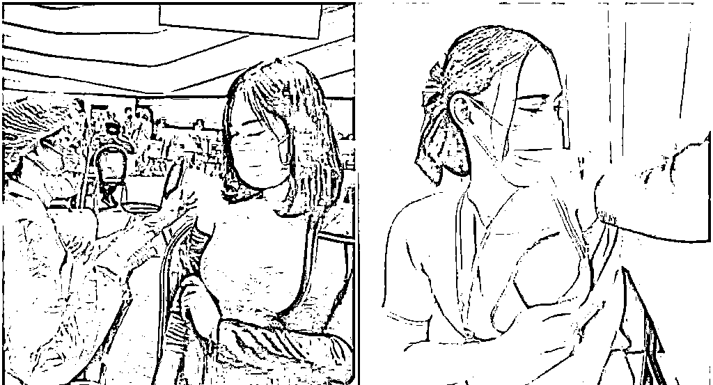

# 打疫苗露胸成为新的潮流，惊呆众人：做人没有底线，真的很可怕

> 原文：[`mp.weixin.qq.com/s?__biz=MzIyMDYwMTk0Mw==&mid=2247516937&idx=3&sn=5d61deb2c57aacb0deb75da252252cf4&chksm=97cb4831a0bcc127bf35eab6c536abd54b7be4ba5314403c015e2b96b193000e75eb2d1e5b7e&scene=27#wechat_redirect`](http://mp.weixin.qq.com/s?__biz=MzIyMDYwMTk0Mw==&mid=2247516937&idx=3&sn=5d61deb2c57aacb0deb75da252252cf4&chksm=97cb4831a0bcc127bf35eab6c536abd54b7be4ba5314403c015e2b96b193000e75eb2d1e5b7e&scene=27#wechat_redirect)

## 
■ 编辑  犀妹 | 犀论（ID：xiyuhy）侵删

众所周知，前段时间广州新增病例很凶猛，每天都在逐渐增多，是近期新冠返潮最厉害的地区。 

如今还没打上疫苗的人，都陷入了“疯狂打疫苗”的节奏当中。

预约号码几乎每天都秒没，连平台都给整瘫痪了。

**全国各地都如火如荼的开始排队打疫苗。**

1

很多人纷纷在网上晒出了自己接种疫苗的卡片或者针孔，还有人 PO 出自己现场打疫苗的照片。

本来打个疫苗，要不就是穿短袖上阵，要不就是把袖子撸上去。

可最近，事情似乎朝着奇怪的方向发展了。网路上开始传出许多接种疫苗时的“香艳”画面：

**一方面，开始出现”网红施打乱象”，每次打疫苗，很多人带着相机，长枪短炮对着医生和护士们拍摄，影响打疫苗的速度；**

另一方面，不少年轻女孩子喜欢把衣服从肩上下拉接种疫苗，露出香肩、甚至是胸部，让很多路人都感到不适；

为了搏版面、吸引大众注意，特别穿上细肩带低胸小可爱、深 V 上衣等性感服饰来接种疫苗，很多排队的居民看到都傻眼......

对此，有许多网友非常不解，纷纷质疑：

**“难道，把衣服拉下来疫苗才会见效？”** 

**“这是打针还是在作秀？”**

**“真厉害，打个针也能吸眼球”。**

但也有部分网友认为，网红们即使在作秀，也达到了推广施打疫苗的目的，引发了双方的论战。

看完新闻，目瞪口呆。

无法想象，竟然有人认为这般低俗无下限的现象，能起到宣传推广的作用。

**孟子说：人有四端，羞耻感是其中之一。**

可是，社会发展到今天，我们越发觉得，羞耻感变成了稀缺品。

有的人遇到一点点事就能随意放下底线，只要你不觉得尴尬，尴尬的就是别人。

这样的风气，真的像病毒一样可怕，会毒害周围的人。

2

**最近，还有个叫“安安”的驾校教练火了，在网上直播教科目一，三天涨粉三百多万。**

她的爆红，并不是因为她分享的科目一知识有多么受欢迎，粉丝有多么爱学习。 

**而是因为她牢牢掌握了流量密码：紧身包臀裙+黑色丝袜+抬脚动作。**

每次直播，她都会穿一件足够凸显身材曲线的紧身裙，搭配一条透明的黑丝袜。

然后在讲题的间隙，看似若无其事地抬个脚。 

又或者，突然把高跟鞋脱下来拎在手上玩弄，加上一些充满诱惑的挑逗动作。 

这些擦边球，让观看者欲罢不能、每天准时守在直播间，只为看美女教练上课。 

**据说，她的直播间里每天有 10 万人，其中 9.5 万人都有驾驶证，剩下的 5 千人，是驾校员工。**

我看不懂，但觉得大为震撼。这就是当下网络环境的现实写照。

再给大家说两个例子。网红一栗莎子，日语专业的硕士，长相甜美。

早期她认真地拍一些日语教学、搞笑段子，却一直不温不火，3 年只有 70 万粉丝。

直到偶然一次改变风格，靠着一条蓝色连衣裙视频爆火，两周直接圈粉 300 多万。 

视频里，一栗莎子穿着凸显性感身材的“蓝色战衣”，随着音乐上下摇摆、抖动。

短短几秒的视频让她一战封神，从那以后，她只要在镜头前穿着小裙子跳舞就可以了，卖颜值和身材，轻轻松松赚得盆满钵满。

**正儿八经分享知识、炫技基本没人看，而整点擦边球、弄点简单粗暴吸睛的玩意就能吸引流量。**

可悲吗？但这就是现实。主播们只能靠辣眼睛的内容，不断博出位。

而观众也会被调教得更重口味、兴奋阈值更高，陷入恶性循环。

4

其实如今“疫苗装”“网红疫苗”的出现，也被质疑“擦边球”。

不知道用什么时候开始，社会好像有一条潜规则：

**谁更出丑，谁更出彩；谁无下限，谁就发达。有些人为了流量，可以毫无道德底线，没有是非观念。**

在日常的互联网上，充斥着大量我们想象不到的软色情内容，无孔不入。

舞蹈博主，穿衣风格永远是低胸装+热裤或短裙+丝袜，全程就是扭来扭去。

但她靠着这种毫无技术含量的视频，一个视频就有高达两万的阅读量，可以获得几百元的收入。

流量市场的竞争日益激烈，几乎每个身处其中的人都在竭尽全力吸引更多的眼球，博人眼球无疑是最轻松且最容易见成效的选择之一。

**就像《娱乐至死》里曾说过：**

**“人类悄无声息地成为娱乐的附庸，毫无怨言，甚至心甘情愿，其结果是，我们成了一个娱乐至死的物种。”**

在这个娱乐至死的年代，大众的底线正在被一次次拉低，然后被一次次击穿，无限循环。

**人有了底线，有了羞耻心，在诱惑面前才能不动如山，在成功面前才能保持清醒，在挫折面前才能不灰心丧气。**

在这个全民直播、网红文化盛行的时代，唯有时刻保持清醒，时刻警惕，向正能量和美好的事物看齐，才应该是网络时代正确的打开方式。

**底线是做人的根基，是不能轻易触碰的临界点，是我们为人处事的核心。**

对此，大家怎么看呢？

本文综合自：段叨叨了吗（ID：daodaoLM8）《打疫苗露胸成为新的潮流，惊呆众人：做人没有底线，真的很可怕》https://mp.weixin.qq.com/s/F7Nf1QgMdhj9Y5YkAeIdSA 小椰子专栏（ID：xiaoyezizhuanlan）《网红打疫苗最丑陋的一幕刷屏：重口味，正在慢慢毁掉你》https://mp.weixin.qq.com/s/QF8kcgkRlg3oIYLgeKo_fA

← 向右滑动与灰产圈互动交流 →

