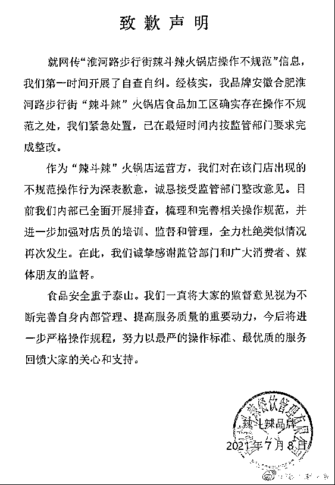
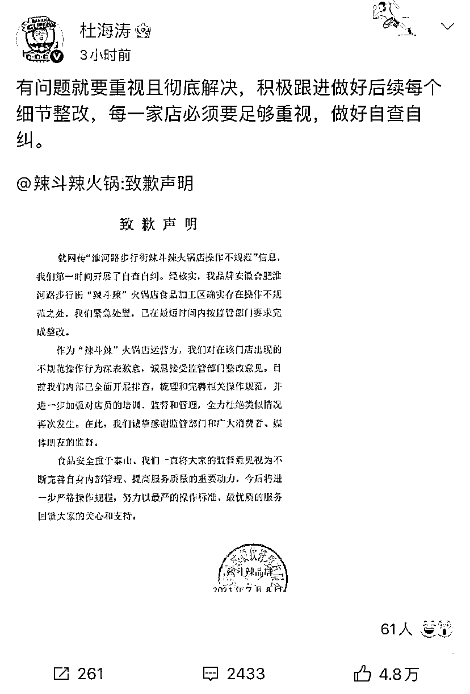
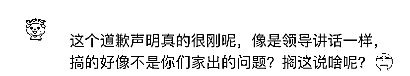
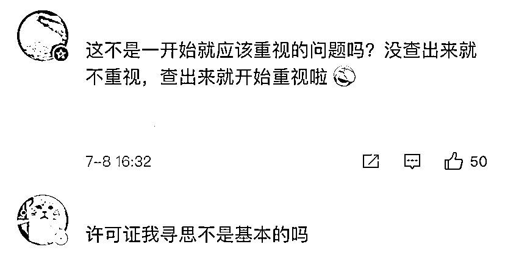
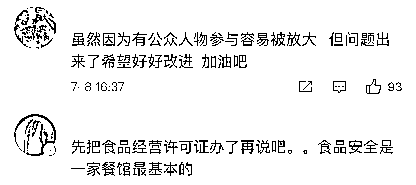

# 杜海涛转发致歉声明后，网友更怒了！

> 原文：[`mp.weixin.qq.com/s?__biz=MzIyMDYwMTk0Mw==&mid=2247516937&idx=4&sn=68e196102cce08cb0936f0e3d7765894&chksm=97cb4831a0bcc127bdd5d94f5914b516dfc58c4f75e7fa6e8bc3cdaab46651be1605a6dfccec&scene=27#wechat_redirect`](http://mp.weixin.qq.com/s?__biz=MzIyMDYwMTk0Mw==&mid=2247516937&idx=4&sn=68e196102cce08cb0936f0e3d7765894&chksm=97cb4831a0bcc127bdd5d94f5914b516dfc58c4f75e7fa6e8bc3cdaab46651be1605a6dfccec&scene=27#wechat_redirect)

湖南卫视主持人杜海涛创立的火锅品牌“辣斗辣”，其合肥淮河路加盟店被消费者投诉火锅汤菜中有苍蝇。 

其后该店因卫生状况不符合标准、苍蝇飞舞、无经营许可证等问题，被市场监管部门责令停业整改。

[`mp.weixin.qq.com/mp/readtemplate?t=pages/video_player_tmpl&action=mpvideo&auto=0&vid=wxv_1948807657151086596`](https://mp.weixin.qq.com/mp/readtemplate?t=pages/video_player_tmpl&action=mpvideo&auto=0&vid=wxv_1948807657151086596)

澎湃新闻记者：祝文博 编辑：王福艳 素材来源：安徽商报 逍遥津市场监管所 责任编辑：李蕊 校对：施鋆

涉事餐饮品牌 7 月 8 日下午发《致歉声明》表示，确实存在操作不规范之处，已按要求完成整改。杜海涛也回应称，积极跟进细节整改，做好自查自纠。 

“辣斗辣”发布的《致歉声明》称，就网传“淮河路步行街辣斗辣火锅店操作不规范”信息，辣斗辣第一时间开展了自查自纠。经核实，合肥淮河路步行街“辣斗辣”火锅店食品加工区确实存在操作不规范之处，公司紧急处置，已在最短时间内按监管部门要求完成整改。 

公司内部已全面开展排查，梳理和完善相关操作规范，并进一步加强对店员的培训、监督和管理，全力杜绝类似情况再次发生。

随后，湖南卫视主持人杜海涛转发前述《致歉声明》称，有问题就要重视且彻底解决，积极跟进做好后续每个细节整改，每一家店必须要足够重视，做好自查自纠。

但就此番道歉，网友们却并不买账，甚至更愤怒了：这是讲给我们听的吗？ 

还有网友直言：食品经营许可证，这难道不是最基本的吗？ 

据安徽网稍早前报道，7 月 7 日，合肥市庐阳区逍遥津市场监管所相关负责人介绍，近期该所陆续接到的 4 起消费者投诉，均反映在庐阳区淮河路与宿州路交叉口的“辣斗辣火锅店”就餐中，发现火锅汤菜中有苍蝇，向商家反映时，店员态度较差，对诉求不予理会。

当天，执法人员对涉诉火锅店经营现场在检查时，发现该店现场消费者就餐区与食品加工操作区设置不合理，未使用玻璃、纱网等材料的门窗进行分隔，为敞开式；食品加工操作区与厨余垃圾未隔离；垃圾桶非脚踩带盖式；待食用食品成品、半成品未覆膜或加盖；苍蝇飞舞等问题。 

该报道还显示，涉事的“辣斗辣火锅店”为湖南卫视某杜姓主持人创立的火锅品牌加盟店，于 6 月 30 日向行政许可部门提交了《食品经营许可证》的申办材料，但目前并未取得食品经营许可证。随后，该火锅店被责令停业整改。

来源：澎湃新闻

← 向右滑动与灰产圈互动交流 →

