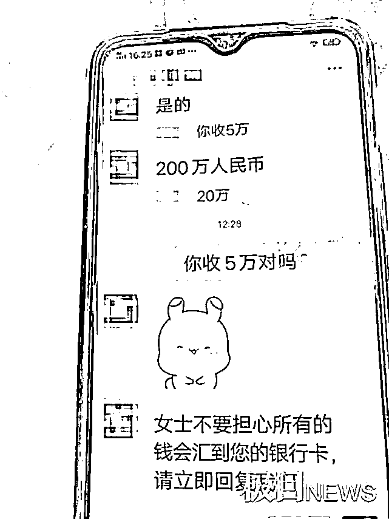
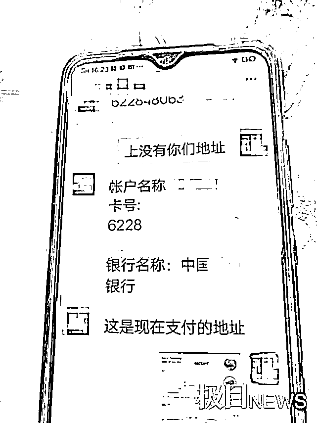
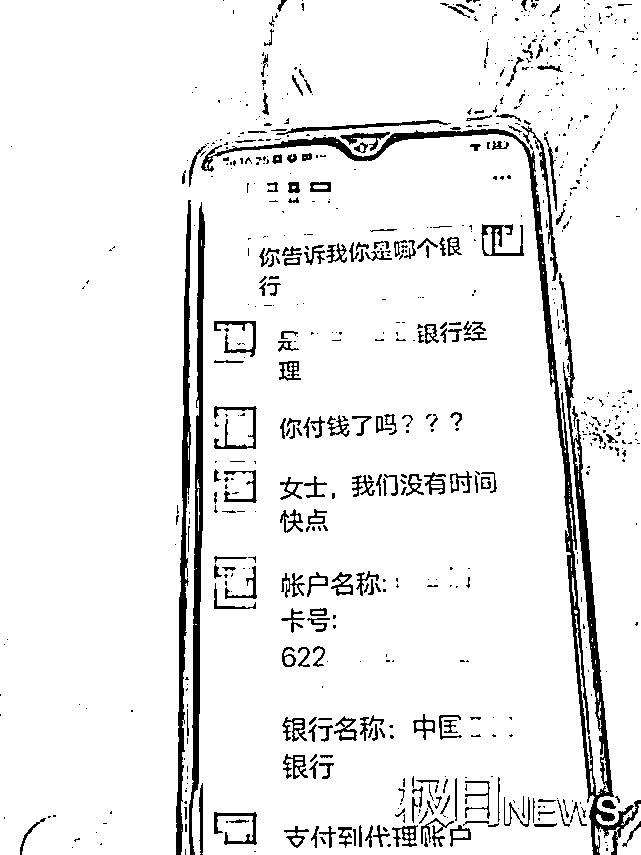
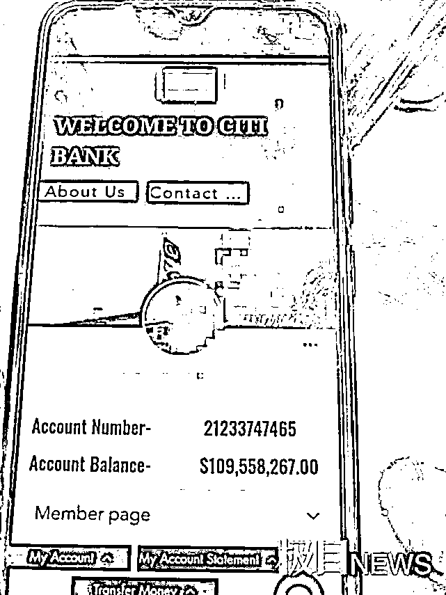

# 前后三名“外籍男友”竟是同一人，六旬婆婆三次网恋三次被骗

> 原文：[`mp.weixin.qq.com/s?__biz=MzIyMDYwMTk0Mw==&mid=2247516937&idx=6&sn=a082cff64b8b8b68529399020c5fb43a&chksm=97cb4831a0bcc127daade6279af40dd44b8c52a975cb0c1c1f0524466971404510917566bf06&scene=27#wechat_redirect`](http://mp.weixin.qq.com/s?__biz=MzIyMDYwMTk0Mw==&mid=2247516937&idx=6&sn=a082cff64b8b8b68529399020c5fb43a&chksm=97cb4831a0bcc127daade6279af40dd44b8c52a975cb0c1c1f0524466971404510917566bf06&scene=27#wechat_redirect)

对爱情的憧憬，不分男女，不限年龄，然而，基本的防范之心同样不可或缺。  

7 月 6 日，极目新闻记者从武汉市江岸区公安分局获悉，该区一名 60 多岁的婆婆先后三次邂逅“外籍男友”，三次网恋三次被骗。更让民警难以理解的是，这三名“外籍男友”是同一名骗子扮演的。民警发现这起骗局，缘于银行工作人员报警，6 月 30 日下午，民警赶到银行，劝说了 2 个小时，终于让她明白自己被骗了，不再坚持给“外籍男友”转账 5 万元。

“60 多岁的婆婆芷兰（化名）坚持要给国外的男友转账 5 万元，我们怀疑她被骗，劝她不要转账，但怎么劝都没用……”6 月 30 日下午 4 时许，武汉市公安局江岸区分局丹水派出所社区民警刘萍接到辖区某银行工作人员打来电话。

“婆婆网恋？对象还是外国人？”带着一连串的疑问，民警刘萍火速赶到银行。来到银行大厅，民警看到一位婆婆正在跟银行工作人员交涉，她不顾银行工作人员劝阻，坚持要求转账。

第一眼见到婆婆，民警刘萍觉得很眼熟，询问得知她名叫芷兰，立即想起见过她，“今年年初，您因为被骗，到派出所报过警吧？”芷兰点了点头。

原来，芷兰今年 64 岁，今年年初在网上认识了一个自称美国人的男子，该男子对她天天嘘寒问暖，没多久两人开始热恋。后来，该男子声称将来到中国来看望她，并编造理找她要钱，芷兰意识到自己上当之后，与他断了联系。

民警刘萍没想到，这次在银行又碰到了芷兰。

银行工作人员向民警介绍了劝阻芷兰转账的原因。当天下午，芷兰来到银行要求转账，按照防范电信网络诈骗工作要求，银行工作人员询问转账原因。

芷兰说，海外亲戚的女儿在中国留学，亲戚寄给女儿的钱是外汇无法支取，需要缴纳 5 万元手续费，亲戚让她帮忙缴纳 5 万元手续费，并承诺事后给她 200 万元报酬。银行工作人员听罢立即意识到她被骗了，劝芷兰不要转账，但芷兰就是不听，坚持要转账，银行工作人员于是报警求助。

民警刘萍也劝说芷兰，没想到，芷兰倔强地说：“我就是把房子卖了，也要把这 5 万元转过去。”交流中，民警了解到，芷兰已经退休，每月靠 3000 元的退休金生活，准备转账的 5 万元是她东拼西凑的。

民警刘萍对芷兰说：“能否给我看一下你手机，看你亲戚是怎么跟你说的？”

芷兰听了脸色微变，很不情愿，最终，打开微信，只给了民警看了几段对话和图片。

民警看到，“外籍男友”的微信头像是一名外国男子的照片，大约 40 多岁，又觉得这张照片似曾相识。点开头像查看照片，民警记起，今年年初诈骗芷兰的的也是这个人。

难道这是巧合？

民警刘萍打电话给派出所同事，让同事帮忙查询，发现芷兰没有亲戚在国外。另外，今年 4 月份芷兰也有一次报警记录，原因也是网恋，网恋对象的头像照片也是这个人，那次她被骗了 5000 元钱。

民警继续耐心劝说，请芷兰说说这次是怎么回事。芷兰说，2 个月前，她收到一个添加好友的消息，对方自称是美国人，是企业家。加为微信好友之后，该男子每天甜言蜜语不断，两人恋爱了。

三次网恋，对方用了三个身份，但微信头像使用的照片一模一样，民警感觉不可思议，对芷兰说：“为什么 3 次认识的网友，他们的微信头像使用一模一样的照片？说话的证据腔调都一样，这是一而再、再而三地骗你呢！”

民警再请银行工作人员告诉芷兰，从国外汇钱到中国，并不需缴纳所谓手续费。

民警苦口婆心地分析，举出类似的诈骗案例，劝说了 2 个小时，芷兰终于意识到自己第三次被骗了。在民警和银行工作人员的见证下，她先拉黑再删除了“外籍男友”的微信号，拉着民警的手表示感谢：“谢谢你们帮我避免了 5 万元损失，我再也不会给网友转账了。”

来源 ：极目新闻，潇湘晨报

← 向右滑动与灰产圈互动交流 →

