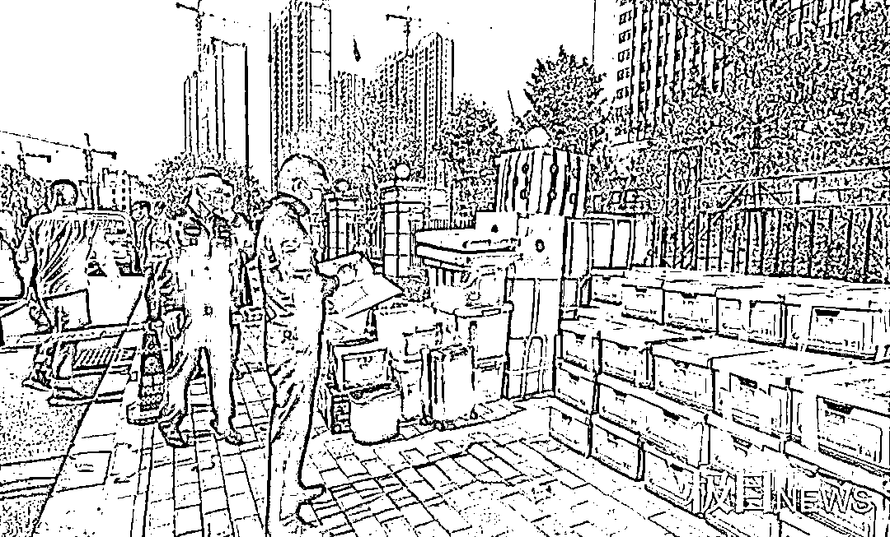
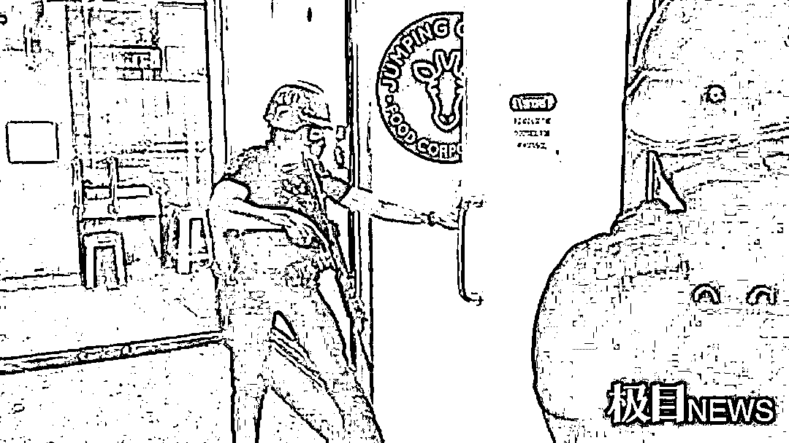
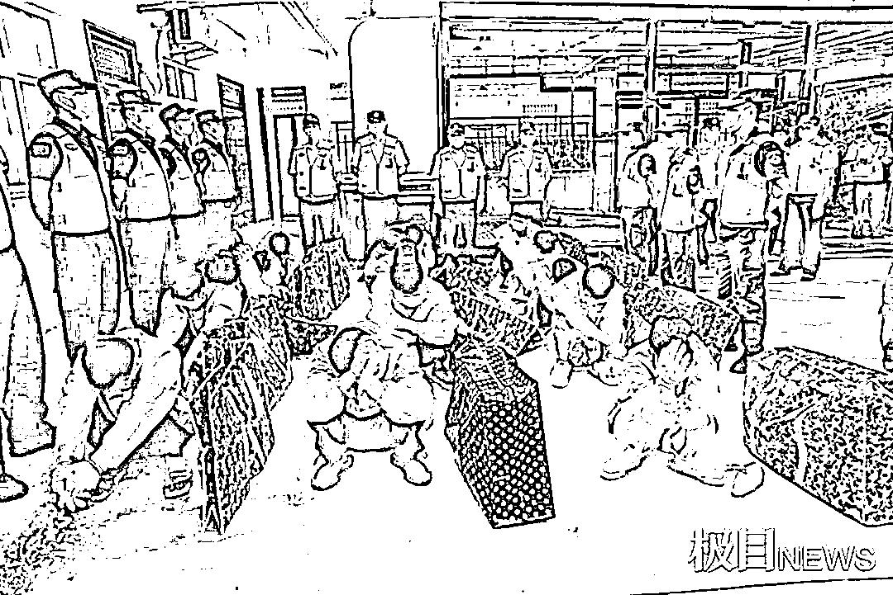
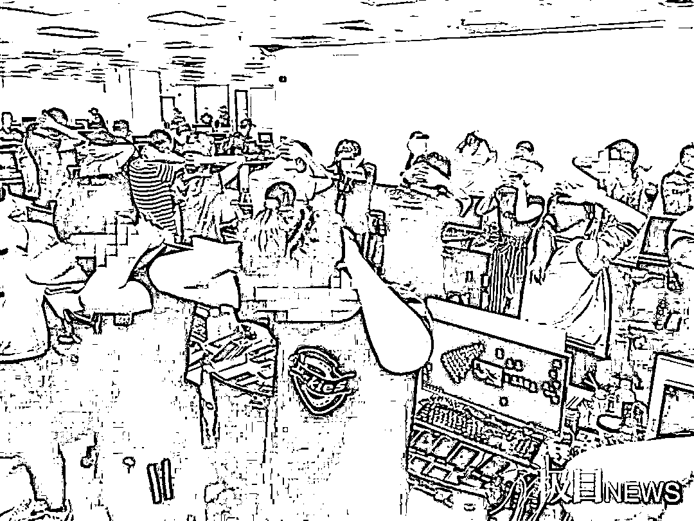
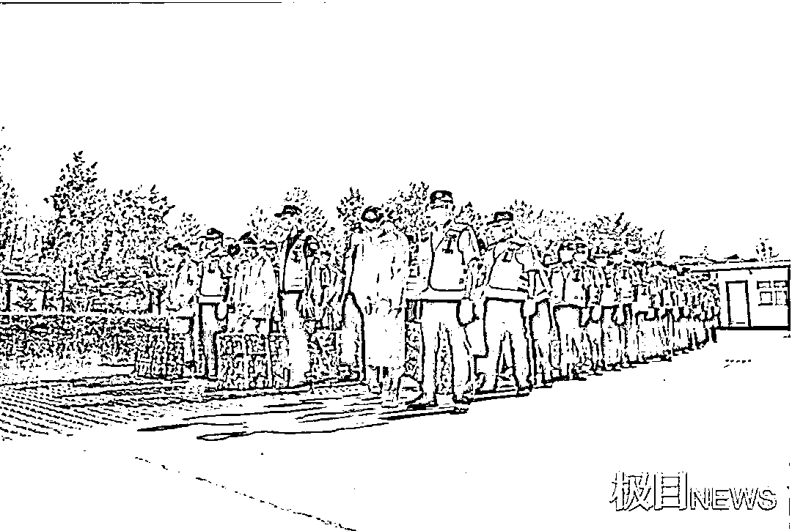

# 警方跨国打掉一电诈团伙抓获 342 人，涉案数十亿

> 原文：[`mp.weixin.qq.com/s?__biz=MzIyMDYwMTk0Mw==&mid=2247516937&idx=8&sn=622a8fa9241a68ba4eecd2a49a53fdd6&chksm=97cb4831a0bcc12702d83e9ce4095a141360b3c87d6bdc490760af6ae11e4f39ecead0a66b9f&scene=27#wechat_redirect`](http://mp.weixin.qq.com/s?__biz=MzIyMDYwMTk0Mw==&mid=2247516937&idx=8&sn=622a8fa9241a68ba4eecd2a49a53fdd6&chksm=97cb4831a0bcc12702d83e9ce4095a141360b3c87d6bdc490760af6ae11e4f39ecead0a66b9f&scene=27#wechat_redirect)

**毕业于仰恩大学国际金融系** 

**北京××××投资有限公司董事长**

**资深杰出的青年企业家——**

**这是在网上搜索黄某金，所获得的结果**

然而很少有人知道，就是这个顶着“青年企业家”光环的黄某金，在菲律宾等地，以合法生意为掩护，搭建资金通道和虚假交易平台，从事电信诈骗。他甚至还提供办公场所、物业服务，引进不同诈骗团队“拎包”入驻。

2019 年 12 月 19 日，公安部刑侦局、湖北省公安厅刑侦总队带领孝感公安赴菲工作组，在中国驻菲律宾大使馆的协助下，成功在菲律宾奎松市捣毁了黄某金的这个诈骗窝点，**抓获中国籍犯罪嫌疑人 342 名，缴获涉案手机 7329 部，电脑类电子产品近千台。**

2021 年 6 月 15 日，孝感警方披露该案具体案情。

远赴菲律宾开展反电诈工作

孝感警方组织工作组赴菲律宾，源于发生在孝感应城市的一起电信诈骗案。

2019 年 3 月 27 日，应城市发生一起电信诈骗案，一位市民被电信诈骗团伙以买彩票为名，骗走百万元。

当地警方经过侦查，初步判定该诈骗团伙位于菲律宾。

当年，公安部同意全国多地警方组成工作组，集中赴菲律宾开展工作，孝感市公安局也派员参与。

在菲律宾开展工作期间，应城这起诈骗案的嫌疑人突然回国，被警方抓获。而孝感警方的工作组，就留在了菲律宾，继续开展案件拓展，并开展其他线索初查工作。

在菲工作期间，接到部刑侦局指令，指派湖北警方接手一起举报奎松一电诈窝点的线索，菲律宾一名举报人提供的线索，让孝感的办案民警兴奋了起来。

这名举报人叫刘刚（化名），是安徽人。他被上海一家外贸公司招工至菲律宾，到达菲律宾进入公司后，发现所在公司从事的业务是“杀猪盘” 诈骗，遂向公安机关举报。

民警开始密集地与刘刚接触。刘刚不愿意从事电信诈骗，但他明白，要想逃出去，必须要先取得对方的信任。

于是，刘刚假装积极工作，获得了较大的活动空间，可以经常外出。“他们已经‘养猪’养了几个月了，准备‘收割’了。”刘刚告诉民警，他不愿意看到又有大批的人上当，于是通过微博向国内警方举报了。

在刘刚的帮助下，民警开始到这家电信诈骗公司办公场所、宿舍进行踩点摸底，一个特大跨国电信诈骗团伙，就这样浮出了水面。

热心举报人爆出大量内幕

刘刚所在的这家电信诈骗公司，有好几百人，位于菲律宾大马尼拉都市区奎松市巴戈班泰北埃德萨 1024 号全球贸易中心大厦。人大多都是通过国内的外贸公司招聘而来，且几乎都是旅游签证。

而公司从事的，则是炒虚拟币的“杀猪盘”电信诈骗。首先购买一些喜欢炒股的人的个人信息，之后通过加群洗脑，诱使其进入该公司的商品交易平台，进行虚拟币交易。

“有对夫妻两个月赚了 200 万走了。”类似的洗脑话语，让很多想赚快钱的人上了当。

“其实他们的交易平台上，虚拟币的价格和正规平台上的价格是脱钩的，是可以后台修改的。”孝感市公安局反诈民警介绍，在将这个电诈窝点捣毁后，他们获得的信息显示，这个所谓的交易平台，“钱进去了从来都不可能让他出来。”

据刘刚介绍，黄某金团伙的诈骗行动分一期和二期。“一期已经‘收割’了四五个亿，黄某金把赚的钱又投入到二期中去了，二期计划‘收割’8 个亿。”

刘刚积极地为孝感警方提供信息，他甚至还主动去“策反”公司的其他员工，让他们一起来向警方举报。

在“策反”其中一个小组长时，这名小组长向公司高层举报了刘刚。当晚，刘刚就和其他几名同事，连夜逃了出来，在孝感警方的帮助下，顺利躲过了诈骗团伙的追杀。随后，他们被警方顺利地送回了国内。

而就在 2019 年 9 月、10 月，在公安部统一指挥下，孝感警方协助福建警方、河北警方、陕西警方，协调当地移民局和警察局行动，先后在菲律宾收网，捣毁了 3 个电信诈骗窝点。

捣毁行动抓获嫌疑人 342 人

刘刚的外逃和身边窝点的被捣毁，让孝感警方盯着的这个诈骗团伙着了急。而据事后了解，福建警方捣毁的那个窝点，和孝感警方盯着的窝点，是同一个老板——黄某金。

黄某金开始加紧推进诈骗进程，计划提前收割。

而此时，广东一名之前的受害者，重新混进了黄某金诈骗团伙的洗脑群，并及时将群内的动态，向警方进行报告。这也让工作组的民警，能够及时掌握黄某金团伙的动态。

**行动的时机已经成熟！**

中国警方的连续行动，引起了诈骗团伙的警觉，公安部赴菲律宾工作组组长甚至还遭遇了暗杀的威胁。工作组顶住压力，通过大使馆协调菲律宾国家移民局和当地警方，同意采取联合行动。令中国警方没想到的是，在行动前夕突生变故，当地警方称，这家公司拥有博彩牌照，无法进行搜查。

在菲律宾，申领了博彩牌照就能合法开展网络博彩业，且当地政府部门不会监督检查业务内容。工作组提供了这家公司以网络博彩为名，实施诈骗的证据，终于在行动前，争取了当地博彩委员会的支持。

2019 年 12 月 19 日，孝感市公安局赴菲打击新型电信网络犯罪工作组在公安部指挥下，联合湖北黄冈、陕西咸阳、江苏南京等多地公安机关，在菲律宾总统府、司法部、移民局、警察总局、博彩委员会等部门的协助下，成功在菲律宾大马尼拉都市区奎松市巴戈班泰北埃德萨 1024 号全球贸易中心大厦打掉一个以股票、虚拟币投资为幌子的“杀猪盘”诈骗窝点，当场抓获犯罪嫌疑人 342 名。

而警方发现，黄某金已经购买了回国的机票，对他的抓捕决定放到国内。

2020 年 1 月 5 日，黄某金抵达北京。在机场，被早已等候在此的民警抓获。

孵化电诈团伙的“企业家”

因为疫情的原因，被抓获的人员全部在菲律宾暂时集中收押。2020 年 9 月，这些嫌疑人开始陆续分批次回国受审。

孝感警方调查的结果让人愤怒：黄某金，这个所谓的“资深杰出的青年企业家”。竟然在国外“批量生产”电信诈骗团伙。

据查，黄某金利用菲律宾申领博彩牌照就能合法开展网络博彩业且当地政府部门不会监督检查业务内容的法律漏洞，出资在菲注册 OMEGA 公司，以博彩业为幌子，通过上海析益信息科技有限公司以招聘员工的名义，为菲律宾输送诈骗作案、服务人员，并安排专人提供员工签证、延期等服务。

而更令人愤怒的是，这只是他的“直营店”，他还有着大量的“加盟店”。黄某金聘请专业电脑技术团队搭建资金通道及虚拟“竞价”虚假交易平台，提供办公场所、宿舍，更以物业服务的名义，为从事诈骗的人员提供食堂、住宿、通勤车辆等生活工作保障，引进不同诈骗团队“拎包”入驻，从事以我国境内群众为主要作案对象的电信诈骗活动。

这些入驻的电信诈骗团伙，每一笔骗到的钱，都需要给黄某金抽成。警方掌握的数据显示，使用黄某金这些交易平台的诈骗团伙，达到四五十个。

此外，黄某金还以投资房地产、海鲜酒楼等合法生意为掩盖，隐藏在诈骗犯罪的幕后，通过与菲律宾官方接触公关，为招商入驻团队从事诈骗活动寻求保护。

黄某金聘请欧某某出任 OMEGA 公司 CEO，直接对公司研发的金融诈骗平台进行管理，指挥犯罪嫌疑人李某从境内招聘员工输送至菲律宾从事电信诈骗活动，指挥、签约张某、钮某的技术团队对诈骗平台的开展研发更新、运营维护和通信保障。

孝感市公安局相关负责人介绍，公安部刑侦局评价此案是近年来我国赴境外打击电诈犯罪单次抓获人员最多、涉案金额最大的一起案件；是首次在境外铲除持有博彩牌照的成功案例；是首次抓获特大幕后金主、蛇头等实现全链条打击的案件。这起案件的破获，对境外电诈集团形成了强有力的震慑。

目前，案件在进一步办理中。

文章来源：极目新闻、天下有诈

← 向右滑动与灰产圈互动交流 →

