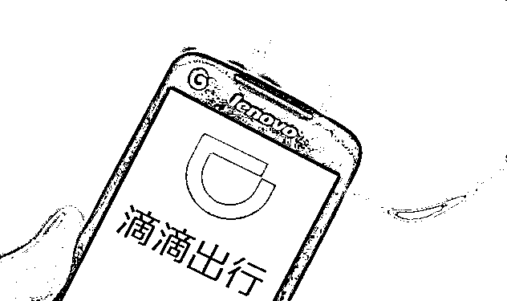
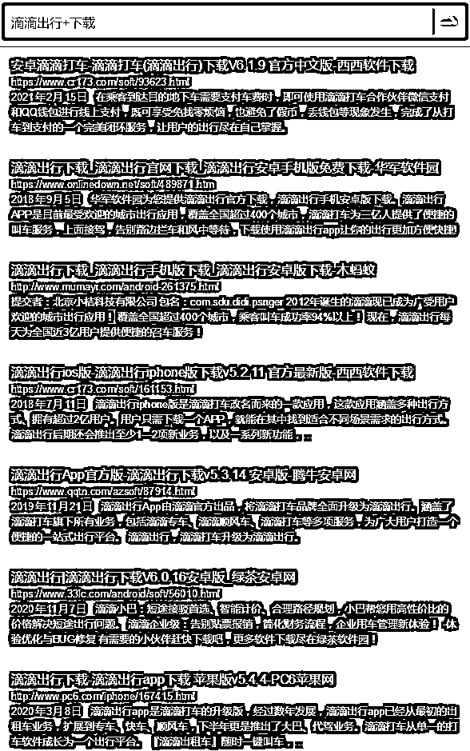
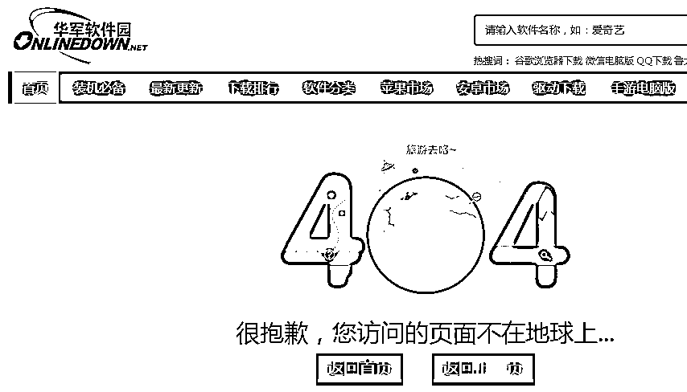
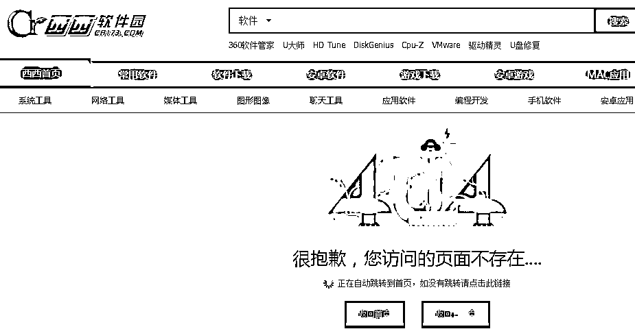
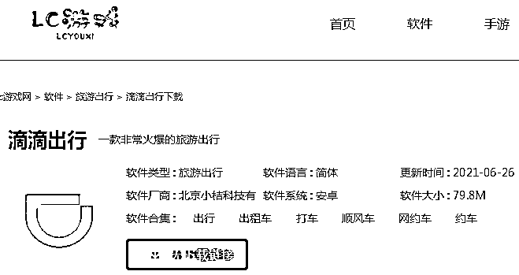
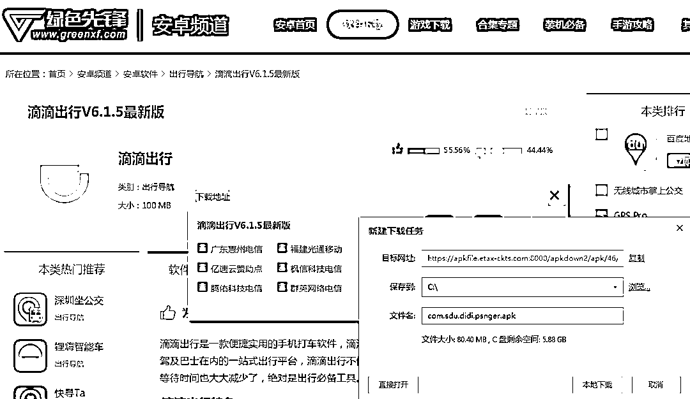
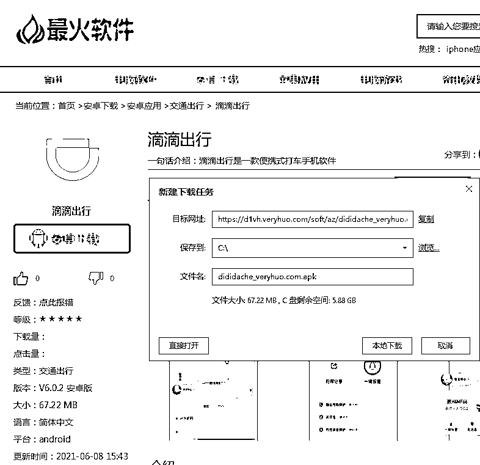
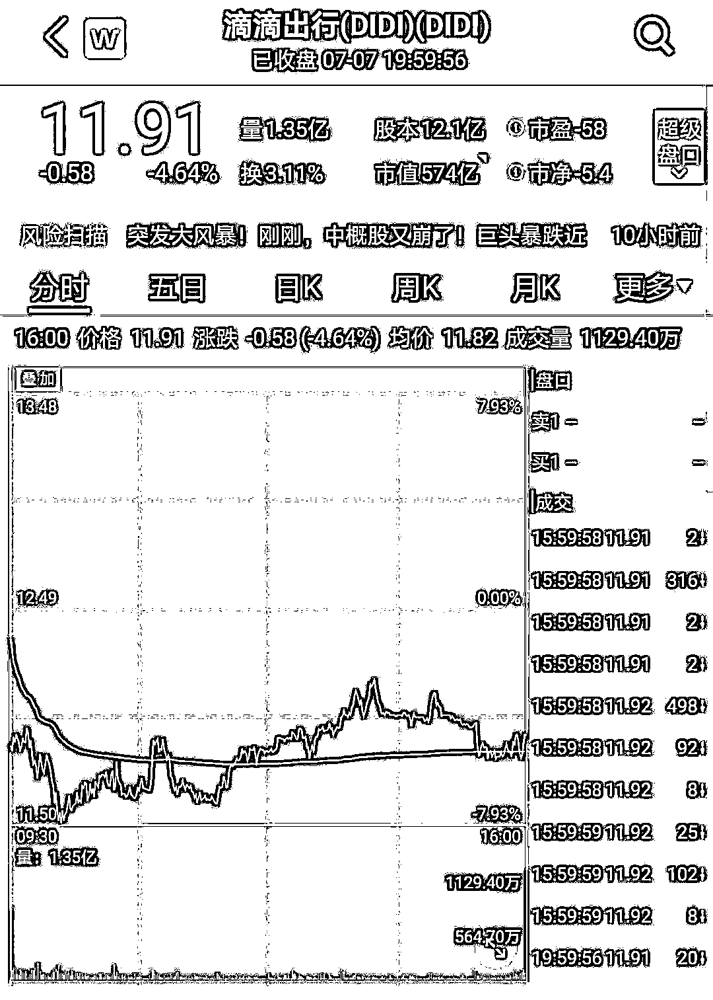

# 滴滴下架后，这些网站顶风作案！

> 原文：[`mp.weixin.qq.com/s?__biz=MzIyMDYwMTk0Mw==&mid=2247516982&idx=2&sn=c0f2937a8ddf24953ffc9a9b3e695c13&chksm=97cb480ea0bcc1187ba4a1373aa58aa803a7b9fe055995e6014959b2444786594d57361919f8&scene=27#wechat_redirect`](http://mp.weixin.qq.com/s?__biz=MzIyMDYwMTk0Mw==&mid=2247516982&idx=2&sn=c0f2937a8ddf24953ffc9a9b3e695c13&chksm=97cb480ea0bcc1187ba4a1373aa58aa803a7b9fe055995e6014959b2444786594d57361919f8&scene=27#wechat_redirect)

**滴滴出行 App 的下载通道正遭到全网封堵。**7 月 8 日早上，“滴滴官网下架滴滴出行 APP”冲上微博热搜。有媒体发现，滴滴官网不再提供下载。7 月 4 日，应用商店下架“滴滴出行”App；7 月 7 日，滴滴出行在支付宝小程序、微信小程序内同时下架；在微信支付的交通出行服务中，也已看不到滴滴出行。然而，记者发现，在搜索引擎中检索“滴滴出行 下载”，在返回的检索结果链接中仍有少量“漏网之鱼”可以提供下载。**仍有网站顶风作案**********记者通过某搜索引擎搜索“滴滴出行 下载”，集中出现了很多 PC 端第三方下载平台。****************来源：某搜索引擎搜索结果页面********随机挑选了几家网站后，记者点击下载“滴滴出行 app”，发现多数显示网页内容不存在，或“应用已下架，无下载链接”。********************************来源：相关软件下载网站********但也有少数网站顶风作案提供下载。在点击下载之后，可以将 apk 安装文件包下载到电脑硬盘上，再借助手机助手等软件将应用安装到手机上。****

********

************ 来源：上述网站********通过这些第三方下载网站下载到的滴滴应用程序是否合法？是否有安全隐患？********7 月 4 日，国家互联网信息办公室依据《中华人民共和国网络安全法》相关规定，通知应用商店下架“滴滴出行”App，要求滴滴出行科技有限公司严格按照法律要求，参照国家有关标准，认真整改存在的问题，切实保障广大用户个人信息安全。********京师律师事务所律师许浩向记者表示，网信办已经发出通知要求滴滴 App 下架，如果有机构不履行，则属于违法行为，将被处罚。网络运营者违反网络安全法规定，由有关主管部门责令改正；拒不改正或者情节严重的，处五万元以上五十万元以下罚款，对直接负责的主管人员和其他直接责任人员，处一万元以上十万元以下罚款。********此外，许浩提示，即使发现有网站提供软件下载，也要注意安全风险。**********进一步强化监管************************Wind 数据显示，美东时间 7 月 7 日，滴滴出行下跌 4.64%，报收 11.91 美元，参照每股 14 美元的发行价，滴滴出行目前最新收盘价已跌破发行价逾 10%。总市值回落至 574 亿美元，约合人民币 3700 亿元。************************图片来源：wind************7 月 2 日，国家网信办发布通报，网络安全审查办公室对“滴滴出行”实施网络安全审查，审查期间“滴滴出行”停止新用户注册。****** ******7 月 4 日晚，国家网信办官微发布通报，根据举报，经检测核实，“滴滴出行”App 存在严重违法违规收集使用个人信息问题。国家互联网信息办公室依据《中华人民共和国网络安全法》相关规定，通知应用商店下架“滴滴出行”App。****** ******据新华社 7 月 6 日消息，中共中央办公厅、国务院办公厅近日印发《关于依法从严打击证券违法活动的意见》（以下简称“《意见》”）。******

******《意见》明确，完善数据安全、跨境数据流动、涉密信息管理等相关法律法规。抓紧修订关于加强在境外发行证券与上市相关保密和档案管理工作的规定，压实境外上市公司信息安全主体责任。推动建立打击跨境证券违法犯罪行为的执法联盟。******

******来源：中国证券报 编辑：老朱******

************

******← 向右滑动与灰产圈互动交流 →******

************