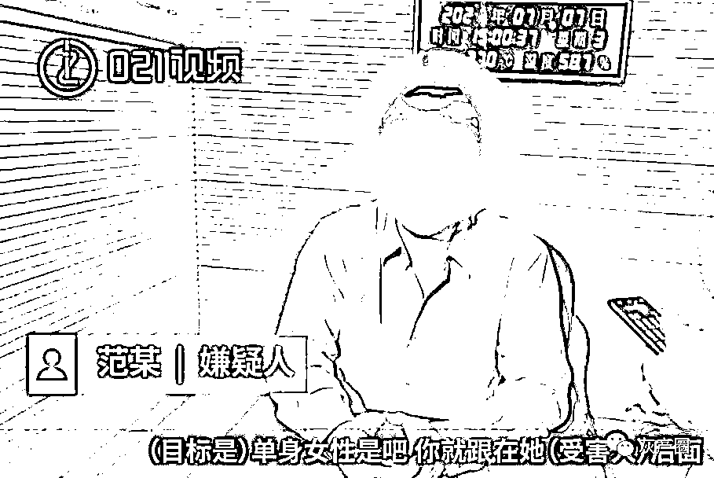
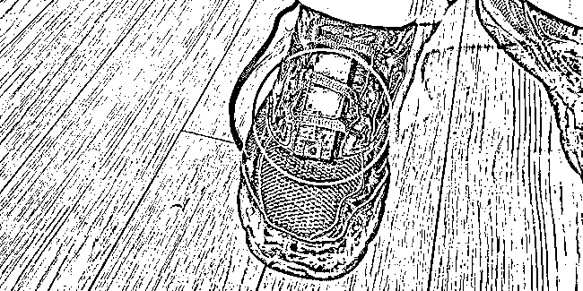
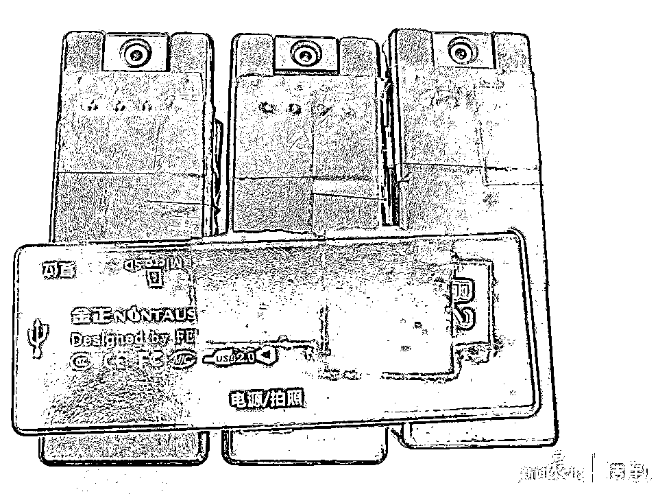
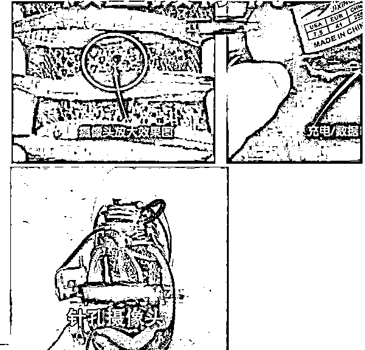
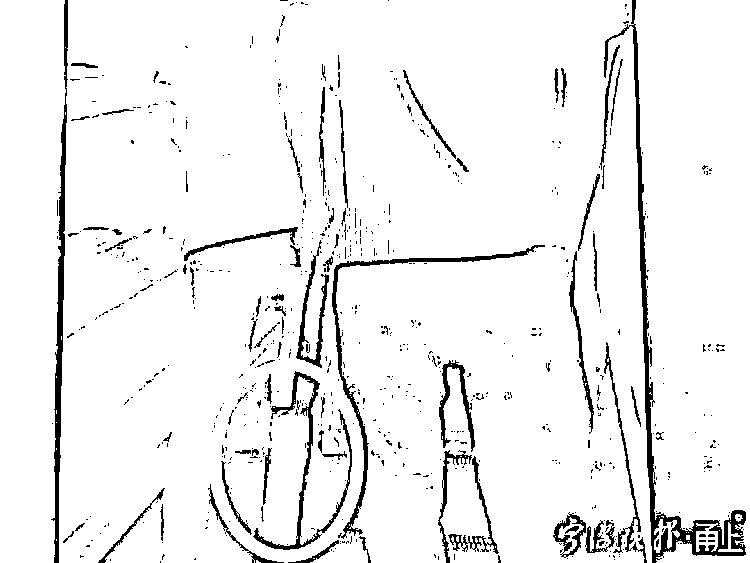
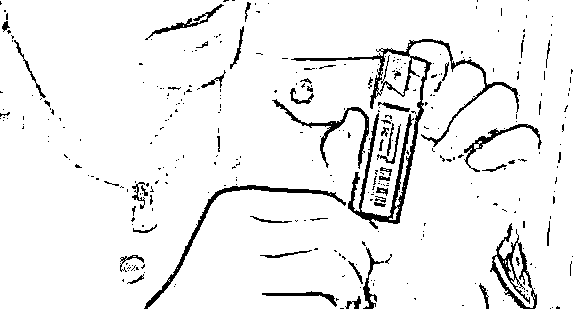
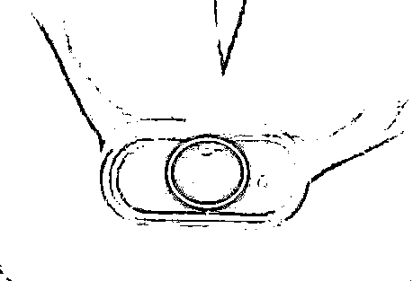
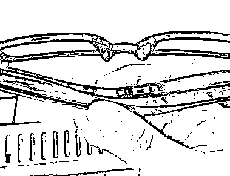
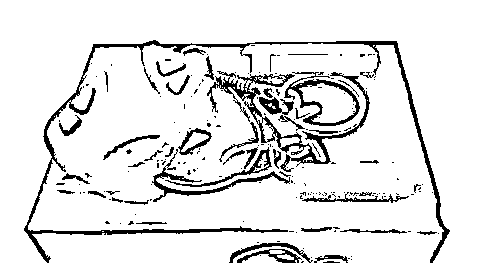

# 鞋子上绑偷拍器专拍裙底！男子被抓时还身背 4 套偷拍机

> 原文：[`mp.weixin.qq.com/s?__biz=MzIyMDYwMTk0Mw==&mid=2247516982&idx=3&sn=1359f49c27298de0c00a583f6dcc7b6a&chksm=97cb480ea0bcc118bd8eb2021e3eba6f674e5d2b8cdc7873cae66a33054c27dfa8f31f1db1a9&scene=27#wechat_redirect`](http://mp.weixin.qq.com/s?__biz=MzIyMDYwMTk0Mw==&mid=2247516982&idx=3&sn=1359f49c27298de0c00a583f6dcc7b6a&chksm=97cb480ea0bcc118bd8eb2021e3eba6f674e5d2b8cdc7873cae66a33054c27dfa8f31f1db1a9&scene=27#wechat_redirect)

夏天到了 

女士们请提高警惕

遇到类似行迹可疑者

请马上报警！

 [`mp.weixin.qq.com/mp/readtemplate?t=pages/video_player_tmpl&action=mpvideo&auto=0&vid=wxv_1950191566346649604`](https://mp.weixin.qq.com/mp/readtemplate?t=pages/video_player_tmpl&action=mpvideo&auto=0&vid=wxv_1950191566346649604) 

视频制作：021 视频

近日，旅客黄女士在上海虹桥站候车室排队检票时，突然感到身后一男子不断用身体贴近她，行迹十分反常，怀疑其可能在偷拍，于是便报了警。

民警接警后快速赶往现场，并在南进站口将准备逃离的范某当场抓获。

据范某交代，7 月 7 日上午 7 时 18 分许，他从昆山南站上车乘坐 G7199 次列车到上海虹桥站，准备去医院看眼睛。他看完病后从上海站乘火车返回昆山，在候车室等车时，看到有人穿裙子，便上前插队偷拍。

范某侧身贴在受害女子身后，并用提前绑在右脚运动鞋上的偷拍设备对准她的裙底，十几秒钟后就被受害人黄某和其丈夫郭某发现，范某立即向候车室外逃跑，没跑几步便被赶来的民警和郭某摁倒在地。

民警询问情况后，在范某某**右脚穿的黑色运动鞋上找到其用于偷拍的设备**，并从其身上查获用于偷拍的录像设备 4 套，内存卡 3 张。民警立即将其传唤至民警值班室。

范某某对违法事实供认不讳，根据《中华人民共和国治安管理处罚法》第四十二条第（六）项之规定，民警对范某某处以行政拘留十日的处罚。

偷拍手段隐秘

媒体曾曝光多起

在之前被媒体曝光的案例中，还有更隐蔽的偷拍方式，比如藏在鞋内侧的针孔摄像机。

还有把偷拍设备藏在伞里、纸袋里↓

　

比如这种“**打火机** ”↓

远看是普通打火机，

但里面暗藏玄机，

**尾部小小的孔是用于拍摄的针孔**↓

还有这种**针孔摄像头眼镜**↓

**钥匙**形状的偷拍设备↓

各种偷拍工具形形色色，除了从源头上加强监管，人们在生活中也需提高警觉。

公安提醒：夏季天气炎热，不少女性穿着裙子，在公共场合下一定要注意保护自己，一旦发现被偷拍和骚扰的情况，及时求助报警！

来源：潇湘晨报

← 向右滑动与灰产圈互动交流 →

