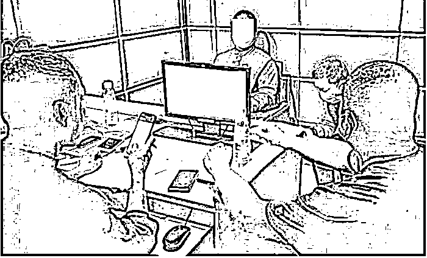

# 他转账 100 多次！被骗 1000 余万！

> 原文：[`mp.weixin.qq.com/s?__biz=MzIyMDYwMTk0Mw==&mid=2247516982&idx=5&sn=b5bd1384ab68dd9569851fd71264b989&chksm=97cb480ea0bcc118439bd33edf3884d0c1494366cc3a571023042147282ca97ee34c763a7e4f&scene=27#wechat_redirect`](http://mp.weixin.qq.com/s?__biz=MzIyMDYwMTk0Mw==&mid=2247516982&idx=5&sn=b5bd1384ab68dd9569851fd71264b989&chksm=97cb480ea0bcc118439bd33edf3884d0c1494366cc3a571023042147282ca97ee34c763a7e4f&scene=27#wechat_redirect)

小品《昨天·今年·明天》中，有这么个桥段，宋丹丹饰演的白云，年轻时放羊薅羊毛，50 多只羊，就可一只羊薅…… 

小品中的桥段，竟然在现实生活中出现了，黑龙江省大庆市一位老人给骗子转账 100 多次，汇去了 1000 余万……

被骗者为什么顺从地给骗子转账 100 多次？是骗子的骗术高明吗？

7 月 2 日，记者对办案民警进行了深入采访，还原了骗局的前前后后。

警方审讯转款犯罪嫌疑人（左二） 

“警官”来电

话说家住让胡路区的田海（化名），今年 70 多岁了，正是享受天伦之乐的年龄。

今年 1 月 22 日这天，田海休息在家，手机突然响起。

“谁啊？”

接听后，电话那头传来一个女声：“你好，我是电信客服，你是不是办过一张手机卡？”

田海想了想说：“办过。”

接着，电话那头称：“你这张手机卡，涉嫌诈骗。公安局的人，已经找过我们公司了，你等着民警联系你吧，这几天不要关机。”

“我也没干过违法的事儿啊？这到底是咋回事儿？”田海蒙了。

就在田海发蒙时，手机又响了。“我是上海市公安局的关警官，之前有人联系你了吧？我们经过调查发现，你名下的一张银行卡，涉嫌洗钱。”

“关警官”顿了顿，接着说：“这事儿非常严重，我们要对你的财产进行核查，如果你不配合调查，我们会赶往大庆，对你实施抓捕。”

两个电话接连打进来，互相认证，没有一点可疑之处，这让田海彻底相信了事情的存在。

视频报到

通话过程中，“关警官”一会儿轻描淡写地说田海家的家庭情况，一会儿又严肃地警告田海，一定要重视，否则会有牢狱之灾。

田海心里越听越发毛，也顾不得求证了。

“你的所有信息，我们都调查清楚了，不要和任何人说，家人也不能说，不然会连累你的家人。”

打一棒子再给个甜枣，先吓唬，接着又表达出为田海着想的态度，田海听了，也信了。

接着“关警官”提出添加微信，并说：“你必须天天和我微信视频报到；如果不报到，我们就对你进行抓捕。”

于是，自第一次接到电话起，田海每天晚上 5 点，都要与“关警官”微信视频，每次视频只是简单的交流。

田海通过视频看到，“关警官”身穿警服，样子很威严。这让田海对“关警官”的身份，更加深信不疑。

大庆市警方在山东省济南市，端掉虚拟币洗钱窝点（犯罪嫌疑人为左二、左三、右二、右三） 

汇集存款

1 月 24 日这天，“关警官”更是连续三次与田海联系，话里话外就是围绕怎么免了灾祸、如何才能平安无事，田海对此深信不疑。

“你把所有的钱，全都转到一张银行卡上。”

“关警官”引导田海，将所有的积蓄存入一个银行账户上后，对田海说：“这些钱需要转到我们的安全账户上，等案件调查清楚了，再返还给你。”

“好好好，我马上转……”田海不敢怠慢。

随后，“关警官”让田海添加了他的几名“同事”的微信。

从之前田海添加“关警官”，至添加其“同事”的微信，微信页面都弹出了相关警告——对方微信账号有异常，请您谨防上当。田海却没有在意。

警方抓获转款犯罪嫌疑人（中）

被骗千万

到了后期，田海已经任人摆布了。因为骗子直接向田海索要了银行账户支付验证码和大额转账优盾密匙密码，田海稀里糊涂地都给了对方。

随即，骗子通过网上银行，向 10 个涉案银行账户转账。

自 1 月 24 日至 1 月 31 日，骗子先后转账 100 多笔，每笔约 10 万元钱左右，共计 1000 余万。

这期间，田海的手机都有转账提示，钱一笔笔被转走，可他竟认为，“警官”过后会把钱还给他的。

直到银行账户里的钱空了，“关警官”等人将田海拉黑了，田海才傻了眼，赶紧打电话报警。

警方在四川省乐山市抓获手机卡商（中） 

广泛撒网

许多人会纳闷，骗子为何会盯上田海呢？他们怎么知道田海有钱？

首先，田海从单位退休多年，没退休时工资就很高。

之所以被盯上，一是他只是骗子广泛撒网目标人群中的一员，骗子通过特殊手段，了解到田海家的经济情况，再有就是田海在与骗子接触的过程中，“露富”了。

办案民警介绍，诈骗分子前期通过网络不法分子，购买了大量大庆市老年人个人信息及电话号码，挨个打电话进行诈骗，筛选出了一些目标人物，田海就是其中之一。

起初，骗子冒充警察的身份，让田海感觉害怕后，又不断套取相关信息，包括田海的身份、此前从事的工作等信息。慢慢地，掌握了田海家境殷实、手中有大量的存款这些信息。

得知田海有大量存款后，骗子利用假警察身份，不断用“对你财产进行核查”、“不配合我们到当地抓你”等语言进行吓唬……

在骗子慢慢引导之下，田海掉进陷阱，无法自拔。

民警表示，骗子有专门的诈骗话术剧本，大庆市还有一些老年人上当。

在民警开始对犯罪嫌疑人进行抓捕后，仍有一些老年人没意识到上当，民警随后一一打电话，制止受害人再转款。

26 人被抓

案发后，大庆市公安局高度重视，立即成立了专案组。

经过多种技术手段加上分析研判，民警发现电信诈骗犯罪集团内部职责清晰，分为资金洗钱组、黑灰产商、技术人员等多个环节。

2 月 3 日，大庆市公安局刑侦支队、龙南公安分局派出四组共 20 余名警力，实施第一轮抓捕，在山东省潍坊市、安徽省宿州市等地，抓获多名犯罪嫌疑人。

随后，大庆市警方先后展开第二轮、第三轮抓捕，至今年 6 月，大庆市公安局刑侦、情报、网安等部门派出 140 余名警力，发起集群抓捕行动，在四川、河南、浙江、福建等 10 省 20 地市，共抓获犯罪嫌疑人 26 名，冻结资金 800 余万元，案件串并共计 28 起。

办案人员介绍，犯罪嫌疑人对犯罪事实供认不讳。

警方调查发现，“幕后金主”在台湾设立冒充公检法类人员诈骗窝点和洗钱窝点，雇佣指挥国内犯罪嫌疑人钟某等 13 人，帮助其洗钱和转移资金；雇佣犯罪嫌疑人高某和彭某等 5 人，注册微信号和手机号等作案工具，为其提供技术支撑，还有若干人，为其提供各种服务。

目前，该案正在进一步侦办中。

**这正是：**

**电诈形式花样多，**

**遇事先和家人说。**

**一招就能防骗子，**

**只要提钱就拒绝。**

来源：大庆晚报、生活报、反诈骗先锋

← 向右滑动与灰产圈互动交流 →

