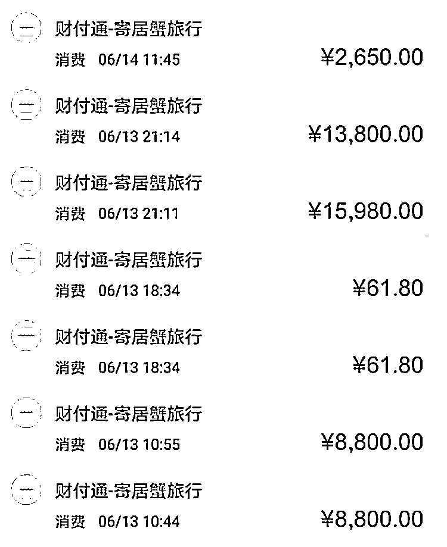

# 这一平台突然关闭！很多人用过……

> 原文：[`mp.weixin.qq.com/s?__biz=MzIyMDYwMTk0Mw==&mid=2247516982&idx=6&sn=efaa762525cac59c5a2bc0d750b8ecd9&chksm=97cb480ea0bcc1188cd08811ff92f47bff0001ea980ff09b3f3103c8bc9380be7a7f38ed0021&scene=27#wechat_redirect`](http://mp.weixin.qq.com/s?__biz=MzIyMDYwMTk0Mw==&mid=2247516982&idx=6&sn=efaa762525cac59c5a2bc0d750b8ecd9&chksm=97cb480ea0bcc1188cd08811ff92f47bff0001ea980ff09b3f3103c8bc9380be7a7f38ed0021&scene=27#wechat_redirect)

‍‍

##### 6500 元买一张“白金卡”，

##### 全年不限次数预定酒店、民宿；

##### 78 元购买一张“新人卡”，

##### 即可享受高端酒店住宿一晚……

##### 这样听来诱人的价格，

##### 被曝是旅行平台“寄居蟹”低价拉客的方式，

##### 而下单前却要收取客户高价押金，

##### 是房费数倍。 

##### 近日，有用户发现，

##### 该平台小程序打不开了，

##### 高额的押金无法退回，

##### 有人甚至损失高达几十万元。

花 25 万元订的房间一次也没住上

今年 5 月，上海的王燕（化名）计划六一儿童节带女儿到深坑酒店游玩，正在查找酒店预订信息时，有朋友提醒她可以到二手买卖平台上看看是否有人转让订单。

果然，在上述二手买卖平台上，王燕看到不少低价转让酒店订单的链接。她联系到了一个卖主，对方告诉她原本要 3300 元一晚的酒店房间，自己这里 2600 元就可以住两晚，只需要更换住宿人信息即可。

↑远低于市场价的价格

按照卖家的指示进行交易，王燕才发现，对方预定酒店的平台是“寄居蟹”小程序，卖家后来才告诉她自己是该平台的代理，随着操作推进，又冒出了需要交付押金的提示。

“我这时候心里有点不舒服，不知道还要交押金，没想到卖家直接微信转了我两千多块，说帮我垫付押金。”卖家转款的举动，让王燕放下了戒备心。

按照订单指定日期前去酒店，王燕顺利入住，这让她彻底相信了“寄居蟹”平台，于是又通过之前的卖家下单了 6500 元的“白金卡”，这张卡的权限是可以在一年内不限次数入住平台上的酒店，每次最多可以下 5 个订单 10 晚房间。

此外，王燕还分别在“寄居蟹”小程序和平台上另一个代理处购买了“房卡”和“新人卡”。前者可以 299 元住一晚高端酒店，后者可以 78 元住一晚高端酒店或民宿，预定好酒店的王燕，共支付押金 8972 元，远远高于购买的卡价和酒店房价。

然而还没等入住，**6 月 17 日，她发现小程序无法正常登录，这时候代理也告诉她平台跑路，钱可能拿不回来了。**

在加入上海地区的几个微信群后，王燕遇到了损失更多的用户。**有人连卡带押金损失 11 万元，还有人买卡、抽盲盒、付押金损失 12 万元，也有订好了今年暑假和明年春天的房间共损失 8 万余元。**

上海的林梦（化名）损失更加惨重，**未收回的押金高达 25 万元，**另外花几千元抽到的盲盒权益也尚未使用。

她和老公在今年 6 月 13 日集中下单预定了北京的宝格丽酒店、成都的丽思卡尔顿酒店等多家酒店的住宿，然而就在几天后，**他们在平台支付的押金全部无法取出，并且这些酒店她一次也还没有消费过。**

↑25 万押金部分付款记录截图

根据林梦所在的某上海微信群统计信息，已有三十多人损失共计一百余万元。除上海群外，还有成都群、北京群、杭州群、广东群、江浙沪群等。

享受超低房价需要先交高额押金

这一旅行平台存在的时间并不长，**从去年 4 月份开始进行预售到今年下架，一共运营了一年两个月，这期间吸纳了全国各地的用户和资金。**

“寄居蟹”的营销方式，是采取远低于市场价的房价吸引用户。其在官方宣传中称，消费者只需支付 880 元成为会员，即可睡遍国内六十多个旅游区、七十多个城市的两百多家高品质度假酒店，并且每月上新五十家酒店或民宿。

↑“寄居蟹”宣传页面

平台页面标价在 500 至 1000 元之间的民宿上，打着醒目的“会员免费”字样，住一次会员费就基本可以回本，住得越多越实惠。并提出承诺，若顾客连续 15 天未订到房，客服会帮忙进行私人订制。

↑打着“会员免费”字样的民宿

平台方称，之所以能给出这样的承诺，是因为自己采取了全年买断式合作，打包价一次买断合作商家全年不限时段房源，商家的空闲房源多，没有获客成本，但通过该平台可以增加入住率。

不少会员都和王燕一样是从“寄居蟹”代理人员处购买的服务，也有人从微博、抖音、朋友圈、公众号了解到，再通过小程序或代理下单。

但在其各种宣传信息中，并没有提及住房需要交押金的条件。

王燕说，**许多人都是买了卡之后，才发现订房需要押金，押金金额没有统一标准，往往是房价的三至五倍。**

比如北京宝格丽酒店，仅一晚的押金就达到 15980 元，也正是如此，一个旅行类的平台出现了能达到单个用户几万或几十万元的付款金额。

据介绍，而这些钱很可能被用作他处。以消费者的实际使用来看，平台规定预订房间往往要提前一段时间，押金在订房时就要缴纳，退房时返还，**中间可能有长达数月的时间差，这高于房价的资金就保留在平台手中。**

在出事前，“寄居蟹”就已经有关于退还押金延时、扣取保证金与约定不符等问题。**今年 1 月份，平台曾被四川省消委会约谈，**要求针对其存在的“霸王条款”等问题立即整改，切实维护消费者合法权益。

上海某用户的情况印证了这一现象，就在前不久，自己被临时告知需要在离店时上传照片才可退回押金，但小程序始终无法定位，上传失败，两晚押金共计 12580 元被扣，此后与客服联系始终没有退回直到平台关闭。

除酒店和民宿房间外，在该平台购买乐园门票、租车、游艇也需要押金。6 月份，开始有消费者投诉，在平台购买了欢乐谷、迪士尼乐园门票，进门时被乐园工作人员拦下告知没有购买信息，而“寄居蟹”的平台订单却显示可以入园，紧接着，**预订房源与酒店方信息对不上的情况被纷纷爆出。**

出事前集中上架高端酒店房源

今年 5 月，有用户发现平台放出大量此前很难预定到的高端房源，相比于去年底只能预定三个月后的房间，这次上新的是可以当月或者下月入住的酒店。适逢暑假假期，会员出行需求旺盛，纷纷订房。

“我们在 5 月底定的第一次住宿时间是 6 月 5 日，顺利住上而且押金秒退，就在 6 月中旬订了很多后面的房间。”一位押金亏损 6 万余元的用户回忆。

但到了 6 月 15 日，上海另一位用户在出行前向预定酒店确认订房信息，被告知查无此单，询问“寄居蟹”客服，得到的回应是“请放心”，订单信息尚未同步至酒店，会按平台规则订好房。

实际上，这时候的“寄居蟹”平台已经根本就没再为客户订房了。并且在 6 月中旬，用户发现一些房型竟然可以在同一天被重复预定。

许多会员表示，**自己都是曾在该平台有过尝试性的消费，**真正入住酒店并且秒退押金后，**对平台产生信任，**在近期高端房源上架时，才敢放开手去预定接下来的行程。

↑此前的押金秒退建立信任，6 月集中支付押金预定

由于 6 月份集中上架的是高端房源，不能免押的要 9999 元押金一晚，有的甚至要一万多，按照会员卡承诺全年畅住等优惠条款，用户订的越多就“薅羊毛”越多，但同时也要交更多押金。

↑大量高端酒店上新，会员可以预定 7 月份的房间，押金为 9999 元

事发后，“寄居蟹”的成都办公室已人去楼空，消费者不仅酒店没住上，数倍押金也不能退还。根据此前的一系列迹象，**有用户分析，这是一场“蓄谋已久”的跑路，并且公司内部人员及部分代理很可能提前已有了解，**仍旧在加紧兜售各种卡券、盲盒，从中抽成获利。

↑3 月份有代理称“寄居蟹”可能突然倒闭

“寄居蟹”的会员卡种名目繁多，设置了各种游戏玩法。有“房卡”“新人卡”“白金卡”“升值卡”“减压卡”等等，每种卡功能权限不同，并且规则也会时常变化。盲盒则花样更多，如抽取早餐券、下午茶、机票、接送机等所谓优惠权益，19.8 元抽一次，198 元十连抽。

↑盲盒页面

由于这些卡从代理手中购买比从小程序购买价格优惠很多，因此大多数用户都是从代理手中买卡，并被拉入群中，“学习”抽盲盒等各种玩法，代理可从中抽成。

“从 5 月份开始，很多用户预定房间付的都是大额押金，这个阶段代理集中力量拉客户。”一位被骗的用户告诉记者，她刚从代理手里买了一张 5500 元的“升值卡”后就遭遇平台关闭，事后分析对方应该是在明知要出问题的情况下拉自己下水，但代理们则表示自己也是受害者并不知情。

受骗者不乏高知人群 警方已立案

就在平台不能正常使用的第二天，也就是 6 月 18 日，其实际控制人之一张莹发表视频，声泪俱下称“没有跑路”。

“因为最近正在积极配合警方调查，没能在最快的时间内出来发声，对不起。但我们没有跑路，只是因为最近由于谣言散播导致集中挤兑，导致资金链紧张，我们需要配合处理。”

张莹还在视频中请求大家进行帮助和转发，并说可以在公众号留言咨询获得融资方式。

↑张莹发布的视频截图

但用户们不买账。结合“寄居蟹”所属公司股权变更及事态的发展，已经被套走押金的用户们开始“恍然大悟”——前期提供低价酒店预订，获取信任和顾客量的积累后，集中上架一批虚假高端房源，**用户看见的是实惠的房价，而平台盯上的则是巨额押金。**

记者查询了解，“寄居蟹”所属公司为四川墨竹旅游咨询有限公司，成立以来经过数次股权结构变更，成立初，实为夫妻关系的田清洪和张莹分别出资 170 万元、330 万元。

2020 年 8 月 28 日，张莹从公司撤资，田清洪和磐古文化分别出资 450 万元、50 万元。

2021 年 1 月 27 日，田清洪出资额从 450 万人民币变为 25 万人民币，在公司占股仅 5%。2021 年 4 月 20 日，墨竹公司法定代表人、高级管理人员备案均发生了变更，法定代表人由田清洪变更为赵俊。

企查查显示，6 月 18 日，赵俊突然对外投资数家公司。这一举动被“寄居蟹”受骗者们视为“资金转移”。

“很生气就这样被收了‘智商税’，之前还认识了一位（同样被骗的）北大校友、现在在高校当老师，她感慨一直以为自己是高智商人群，没想到也被坑了。”王燕介绍，**被骗者涵盖了大学生、教师、企业员工、律师等行业和人群，**“松江大学城有位学生，自己的加上帮朋友下单的，总共被骗了七万块，被同学要求还钱。”

“寄居蟹”出事后，成都市高新区管委会在回复网友投诉中称，经核实，公安机关已接到群众报警，经开展初查工作，**已于 6 月 18 日将寄居蟹旅行事件立为诈骗案侦查，**正在进一步侦办中。记者 7 月 7 日从成都警方处了解到，**涉案的张莹、田清洪处于在押状态，案件暂无最新进展。**

目前，上海多名受骗用户已向当地派出所报案，包括王燕在内的受骗者们**资金尚未追回。**

来源：新闻晨报·周到 APP，长沙晚报

← 向右滑动与灰产圈互动交流 →

