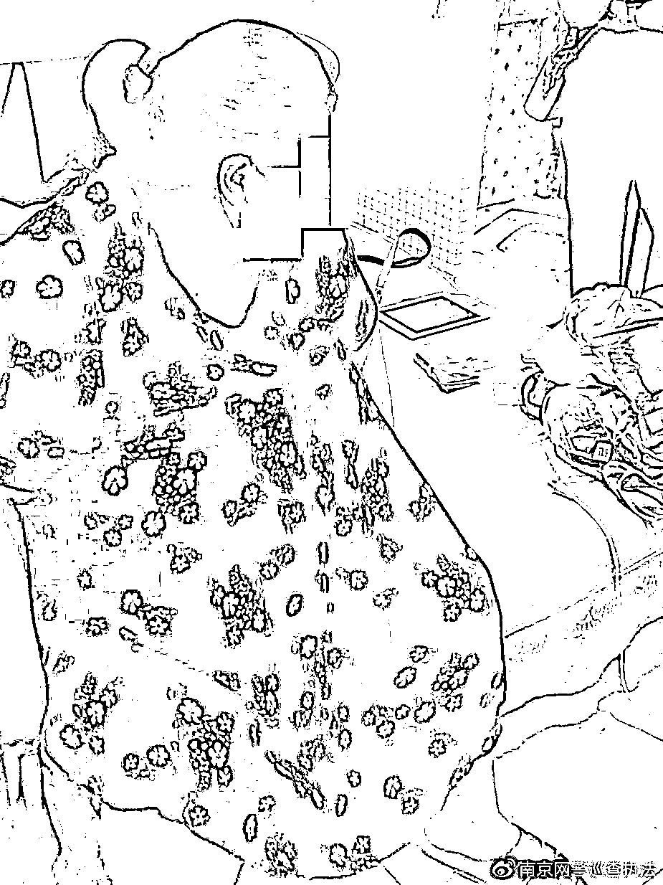
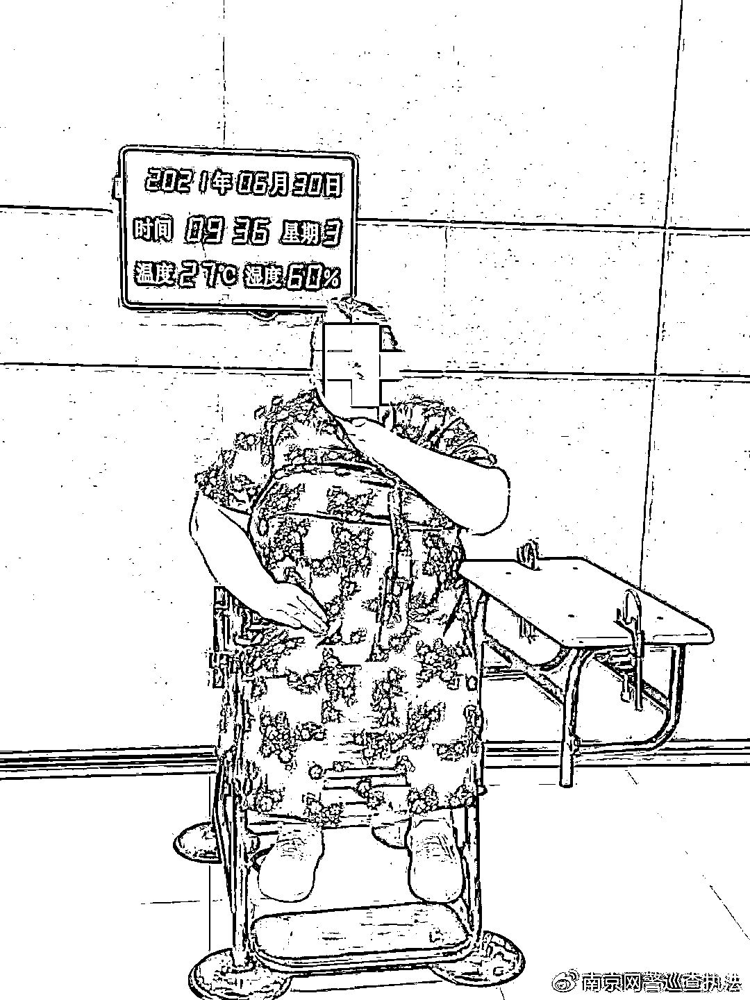

# 陪玩小姐姐真面目曝光！比乔碧萝还乔碧萝

> 原文：[`mp.weixin.qq.com/s?__biz=MzIyMDYwMTk0Mw==&mid=2247517083&idx=2&sn=f56ab735a52339900f562cf61c2c9873&chksm=97cb48a3a0bcc1b57f64aceeafd723105d670a98c8dc4662b661efa998e751e740f6de4cb8fe&scene=27#wechat_redirect`](http://mp.weixin.qq.com/s?__biz=MzIyMDYwMTk0Mw==&mid=2247517083&idx=2&sn=f56ab735a52339900f562cf61c2c9873&chksm=97cb48a3a0bcc1b57f64aceeafd723105d670a98c8dc4662b661efa998e751e740f6de4cb8fe&scene=27#wechat_redirect)

据江苏网警消息，近日，常州小伙刘某下班回家后玩起了网游，在一场组队游戏之后，“美女”队友突然加他为好友，并表示希望与他继续玩游戏。在刘某的要求下，“美女”队友打开了语音交流软件，此时手机中传来的“萝莉音”仿佛要将刘先生融化。“美女”网游自称叫李某，很快两人就从游戏中的情侣发展成现实生活中的“情侣”。每天下班后刘某开着语音打着游戏，没过几天，刘某微信就转出去了 15000 多元。 但是当刘某提出想要见面时，“女朋友”李某却始终不肯露面，两人也从来没有视频过。刘某便提出要分手，并要李某还 1 万元给他。然而刚提出这个要求，刘某就发现自己被拉黑，他意识到自己被骗，随后向警方报案。接到报警后，常州警方通过转账信息迅速锁定了四川省德阳市中江县的李某。获得该线索后，分局刑警大队会同潘家派出所民警立即前往四川，6 月 30 日就将李某抓获。（中间为刘某的网恋女友）在民警抓获李时，其还在打着手机网游，不过此时，体重 200 多斤的她已成为其他人的“美女女友”。

让我们来看一看“美女”李某的庐山真面目！

来源：IT 之家

← 向右滑动与灰产圈互动交流 →

