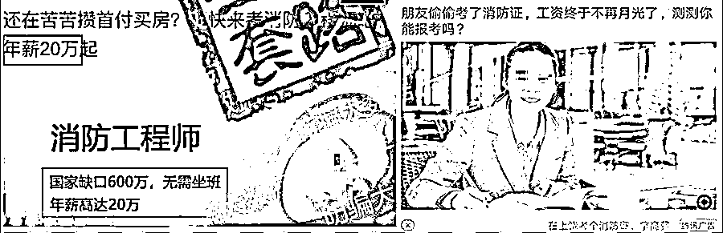
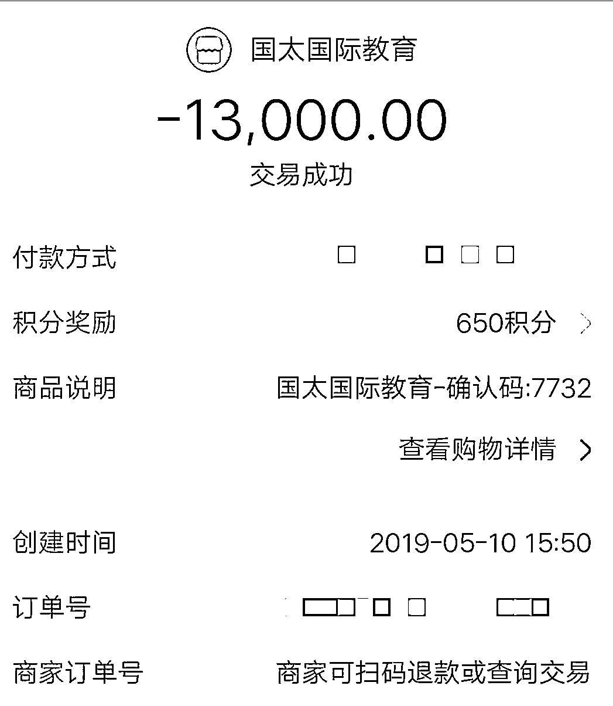
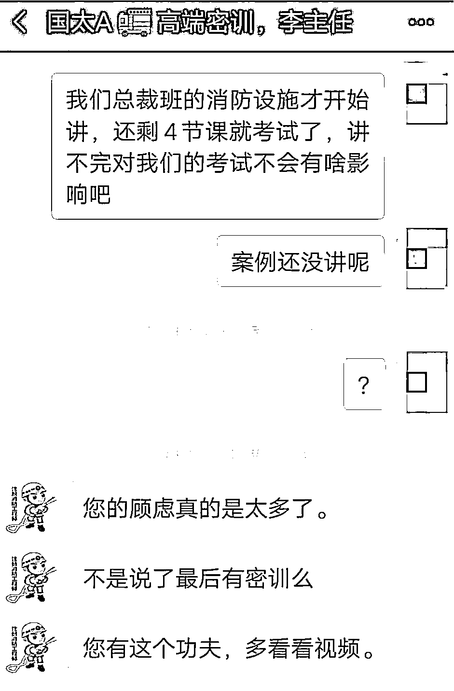
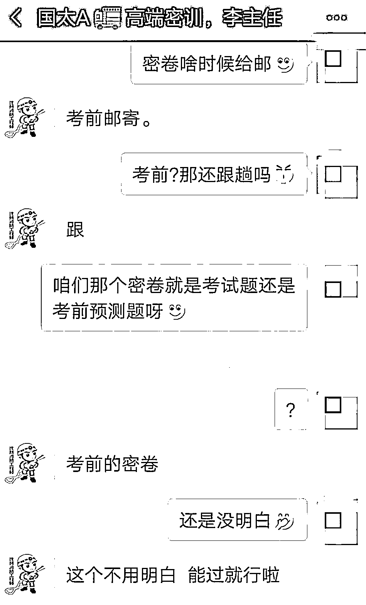
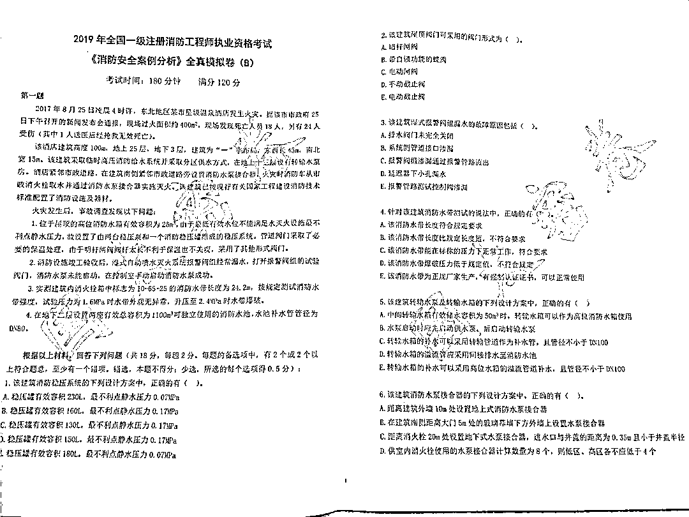
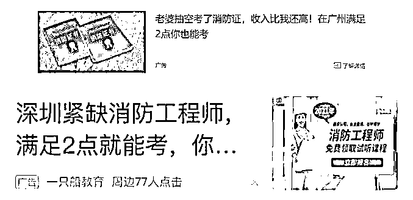
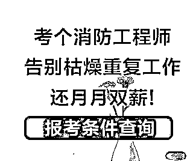
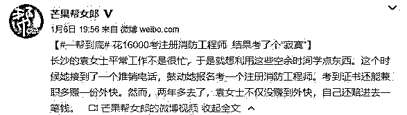

# 考个“消防证”每年躺赚 10 万？

> 原文：[`mp.weixin.qq.com/s?__biz=MzIyMDYwMTk0Mw==&mid=2247517083&idx=6&sn=e3a689b6a85f54d10e1254ba89c81532&chksm=97cb48a3a0bcc1b528e8940415cf3fcb84c09e42aef6bcee13bd9f65349e5c7618682dce9d15&scene=27#wechat_redirect`](http://mp.weixin.qq.com/s?__biz=MzIyMDYwMTk0Mw==&mid=2247517083&idx=6&sn=e3a689b6a85f54d10e1254ba89c81532&chksm=97cb48a3a0bcc1b528e8940415cf3fcb84c09e42aef6bcee13bd9f65349e5c7618682dce9d15&scene=27#wechat_redirect)

> **4 月 6 日发布：**考个“消防证”挂靠公司，每年白拿十多万挂靠费？看到这样的信息，你会不会心动？一些不法分子正是抓住这种心理，打着“能运作、代报名、容易过”的幌子，骗取高额报名、培训费。
> 
> **北京一家消防工程师培训机构考试报名涉嫌工作单位和学历造假，受骗学员遍布全国 20 多个省市，最大维权群超过 350 人。**

大连的蒋女士说，当初就是这条广告打动了她。一级注册消防工程师属于国家级职业资格证书，代表着这个行业的最高专业水准。正因如此，消防工程师考试被一些培训机构当成了敛财的手段。连日来十多名网友报料，他们均为北京国太国际教育咨询有限公司的学员。

[`mp.weixin.qq.com/mp/readtemplate?t=pages/video_player_tmpl&action=mpvideo&auto=0&vid=wxv_1816570717870620672`](https://mp.weixin.qq.com/mp/readtemplate?t=pages/video_player_tmpl&action=mpvideo&auto=0&vid=wxv_1816570717870620672)

经调查发现，这家主要培训消防工程师的培训机构，不仅欺骗学员，更涉嫌在考试报名中伪造假工作单位，伪造假学历。包括大连人在内受骗学员遍布全国 20 多个省市，目前最大的维权群超过 350 人。 

**大连宝妈花两万元报保过班，其中一科只考 27 分**

大连的刘女士中专学历，在一家企业做文员。在报考消防工程师前，她对这个行业并没有多少了解。孩子还小，自己上班又赚不了多少钱，刘女士盘算着换个行业。

她说去年 3 月，一次偶然的机会，她在网上看到了有关“消防工程师”的内容，网页需要注册身份信息，之后她接到了一家培训机构的电话。

这家公司就是北京国太国际教育咨询有限公司。在电话里，培训机构的老师跟刘女士聊了很久，其中老师承诺“考过了，挂靠证书一年就能拿十几万元。”这也是吸引刘女士报名的唯一理由。

起初她交了 7990 元的基础班报名费，之后老师又建议她报保过班，而且称考前还有密题，都是考试内部题，当然费用也不少。想想如果考过，挂靠一年就能回本，刘女士还是咬牙交了报名费，两次她一共交了 21800 元钱。

刘女士说，交了钱她也是很认真的学习，无论是保过班还是基础班的网课，她可以说一节没落下。因为白天需要上班，回家还需要带孩子，等把孩子哄睡，那段时间她每天坚持学习到凌晨两三点钟。

可即便如此，她最终的考试成绩却不尽如意，没有一科通过，甚至有一科只考了 27 分。

**“高价买密卷，考试一道题没有”**

与刘女士有相同经历的还有大连的蒋女士。她说自己也是偶然在网上看到这样的一则广告打动了她。“宝妈在家也能考工程师，挂靠一年净赚十几万”。

蒋女士大专毕业，但从事的不是与消防相关的专业。她的孩子才 21 个月大，企业即将裁员，迫于个人和家庭的现状，所以她也在北京国太国际教育咨询有限公司报了名。

老师说有考前密卷，相当于把考题告诉你了，肯定能过。

蒋女士说，她花 3 万多元报名，拿到考前密卷做了很多遍，可考题发下来时她都蒙了，一道题也没有。蒋女士在考试中失败。

十多位网友反映，他们均是北京这家培训机构的学员。除了本地网友在内，还有很多外地网友。

其中有网友说，“自己是浙江杭州人，初中还没毕业，没有工作，就是家庭主妇。听信了这家培训机构的谎言，一共交了 15800 元，最终上当受骗...”

**涉嫌伪造假工作单位、伪造假学历**

大连的刘女士说，无论与培训机构签订的合同，还是报名的老师都称承诺，考试不过可以全额退款。自己考试未过自然要找培训机构，可她发现此前与她联系的老师均把她微信拉黑了。

在采访时，刘女士也提到，事实上国家对一级注册消防工程师资格考试，从报名环节就设置了严格的条件限制，包括学历，所学专业和工作年限等，其中对学历的要求最低也要大学专科毕业。

以她中专的学历根本不满足报考条件。但当初培训机构的人说，可以走企业代报，具体怎么报名她也不是很清楚。名是报上了，可她却被安排到山西去参加考试，她准考证上的信息，除了名字之外，工作单位，毕业院校以及社保信息均是假的。看到在刘女士的报名表上毕业院校写着“四川某大学”，工作单位写着“山西某消防科技有限公司”。

大连的蒋女士描述的情况刘女士她相似。一位外地学员提供了一段与该培训机构工作人员的电话录音。这位学员质问为何自己的报名信息被造假时，这家培训机构的工作人员言语中承认确实存在这种操作，但表示“有些东西只能睁一只眼闭一只眼，系统审核通过，能应付这个考试就行。”

对于报名机构这样的解释，学员们不能接受。在采访中，很多学员都表示起初并不清楚“企业代报”是什么意思，对于在报考中学历造假，工作单位造假，是否会对个人产生不良信用记录，都十分担心。

**受骗学员遍布全国 20 多个省市，最大维权群超过 350 人**

浙江宁波的汤先生也是该培训机构的学员，也是受骗者之一。他说，事后他组织大家成立了维权群。受骗学员遍布全国 20 多个省市，目前人数超过 350 人。

汤先生说，事实上这些学员大部分都是学历或者其他方面不满足报名条件的，当初都是受这家培训机构的诱导，交了数万元钱，最终没有考过。这家培训机构在缴费前是承诺不过退费的，但事后都没有履行合同。据他了解，只有极少数学员退了费。

在众多的受骗学员中，也有学员向当地公安机关报了案。汤先生说，据他了解这家机构依然在经营，他也一直在帮助大家维权，也希望通过媒体提醒其他人，不要再被这样的培训机构所骗。

**当联系这家培训机构时，对方挂断电话**

当找到了这家培训机构的网站。网站上留有两个电话号码。拨打其中一个号码时，一名男子接听，当询问是否为“北京国太国际教育咨询有限公司”时，对方连说“不是，不是”，之后挂断了电话。等再次拨打该号码显示已经关机，另外一部电话则一直无法接通。

事实上，针对这家培训机构的丑闻，外地的一家媒体此前也曾做过相关报道。面对媒体记者的提问，这家机构工作人员曾表示，“大部分培训机构全都是这样。

**业内人士：考试审查非常严格**

当时采访了该行业的一位业内人士张女士。她是在 2018 年考取的一级注册消防工程师的资格证书。她说，国家一级注册消防工程师资格考试由人力资源社会保障部人事考试中心统一组织实施的。报考人员大多是从事相关专业的，而且报名需要层层审核。有的省市在成绩出来之后，还进行复查，可以说是非常严格。

张女士表示，目前培训市场上确实有一些机构承诺很多，但一旦在审核时被发现造假，那么即便是报上了名，成绩通过，最终也会被取消成绩。此外，她也表示，这种考试专业性很强，即便是她有着十多年的工作经验，也进行了很长时间的学习。对于无专业基础、无相关工作经验的人来说，几乎很难通过。

**防骗每日电讯提示**

1、 消防工程师考试只能由个人登录人事考试网进行注册报名，并无企业对接报名这一说法。不法分子和违规网校所称的“运作”行为根本不可能实现。

2、 消防工程师资格证考试对学历、工作年限的要求及审核非常严格，报名时一定要确认自己具备资格。

3、 挂靠公司涉嫌违法，需要承担行政责任，最严重可能会面临注销证件的处罚。如果发生事故，还要承担相应的刑事责任。

来源：天天防诈骗

← 向右滑动与灰产圈互动交流 →

