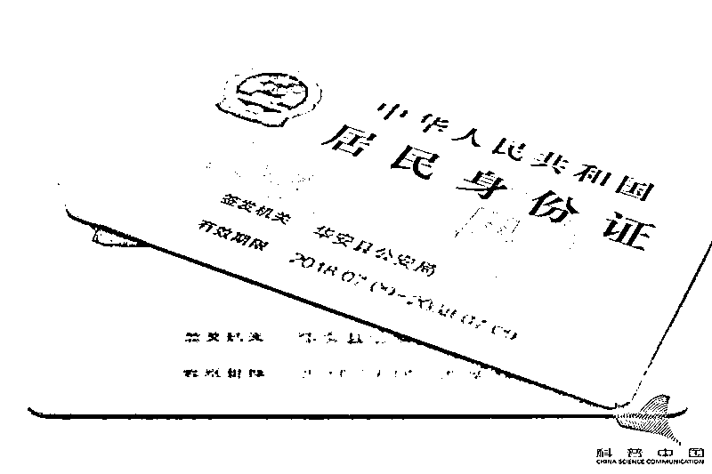
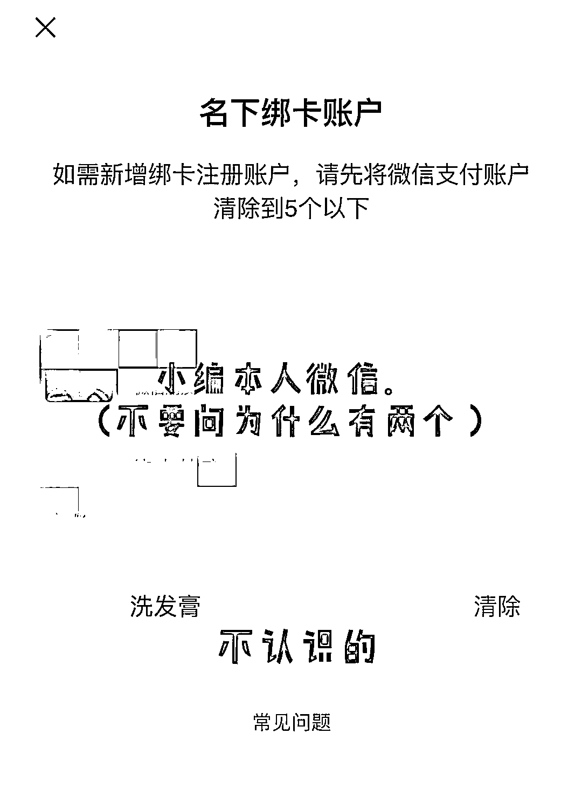
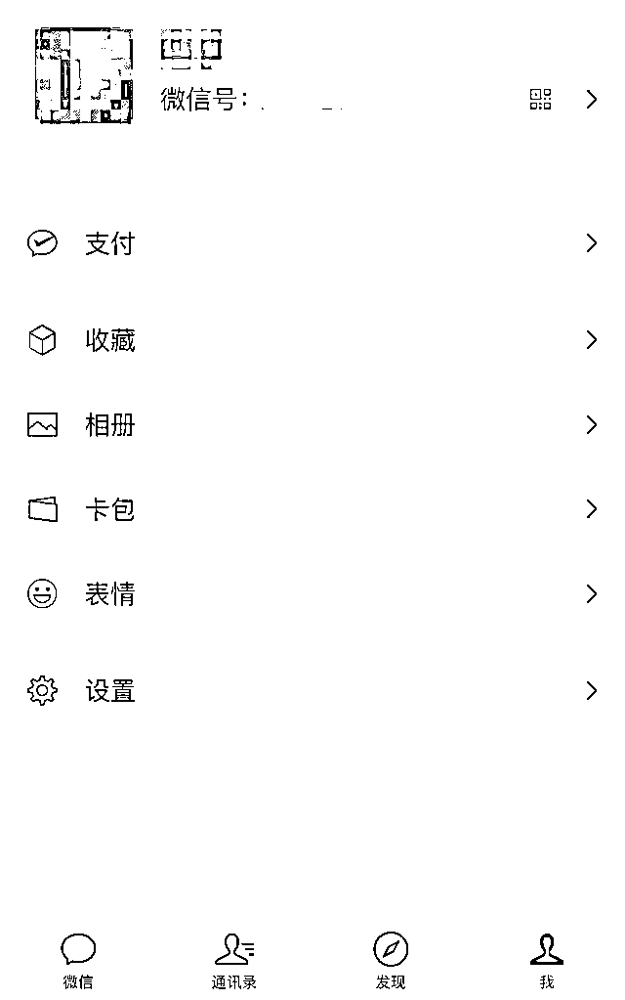
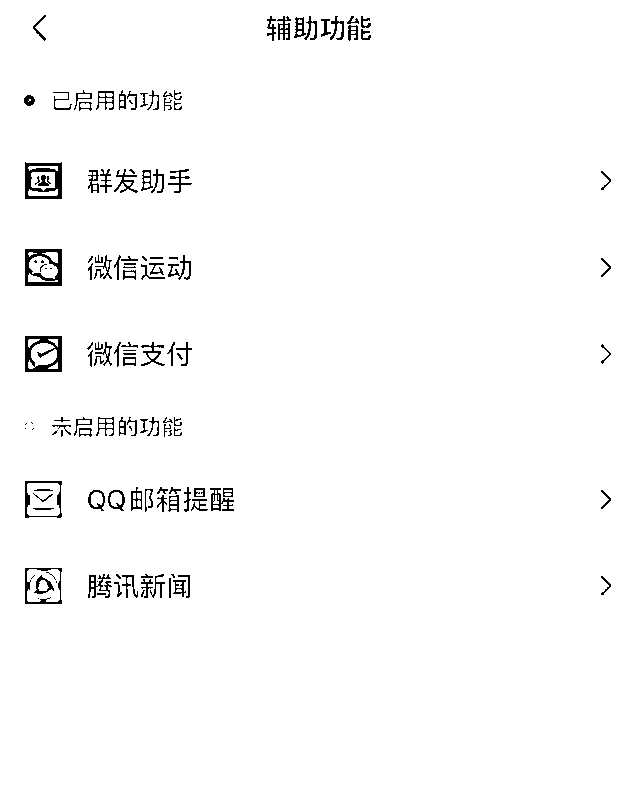
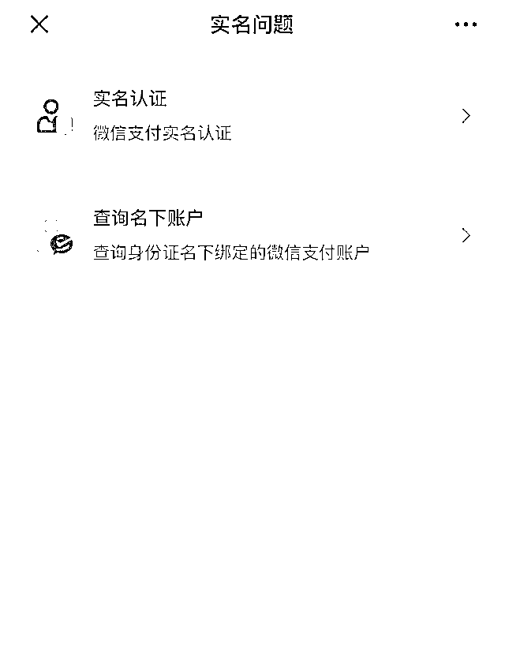
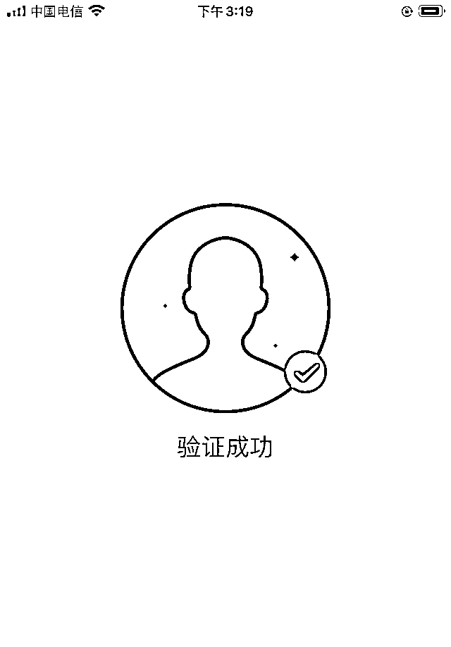
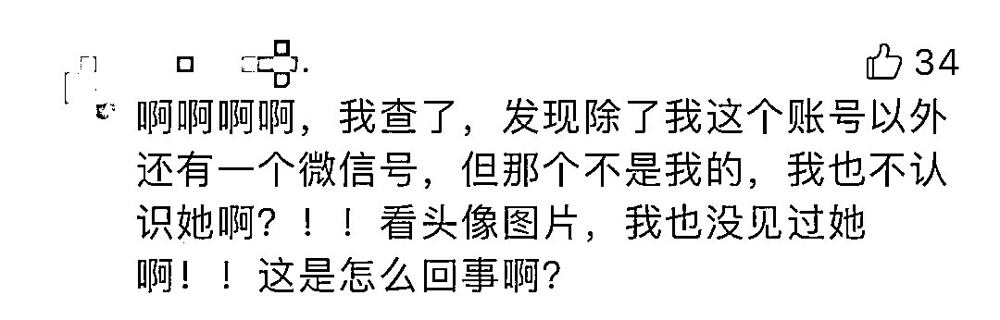
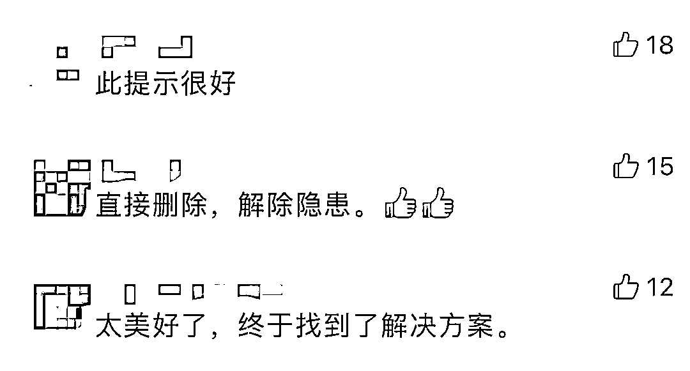

# 赶紧自查！你的身份证可能被别人绑定了微信支付！已有多人中招...

> 原文：[`mp.weixin.qq.com/s?__biz=MzIyMDYwMTk0Mw==&mid=2247517161&idx=2&sn=c9233506de42e0f5bca58d5667cdbfb4&chksm=97cb48d1a0bcc1c74975fa9c1e2b03c74b2e3d95b97051e4824f8df11b6fc69a5c36cefad43f&scene=27#wechat_redirect`](http://mp.weixin.qq.com/s?__biz=MzIyMDYwMTk0Mw==&mid=2247517161&idx=2&sn=c9233506de42e0f5bca58d5667cdbfb4&chksm=97cb48d1a0bcc1c74975fa9c1e2b03c74b2e3d95b97051e4824f8df11b6fc69a5c36cefad43f&scene=27#wechat_redirect)

对很多人来说

拥有两个或多个微信账号

是十分正常的事情

然而，如果你的身份信息

在你不知情的情况下

被别人绑定了微信支付

是不是细思极恐？

虽然绑定微信支付不等同于绑定银行卡，仅进行了身份认证的微信号，也只有一定的微信支付额度。但是，**一旦对方用有我们身份信息认证的微信从事违法活动**，后果将不堪设想。

有网友抱着试一试的心态，查了一下自己身份信息名下的微信账号。

不查不知道，一查吓一跳！名下竟然有一个陌生的微信号。

遇到这种情况怎么办？别急，下面就手把手教你如何查询并解绑自己身份证绑定的、不属于自己的微信。

**第一步**

打开微信，依次点击“我”-“设置”-“通用”-“辅助功能”

**第二步**

进入“辅助功能”页面后，点击“微信支付”-“帮助中心”-“实名问题”。

**第三步**

在“实名问题”中点击“查询名下账户”根据查询要求输入姓名、身份证号，最后扫脸验证。就可以查询到自己身份证名下绑定了多少个微信号，还可以查看到这些账号的昵称以及头像信息。

**第四步**

身份验证之后，如您发现有些微信号已经没有使用或者非本人的微信号，可以点击【清除】解绑账号。

不少网友测试后，也纷纷表示终于找到解决方案。 

身份信息被冒用，是个老生常谈的问题。近年来，冒充他人身份信息犯罪的新闻并不少见。

**警方提醒**

**赶紧查查你的身份证**

**有没有被别人绑定**

**若有绑定**

**在解绑账号的同时**

**请及时拨打 110 报警** 

来源：浙江公安，反诈骗先锋

← 向右滑动与灰产圈互动交流 →

