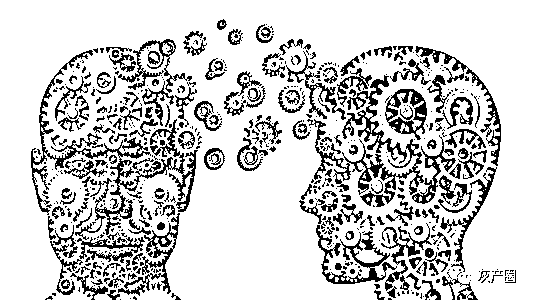
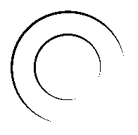

# “别以为骗子不学无术，其实他们个个都是心理学大师！”

> 原文：[`mp.weixin.qq.com/s?__biz=MzIyMDYwMTk0Mw==&mid=2247517161&idx=3&sn=6ce6ddafada0ac998ff8f392f012ad2f&chksm=97cb48d1a0bcc1c76baf8b9b5a81206c902f77edd4a120d27dd42c8663955e9fa133c52ca034&scene=27#wechat_redirect`](http://mp.weixin.qq.com/s?__biz=MzIyMDYwMTk0Mw==&mid=2247517161&idx=3&sn=6ce6ddafada0ac998ff8f392f012ad2f&chksm=97cb48d1a0bcc1c76baf8b9b5a81206c902f77edd4a120d27dd42c8663955e9fa133c52ca034&scene=27#wechat_redirect)

   “你以为骗子不学无术，其实他们个个都是心理学大师。你以为自己被骗是大意，其实骗子利用人类心理上众多漏洞，已将你拿捏住了。”每类电信诈骗背后都有哪些心理学秘密？受害人又是怎么稀里糊涂落入陷阱的？对此，盾盾为你一一揭秘。

杀猪盘“首因效应”“自我展示技巧”“自己人效应”

      一女子名叫筱筱，不久前，她通过微信认识了自称叫“林磊”的男子。经过几天的交流，筱筱发现对方风趣幽默，帅气多金，两人随后发展成男女朋友关系。此后有一天，“林磊”突然对筱筱说他在香港维护某彩票后台时，发现该博彩网站有漏洞，可以利用该漏洞赚钱。因为“林磊”是工作人员，工作时有监控不方便操作，他希望筱筱可以帮忙，并再三保证这些赌博网站在澳门、香港都是合法的，稳赚不赔。为了证明自己对恋人的信任，筱筱按照“林磊”的指示进入赌博网站，注册账号开始充值。起初，她每次按照“林磊”指导都能赌赢，几天下来在平台上已经赚了 2 万元。这时“林磊”要筱筱在“VIP 场”玩个大的，为以后幸福婚姻生活积攒一笔资金。筱筱东拼西凑充值 18 万余元，结果血本无归。而此时，她的恋人“林磊”失踪了。

心理学揭秘：

      从网恋“一见钟情”开始，到参与网络赌博或投资诈骗结束，直到受害者倾家荡产甚至背负巨债，这就是“杀猪盘”诈骗。采访中，山西晚报记者了解到，别看刷单、贷款类诈骗发案数比杀猪盘类诈骗多，但是要说起来财损，其他所有的诈骗类型加起来都没有杀猪盘类诈骗高。经统计，2021 年，太原市平均每一起杀猪盘类诈骗案件受损金额就高达 19.5 万元，可以说是触目惊心。

     这其中，3 个心理学内容不得不提，那就是“首因效应”“自我展示技巧”和“自己人效应”。

    “首因效应”也叫首次效应、优先效应或第一印象效应。心理学研究发现，与一个人初次会面，45 秒钟内就能产生第一印象。对于单身的或者缺乏感情的男女，特别是成功的有一定经济基础的男女，骗子们都会“对症下药”，钻研角色，摸清你的喜好，从而打动你的内心，击穿你的一切戒备。杀猪盘诈骗手法中，骗子们总是披着华丽的外衣，要么是俊男美女，要么是行业精英。他们会为你展示“精致”的生活和宽广的人脉。这就是第一印象效应，把你带进“先入为主”的漩涡，让你看不透、摸不透，一切都掩饰得天衣无缝。

      获得良好的印象分后，骗子就开始使用“自我展示技巧”。在心理学层面，人类有一种习性，那就是会对主动展示隐私给自己看的人，产生天生的好感。几乎无一例外，交流中，骗子会以自己私密的感情失败经历或是不幸的童年为内容，先向受害人倾诉。包括引诱受害人投资时，他们的说法也是“这是系统漏洞，我只信你，也只和你一个人说”。当骗子如此“坦诚”向你展示“隐私”时，受害人本能的反应就是，他原来如此信任我，我更不应该对他有什么戒心和恶意。受害人会不自觉对骗子产生好感，进而信任。

      在上述两个步骤完成后，通常情况下，受害人都会陷入“爱河”。此后，骗子使用的心理学技巧就是“自己人效应”，简单来说就是“是自己人，什么都好说；不是自己人，一切按规矩来”。用心理学分析人际交往，如果双方关系良好，一方就更容易接受另一方的某些观点、立场，甚至对对方提出的难为情的要求，也不太容易拒绝。例如，一个原本连扑克都不会玩的，甚至讨厌赌博的女子，都会因为“恋人”的要求去豪赌。但如果对方是自己讨厌的人，那么无论对方说什么，本能地就想加以抵制。鉴于上述多种心理学手法运用，骗钱又骗情的杀猪盘，往往让受害人在不知不觉中掏空了所有的钱财，甚至背负上了贷款。最重要的是，那种屈辱和无力感，摧毁了他们的自信心和对未来的美好憧憬，很长时间不能走出这种痛苦。

刷单类诈骗“公开承诺”“群体效应”“内爆现象”

      近日，小森在家玩手机时，被拉进一个叫“74”的微信群里。群内，有人发布兼职刷单广告：“一单赚三四十块钱，每天动动手指就有三百块进账”。如此轻松就能赚取外快，小森被吸引了，于是点击对方发来的链接下载了“创聊”APP。很快就有“派单员”主动添加他为好友。面对对方发来的“垫付投资回报表”和“包赔协议”，小森跃跃欲试，将钱转到对方指定的银行账号充值购买“三分快三”“五分快三”，几分钟后开大小。当小森充值几次等着提现的时候，“派单员”以账号冻结，需要充值流水等理由让他不断加大充值金额，他才恍然大悟发现被骗。

心理学揭秘：

     “微信群里组织刷单、赌博、炒股……很多受害人刚进此群的时候，大都能感觉这个群‘不太正常’。有些人会有些戒心，但因好奇心，他们会选择先看看。但怎么看着看着，这些人就从旁观者变成了参与者呢？”民警揭秘，这其中的变化主要就是骗子利用了“公开承诺”“群体效应”“内爆现象”等心理学技巧。

      通常情况下，此类群聊中，骗子首先会群发一些“口号”“演讲”“承诺”，并要求群内的成员统一更改有目标性的群昵称，比如“暴富家族—某某”“赚上一百万—某某”。这种潜移默化式的“公开承诺”，最早在传销洗脑组织中最为常见。随着群主不断加强相关暗示，当所有群成员都完成“公开承诺”并预先做出表率后，受害人的思想会为了支持自己的行动而变得更加坚定，即：行为改变思想。同时，公开的方法也会让受害人产生对他人评价的顾忌，特别是在一个相对封闭的交流环境中，“洗脑”的过程更易进行。在此之后，所谓的“派单员”“客服”会点对点对受害人提供服务，此举的目的，就是将受害人与其先前的社会支持系统分离，也就是不让你和别人交流。在完成上述步骤后，此类微信诈骗群就可能会出现一种社会内爆现象：外部联系逐渐减弱，每一个人都只和骗子联系。而骗子往往不会一个人行动，警方介绍，此前他们曾办理过一起微信网络赌博诈骗案，近百人的聊天群中，只有一个受害人，其余均为骗子扮演的角色。在那个案件中，骗子扮演的赌徒们不断发信息称“盈利”，并怂恿、鼓励受害人继续加大投入，因为群体效应造成错觉，最终让受害人赔光了所有家当。

贷款类诈骗“得寸进尺效应”“登门槛效应”

      近日，市民小凤收到一条贷款短信“无抵押，低利息，下款快，最高可贷 30 万”，后面附有一个网址链接。小凤点开链接下载了一个叫“WLD”的 APP，贷款的流程十分顺畅，很快在 APP 的账户里就有了 10 万元的额度。但当小凤提现时却被系统告知银行卡号错误，资金已被银监局冻结，需要 2 万元的解冻费，随后和贷款一起返还。可是当给对方转账 2 万元后，满心欢喜等待下款的小凤却又收到一条信息，说自己的征信风险度和征信有问题，需要再分两次转账 12 万元才能完成贷款。天真的小凤于是又给对方转账 12 万元，结果自然不言而喻，这才发现被骗选择报警。

    “低门槛”广告+网贷 APP。当有人向你推销贷款时，一定要小心。诈骗分子先让你在虚假贷款网站或 APP 上填写个人信息，再以信息填报错误、贷款额度被锁定等理由，诱骗你缴纳保证金或者解冻金。

心理学揭秘：

      此种犯罪手法中，骗子使用了心理学上的“得寸进尺效应”，又叫“登门槛效应”。其具体内容是指一个人一旦接受了他人的一个微不足道的要求，为了避免认知上的不协调（或想给他人以前后一致的印象），就有可能接受更大的要求。心理学家曾做了一个有趣的实验，他让助手去访问一些家庭主妇，请求被访问者答应将一个小招牌挂在窗户上，她们答应了。过了半个月，实验者再次登门，要求将一个大招牌放在庭院内，这个牌子不仅大，而且很不美观。同时，实验者也向以前没有放过小招牌的家庭主妇提出同样的要求。结果前者有 55%的人同意，而后者只有不到 17%的人同意，前者比后者高 3 倍。后来人们把这种心理现象叫“得寸进尺效应”。心理学认为，人的每个意志行动都有行动的最初目标，在许多场合下，由于人的动机是复杂的，人常常面临各种不同目标的比较、权衡和选择，在相同情况下，那些简单容易的目标容易让人接受。另外，人们总愿意把自己调整成前后一贯、首尾一致的形象，即使别人的要求有些过分，但为了维护印象的一贯性，人们也会继续下去。

      利用此种心理，骗子在“引君入瓮”时，常常会把“门槛”设定得很低，在目前发生的一些贷款诈骗案件中，骗子首次提出收取的费用仅仅为数百元。但当受害人一旦开始了首次支付，骗子就会变着花样不断要求继续支付各种名目的费用，而受害人尽管此时已经察觉到异常，也会“鬼迷心窍”似的不断加大投入。民警表示，在具体案件办理中，这种看似简单的诈骗手法，只有极少部分的受害人能够果断“悬崖勒马”。

冒充公检法诈骗“刺激性信息”“态度免疫策略”

      近日，市民刘女士接到自称“光大银行信用卡中心”的电话。通话中，“银行客服”称刘女士在北京光大银行办理的一张信用卡消费了 11000 元。“我从来没有在北京办过银行卡，对方说我有消费，我肯定是极力否认。”电话中，因为坚称自己绝对没有办理过这家银行的信用卡，“银行客服”先是让她不要着急，并随后好心帮她将电话转接到了“北京东城公安分局”。由“银行客服”到“公安民警”，不知不觉中，刘女士便进入了升级后的冒充公检法诈骗陷阱。“您涉嫌某刑事案件，现已立案侦查”，在此后与“警官”交流中，迫切想证明自己清白的刘女士，从一开始的警觉，变成了完全信任对方，最终被对方将账户内所有钱款骗走。

心理学揭秘：

      人在什么时候最好骗？情绪波动最大的时候。如：大喜——“你的手机号中奖了，请与某某号联系”。大悲——“你好，你的××遭遇车祸正在抢救”。恐慌——“你××银行的账户有笔钱被转移”。恐惧——“你的快递被查出藏有毒品，请配合警方调查”。

      警方提示，人情绪波动最大的时候，是人心理最脆弱的时候，也是受害人智商被“拿捏”的时候。冒充公检法实施电信诈骗的犯罪分子玩的就是个“心跳”，玩的就是“刺激性信息”。这类骗局一开始，骗子所有的手段就是让受害人产生激烈情绪。之后，便以警官、检察官、法官等身份获取受害人信任。其间，骗子为制造信息不对称、时间和空间上的紧迫感，还会要求受害人暂时中断与外界联系。例如“你先去酒店住”“除了我谁也别信”等要求，这在心理学中被称为“态度免疫策略”，其目的就是让陷入焦虑中的受害人，彻底失去警惕意识和反抗意识，方便骗子随意摆布。

来源：天津市反电信诈骗中心，利箭在行动

← 向右滑动与灰产圈互动交流 →

