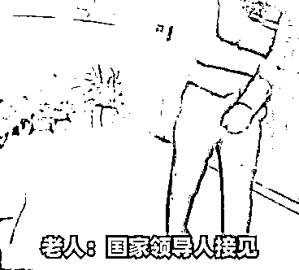
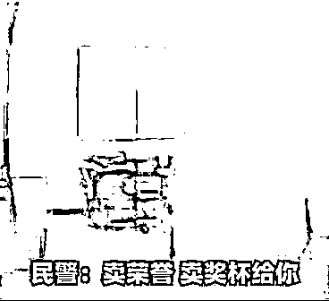
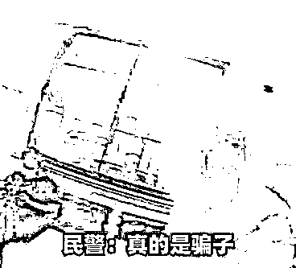

# “人民大会堂”这牛也敢吹？！

> 原文：[`mp.weixin.qq.com/s?__biz=MzIyMDYwMTk0Mw==&mid=2247517161&idx=5&sn=76c974ca9545fbf7100402b9dcd810e4&chksm=97cb48d1a0bcc1c74489942e6bd229450a55f0d8d2c483a7850c532a5131e0ecaccdf8f9e6ca&scene=27#wechat_redirect`](http://mp.weixin.qq.com/s?__biz=MzIyMDYwMTk0Mw==&mid=2247517161&idx=5&sn=76c974ca9545fbf7100402b9dcd810e4&chksm=97cb48d1a0bcc1c74489942e6bd229450a55f0d8d2c483a7850c532a5131e0ecaccdf8f9e6ca&scene=27#wechat_redirect)

俗话说

**人有多大胆**

**地有多大产**

但这些话被骗子们

**“活学活用”**后

就闹出了不少笑话

↓↓↓

[`mp.weixin.qq.com/mp/readtemplate?t=pages/video_player_tmpl&action=mpvideo&auto=0&vid=wxv_1952421792690569221`](https://mp.weixin.qq.com/mp/readtemplate?t=pages/video_player_tmpl&action=mpvideo&auto=0&vid=wxv_1952421792690569221)

近日

上海市公安局长宁分局

仙霞路派出所

接到辖区银行求助

**称有一名老人执意**

**向陌生账户汇款**

**汇款理由“令人费解”**

**疑似遭遇电信网络诈骗**

请求民警帮助

民警到场后立即

开展劝阻工作

经交谈得知

孙老伯最近突然

接到一份宣传手册

**邀请其前往人民大会堂**

**参加一个庆祝建党百年系列活动**

**手册中还特地注明**

**即使本人不便出席**

**只需缴纳 67800 元**

**就能获得主办方**

**制作的个人全身铜像**

**并授予“时代榜样”**

**荣誉勋章和证书**

孙老伯对此次活动颇为心动

但民警一眼

就识破了这一骗局

当即向孙老伯分析起了

骗子的话术

*这类骗术正是利用了老年人*

*渴望得到认可的心理*

*实际是诱导老年人付费参会*

*并出资购买**一些*

*毫无价值的劣质铜像*

见孙老伯将信将疑 

民警决定将其带回派出所

继续开展反诈劝阻

经过民警近两个小时的劝解

孙老伯终于认清了

骗子的真面目

表示放弃汇款

不会受骗上当

**老年人面对形形色色的讲座、**

**活动更应当保持理性，**

**多和子女、家人沟通商量，**

**以免受骗上****当**

来源：警民直通车上海，利箭在出击

← 向右滑动与灰产圈互动交流 →

