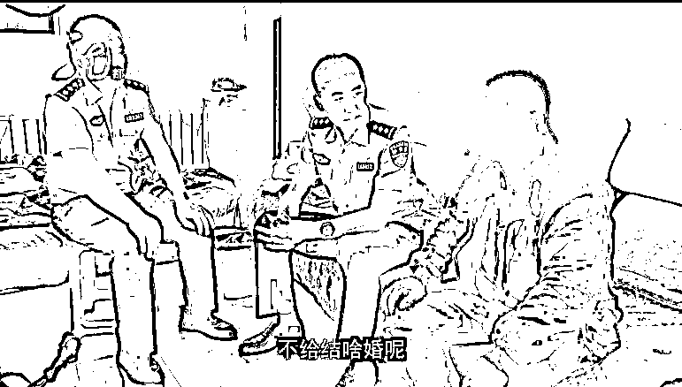
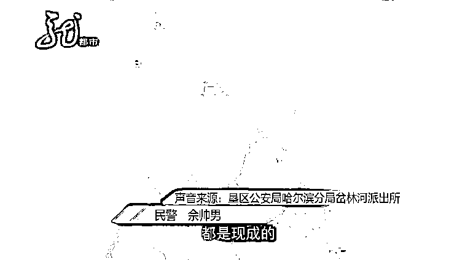
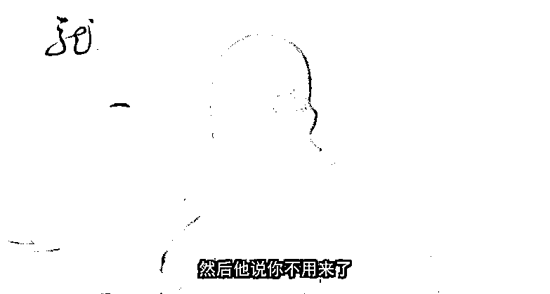
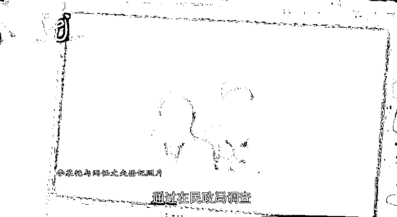
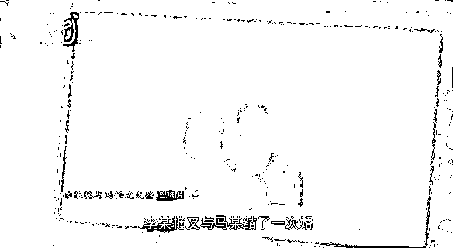
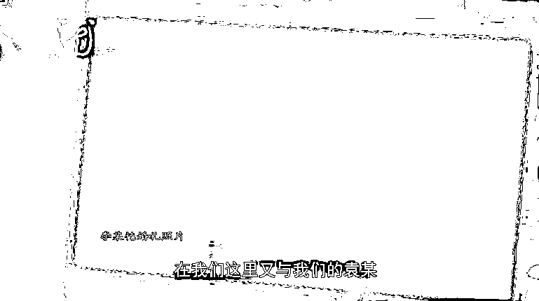
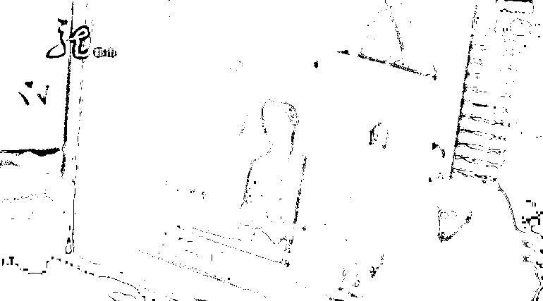
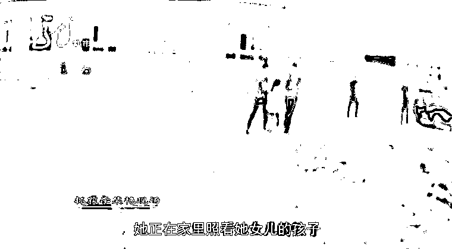
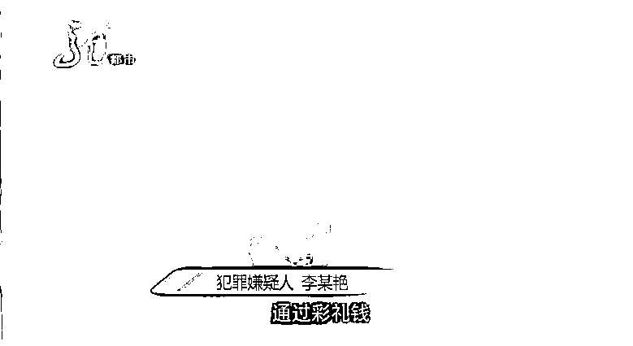
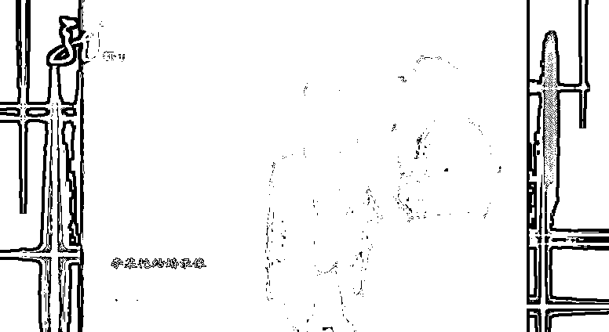

# 年近半百的新娘，结婚一个月离奇失踪！真相让人不寒而栗……

> 原文：[`mp.weixin.qq.com/s?__biz=MzIyMDYwMTk0Mw==&mid=2247517161&idx=7&sn=60210e53d561890e64fe59adb741f62d&chksm=97cb48d1a0bcc1c7afad2ac313b0d66b05ef26745a2b760ff5cfa41d248b67d482c67b746cd9&scene=27#wechat_redirect`](http://mp.weixin.qq.com/s?__biz=MzIyMDYwMTk0Mw==&mid=2247517161&idx=7&sn=60210e53d561890e64fe59adb741f62d&chksm=97cb48d1a0bcc1c7afad2ac313b0d66b05ef26745a2b760ff5cfa41d248b67d482c67b746cd9&scene=27#wechat_redirect)

<lable style="max-width: 100%;box-sizing: border-box !important;overflow-wrap: break-word !important;">刚结婚不到一个月的新娘</lable>

<lable style="max-width: 100%;box-sizing: border-box !important;overflow-wrap: break-word !important;">离家出走了，</lable>

整整四年杳无音讯。

男方多次寻找，

找来找去，最终发现……

[`mp.weixin.qq.com/mp/readtemplate?t=pages/video_player_tmpl&action=mpvideo&auto=0&vid=wxv_1951501224785018882`](https://mp.weixin.qq.com/mp/readtemplate?t=pages/video_player_tmpl&action=mpvideo&auto=0&vid=wxv_1951501224785018882)

事情还得从 2016 年开始说起

时年 46 岁的袁立（化名）

经亲戚介绍认识了一名女子

<lable style="max-width: 100%;box-sizing: border-box !important;overflow-wrap: break-word !important;">女子自称李雪，和袁立同岁</lable>

<lable style="max-width: 100%;box-sizing: border-box !important;overflow-wrap: break-word !important;">两人见面后对对方感觉都不错</lable>

<lable style="max-width: 100%;box-sizing: border-box !important;overflow-wrap: break-word !important;">不到一个星期</lable>

<lable style="max-width: 100%;box-sizing: border-box !important;overflow-wrap: break-word !important;">李雪就把行李搬到了袁立家</lable>

**黑龙江省哈尔滨市通河县岔林河农场居民 袁立**

<lable style="max-width: 100%;box-sizing: border-box !important;overflow-wrap: break-word !important;">结婚说要五万彩礼，最后给了她三万，（记者：这些钱是结婚之后给的，还是结婚之前？）结婚之前给的，不给结啥婚呢？</lable>

<lable style="max-width: 100%;box-sizing: border-box !important;overflow-wrap: break-word !important;">2017 年年初两人举行了婚礼</lable>

<lable style="max-width: 100%;box-sizing: border-box !important;overflow-wrap: break-word !important;">男方家办了好多桌酒席</lable>

<lable style="max-width: 100%;box-sizing: border-box !important;overflow-wrap: break-word !important;"><lable style="max-width: 100%;box-sizing: border-box !important;overflow-wrap: break-word !important;">**席间亲戚朋友们发现了**</lable></lable>

**新娘的奇怪之处**

**垦区公安局哈尔滨分局岔林河派出所民警  佘帅男**

<lable style="max-width: 100%;box-sizing: border-box !important;overflow-wrap: break-word !important;">**结婚现场，新娘的父母、兄弟姐妹一个都没有来，这是非常奇怪的。**</lable>

<lable style="max-width: 100%;box-sizing: border-box !important;overflow-wrap: break-word !important;">然而当时的新娘李雪</lable>

<lable style="max-width: 100%;box-sizing: border-box !important;overflow-wrap: break-word !important;">却表现得</lable>落落大方

<lable style="max-width: 100%;box-sizing: border-box !important;overflow-wrap: break-word !important;">被喜悦冲昏头的袁立便忽略了</lable>

这些细节

<lable style="max-width: 100%;box-sizing: border-box !important;overflow-wrap: break-word !important;">然而婚礼后没几天</lable>

<lable style="max-width: 100%;box-sizing: border-box !important;overflow-wrap: break-word !important;">一个自称李雪哥哥的人就打来电话</lable>

<lable style="max-width: 100%;box-sizing: border-box !important;overflow-wrap: break-word !important;">称李雪生病，要把她接走</lable>

<lable style="max-width: 100%;box-sizing: border-box !important;overflow-wrap: break-word !important;">就这样，又过了半个月</lable>

<lable style="max-width: 100%;box-sizing: border-box !important;overflow-wrap: break-word !important;">李雪看完病回来</lable>

<lable style="max-width: 100%;box-sizing: border-box !important;overflow-wrap: break-word !important;">称自己因病欠了外债，急需用钱</lable>

<lable style="max-width: 100%;box-sizing: border-box !important;overflow-wrap: break-word !important;">袁立听后便又给了她三万</lable> 

可这回，拿了钱出门的李雪

再也没回来……

李雪失联后，袁立四处寻找

此时的他才意识到 

除了结婚那日去过

李雪所谓的表姐家

自己对她几乎一无所知 

**哈尔滨市通河县岔林河农场居民 袁立**

<lable style="max-width: 100%;box-sizing: border-box !important;overflow-wrap: break-word !important;">办理结婚登记时，她拿身份证和户口啥的，登记员就说登不上，说她有记录没注销，我也没细问。</lable>

<lable style="max-width: 100%;box-sizing: border-box !important;overflow-wrap: break-word !important;">就这样，袁立找了四年</lable>

<lable style="max-width: 100%;box-sizing: border-box !important;overflow-wrap: break-word !important;">直到今年 6 月 3 日</lable>

<lable style="max-width: 100%;box-sizing: border-box !important;overflow-wrap: break-word !important;">袁立才去了派出所报案</lable>

<lable style="max-width: 100%;box-sizing: border-box !important;overflow-wrap: break-word !important;">**民警的调查结果，让他大吃一惊！**</lable>

**岔林河派出所民警  佘帅男**

<lable style="max-width: 100%;box-sizing: border-box !important;overflow-wrap: break-word !important;">通过在民政局调查，发现这名女子**在 2010 年的时候与一个赵某结过一次婚；2012 年的时候，又与一名马某结了一次婚；2017 年的时候在我们这里又和袁某结了一次婚。**</lable>

<lable style="max-width: 100%;box-sizing: border-box !important;overflow-wrap: break-word !important;">**这新娘不是新婚，**</lable>

<lable style="max-width: 100%;box-sizing: border-box !important;overflow-wrap: break-word !important;">**也不是一婚二婚，竟然是三婚？**</lable>

民警经过调查发现，<lable style="max-width: 100%;box-sizing: border-box !important;overflow-wrap: break-word !important;">**李雪的名字是假的，身份是假的，只有要钱要彩礼是真的，她在和三个人结婚前无一例外都要了彩礼。**</lable>也就是说，这名女子的行为已经涉嫌诈骗犯罪。

****<lable style="max-width: 100%;box-sizing: border-box !important;overflow-wrap: break-word !important;">派出所民警 </lable>鲍金龙****

 **<lable style="max-width: 100%;box-sizing: border-box !important;overflow-wrap: break-word !important;">犯罪嫌疑人真实姓名叫李某艳，我们用李雪当年与袁某结婚的照片，在人口数据库里与李某艳比对成功，相似度在 95%。</lable>** 

****

**<lable style="max-width: 100%;box-sizing: border-box !important;overflow-wrap: break-word !important;">李某艳是哈尔滨市呼兰区人，曾有过诈骗前科。2006 年，她就曾因骗婚被巴彦县人民法院判处有期徒刑四年。了解了这些信息后，</lable>民警找到了李某艳的第一任丈夫赵某和第二任丈夫马某。**

****<lable style="max-width: 100%;box-sizing: border-box !important;overflow-wrap: break-word !important;">派出所民警 </lable>鲍金龙****

 **<lable style="max-width: 100%;box-sizing: border-box !important;overflow-wrap: break-word !important;">我们去找赵某核实，赵某结婚前也被索要了五万元彩礼。婚后，李某艳基本不同赵某生活，也是以各种理由要钱，之后就走了。</lable>** 

 **<lable style="max-width: 100%;box-sizing: border-box !important;overflow-wrap: break-word !important;">办案民警认为，</lable>李某艳虚构事实**

**<lable style="max-width: 100%;box-sizing: border-box !important;overflow-wrap: break-word !important;">隐瞒自己的真实身份</lable>**

**<lable style="max-width: 100%;box-sizing: border-box !important;overflow-wrap: break-word !important;">非法占有他人财物</lable>**

**<lable style="max-width: 100%;box-sizing: border-box !important;overflow-wrap: break-word !important;">**涉嫌诈骗犯罪**</lable>**

****不久后，民警在呼兰区的****

****一间出租屋内****抓获李某艳****

****

**经审讯**

****李某艳承认在七年里结过三次婚****

****骗了三个人****

****分别是哈尔滨市呼兰区的****

****赵某、巴彦县的马某和****

****岔林河的袁立****

****

**<lable style="max-width: 100%;box-sizing: border-box !important;overflow-wrap: break-word !important;">警方查明，**李某艳自出狱后，四处物色农村未婚大龄男士，比如离异的、早年丧偶的，或是家庭条件不是特别好的、急于结婚的人为目标，以结婚要彩礼、看病、买东西为由，索要钱财。**</lable>**

******犯罪嫌疑人 李某艳******

****<lable style="max-width: 100%;box-sizing: border-box !important;overflow-wrap: break-word !important;">（记者：彩礼钱你都干啥了？）我自己就是日常生活花了，买东西、买衣服、买吃的、买穿的。</lable>****

********

******派出所民警  鲍金龙******

****<lable style="max-width: 100%;box-sizing: border-box !important;overflow-wrap: break-word !important;">她自己买的衣服都是上千块的，鞋都是几百块钱的。因为消费比较高，所以她没钱以后就再寻找下一个目标。</lable>****

****<lable style="max-width: 100%;box-sizing: border-box !important;overflow-wrap: break-word !important;">目前，李某艳因涉嫌诈骗被检察机关批准逮捕。</lable>****

 ****<lable style="max-width: 100%;box-sizing: border-box !important;overflow-wrap: break-word !important;"></lable>**** 

******警方提醒******

******不论是恋爱还是结婚******

******都要擦亮眼睛******

******谨防上当受骗****** 

****来源 ：新闻夜航、黑龙江广播电视台、潇湘晨报 ****

********

****← 向右滑动与灰产圈互动交流 →****

********