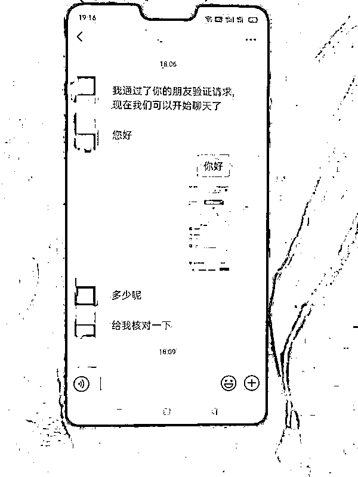
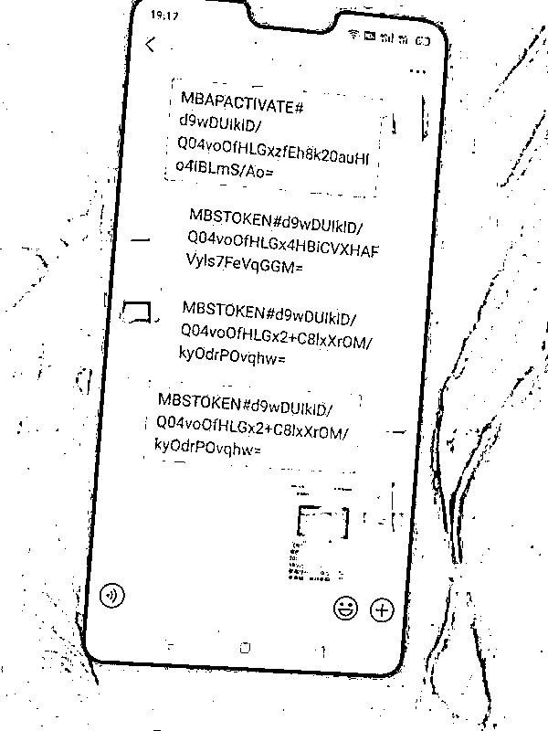
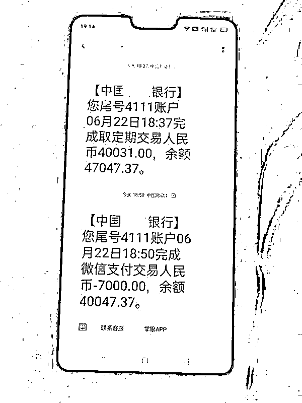
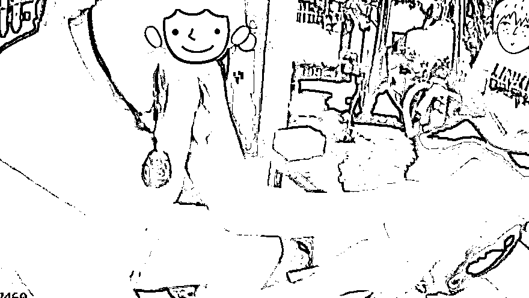
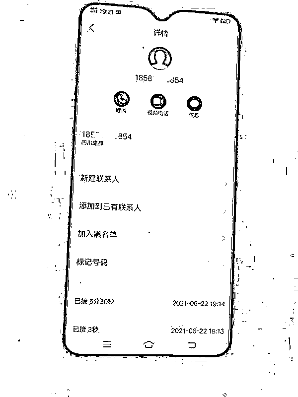
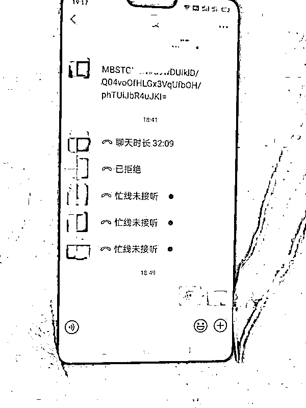

# 一女子卡上突然多了 4 万块钱！她立马报警…

> 原文：[`mp.weixin.qq.com/s?__biz=MzIyMDYwMTk0Mw==&mid=2247517161&idx=8&sn=f27eea166349489cf546e0687d822224&chksm=97cb48d1a0bcc1c75017bea59717e4d9c07672cd0102d9757458ac0c911186f4dfff309b613c&scene=27#wechat_redirect`](http://mp.weixin.qq.com/s?__biz=MzIyMDYwMTk0Mw==&mid=2247517161&idx=8&sn=f27eea166349489cf546e0687d822224&chksm=97cb48d1a0bcc1c75017bea59717e4d9c07672cd0102d9757458ac0c911186f4dfff309b613c&scene=27#wechat_redirect)

前几天傍晚

**海宁一女子收到短信**

**被告知她的快递丢了**

随后 

**又收到一笔转账**

**卡里竟多了 4 万多元**

这是怎么回事？

快递丢失了？

此前，宋女士确实有一个快递一直没到货，在收到短信，被告知快递丢失后，宋女士**就根据短信提示添加了对方的微信**。

添加微信后，对方发给宋女士一个链接。按照对方所说，**宋女士将银行卡账号和密码输入到了这个链接里**。

输入完账号和密码后，宋女士马上收到一条某银行的短信，上面显示，**自己的银行卡里真的多了 4 万多元**。

接着，对方告诉宋女士，**这 4 万元是不小心打错了，需要她马上将钱退还**。宋女士来不及确认自己的银行卡里是否真的多了 4 万元，只记得之前一直听到的反诈口诀是“不听不信不转账”，**感觉对方像极了骗子，便告诉他“我要去报警了**。”

接到宋女士的报警后，盐官派出所的值班民警立即赶到现场。

“我就是警察……”

就在民警到达现场了解情况时，**对方突然来电了，号码显示是四川成都**。民警接起电话，对方听到声音不对，立马挂断。

过了一会儿，电话再次响起。于是，**民警和对方开始了斗智斗勇**。

**“你现在到公安局了吗？你看一下是不是收到了我们公司打的 4 万元？”**

**“这个要去银行里核实的。”**

**“现在民警在旁边吧，让他给我们做个证。”**

**“我就是民警！我现在就在处理这个事情。如果这钱确实打错了，那么可以退还给你。但我有个问题想问你，这个钱是谁打过来的？”**

**“是我们公司打过去的。”**

**“你们公司为什么要打这么多钱？”**

**“不小心打错，我叫我们经理跟你们讲。”**

**“你让你们经理听电话！”**

在民警的一再追问下，**对方一下子找不到合理的借口，慌慌张张挂断了电话**。好在宋女士保持冷静报了警，在民警的及时处置下，**成功****守住了钱袋子里的 4 万元**。

“不听不信不转账”

随后，民警建议宋女士马上去银行确认**卡里是不是真的多了 4 万元，并向银行反映今天遇到的情况，然后将银行卡的余额马上转到家人的卡里**，以确保资金安全。

同时，民警又对宋女士和周围邻居都进行了反诈宣传，提醒大家如果对方要求你输入账号密码的，千万不能输入，**一般转账只需要姓名、账号，问你要密码的多半有猫腻**，一定要多留个心眼！

警方提醒：

时刻谨记“不听不信不转账”！

**凡是要求你向指定账户**

**或“安全账户”转账的**

**一律拒绝！！！**

遇到可疑情况

马上拨打 110 报警

也可以拨打

**全国反诈热线 96110**

来源：海安公安、反欺诈平台、反诈骗先锋

← 向右滑动与灰产圈互动交流 →

