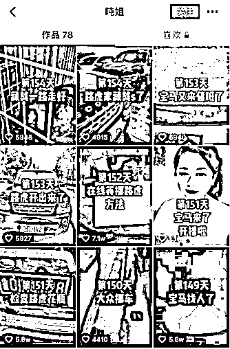
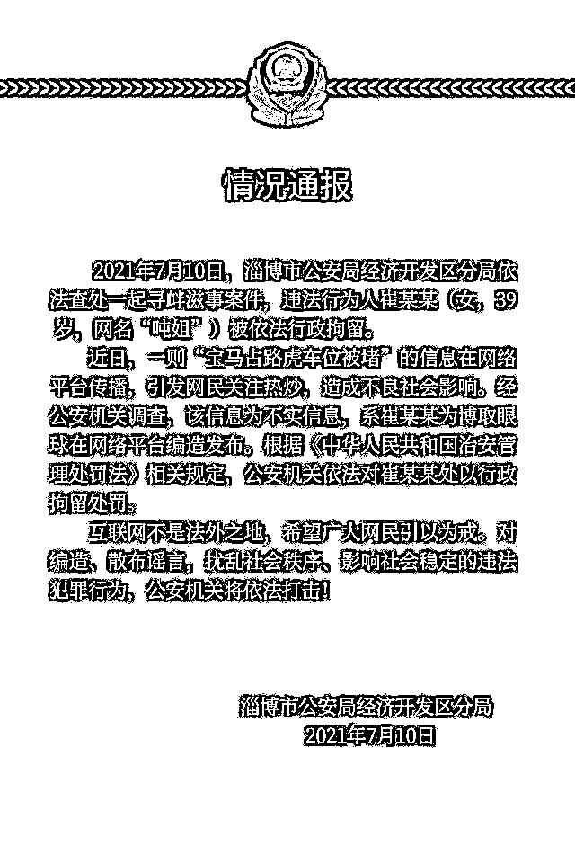
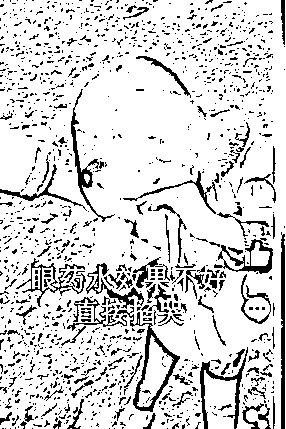
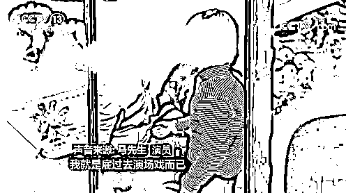
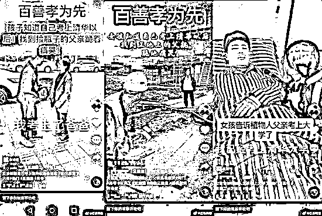
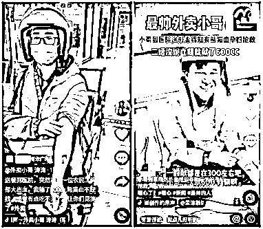
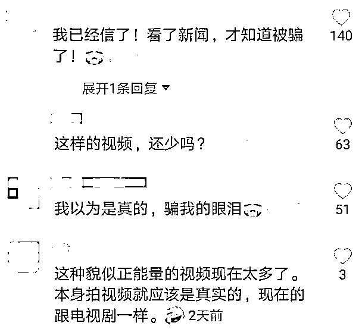

# 假视频算正能量么？

> 原文：[`mp.weixin.qq.com/s?__biz=MzIyMDYwMTk0Mw==&mid=2247517227&idx=1&sn=d88cfc242a50492de37e6d0ada7835c5&chksm=97cb4f13a0bcc605822a9e44bf9f906c3353c8726dfc0018ffb33d92e1bc1b3f5cdc3e762f89&scene=27#wechat_redirect`](http://mp.weixin.qq.com/s?__biz=MzIyMDYwMTk0Mw==&mid=2247517227&idx=1&sn=d88cfc242a50492de37e6d0ada7835c5&chksm=97cb4f13a0bcc605822a9e44bf9f906c3353c8726dfc0018ffb33d92e1bc1b3f5cdc3e762f89&scene=27#wechat_redirect)

现在是个短视频大爆发的时代。

闲来无事，刷刷短视频

已经成为很多人的一种主要消遣方式了。

看视频的时候，

你会不会

时而开怀大笑，

时而备受感动，

时而拍手称快，

时而愤怒生气……

不过先别激动，

你看到的这些视频，

可能是经过精心设计演出来的，

说白了，**都是****假****的！**

这不，山东警方处理了这么一位：

从今年 2 月份起，

一个叫“吨姐”的视频账号持续发布视频，

称一辆宝马车占了自己的车位，

自己用一辆路虎车将其堵住，

要给这种人点颜色看看。

有过此类遭遇的网友纷纷表示支持“吨姐”，

批评随意占用他人车位的行为。

“吨姐”自称，

宝马车主多次与其联系求沟通，

但自己都没有同意。

双方还闹上了法庭，正在等待判决书。

“吨姐”几乎以每天一更的方式介绍进展，

其账号在几个月里粉丝暴涨 70 多万。

很网友每天像追剧一样跟踪事件发展。 

没想到，大家等来的却是一个反转：

7 月 10 日，山东淄博警方发布通报称，

网友们 160 多天的密切关注，

等来的却是实打实的被“涮”。

“吨姐”斗宝马，

还要上法庭求个说法，

消费了大众的“惩恶”情绪。

值得注意的是，

最近一段时间，类似的事件频发：

为了带货，

某短视频团队哄骗七岁凉山女孩哭穷卖惨，

用滴眼药水，

掐胳膊制造流泪博取同情;

为了牟利，

某情感博主在视频里面声泪俱下，

以“资助孩子”的名义公然出售塑料珠宝……

为了流量，

某网友自编“寒门女孩考上清华，

跪谢父母”视频，

一声“爸！我考上了！”感动无数人。

结果有人发现，

爸爸的身份在其他视频里变成了民工，

甚至是病床上的植物人……

还有的个人或者商家，

为了宣传献血而拍摄短视频，

却传递出与常识和国家法规相悖的信息，

比如献血要去血站或者献血车，

“每次采集血液量一般为二百毫升，

最多不得超过四百毫升”等。

这些视频被一些红十字机构质疑是造假摆拍。

拍摄并发布短视频，

无论是为了娱乐、流量或者公司宣传，

都是创作者的自由。

如果是表演，即使明说也没人苛责，

但不能为了利益和效果，

故意模糊“摆拍表演”和“真实记录”之间的界限。

这些假剧本不仅让那些有价值的新闻被埋没，

更是在煽动人性，贩卖善良，

**长此以往会消耗大众的爱心，**

**让善良的人变得麻木，**

**反而稀释了社会正能量。**

短视频的生命力在于真实。

社会需要正能量，

但不等于只要举起正能量的大旗就可以胡作非为。

**这些有意或无意的欺骗，**

**已经触及了社会底线和法律红线。**

即使能逃过平台审核，

也逃不过舆论监督和网友的火眼金睛。 

在当前短视频平台规则中，

有流量就收获注意力，

有流量就有利益，

一些人为了钱甘愿铤而走险，

靠编故事博眼球。

**仅靠 UP 主的自觉和平台的自我监督远远不够，**

**更需要相关部门出台相关法规，**

**向造假者亮出“牙齿”，**

**给造假者当头棒喝。**

你如何看“演”出来的正能量视频？

留言区说出你的观点~

来源：央视网《事说新语》栏目

← 向右滑动与灰产圈互动交流 →

