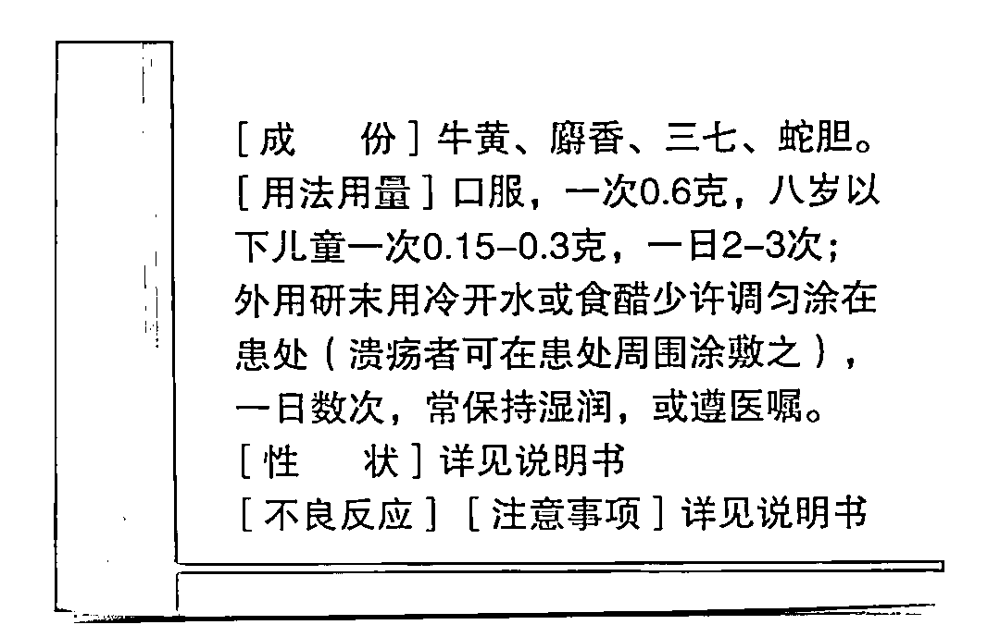

# 买不起的片仔癀，抢不到的茅台

> 原文：[`mp.weixin.qq.com/s?__biz=MzIyMDYwMTk0Mw==&mid=2247517227&idx=3&sn=deb69c69172fd4cf573fadf7a8a92ccb&chksm=97cb4f13a0bcc6058710c242c2df740c9ba42fdc7c88e812ba05ded1f2f9873376b2d374c2af&scene=27#wechat_redirect`](http://mp.weixin.qq.com/s?__biz=MzIyMDYwMTk0Mw==&mid=2247517227&idx=3&sn=deb69c69172fd4cf573fadf7a8a92ccb&chksm=97cb4f13a0bcc6058710c242c2df740c9ba42fdc7c88e812ba05ded1f2f9873376b2d374c2af&scene=27#wechat_redirect)

**1 盒 1 粒，1 粒 3 克，1 粒 590 块**。这是片仔癀未涨价之前的价格。 在线上线下齐涨价后，片仔癀现在直接被炒到近千块，更离谱的卖到**1600 块**。有网友戏称：一粒片仔癀入口，相当于 4 克黄金下肚。

01

**贵出天价的片仔癀** 

## **是如何一步步变得一药难求？**

片仔癀贵成这样，配方得多牛呢？网友们很快就扒到了片仔癀的配方： 观察片仔癀的成分，里面包含**3%麝香、5%牛黄、85%三七、7%蛇胆**。麝香的成分虽然是最少的，但十分昂贵，**成本占到了一粒片仔癀总成本的一半**。因为自 2003 年起，我国就紧急将麝列入国家一类野生保护动物。如今，野生麝基本绝迹，增量麝香主要来自养麝基地。麝香的使用，统一由国家审批和分配。物以稀为贵，天然麝香价格达到**480 元/克**以上，堪比黄金。****▲图源网络｜麝香的价格堪比黄金除了**原材料天然麝香的“真贵”**，片仔癀的第二重“贵”在于它**神秘、权威的配方**。为了保护中药品种，中国药监局设置了一个“国家保密配方”，配方分三个等级，其中最高等级的被称为“**国家绝密级配方**”，保密期限永久。**在全国，获得这个殊荣的，一个是家喻户晓的云南白药，另一个就是片仔癀。**但被捧上神坛的片仔癀，其适应症和主治并无神奇之处，都有平价且疗效好的替代药，并且可以在国家医保药品目录当中找到。 这不禁让人好奇，药效普通的片仔癀是怎么卖出天价，变得奇货可居呢？******▍片仔癀天价炒作套路揭秘**小珊替大家整理了要一下片仔癀背后的炒作套路，简单来说就是：**上游**有拿货的关系，**中间**有囤货的资金实力，**下游**开设大量面向高端人群的所谓“体验馆”。比如，**存货不充裕**的现象在片仔癀体验馆当中极为普遍，其整体库存周期约在一至两个月左右。原因或是片仔癀有意为之，目的为寻求对渠道更强的掌控能力，或是旺盛的终端需求加快了片仔癀体验馆的库存周转周期。有经销商表示片仔癀几乎每年 9 月份都会缺货，直到几乎不再供应的程度。而这将解释黄牛对片仔癀周期性的囤积行为——**只要抓住药企直营体系供货量的低谷期，黄牛就有空间对囤货进行提价处理**，并从中获利。从本质看，片仔癀通过产量及供货量控制“官倒”，反而推动了“**民倒**”加入竞争。只要片仔癀的需求紧张没有解决，涨价空间未被完全释放，囤积牟利的空间也将持续存在，黄牛行径也就无从根除。再加上在特定圈子里的文化游说以及消费习惯的培育，片仔癀的销售环境很快便成为了**卖方市场**——想卖多贵，就卖多贵。

02

## **飞天茅台疯抢的背后**

## **还有一条“代抢”黑产链**

值得一提的是，在片仔癀之前，还有一个遭到疯抢的国货，这就是**茅台酒**。**在线抢购茅台**已成产业，有黄牛以每瓶加价 400 元的价格提供**代抢服务**，还有技术团队出售茅台**“秒杀”软件**，最低 398 元包月。▲图片来源网络今年春节期间，淘宝、京东、苏宁易购等电商平台大量出售飞天茅台，定价 1499 元一瓶。日常市价 2500 元左右，抢到 1 瓶即赚 1000 元。利益诱惑掀起抢购潮，百万人疯抢。

**▍“薅羊毛”心态助推“代抢”黑产**

为了成功抢购茅台酒赚差价，网民们纷纷充分发挥主观能动性，有些开始专程从网上购买“**代抢脚本**”。这种一款**自动触发点击器**，可以设定抢购时间、抢购平台、抢购物品，非常便利。以往都是花时间各处搜罗优惠、折扣信息甚至平台漏洞，蹲点抢，有了代抢工具更方便薅羊毛。▲图片来源网络**大多数人抱着薅羊毛的心态，助推了开发、售卖、倒卖、代理脚本等一条****黑色产业链。****▍代抢背后隐藏个人信息泄露风险**在抢茅台占便宜的背后，其实隐藏着巨大的风险。首先，制作或者售卖脚本涉嫌提供侵入、非法控制计算机信息系统程序、工具罪。在你薅羊毛的同时，**或许一只脚已经踏入黑灰地带，踩到法律底线**。其次，代抢购**存在个人信息泄露风险隐患，或致网银资金被盗刷**。因为代抢脚本的运行需要特定的权限，通常抢购软件会要求手机**开放所有的权限**（无障碍模式），所以代抢服务就将你的隐私泄露给了开发者，也给别有用心的人以可乘之机。小珊在此提醒大家，制售抢购软件并非法律监管的“真空地带”，近年来，已有研发此类软件的不法分子被查处。▲图源网络｜“秒杀”软件如何抢购茅台

## **有人制售抢购软件获刑，有人以代抢茅台诈骗被刑拘**，可以看到，有关部门对黑产的打击力度在不断增加。与此同时，公民也要提高自身的信息安全意识，千万别因为搞个抢购就去违法的边缘试探，得不偿失呀～

← 向右滑动与灰产圈互动交流 →

