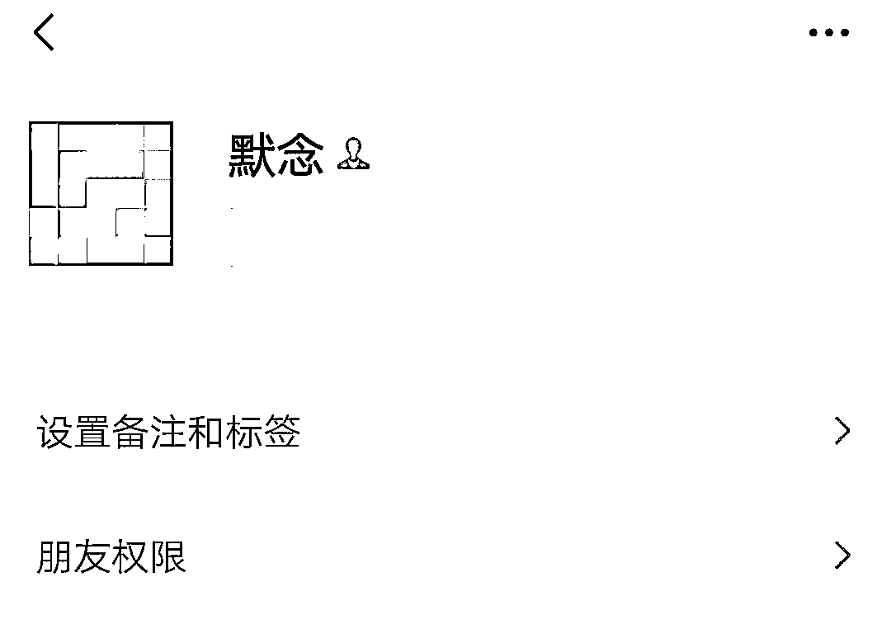
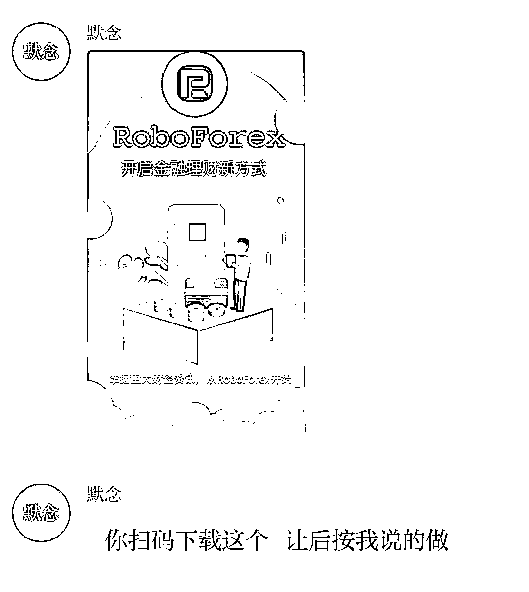
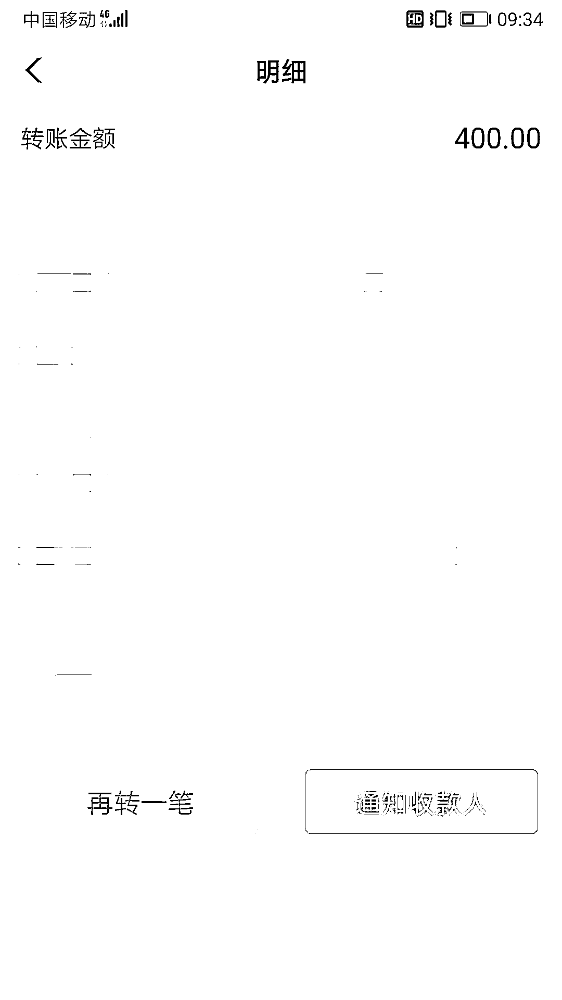
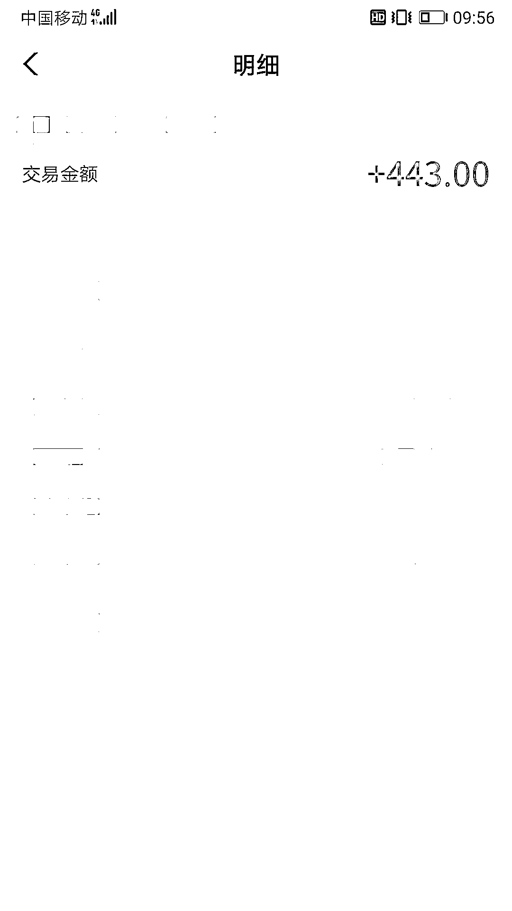
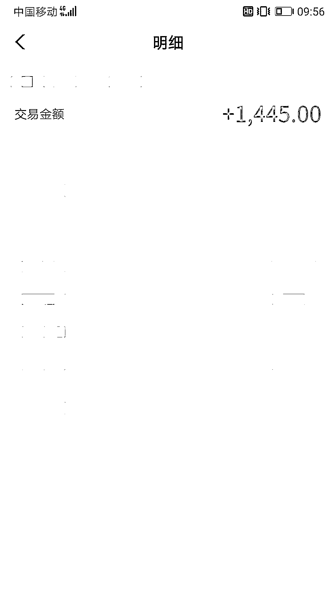
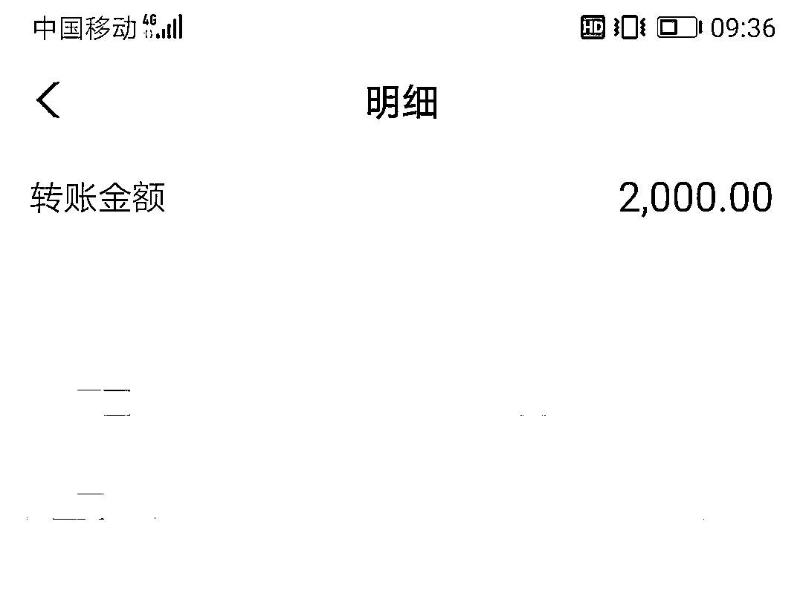
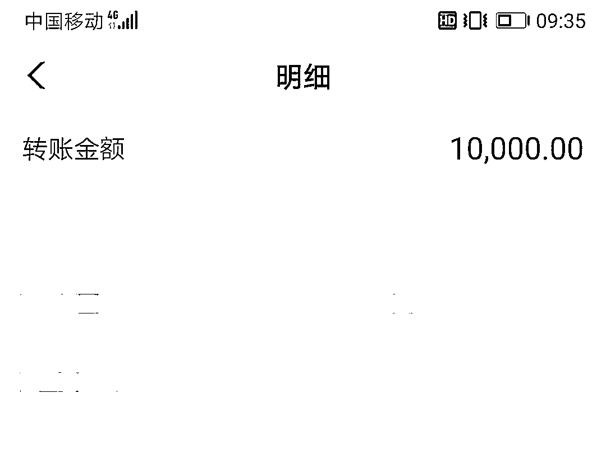
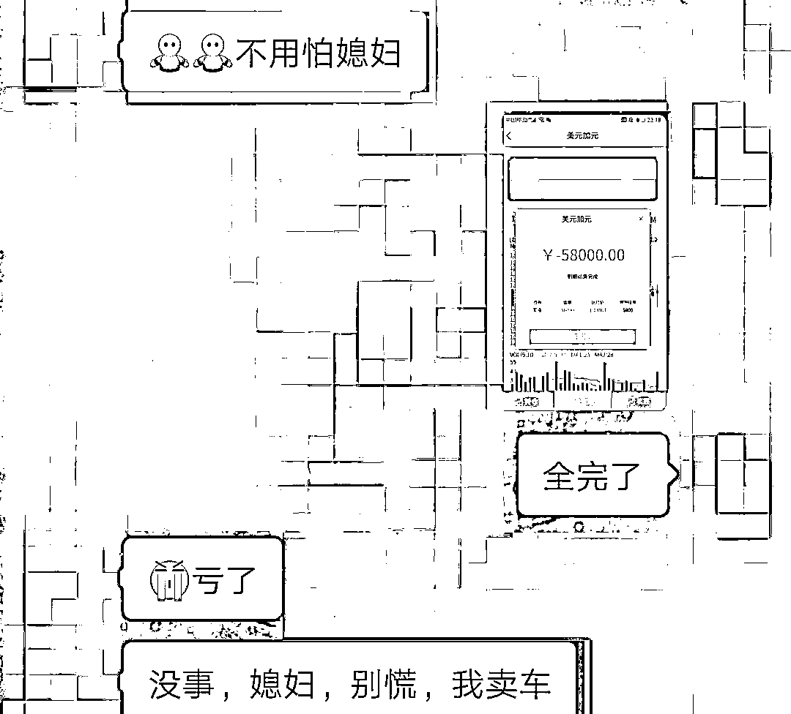
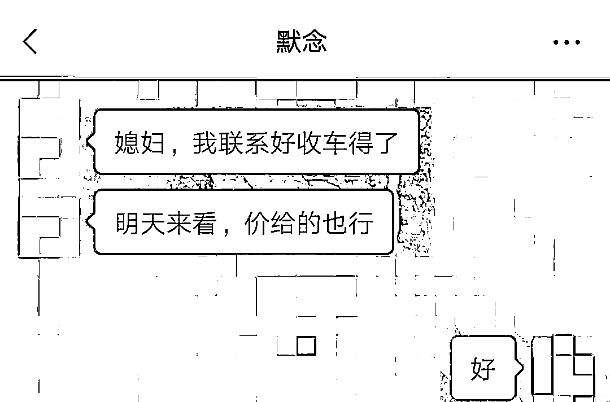

# 一女子网贷 7 万元投资外汇，最后人财两空....

> 原文：[`mp.weixin.qq.com/s?__biz=MzIyMDYwMTk0Mw==&mid=2247517227&idx=5&sn=c7ec419d30e69588d6d2e6f62397da4b&chksm=97cb4f13a0bcc60553fa87794dfee11042913e3f89e438a7bd7f1ac07204b764e923fc39ce66&scene=27#wechat_redirect`](http://mp.weixin.qq.com/s?__biz=MzIyMDYwMTk0Mw==&mid=2247517227&idx=5&sn=c7ec419d30e69588d6d2e6f62397da4b&chksm=97cb4f13a0bcc60553fa87794dfee11042913e3f89e438a7bd7f1ac07204b764e923fc39ce66&scene=27#wechat_redirect)

**“从前车马很慢，一生只够爱一个人”！**

**如今 5G 时代**

**“爱情来得太快，就像龙卷风”**

**稍不小心就陷入了爱情“陷阱”**

**清醒理智后回过头看** 

**原来**

**自己落入了一个叫“杀猪盘”的圈套**

**你把对方当真爱**

**对方视你为“猪”**

今年 26 岁的小含是安徽人，单身，独自一人在临安打工。**6 月初，小含通过微信认识了一个昵称叫“默念”的男子，他自称在广州做红木家具生意**，双方经常聊些家常，交谈甚欢，聊天中小含觉得这个男子成熟稳重，感觉自己的“春天”来了。

**几天后**

“默念”请小含帮他炒外汇，刚开始小含是拒绝的。但是为了拉近和他距离，小含最后妥协了，**她下载了一个叫“RoboForex”APP，使用“默念”的账号进行操作，几轮买进卖出的操作后发现收益非常可观**，这高额的收益数字是小含好几个月的工资，从来没见过这么多钱的小含心动了。

于是，小含用自己的身份信息注册了账号并绑定了银行卡号，**“默念”胸有成竹地告诉小含：“有老公在，放心。”**小含自以为幸福生活即将开启。

**6 月 12 日**

小含在“默念”的指导下，从“RoboForex”APP 上联系客服**成功充值 400 元，没过多久平台显示余额 443 元并成功提现**。

**6 月 15 日**

小含继续向指定账户**转了 1314 元并提现 1445 元**，直到 17 日小含的账户一直在收益。

**6 月 20 日**

“默念”告诉小含最近收益可观可以追加投入，小含分别充值了 2000 元和 10000 元，平台很快显示盈利，**正当小含准备提现时，发现提现失败。“默念”告诉小含由于账户流水不足导致提现失败，需要继续充值**。此时小含手上已经没有钱了，“默念”便怂恿小含到网上贷款，并告诉她贷款几天，赚了马上还进去，不用担心。小含相信了，从多个网贷平台借款 7 万余元。

**6 月 22 日**

小含相继转账 47000 元，平台显示亏损。小含着急问“默念”该怎么办？**“默念”称由于本金不够导致亏损，需要继续充值才能保证返本盈利并且提现。小含犹豫了，思考再三后选择继续转账但平台仍然显示提现失败**，此时的小含已经向平台充值了 77323 元。

网贷催款信息、平台提现失败等消息让小含倍感压力，不知如何是好的小含找到“默念”，质问他为何要让她陷入困境，**“默念”安慰小含不要着急，他一定会想办法帮她还本金，并承诺她把车卖掉赔偿小含的损失，可是到 7 月 4 日，“默念”彻底消失在网络中**，小含才意识到自己遇到了骗子，马上到板桥派出所报警求助。

**值班民警了解前因后果后告诉小含**

她遇到了典型网络交友诈骗，俗称“杀猪盘”，对方通过聊天获取信任后，**以高额回报的投资项目为诱饵，迷惑受害人进行投资**，当投资金额到达一定数额后，骗子就拉黑、删除人去楼空。

****** “杀猪盘”套路五步法******

**· 第一步：**** 取得信任 ****·**

骗子在添加好友之后，频繁与你聊天，让你对其产生信任。

**· 第二步：**** 怂恿投资  ****·**

等到关系稳定，骗子开始怂恿你在他（她）们自制的平台进行投资，骗子会通过后台操作，让你小赚几笔。

**· 第三步：**** 大量投入  ****·**

当你尝到甜头之后，骗子声称自己只要跟着他（她）投资稳赚不赔。

**· 第四步：**** 无法提现  ****·**

当你投入大量金额之后，看到平台金额并未增加，准备将里面的金额提现，发现提不出来。

**· 第五步：**** 销声匿迹  ****·**

再想与对方交涉时，骗子已经消失得无影无踪。等到你恍然大悟，发现自己上当受骗后，钞票已经进入骗子的口袋了。

**警方提醒**

**不要轻信“网络蜜糖”**

**多些清醒**

**少些痴迷**

**温柔的暴击有可能暗藏套路**

**在收获美好爱情之前**

**请先学会保护自己**

来源：临安公安，利箭在出击

← 向右滑动与灰产圈互动交流 →

