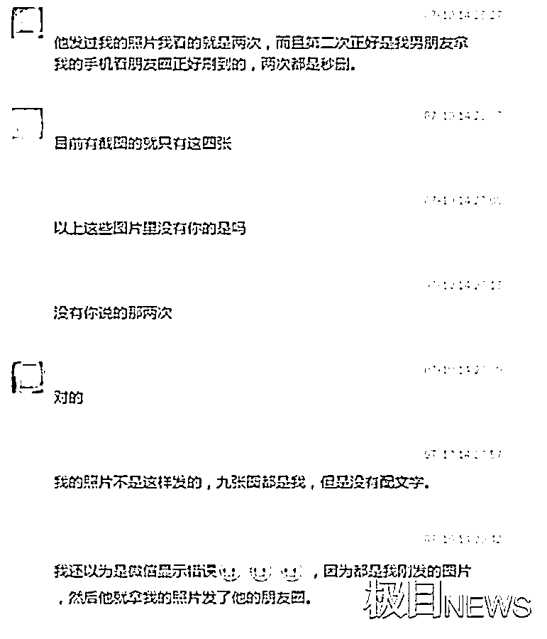
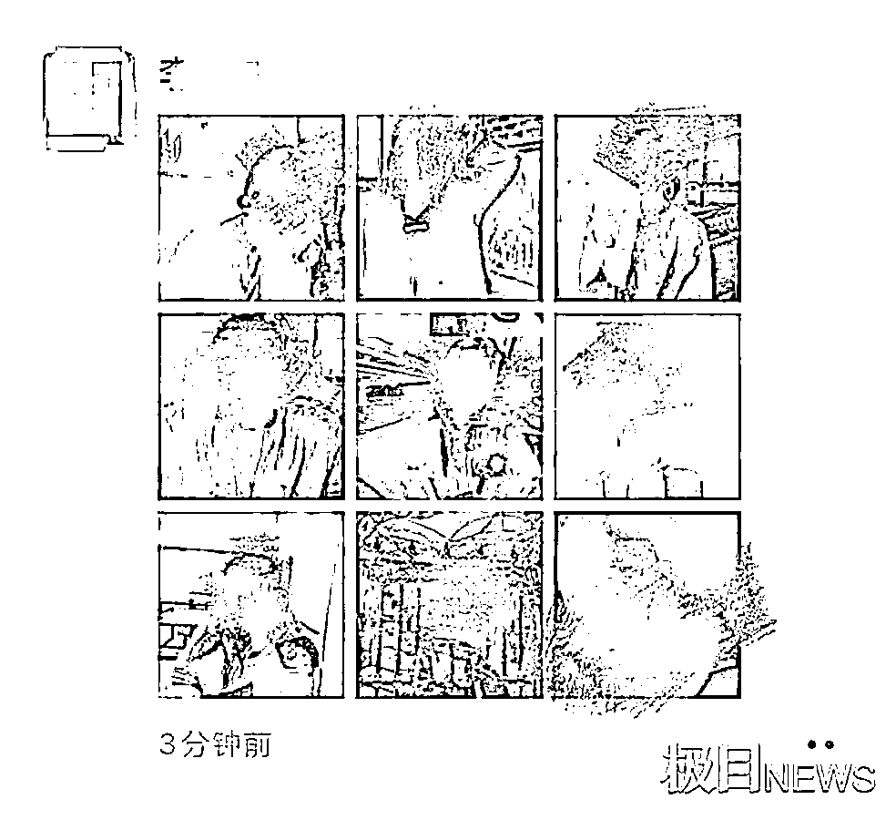
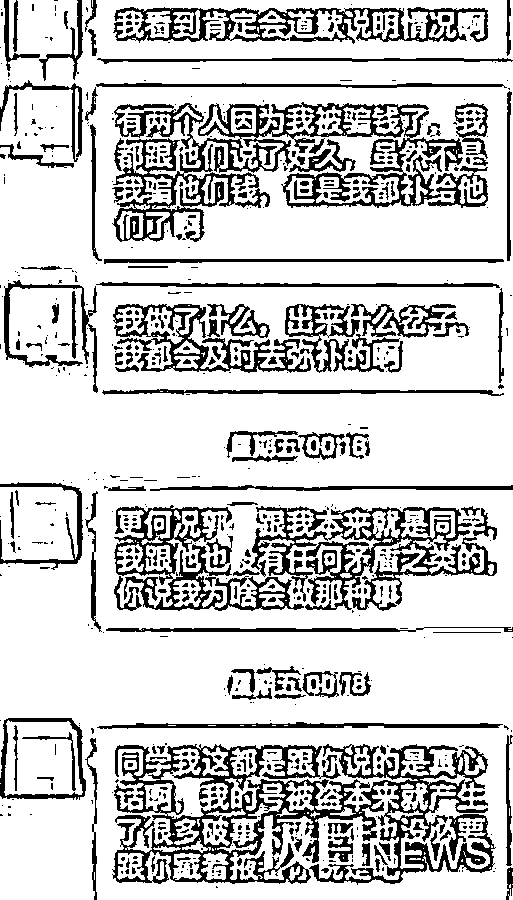
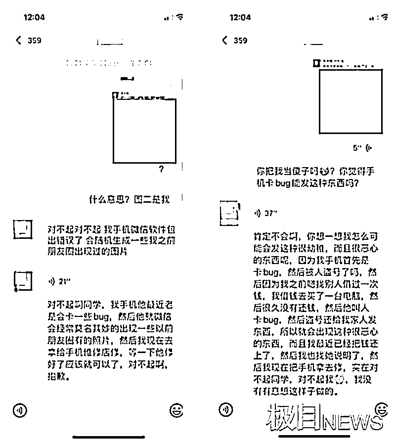
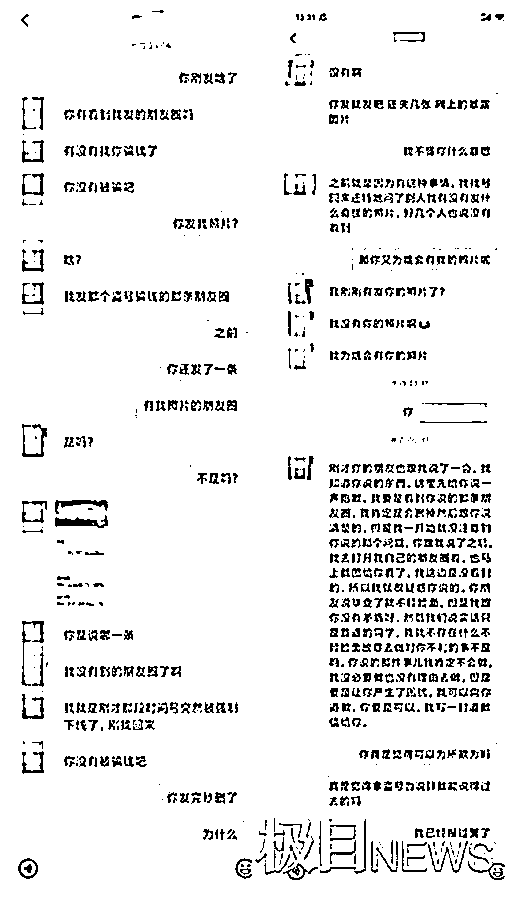
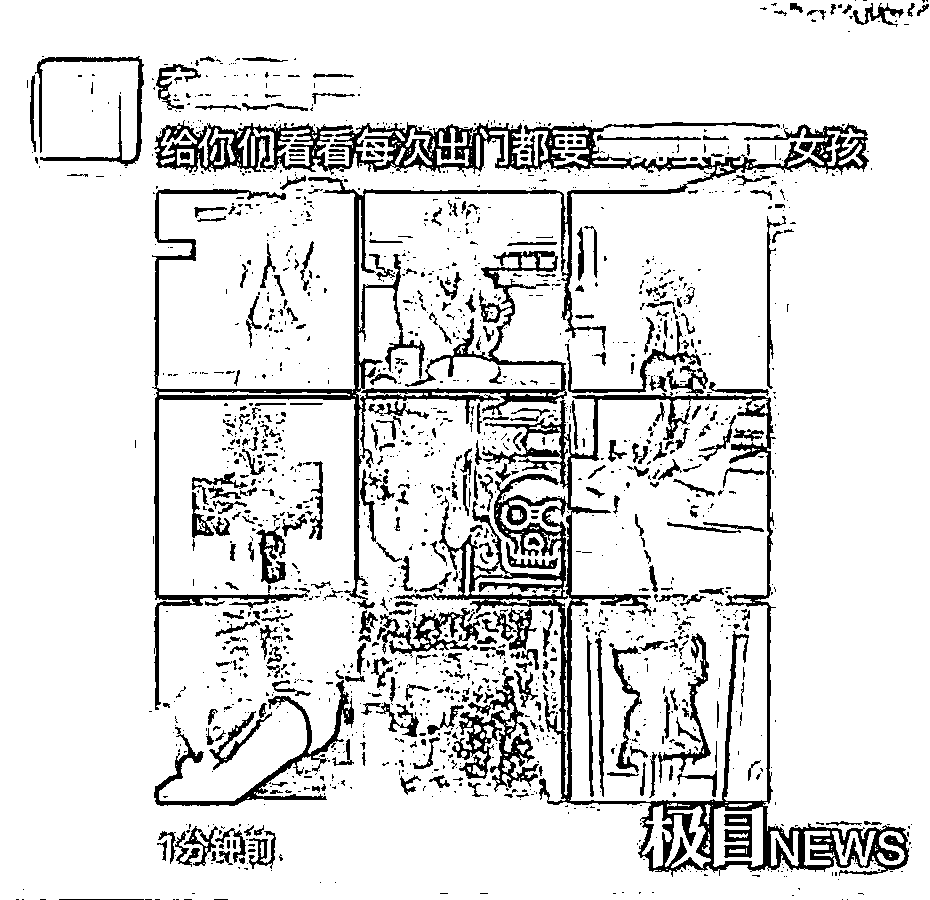
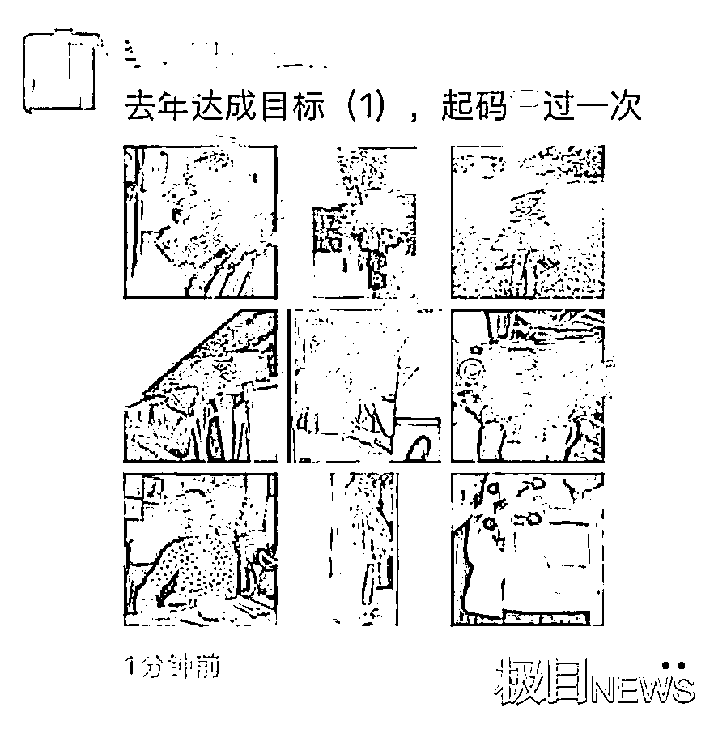

# 网曝一大学毕业生多次盗用女同学照片，配不雅照发朋友圈！

> 原文：[`mp.weixin.qq.com/s?__biz=MzIyMDYwMTk0Mw==&mid=2247517227&idx=6&sn=673d322cd933b812e382604087f3ceb5&chksm=97cb4f13a0bcc605d65ca4d8db760a121fbd570903f9fe2c74fa1ac34a54b2f374b4cc266172&scene=27#wechat_redirect`](http://mp.weixin.qq.com/s?__biz=MzIyMDYwMTk0Mw==&mid=2247517227&idx=6&sn=673d322cd933b812e382604087f3ceb5&chksm=97cb4f13a0bcc605d65ca4d8db760a121fbd570903f9fe2c74fa1ac34a54b2f374b4cc266172&scene=27#wechat_redirect)

前几天，我们就曾提醒

女性朋友们要提高警惕

遇到类似行迹可疑者

请马上报警！

## [鞋子上绑偷拍器专拍裙底！男子被抓时还身背 4 套偷拍机](http://mp.weixin.qq.com/s?__biz=MzIyMDYwMTk0Mw==&mid=2247516982&idx=3&sn=1359f49c27298de0c00a583f6dcc7b6a&chksm=97cb480ea0bcc118bd8eb2021e3eba6f674e5d2b8cdc7873cae66a33054c27dfa8f31f1db1a9&scene=21#wechat_redirect)

（点击链接，了解详情）

不过，遇到以下情况

女性也要多加提防！

↓↓↓

7 月 12 日的下午

有一位豆瓣网友发帖称

其高中男同学多次

在微信朋友圈发布

周围人的照片

并配上不雅图片和污言秽语

对她们进行诽谤

据该网友描述，在近半年内

该男同学诽谤的女性数量**超过 10 人**

目前，受害者们已联合起来

希望通过法律的手段

来捍卫自己的权益！ 

该网友说，这位男同学是他的高中同学李某某。李某某是海南人，是西北大学 2017 级的学生，就读于公共管理学院的劳动与社会保障专业。

7 月 8 日晚 10 时，一位郭姓女同学收到了来自朋友的微信，称同班同学李某某的微信朋友圈中，有她的 7 张照片，**其中还夹杂着 2 张不雅的图片**。郭同学感到非常震惊，马上去质问李某某。**李某某却以自己微信被盗号为由，不承认是自己发了这条朋友圈**。

李某某的谎言很快被郭同学识破，因为这 7 张图涵盖了她从 2019 年至今的照片，但是，她的朋友圈一直设置的是仅三天可见，可以证明李某某是“**早有预谋**”。

同时，李某某的室友也表示，在 7 月 8 日前后，李某某都在正常使用微信，**并未出现任何异常**。

后来，郭同学发现，身边很多人都曾因为自己的照片出现在李某某的朋友圈，而找过他。但是，都被李某某**以技术性故障的理由来糊弄**，例如“手机微信的软件包出现了错误，所以随机生成了一些之前朋友圈曾出现过的图片”、“我清理内存时，经常会发生这种情况”等等。 

从李某某朋友圈的截图可以看到，他的相关朋友圈每次都会发满 9 张图片，其中，有的是生活照、有的是外出旅游照，**有的甚至会夹杂裸露或者不雅的图片**。 

其中两次的朋友圈，还配有侮辱性和诽谤的文字，比如“给你们看看每次出门都要 xxx 的女孩”、“去年达成目标，起码 x 过一次”。

根据该网友搜集到的受害人资料显示，今年的 2 月至 7 月，李某某至少有**7 次**在微信朋友圈发布了女性的照片，**包括了他的高中同学、大学同学、辅导员，甚至是基本没有接触过的女同学**，涉及的人数超过了十人。 

该网友称，虽然勇敢很辛苦，但是“我们绝对不会沉默”，将**通过法律的武器，来捍卫自己的合法权益**。

7 月 13 日上午，西北大学党委宣传部的工作人员称，该学生确实是该校的毕业生，目前已协助受害学生进行了报警处理。当天上午，**西安市郭杜派出所称，已经接到相关警情，但详情不便透露**。

该男同学的做法实在太过分

支持受害女性用法律武器

来保护自己！！！

来源：潇湘晨报

← 向右滑动与灰产圈互动交流 →

