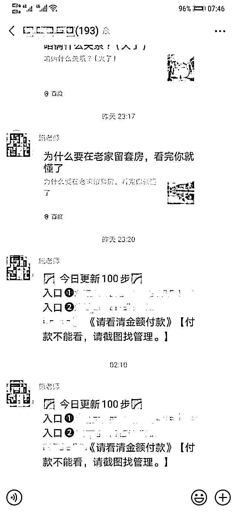

# 受不了 996 压力，某程序员搭建涉黄网站，获利 420 万被抓

> 原文：[`mp.weixin.qq.com/s?__biz=MzIyMDYwMTk0Mw==&mid=2247517227&idx=8&sn=cddc2fec963a8ebb55d309d8995f241d&chksm=97cb4f13a0bcc6054256121f93f1a2065c7fa9ec50e58056b4a28c619547aae91d3c42ba1e40&scene=27#wechat_redirect`](http://mp.weixin.qq.com/s?__biz=MzIyMDYwMTk0Mw==&mid=2247517227&idx=8&sn=cddc2fec963a8ebb55d309d8995f241d&chksm=97cb4f13a0bcc6054256121f93f1a2065c7fa9ec50e58056b4a28c619547aae91d3c42ba1e40&scene=27#wechat_redirect)

近日，浙江省丽水市松阳网警大队成功侦破了一起特大网络传播淫秽物品牟利案件，涉案资金高达 5000 余万元。

起初，松阳网警接到举报，有人通过微信群每日发布大量淫秽色情视频链接，且需要充值付费才能观看。

经过严查，这些链接背后是一个分工严密的犯罪团伙，搭建平台、运营维护、代理推广……已经形成了一条成熟的“黄色”产业链。

松阳网警进一步侦查后，发现该案的幕后主犯之一是程序员傅某。

大学毕业后，傅某去了互联网公司当程序员，但他很快就受不了互联网“996”的工作节奏和巨大的工作压力，想辞职自己创业。

2019 年，傅某辞职回家。利用自己所学的编程知识，创建了一个名叫“豹子”的网络工作室，发布了大量宣传灰色、黑色产业的信息。他还先后搭建了“猎豹”、“女儿国”、“九龙”等 6 个涉黄平台，再将每个平台以几千到几万元不等的价格出售给他人运营，而他负责网站的日常维护，收取网站订单流水的 5%-8%作为提成。

在巨大的利益面前，谢某、王某、林某某等 10 人分别从傅某处购买了各网站的运营权后，通过在各种聊天平台中向全国不特定人群发送视频链接进行宣传推广，不断发展代理，从中谋取暴利。

代理可拿到高达 80%的分成，他们为了获取更多的受众，会在大量的 QQ、微信群内发布淫秽视频的观看链接，短时间内，网站便以几何的倍速在全国范围内迅速传播，仅半年时间，“观影人数”就高达百万。

为了赚取更多钱，傅某还和他的好友叶某合作开发了一个名为“涛涛支付”的通道，对接到各个网站用来收款。从 2019 年 12 月到案发被查处时，“涛涛支付”这个通道共收取充值款近 60 万元，傅某个人分到了 44 余万元。在此案中，傅某通过各种途径共获利高达 400 余万元。

2019 年 12 月，松阳县公安局接到举报，通过四个多月的缜密侦查，成功抓获了该团伙，在查扣的电子设备中存有 6525 部淫秽视频，摧毁了 6 个全国性的涉黄平台。

该案被移送到检察院提起公诉，傅某等人因传播淫秽物品牟利罪，一审被判处有期徒刑七年到十二年不等，并处罚人民币两万到四百二十万元不等。

技术是一把双刃剑，用好了能升职加薪，如果不小心用错了就会走上歪门邪道，我们都要做遵纪守法的好公民。

来源：松阳县人民检察院、潇湘晨报等

← 向右滑动与灰产圈互动交流 →

