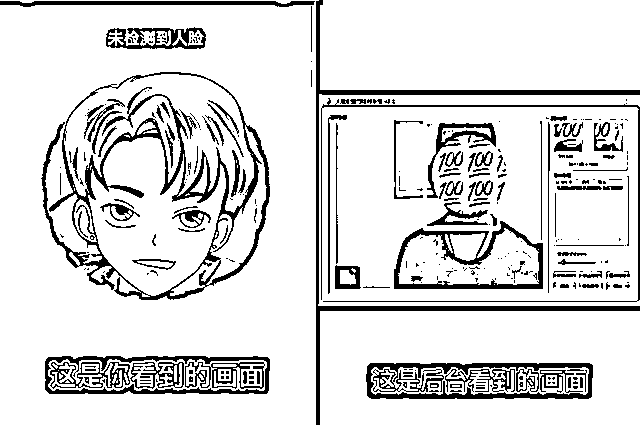
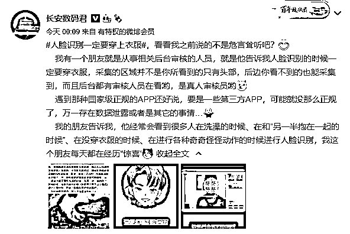
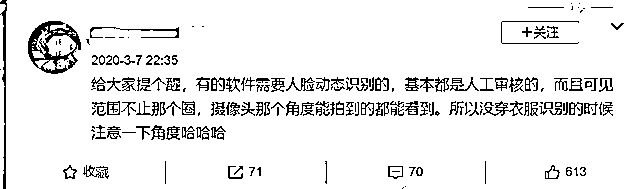
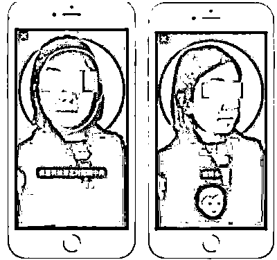

# 人脸识别的时候，请一定要穿上衣服！

> 原文：[`mp.weixin.qq.com/s?__biz=MzIyMDYwMTk0Mw==&mid=2247517345&idx=1&sn=d1803179493213b9c7c92ed30fe93c77&chksm=97cb4f99a0bcc68f5efec3eb3827cc340a8fbe2765aea4932fd598866870ce3124d2395b1d73&scene=27#wechat_redirect`](http://mp.weixin.qq.com/s?__biz=MzIyMDYwMTk0Mw==&mid=2247517345&idx=1&sn=d1803179493213b9c7c92ed30fe93c77&chksm=97cb4f99a0bcc68f5efec3eb3827cc340a8fbe2765aea4932fd598866870ce3124d2395b1d73&scene=27#wechat_redirect)

说到人脸识别，大家应该都不陌生了。

如今，人脸识别作为新兴的生活方式，已经在乘车、打卡、支付、办证、公安司法等环境中快速普及。

不少软件在进行身份安全认证时，人脸识别都是必不可少的重要一环。

但你真的以为，人脸识别就只是拍 “人脸” 吗？ 

近日，数码博主 @长安数码君 在社交平台爆料称：

人脸识别时采集到的区域不仅仅是屏幕所显示的头部，而是摄像头覆盖的整个范围。

并且采集到的照片都会上传到后台，后台的真人审核人员都能看到。

你想象中的人脸识别：

后台工作人员看到的人脸识别：

该博主还表示，有从事后台审核的朋友称：经常会看到很多人在洗澡的时候、在和 “另一半抱在一起的时候”、在没穿衣服的时候、在进行各种奇奇怪怪动作的时候进行人脸识别。

对此，该博主提醒称，如果是国家级正规 APP 还好，但如果是一些不那么正规的第三方 APP，在这样的情况下进行人脸识别，很有可能导致隐私数据泄露。

鉴于很多用户误以为人脸识别系统只会将人脸的部分上传，于是在拍照时毫无顾忌。

因此，这条消息曝光后很快引起了网友们的关注，# 人脸识别一定要穿上衣服 #的词条也火速登上了微博热搜。

而从微博留言评论来看，不乏相关行业的网友印证了这种说法的真实性：

人脸识别拍到的不仅仅是画面里圈出来的人脸，而是跟普通拍照时一样的取景范围，只是 “你自己” 看不到而已。

一位自称是风控体系的网友称，日常可以看到很多 “裸露” 的人脸照。

另一条评论则称，金融机构很多业务都要人工审核的。

同时 Ta 也表示，听银行的员工吐槽过，审核的时候看到过很多辣眼睛的画面。

当然，也有更多知道了真相的网友表示自己 “社会性死亡” 了。

不少网友称，自己好几次没穿衣服时进行了人脸识别。

还有人称，自己经常在蹲厕所时进行人脸识别。

在微博发起的一项有关 “你有没有在人脸识别的时候‘为所欲为’过” 的投票中，数万名网友都选择了 “有”。

在众多表达 “震惊” 和 “社死” 的言论中，也有网友表示，大部分 APP 的人脸识别只是算法对比，并不存在人工审核这种情况。

比如在支付宝、微信的人脸支付环节，如果加入人工审核的话，工作量是非常巨大的，因此只可能是通过算法来进行验证。

还有更多网友开始质疑，软件这样做是否侵犯了用户隐私，是否应尽到告知用户使用风险的义务。

部分网友称 “感觉隐私被侵犯到”，毕竟人脸识别带来的并非 “尴尬” 那么简单，而是一件十分严肃的事情。

有网友提议，平台方应提醒用户 “人脸识别系统后台人工审核时，可以看到摄像头全景”，这也应该是在消费者的知情权范围内的。

实际上，现实生活中，在一些特殊的身份认证环境下，人脸识别的确是存在人工审核环节的。 

早在去年便有博主提醒，需要人脸动态识别（比如眨眼、摇头等）的 APP，基本都是人工审核。

同时，也正是因为部分 APP 的人脸识别需要人工审核，警方还通过此破获了一起命案。

2019 年，厦门晚报曾报道过一则 “男子杀害女友，用尸体进行人脸识别申请网贷被发现” 的新闻，引发舆论热议。

据悉，该男子在杀害女友后，意图借用女友的身份在网上申请小额贷款。

他下载了某网贷 APP，将女友身份证上传，并用女友尸体进行人脸识别，但因系统提示要眨眼，只好放弃。

但该男子的行为却引起了网贷 APP 工作人员的注意。

首先，在 7 秒的 “活体识别” 的视频中，当事人无任何反应，而在语音验证时，也是一名男性的声音，与贷款申请者性别不符。

于是 APP 系统判断发现异常，转入了人工审核。

在人工审核中，工作人员发现，贷款申请人的照片以及活体识别视频中颈部有棕红色的勒痕，且双眼失焦，面部有青紫色的瘀血，怀疑贷款申请人被害，赶紧向警方报案。

从扫码支付、指纹支付到人脸识别，数字技术的发展成熟将人们的生活不断简化。

然而，随着人脸识别技术的广泛运用，个人信息泄露、信息被盗取的情况时有发生。

不穿衣服的照片被后台的审核人员看到，可能是公司管理的疏漏。

正如有网友所质疑的，平台在进行人脸识别时，其实理应作一些相应的提醒，这不仅是一个法律问题，也是一个基本的服务问题。

但就目前而言，对于作为普通用户的我们来讲，只有在进行人脸识别的步骤时，务必衣着整齐，才能尽量避免这种风险。 

同时，我们也希望所有具备人脸识别功能的 APP，能在页面上进行提醒或告知用户，在隐私方面同样加强管理。

至于这样的操作是否合规，是否意味着侵犯了用户的个人隐私？这方面的法律问题，也有待进一步探讨了。

来源：扩展迷，不神秘程序员

灰产圈在线客服

← 向右滑动与灰产圈互动交流 →

