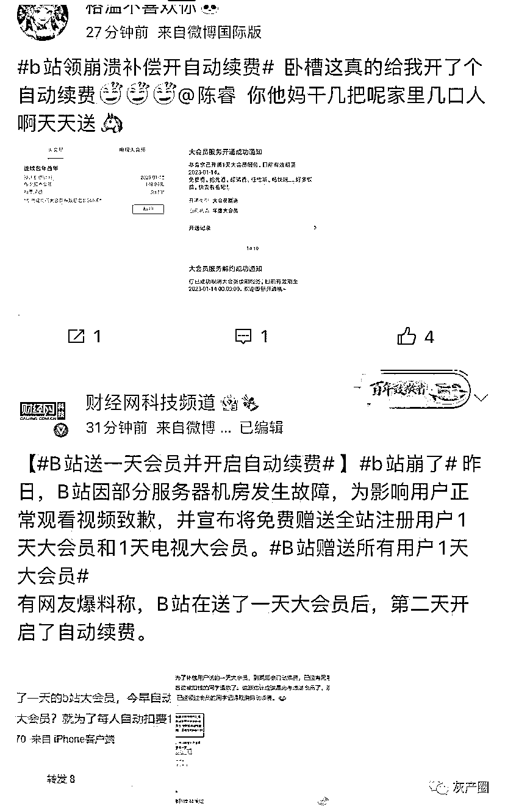
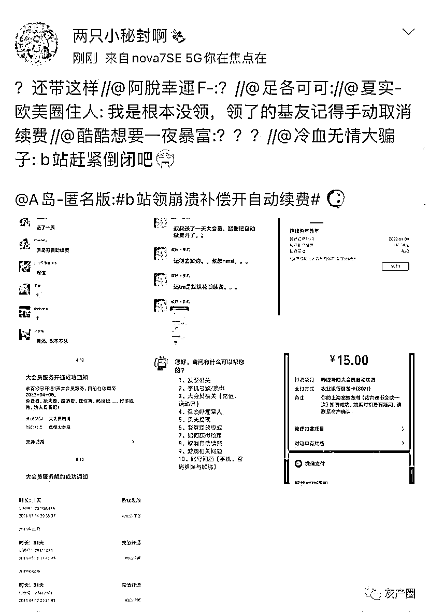
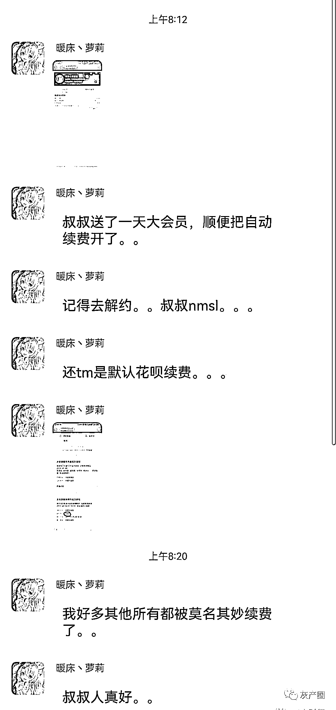
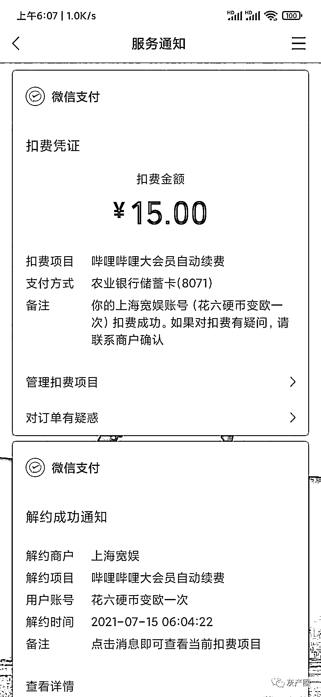
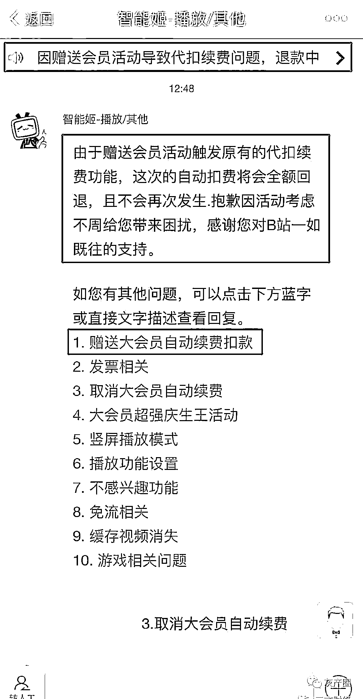
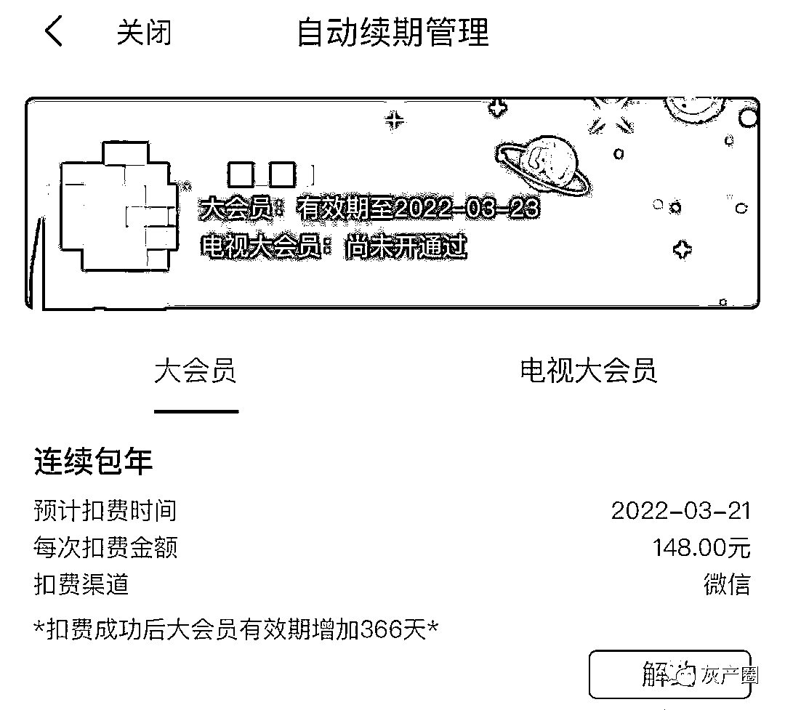
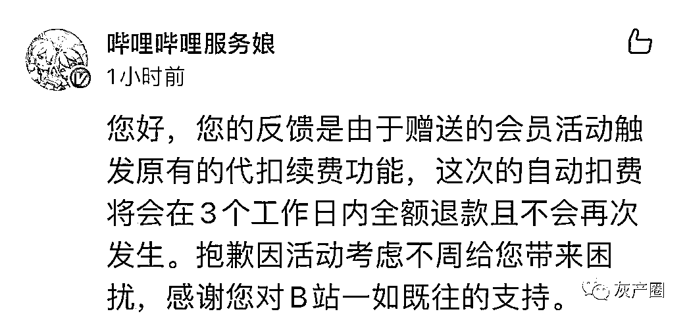
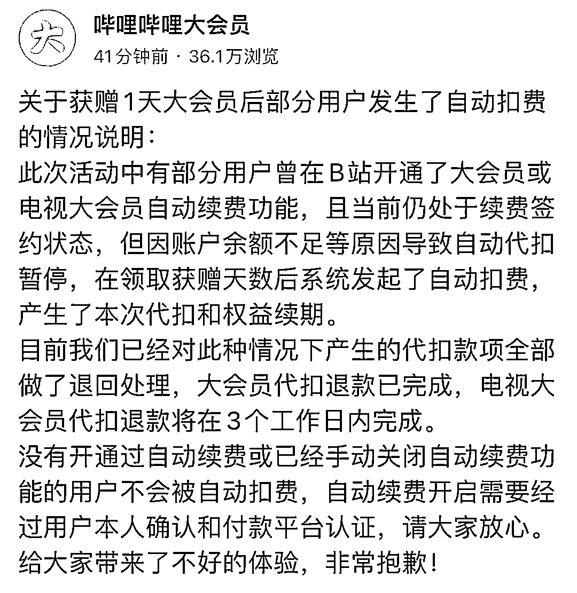

# B 站套路深，我要回农村

> 原文：[`mp.weixin.qq.com/s?__biz=MzIyMDYwMTk0Mw==&mid=2247517345&idx=3&sn=6b15c9f8f89273090956f9a90a87da7c&chksm=97cb4f99a0bcc68f6fde9475a58b8944204de58639e013b6d0922b32070ad38e55fc51b6ff82&scene=27#wechat_redirect`](http://mp.weixin.qq.com/s?__biz=MzIyMDYwMTk0Mw==&mid=2247517345&idx=3&sn=6b15c9f8f89273090956f9a90a87da7c&chksm=97cb4f99a0bcc68f6fde9475a58b8944204de58639e013b6d0922b32070ad38e55fc51b6ff82&scene=27#wechat_redirect)

三言财经消息，日前 B 站因为崩溃向全体用户补偿了一天大会员，不过有部分网友收到补偿后却触发了自动续费的 BUG，直接被扣了钱。    

根据网友反映，自己的 B 站账号在领取了一天大会员服务后，但却被自动续费。但是在 B 站活动规则中却并没有任何说明。

根据一张 B 站 AI 客服聊天记录显示，赠送会员服务触发了原有的代扣续费功能，将会为误扣款的用户全额退款。

此外，某自媒体分析称，B 站赠送的一天大会员服务补偿存在 Bug，如果用户曾经开通过包月、包季以及包年等服务，那么将可能触发原有的续费功能，再次开通自动续费。

三言财经测试发现，确如上述自媒体所言，若用户曾经开通过连续订阅服务，那么领取了本次一天大会员后可能会触发自动续费功能；如果曾经从未开通过连续付费服务的用户，则不存在该问题。若用户误触发了自动续费，那么需要及时关闭；如果已经被扣款，则需要联系客服全额退款。

B 站方面也确认了触发自动续费问题的原因。B 站官方账号回应称，该问题是由于赠送的会员活动触发原有的代扣续费功能。这次的自动扣费将会在 3 个工作日内全额退款并且不会再次发生。    

具体原因，B 站官方进一步解释称，此次活动中有部分用户曾在 B 站开通了大会员或电视大会员自动续费功能，且当前仍处于续费签约状态，但因账户余额不足等原因导致自动代扣暂停，在领取获赠天数后系统发起了自动扣费，产生了本次代扣和权益续期。

此外，B 站表示没有开通过自动续费或已经手动关闭自动续费功能的用户不会被自动扣费，自动续费开启需要经过用户本人确认和付款平台认证。

7 月 13 日晚，B 站因服务器故障导致用户长时间无法使用 App。此后，B 站就系统崩溃事件道歉，并且表示将为所有用户赠送 1 天大会员服务。

来源：三言财经

灰产圈在线客服

← 向右滑动与灰产圈互动交流 →

