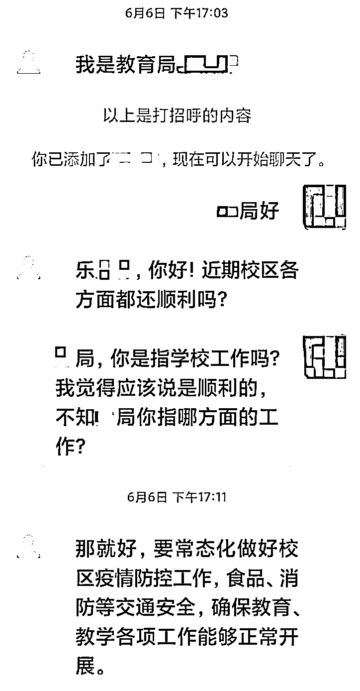
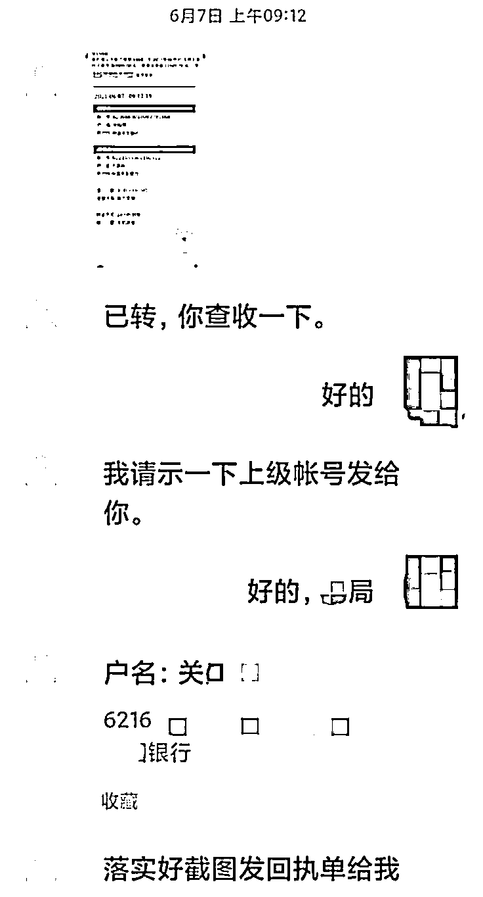
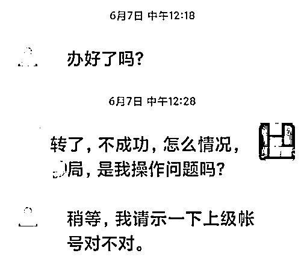
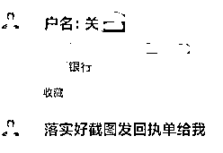
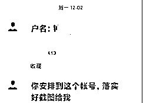
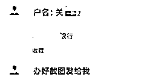
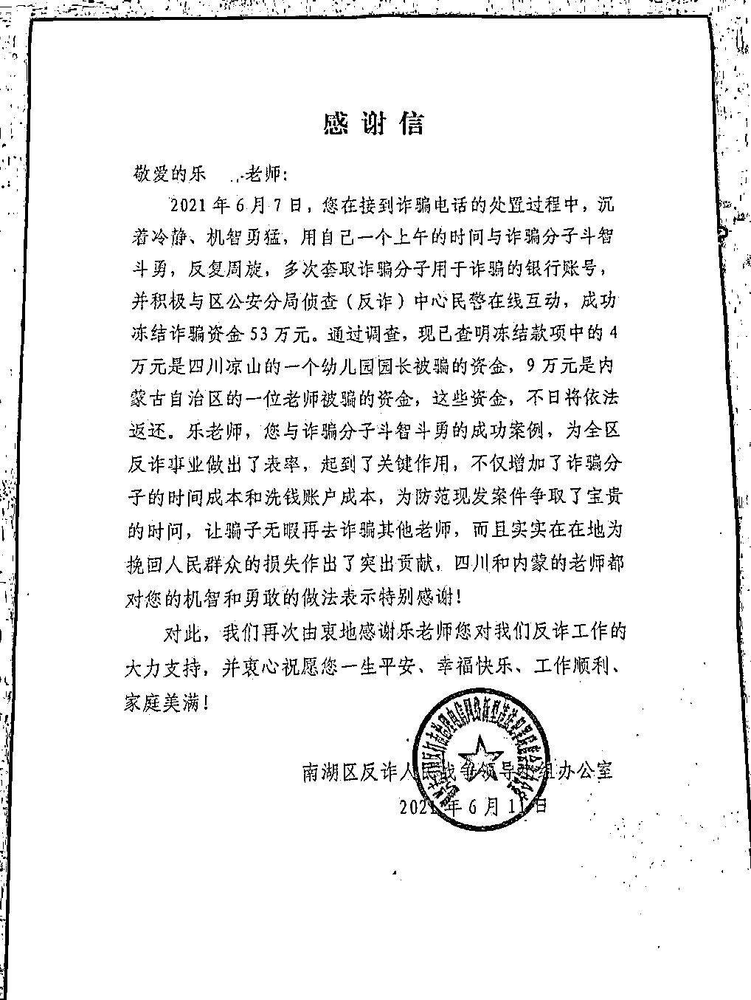

# 体育老师教我们如何冻结骗子 53 万

> 原文：[`mp.weixin.qq.com/s?__biz=MzIyMDYwMTk0Mw==&mid=2247517345&idx=4&sn=d13f5051ba32cfaa531da09bfbd0b06d&chksm=97cb4f99a0bcc68fa9f3eebb24e514217966f8b308dbe777cb61cc0ae6736a62cac9ae190f07&scene=27#wechat_redirect`](http://mp.weixin.qq.com/s?__biz=MzIyMDYwMTk0Mw==&mid=2247517345&idx=4&sn=d13f5051ba32cfaa531da09bfbd0b06d&chksm=97cb4f99a0bcc68fa9f3eebb24e514217966f8b308dbe777cb61cc0ae6736a62cac9ae190f07&scene=27#wechat_redirect)

没上骗子的当 

还反手冻结了骗子 53 万元

一位体育老师的这波操作令人叫绝

他是怎么做到的？

骗子冒充领导来加好友

体育老师靠细节识破

近日，嘉兴南湖区 

辅成小学的乐老师

收到了一条微信好友申请

对方自称是**教育局的一位领导**

并主动跟乐老师寒暄

然而，仔细一看 

“领导”把他的名字都打错了

而且，从对方的言语中可以感觉到

对方似乎压根儿不知道他是体育老师

这些细节引起了乐老师的警觉

当天，经与学校及教育局核实

乐老师确认自己遇到了骗子

并立即报了警

**警方建议他，可先与骗子周旋**

**想办法要到尽可能多的银行账号** 

**以帮助警方对其资金进行冻结**

**减少其他受害人的损失**

一个反手冻结 53 万元！

他把骗子“骗了”

第二天，“领导”找到乐老师 

要他帮忙办一件私事：

**用他的卡作为中转**

**向“上级领导”转一笔钱**

对方很快发来了一张

已向乐老师成功转账 8 万元的截图

乐老师一眼看出 

**对方的转账截图是 PS 的**

而且自己也没有收到任何钱

他将计就计答应下来，拖住骗子

并马上联系了警方

乐老师一直以各种借口

向对方表示转账失败

着急想要实施诈骗的“领导” 

**在乐老师和警方的“套路”下**

**陆续发来 4 个**

**用于诈骗收账的银行账户**

**警方随即对账户进行紧急冻结**

“我们反诈中心 

紧急成立了资金查冻组

骗子每告诉乐老师一个诈骗账户

我们就紧急冻结一个账户”

嘉兴市公安局南湖区分局

反诈中心教导员陈赛平说

乐老师与民警一起

用一上午时间

成功冻结诈骗资金 53 万元

这波操作让网友直呼好家伙

**“这次骗子遇上对手了”**

**“太解气了”**

如何像乐老师一样机智？

记住警方这个小提示

经调查，这 53 万元来自 6 名受害者 

其中 4 万元 

是四川凉山一幼儿园园长被骗的资金

9 万元是内蒙古自治区

一位老师的被骗资金

剩余资金的被骗者信息正在核实中

这些资金不日将依法返还

乐老师与骗子的斗智斗勇

帮他人挽回了损失 

警方特地赶到学校 

送上一封感谢信

警方也提醒大家： 

**遇到微信上主动加好友的领导**

**一定要保持警惕**

**最好要核实对方身份**

**如果对方找各种理由让你帮忙转账**

**一律拒绝，以免被骗**

来源：中央广电总台中国之声，长沙晚报

灰产圈在线客服

← 向右滑动与灰产圈互动交流 →

