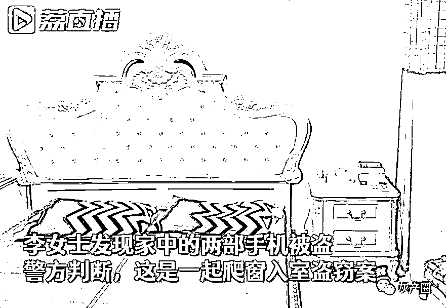
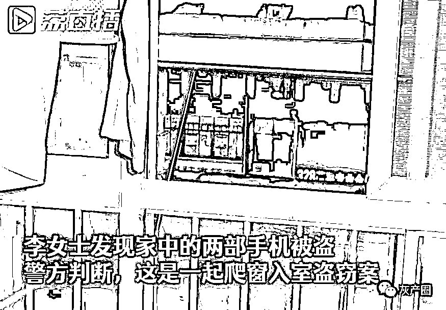
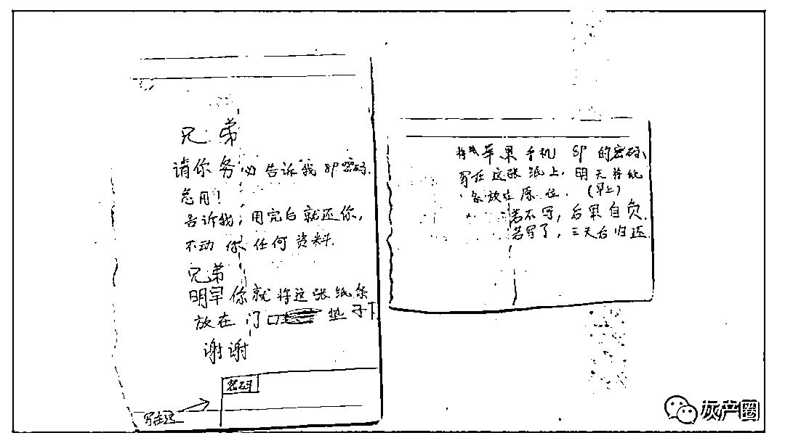
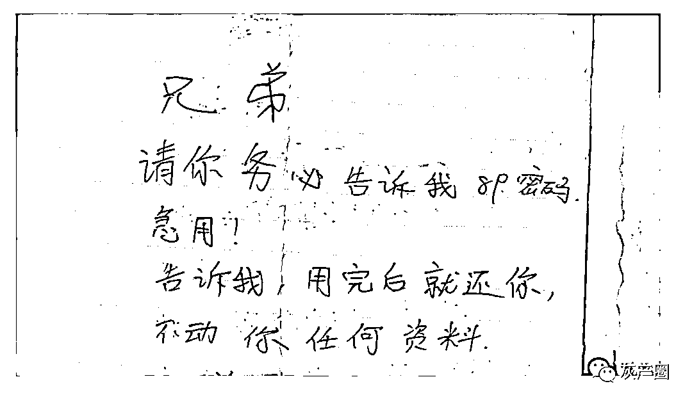
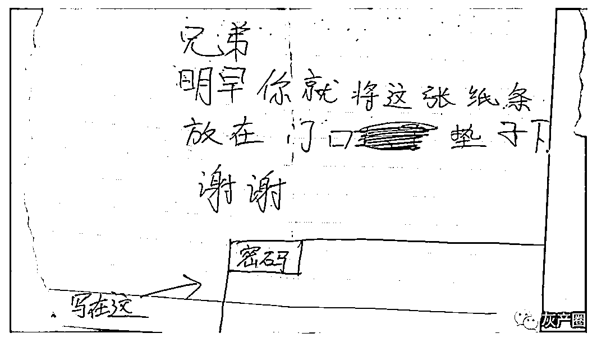
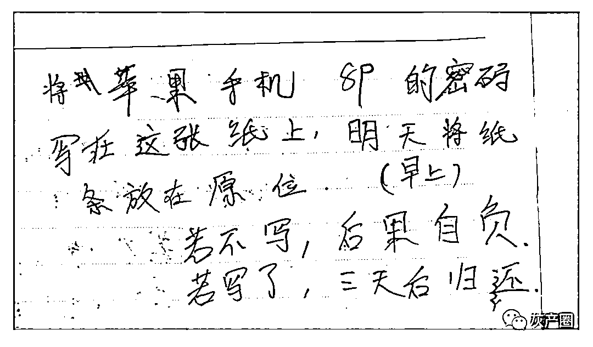
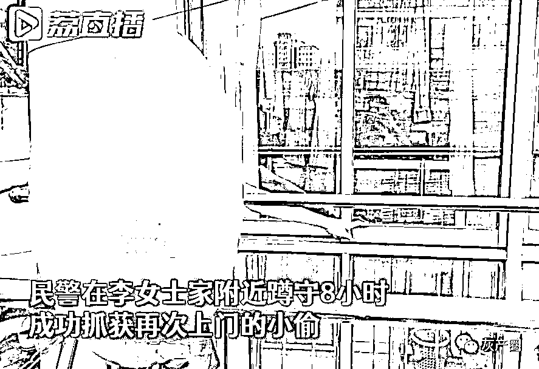

# 小贼偷手机后给失主留纸条：兄弟，把开机密码写这里→

> 原文：[`mp.weixin.qq.com/s?__biz=MzIyMDYwMTk0Mw==&mid=2247517345&idx=5&sn=977470fc65cf26a3b68983e35a56daa3&chksm=97cb4f99a0bcc68ff5c807c0d009b3ae0f476b4387461b0a69e818ecba4882ccc951a4a4e42f&scene=27#wechat_redirect`](http://mp.weixin.qq.com/s?__biz=MzIyMDYwMTk0Mw==&mid=2247517345&idx=5&sn=977470fc65cf26a3b68983e35a56daa3&chksm=97cb4f99a0bcc68ff5c807c0d009b3ae0f476b4387461b0a69e818ecba4882ccc951a4a4e42f&scene=27#wechat_redirect)

入室偷了手机后

因为没有开机密码

小偷竟还留了纸条给失主：

**交出密码！否则……**

[`mp.weixin.qq.com/mp/readtemplate?t=pages/video_player_tmpl&action=mpvideo&auto=0&vid=wxv_1957237687644422147`](https://mp.weixin.qq.com/mp/readtemplate?t=pages/video_player_tmpl&action=mpvideo&auto=0&vid=wxv_1957237687644422147)

7 月 6 日晚

宿迁李女士下班回家

想着手机快要没电了

便找充电器充电

“就发现充电器线找不到了

然后发现家里的手机也不见了

我立即就报警了”

李女士说

民警接到报警后

立即开展工作并立案侦查

发现这可能是一起入室盗窃案

**宿豫公安分局珠江路派出所民警 刘伟：**

通过现场的勘验发现

住户的大门是完好无损的

后来民警在该住户的阳台上

发现有脚印的痕迹

初步判断这是一起爬窗入室盗窃案

第二天

李女士向民警提供了一个重要线索：

中午回家的时候

**发现门前的地毯上有纸条**

纸条上的内容是这样的↓

“请你务必告诉我密码，急用！”

“告诉我，用完后就还你！”

“若不写，后果自负！”

民警分析 

嫌疑人应该会再来李女士家

并立即制定了抓捕计划 

通过近 8 个小时的蹲守

次日警方在李女士家中

**果然等到了嫌疑人**

**并立即实施了抓捕**

之后

民警在其身上查获了

李女士被盗的两部手机

目前，案件在进一步侦办中

**警方提醒广大人民群众：**

外出时一定要锁好家中的门窗

将家中的贵重财物保管好

切勿给不法分子留下可乘之机

来源 ：江苏新闻，潇湘晨报

灰产圈在线客服

← 向右滑动与灰产圈互动交流 →

