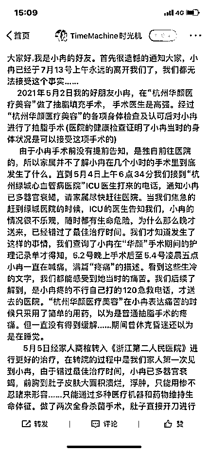
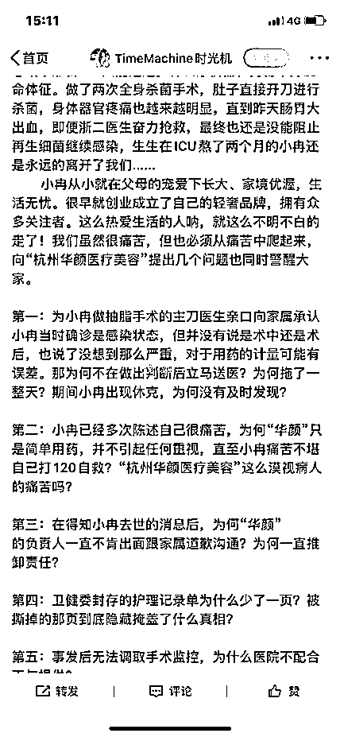
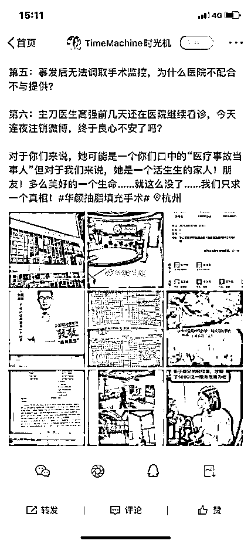

# 33 岁网红抽脂感染去世：在美容医院打 120 求救

> 原文：[`mp.weixin.qq.com/s?__biz=MzIyMDYwMTk0Mw==&mid=2247517345&idx=7&sn=c3f7ae5d2404599aca9b6c1a870b0a0d&chksm=97cb4f99a0bcc68f9c4b5f936f3e29ad242e4a5f8aaba63c1e09755f6f3bae6ab833f9f0a613&scene=27#wechat_redirect`](http://mp.weixin.qq.com/s?__biz=MzIyMDYwMTk0Mw==&mid=2247517345&idx=7&sn=c3f7ae5d2404599aca9b6c1a870b0a0d&chksm=97cb4f99a0bcc68f9c4b5f936f3e29ad242e4a5f8aaba63c1e09755f6f3bae6ab833f9f0a613&scene=27#wechat_redirect)

7 月 13 日，33 岁杭州女子网红小冉因抽脂感染医治无效去世，引发网友热议。据悉，小冉 5 月 2 日在杭州华颜医疗美容医院进行吸脂填充手术，5 月 4 日术后因皮肤溃烂、器官衰竭转入 ICU 抢救。两个月后，小冉因全身感染造成多器官衰竭，于 7 月 13 日抢救无效死亡。小冉家属对该整形医院提出多项质疑。杭州市西湖区卫健局也已介入调查处理此事。 

@中国新闻周刊 7 月 14 日报道中称其多次致电涉事医疗美容医院，该院工作人员称不清楚此事，目前医院正在消防演练，暂停接诊。涉事整形医院线上信息均已注销。

小冉好友通过其微博账号发文（目前已设置为关注可见）称，5 月 4 日上午 6 点 34 分，接到杭州绿城心血管病医院 ICU 医生打来的电话，通知小冉已多器官衰竭。ICU 的医生告知家属，小冉的情况很不乐观，随时都有生命危险。院方表示，由于送往医院不及时，小冉已经错过最佳治疗时间。

病历显示，小冉做了“腰腹吸脂修复术、上臂吸脂术和自体脂肪二次填充乳房术。这位好友说，她们查询了小冉在整形医院手术期间的护理记录单才得知，5 月 2 日晚上术后至 5 月 4 日凌晨 5 点，小冉一直在喊痛，满篇“疼痛”的描述。而“杭州华颜医疗美容”在小冉表达痛苦的时候，只是简单用药，以为是普通抽脂手术的疼痛，但一直没有得到缓解。

小冉的朋友称，5 月 2 日当晚，小冉在杭州华颜医疗美容医院进行了抽脂填充手术，由院内一位名叫高强的医生负责。术前，院方对小冉进行了各项身体检查，结果显示小冉当时身体状况允许接受手术。由于小冉在手术前没有提前告知就独自前往医院，其家属并不知道手术期间究竟发生了什么。

正观新闻 15 日报道称杭州市西湖区卫健局已介入调查处理此事，记者查阅工商信息发现，杭州华颜医疗美容医院成立于 2018 年 6 月，注册资本为 1000 万人民币，目前该公司由杭州悦颜医疗科技有限公司和杭州俪颜医疗科技有限公司共同持股，经营范围为医疗美容科，美容外科，美容皮肤科，美容牙科，美容中医科/麻醉科医学检验科(临床化学检验专业、临床免疫、血清专业)，内科、临床体液、血液专业等。近两年，这家医疗美容医院曾受辖区卫健局、市场监管局和公安局的 4 次行政处罚，原因包括病历资料不全、违规开展口腔种植技术、发布违法广告、违反医疗废物管理条例以及消防法规等。

死者生前照片。（图自其微博）

生命时报 7 月 15 日指出，在改变身材这件事儿上，很多人因为不愿意运动常常会想到抽脂这条捷径。但你可能不知道，抽脂手术是项大手术，它最可怕的地方就是发生坏死性筋膜炎。这种病是软组织感染，也是外科危重急症。一开始是手术部位持续性疼痛，术后 3 天可能发热，皮肤出现血性大疱，然后可能会出现大片坏死、恶臭，随着坏死组织迅速扩散，可发生败血症或脓毒血症，甚至死亡。确诊是坏死性筋膜炎后应及时进行清创，切除坏死筋膜，使用抗生素治疗。提醒所有想减肥的人，减肥没有捷径，一定要理性看待。一些超重患者，最好到正规医院明确自身的肥胖类型、肥胖程度以及是否伴有其他疾病之后，再“对症”减肥；轻度肥胖的人，通过饮食控制，并合理运动，持之以恒地即可达到减肥目的。对疾病引起的病态性肥胖，以腹部内脏脂肪堆积为主的肥胖人士，特别是同时合并有高血压、糖尿病、血脂紊乱时，需要医生的专业治疗及减肥指导。

来源：观察者网,正观新闻

灰产圈在线客服

← 向右滑动与灰产圈互动交流 →

