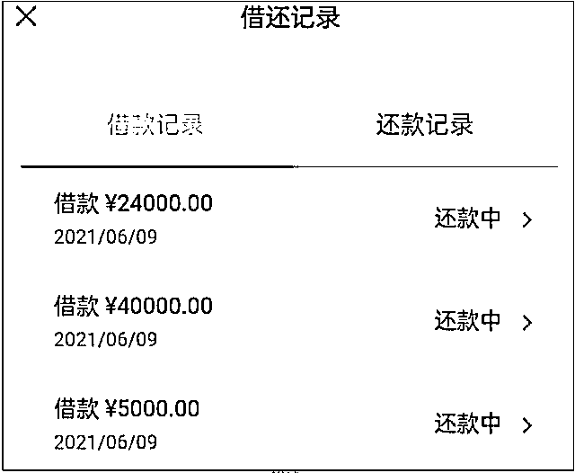
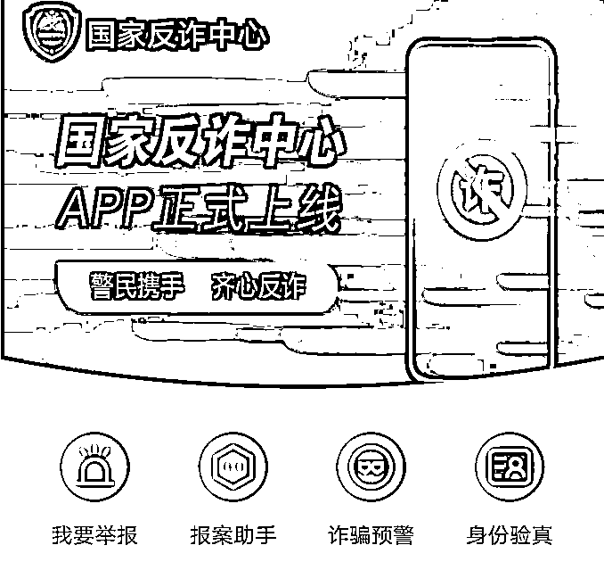

# B 站百万人气 UP 主：“我被粉丝骗了 25 万！”

> 原文：[`mp.weixin.qq.com/s?__biz=MzIyMDYwMTk0Mw==&mid=2247517414&idx=1&sn=62a5867fc5520b808874febabd8604a6&chksm=97cb4fdea0bcc6c880200e80862b4db19c82d350c58b01a1998435c721fe1fca921069209745&scene=27#wechat_redirect`](http://mp.weixin.qq.com/s?__biz=MzIyMDYwMTk0Mw==&mid=2247517414&idx=1&sn=62a5867fc5520b808874febabd8604a6&chksm=97cb4fdea0bcc6c880200e80862b4db19c82d350c58b01a1998435c721fe1fca921069209745&scene=27#wechat_redirect)

近日

B 站一名 UP 主波桑

自曝被粉丝诈骗 25 万的消息

冲上 B 站排行榜第 1 名

而这位 UP 主还曾介绍过

柬埔寨的跨国电信诈骗聚居地

**这让“反诈”话题再次引发关注**

<mpvideosnap class="js_uneditable custom_select_card channels_iframe" data-pluginname="videosnap" data-id="export/UzFfAgtgekIEAQAAAAAAd-grrLWvLQAAAAstQy6ubaLX4KHWvLEZgBPEvoMEBhNhKcn-zNPgMItxUz3X2G5oKGxeaL-lQQak" data-url="https://findermp.video.qq.com/251/20350/stodownload?encfilekey=wMyh8PvoRic4QvEiapufQCa94hDqSSU4IKiarakHJXfyw3w7YrXuyNJwWrfTCib33giadLrib7d4gBClQ2M5pNGT0IO1uKV4MutE8K2iaOTyiaibicEThNlCsP0m1MuGD67NC6lAUeE3ongC7If9n96pSBsCia2y2BETgNeRu1z1hyhaUOtnxQlIb5l6onrhw&amp;adaptivelytrans=0&amp;bizid=1023&amp;dotrans=0&amp;hy=SH&amp;idx=1&amp;m=5ff9cfd7e4b336b435cbc21798047f5b&amp;token=x5Y29zUxcibBiaGHtmXXicGxuJen3cKIvaapiczrI0tRMAmnia9yTicHj61mW5gqsJF5VD" data-headimgurl="http://wx.qlogo.cn/finderhead/PiajxSqBRaEISAKibugHhUQs74zK9sdqn9QvawbxCzU7AuxCgU4kpS0A/0" data-username="v2_060000231003b20faec8cae18b1bcad5cb00e937b0779ef044c516b0481d185bbca60dd9c21f@finder" data-nickname="灰产圈" data-desc="微博@ 波桑吃遍世界被粉丝诈骗 25 元！#灰产圈@灰产圈" data-nonceid="12552486137209726576" data-type="video"></mpvideosnap>

视频来源：波桑吃遍世界

什么？

**揭露诈骗的人也会被诈骗？**

答案是肯定的！还记得此前

编发无数诈骗新闻的小编被诈骗

以及反诈宣讲员被诈骗的事件吗？

伤害性不大，侮辱性极强！

就拿此次被骗的 UP 主来说

**诈骗手法其实很简单**

就是骗子冒充银监会工作人员

声称 UP 主的银行账号存在冻结风险

需要转账验证资金

此时 UP 主已经怀疑对方是骗子了

但其不仅说出 UP 主真实姓名与职业

还表现出自己是 UP 主的忠实粉丝

并说到：

**“我很喜欢你的视频，**

**最近为什么不更新呢”**

**“要加油更新视频，**

**要小心骗子的电话。”**

**“平时的话一定要提高安全意识。”**

粉丝的关心最为致命

这让 UP 主开始质疑自己

**“天啊，我竟然在怀疑我的粉丝？”**

随后对方的操作更是绝了

**竟然先往 UP 主的银行卡里转了 2 万元**

说是担保资金

约半小时后另一人打电话给 UP 主

上来就是一顿长辈式的夸奖

说 UP 主年少有为生活不易

然后闲聊探底询问 UP 主单位及近况

最后称 UP 主情况特殊需打款 25 万验证

**并信誓旦旦保证自己绝不会动这笔钱**

**“动用是犯法的！”**

于是 UP 主就彻底陷入了骗子的陷阱

在对方的提示下将钱

**在不同账户里转来转去**

**但因中间并没有产生损失**

**于是 UP 主就放松了警惕**

直到最后确认了转账之后

他才意识到被骗了……

**有 UP 主被粉丝骗的**

**也有粉丝被“爱豆”骗的**

去年 9 月

福建南安警方

接到群众小明（化名）报警

称自己因轻信网上“粉丝福利”

被骗 76600 元

经查，小明网遇某明星“粉丝福利群”

有个自称“助理”的人在群里表示：

**“群内成员只要转给他 100 元，**

**即可返利 1000 元，**

**这是粉丝专属福利。”**

返利形式为购买某商城“电子卡”

然后再联系商城客服申请退款

一听是粉丝福利，小明便信以为真

购买了 76600 元的“电子卡”

但迟迟没有退款信息……

哈？ 

明星送福利？他们这么闲的吗？

虽然他们很有钱……但……

**这个充 100 返 1000、**

**充 100 返 300 的超大“福利”**

**你敢信吗？**

除了粉丝与爱豆间的“相爱相杀”外

还有普通人的“防不胜防”

前不久

山东青岛全职妈妈杨女士（化名）

被骗倾家荡产只用 2 小时

起因是一通自称

“蚂蚁金服客服”的来电

**其“善意”提醒杨女士要**

**小心被骗子钻漏洞**

“由于您的支付宝

留的是大学学校信息

需要及时关闭

借呗、花呗等贷款功能”

杨女士挂断电话后

“客服”并没有放弃

再次强调

“国家多部门已发布政策

重拳打击不良校园贷，

如果再不更改支付宝账号会被冻结”

以前的骗子

都是想方设法把你引到

不良贷款的陷阱

**而这个“客服”不同**

**张嘴闭嘴都是**

**跟校园贷势不两立**

**应该……是个好人吧？**

随后杨女士在“客服”的紧急催促下

将借呗、花呗、微信、支付宝

以及几个其他借贷平台的钱提现转账

再转至指定账户

总计近 30 万元……

为什么？

近年来反诈宣传“花样百出”频频出圈

为何仍有不少人上当受骗？

因为骗子换剧本玩起了

“反套路”心理战！

前不久

湖北十堰警方

核查一家网络诈骗公司时

涉案嫌疑人交代称：

**微信头像为卡通图案的人不要骗**

**事多而且还穷**

此前还有犯罪嫌疑人称：

**单身女人最好骗**

穷且单身的自己悲喜交加……

不知自己是幸运还是不幸…… 

对此有网友表示

这是骗子长期实践总结的“经验”啊！

也有网友认为 

正因为我穷所以一定不会被骗！

真的是太天真！

[`v.qq.com/iframe/preview.html?width=500&height=375&auto=0&vid=c32516biv4y`](https://v.qq.com/iframe/preview.html?width=500&height=375&auto=0&vid=c32516biv4y)

视频来源：扬子晚报紫牛新闻

今年 6 月

江苏常州 90 后男子小李（化名）

明知可能遇到了裸聊骗局

但出于好奇想看骗子是怎么骗钱的

**于是就只露了一下脸**

**便被骗子的 AI 换脸技术**

**做了一段“裸聊视频”**

骗子把伪造的“裸聊视频”

发给小李后

又发来小李的手机通讯录

告知如果不花钱消灾

就让小李在朋友面前抬不起头

在骗子威逼之下

小李只能答应对方的转账要求

直到 11 万全部转走

骗子才罢休……

所以说

不管你是有经验的

还是没有经验的

千万不要挑战骗子的诈骗手段！

否则你会被骗得很惨！

据媒体报道

**目前有数十种电信诈骗类型**

而且他们的剧本也不断更新升级

并且研究起了

《墨菲定律》

《说话的艺术》《说话心理学》……

就问你怕不怕？

[`v.qq.com/iframe/preview.html?width=500&height=375&auto=0&vid=n32539qyn3m`](https://v.qq.com/iframe/preview.html?width=500&height=375&auto=0&vid=n32539qyn3m)

视频来源：成都公安 

还有媒体表示： 

**目前杀伤力最强的为“杀猪盘”诈骗**

**远超让人“胆战心惊”的“公检法”诈骗**

所谓“杀猪盘”就是诈骗分子利用网络交友 ，诱导受害人投资赌博的一种电信诈骗方式。和普通电信诈骗不同，“杀猪盘”更具迷惑性，不好识破，骗子会准备好完善的人设和你慢慢周旋，培养感情，打着“对你好”的借口渐渐取得你的信任，放长线“养猪”。直到你对他足够信任，才会利用感情控制你到假投资网站或博彩网站借贷投资充值，迅速收割。 

**除此之外常见的诈骗类型还有：**

**一、涉案类诈骗**

骗子冒充“公、检、法、社保、医保”等国家机关工作人员，以涉嫌“洗钱、电话欠费、包裹涉毒、医保卡信息泄露或医保卡大量购买药物涉嫌套现”等理由，谎称因办案需要，要求事主将钱款转到骗子提供的所谓“安全账户”。

**二、刷单类诈骗**

骗子以联系刷单业务为由，让事主购买低价商品，并快速将购物本金和刷单佣金返还，逐渐赢得信任，等到完成任务后，骗子们又以各种理由，引诱事主向诈骗账户汇入同样的金额激活账户。

**三、网贷类诈骗**

骗子以“提供无担保、低息贷款”为诱饵，发布虚假信息，并留下联系电话。当事人与之联系时，对方则声称贷款需先支付保证金或部分利息，当事人按其要求汇入指定账户以后，对方又要求交纳“个人安全费”等费用，步步下套，骗取钱财。

**四、注销“校园贷”诈骗**

骗子以“网贷影响征信”为由，诱骗受害者进行所谓的“注销网贷账户需先清空信用额度”操作，随即到各大网贷平台，将贷款额度进行全部提现，并声称“网贷注销后将全额返还”，诱骗受害者将从网贷平台提现的借款全部转入其提供的“清查账户”中。

**五、救急类诈骗**

骗子冒充事主同学或亲属的领导、朋友等，打电话、发短信联系当事人，以“在外地发生车祸需花钱救人”、“嫖娼被抓需缴纳罚款”、“子女在外遭绑架需交钱赎人”等为名，通过银行转账方式骗取钱财。

**六、财务类诈骗**

骗子微信冒充公司老总诈骗财务人员，通过技术手段获取公司内部人员架构情况，复制公司老总微信昵称和头像图片，伪装成公司老总添加财务人员微信实施诈骗。

**七、退赔类诈骗**

骗子冒充有关机关工作人员打电话或发短信联系事主，谎称根据国家最新出台的政策，事主可享受购房、购车退税、“二胎补助”“发放扶贫助学金”“学校补助款”等，并留下所谓“服务电话”，以交纳手续费、保证金等名义，诱导其到 ATM 机进行假退款真转账的操作。

**八、网购类诈骗**

犯罪分子开设虚假购物网站或淘宝店铺，一旦事主下单购买商品，便称系统故障，订单出现问题，需要重新激活。随后，通过 QQ 发送虚假激活网址，受害人填写好淘宝账号、银行卡号、密码及验证码后，卡上金额即被划走。

**九、游戏装备类诈骗**

骗子以游戏装备交易、游戏账号交易、游戏币交易、游戏金币交易、游戏点卡交易、游戏元宝交易、各类激活码交易和游戏材料交易等名义，通过低价等方式引诱游戏玩家进行交易，一旦有玩家上当，骗子就会在交易过程中以激活费、验证金、保证金、大额退款保证金等多种名目，借口骗取玩家的钱财。

**十、保健品购物类诈骗**

骗子以为老年人免费“问诊”为名，伙假扮医疗机构的顾问、专家、教授等夸大病情，以会员登记、免费体验、国家补贴、中奖等噱头诱骗事主购买各类成本低廉却售价很高的“保健品”。

下滑查看更多内容↑

**记住这“十二个凡是”，**全属诈骗！

**一.凡是**“公检法”部门在电话中要求你配合调查并汇款到“安全账户”的，一律是诈骗。 

**二.凡是**领导、亲属通过 QQ、微信、短信要求您汇款或付款的，未经你电话核实的，一律不要轻信。

**三.凡是**陌生人索要个人和银行卡信息及短信验证码的，一律是诈骗。

**四.凡是**网上兼职刷信誉赚取报酬的，一律是诈骗。

**五.凡是**陌生网站（链接）要求登记银行卡信息的，一律是诈骗。

**六.凡是**要你开通网银接受检查的，一律是诈骗。

**七.凡是**引诱你在网上购买各类彩票的，一律是诈骗。

**八.凡是**引诱老人体验并购买保健品或收藏品的，一律是诈骗。

**九.凡是**非正规银行发售的高息（超 10%）理财产品，网络推销、手机下载 APP 购买的理财产品，一律是诈骗。

**十一.凡是**通知中奖、退税、领取补贴要先交钱的，一律是诈骗。

**十二.凡是**通知“家属”出事不要求你现场核实而要先汇款的，一律是诈骗。

我们要时刻警惕诈骗骗局

遇到上述情况，一定要先反问自己：

**反诈骗“灵魂 10 问”**

**1.网恋时问问自己：**人人都趋之若鹜的高富帅白富美，为啥找不到对象？偏偏要在网上找你谈恋爱？

**2.收到逮捕令时问问自己：**警察抓人还要提前通知？怕坏人跑路跑得不够快吗？

**3.刷单前问问自己：**动动手指就能赚钱？这天上掉馅饼的好事儿凭啥能轮到你？

**4.网投前问问自己：**那么高的回报率如果是真的，为什么银行还没有倒闭？

**5.网贷前问问自己：**无抵押还免息，对方为啥不直接送钱给你?

**6.理财时问问自己：**“大神”和你非亲非故，为什么要带你挣钱？

**7.接到退款电话时问问自****己：**是对方主动退款，为啥要你自己一大堆操作？

**8.接到自称官方来电时问问自己：**他说自己是官方就是官方吗？咋证明？

**9.听到“安全账户”时问问自己：**自己的钱放在自己的卡里安全，还是转到别人卡里安全？

**10.给领导转账前问问自己：**用自己微信公然收受巨额资金，领导是不是嫌自己官儿干久了？

此外还有一定要下载

官方出品权威认证的防诈骗利器：

国家反诈中心 App

全民举报才让骗子无所遁形

还有这个电话一定不要漏接！

反电信网络诈骗专用号码——96110！

电信诈骗之所以如此猖獗

是因为他依托于看不见也摸不到的网络

如果在发生类似情况时

一定要第一时间拨打 110

或者前往当地派出所

或者公安局进行信息核实

来源：检察日报，正义网，中央政法委长安剑，反诈骗先锋

← 向右滑动与灰产圈互动交流 →

