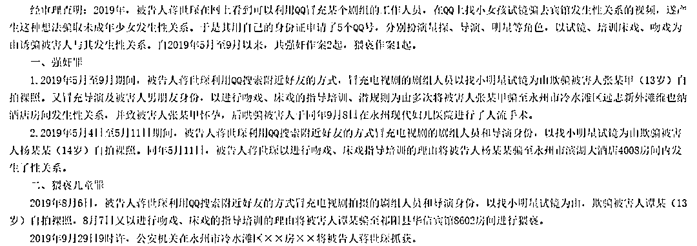
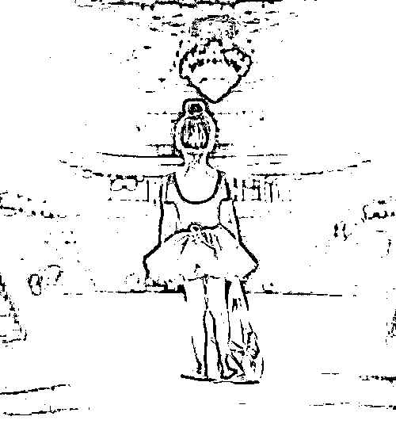

# 真的很想当明星？这件事一定不能做！

> 原文：[`mp.weixin.qq.com/s?__biz=MzIyMDYwMTk0Mw==&mid=2247517414&idx=3&sn=d3d44224ca707bbadc8e6a75ff873476&chksm=97cb4fdea0bcc6c87ff11d9a38a96a84573801aecc2423e7c138c9d0bff3519310b7693d461e&scene=27#wechat_redirect`](http://mp.weixin.qq.com/s?__biz=MzIyMDYwMTk0Mw==&mid=2247517414&idx=3&sn=d3d44224ca707bbadc8e6a75ff873476&chksm=97cb4fdea0bcc6c87ff11d9a38a96a84573801aecc2423e7c138c9d0bff3519310b7693d461e&scene=27#wechat_redirect)

在网上发布童星招募信息

冒充导演、经纪人等

**以检查身体、试镜培训等为幌子**

**诱骗女童拍摄各种淫秽视频照片**

**甚至与其发生性关系**

……

近些年

以童星招募为幌子 

性侵女童的犯罪案件屡见不鲜

净化未成年人网络空间

依然任重道远

（网络图片，图文无关）

“星探”黑手伸向各地女童

近日，有媒体报道，据裁判文书网文书显示，2019 年，湖南男子蒋某在网上看到有人利用 QQ 冒充剧组工作人员寻觅小女孩试镜，骗至宾馆发生性关系的视频，遂申请了 5 个 QQ 号，分别**扮演星探、导演、明星等角色，**以试镜、培训吻戏为由，诱骗被害人与其发生性关系。

自 2019 年 5 月至 9 月以来，蒋某共强奸作案 2 起，猥亵作案 1 起，甚至致使其中一名 13 岁被害人怀孕。

判决文书截图，来源：中国裁判文书网

湖南省祁阳县人民检察院于 2020 年 7 月 2 日提起公诉，以强奸罪、猥亵儿童罪追究蒋某的刑事责任。综合全案的犯罪事实、性质、情节及对于社会的危害程度，对被告人从重处罚，判决被告人犯强奸罪，判处有期徒刑 8 年；犯猥亵儿童罪，判处有期徒刑 3 年。决定合并执行有期徒刑 10 年 6 个月。

类似这样**以“打造童星”为幌子的骗局，并非少数。**

2019 年 7 月，苏州市吴江区公安机关先后赴湖南、山东抓获犯罪嫌疑人王某和邹某。涉案被害人达 17 名，遍布全国各地多个省份。

2019 年 12 月，经吴江区检察院提起公诉，吴江区法院以犯猥亵儿童罪分别判处王某和邹某有期徒刑一年十个月和有期徒刑五年六个月。

法院经审理查明，2019 年 5 月至 7 月，两人为满足性刺激，分别通过聊天软件添加 10 岁至 14 岁女童为好友，冒充某影视公司副总经理和经纪人，后以招募童星需要面试、检查身体敏感度和模仿能力等为由，诱骗被害人裸露身体，以拍摄、传送淫秽视频照片等方式实施猥亵。

图片来源网络，图文无关

制造假身份假冒“星探”

“在涉及童星招募的空间、群中寻找合适目标，利用被害女童急于成名、心智不成熟等特点，引诱她们拍摄不雅视频照片”是他们的主要作案手段。

他们会**假装导演或“星探”**，长期在社交网络发布诸如“新剧招募演员，本公司还缺歌手、舞蹈演员、主持人、模特、网红等，薪酬优厚”等广告，在 QQ 群或者空间添加被害人，以推荐拍电影、当明星为幌子，要求女童**提供个人基本信息、生活照片、**自我介绍的语音等。

随后，当有女童信以为真后，就开始进行所谓的**“面试”**，并以看身材和发育审核为由要求她们**拍摄裸照**；等待几天后，如果女童仍未发觉异常，再以考验演技、安排任务为由要求她们拍摄各种淫秽动作照片和视频，**甚至发生性侵行为。**

作案人员称，“女童大多很单纯，容易控制。”如果有人犹豫，只要采用**“为了梦想，要勇敢、要努力”**“马上可以拿到名额”等话术，被害女童通常会信以为真，配合各种要求。

即便意识到自己上当受骗，她们也常会担心事件曝光而**选择沉默，不会主动告诉老师和家长，**仅以删除对方 QQ 号了事。

警方表示，“被害人大多处于青春期，这一群体的孩子比较特殊，虽自认为成熟，但实际上仍**缺乏足够的分辨力和自我保护能力。**”

守护未成年人上网安全

近年来，不法分子利用网络平台诱骗儿童发送裸照、裸体视频、做猥亵动作等案件一直禁而不绝。

犯罪嫌疑人以招募童星为幌子，获取女童淫秽视频进行贩卖，有的还以淫秽视频控制幼女卖淫、性侵。这些犯罪手段**具有很强的隐蔽性**，不易被监护人和老师发现。

对此，需要各部门加强对网络空间的日常监管协作，社会各界加大联合宣传教育力度，家长、老师做好未成年人引导。

 [`mp.weixin.qq.com/mp/readtemplate?t=pages/video_player_tmpl&action=mpvideo&auto=0&vid=wxv_1673005230210269191`](https://mp.weixin.qq.com/mp/readtemplate?t=pages/video_player_tmpl&action=mpvideo&auto=0&vid=wxv_1673005230210269191)

放假了

温馨提醒

大家在上网时

一定要注意甄别各类信息

**提升自我保护意识**

**不要将个人隐私发给他人**

如果你或者自己的朋友

不幸遇到上述情况

一定要及时求助父母和权威部门

报警 

不光可以帮助你**免受威胁之苦**

更会让坏人**绳之以法**

来源：中国青年网微信（ID：youthzqw），“共青团中央”（ID：gqtzy2014）

← 向右滑动与灰产圈互动交流 →

