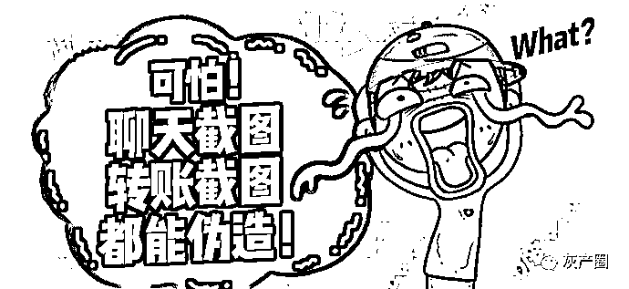
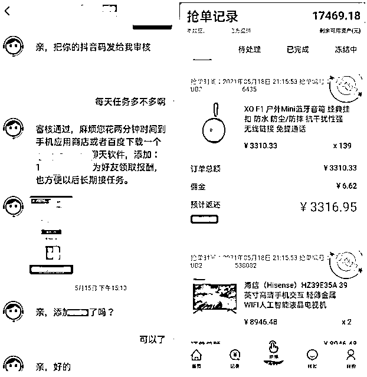
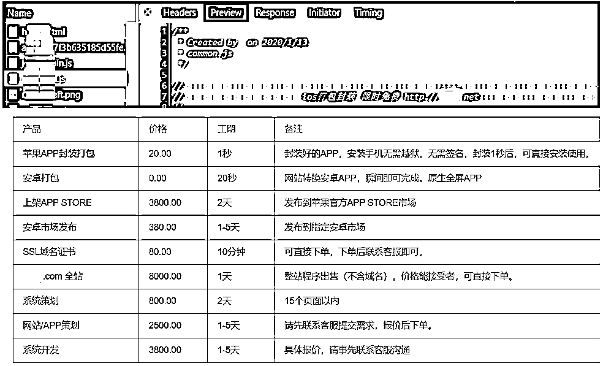
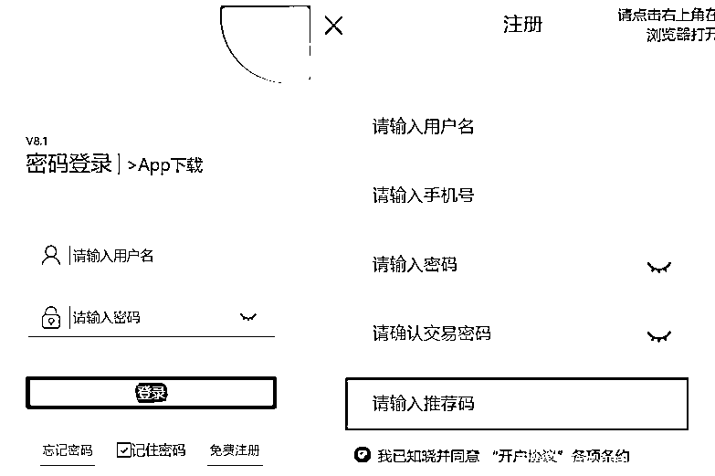
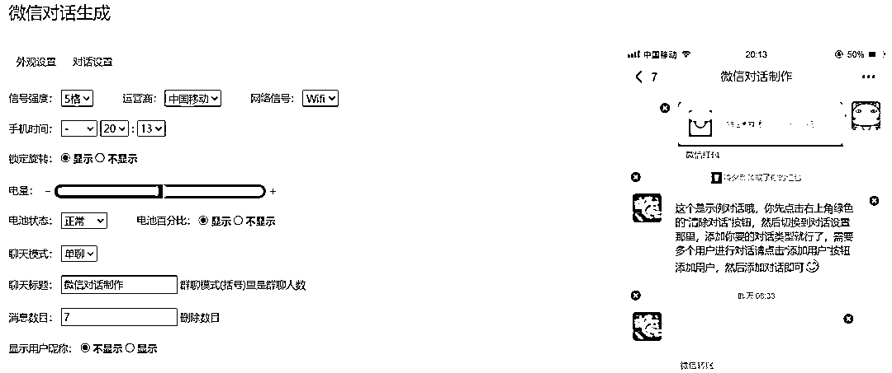
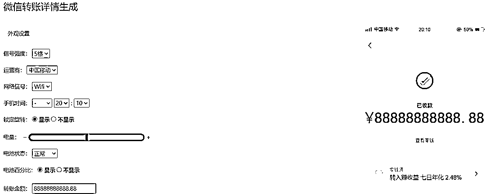
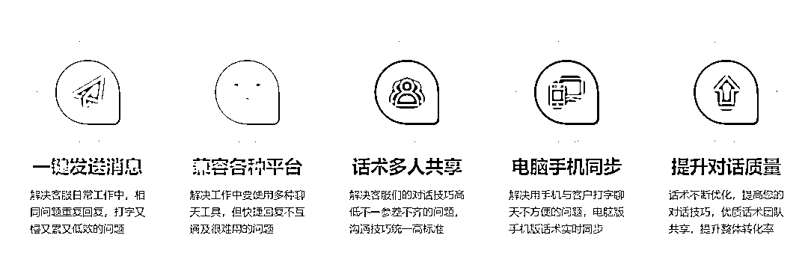
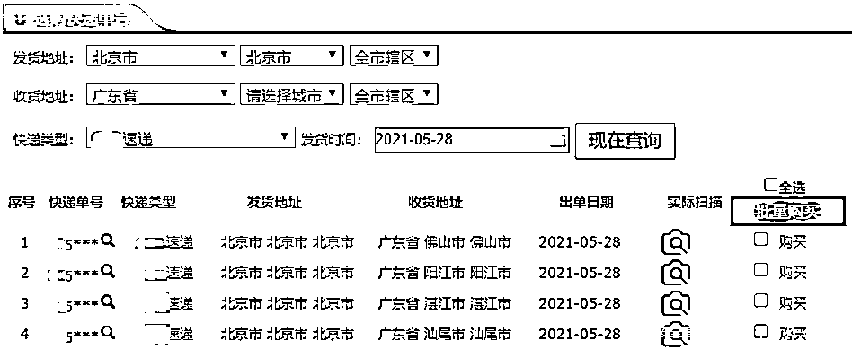

# 我们看到的聊天记录、百万转账记录都是一键生成的

> 原文：[`mp.weixin.qq.com/s?__biz=MzIyMDYwMTk0Mw==&mid=2247517414&idx=4&sn=bdb8d28784bdff02f01121ddd14fc959&chksm=97cb4fdea0bcc6c8b68f63790503145bbb0d210547185d4cc8dae2a8c9fb2e9f3ee412653b19&scene=27#wechat_redirect`](http://mp.weixin.qq.com/s?__biz=MzIyMDYwMTk0Mw==&mid=2247517414&idx=4&sn=bdb8d28784bdff02f01121ddd14fc959&chksm=97cb4fdea0bcc6c8b68f63790503145bbb0d210547185d4cc8dae2a8c9fb2e9f3ee412653b19&scene=27#wechat_redirect)

近日，360 手机先赔接到用户反馈，兼职网赚被骗上万元。通过对诈骗过程的分析挖掘，尝试对刷单诈骗背后涉及的黑灰产链条及诈骗工具做分析。

案例经过

用户在朋友圈看到“短视频点赞”的网赚信息，添加了指定的微信公众号。在客服的引导下，进行了短视频点赞，之后对方表示点赞单子少，给用户介绍高佣金的电商平台刷单。

用户按照要求，在应用商店下载了指定聊天软件，并添加工作人员账号。随后又下载了“天猫众包”APP。应用内首次充值 300 元，刷单后正常体现 483 元；第二次充值 1200 元，刷单后正常提现 1314 元；第三次刷单后，系统提示需要继续充值才可提现，用户累计充值 17600 元后还要继续充值 12000 才可以提现，得知受骗。

## 刷单诈骗背后的黑灰产业链及诈骗工具分析

涉诈 APP 来源

通过 APP 内嵌的钓鱼网址，发现其使用的封装平台，与常见的封装平台不同之处在于，此封装平台偏灰产，与博彩行业的包网平台很像，提供防洪域名、SSL 证书、服务器、APP 策划开发、安卓市场发布一站式服务。

涉诈应用特征

①需使用邀请码注册

②一台服务器绑定多个涉诈域名，每个域名再生成一个涉诈应用

③网站特征：非手机端限制访问

微信引流至小众聊天软件，在小众聊天软件中，向受害人提供涉诈 APP，发布兼职任务，诱骗受害人在 APP 内充值。 

诈骗工具分析

聊天生成器、转账截图生成器

为了宣传引流，诈骗团伙会使用微信聊天生成器、转账截图生成器工具伪造兼职赚取高佣金的截图。

客服软件

批量聊天神器，多人共享一套话术，兼容 QQ 微信千牛等多平台的一键回复工具。此类工具，在诈骗场景中，被用于批量群发引流获客、客户管理。

快递单号网

提供快递单号买卖的网站，可根据发货地、收货地，快递类型购买快递单号。此类平台主要售卖的是空包裹单号（真实的物流信息），在部分诈骗场景中，为了让用户相信刷单的真实性，诈骗团伙也会使用此类空包裹单。

 来源：网络侦查研究院，反诈骗先锋，安全客

← 向右滑动与灰产圈互动交流 →

