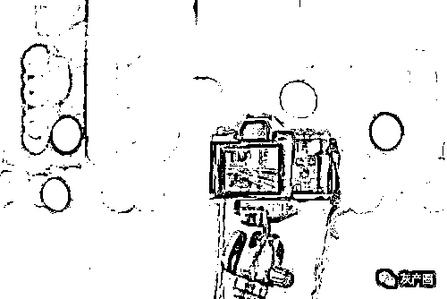

# 警惕！“抖音”平台暗藏的陷阱

> 原文：[`mp.weixin.qq.com/s?__biz=MzIyMDYwMTk0Mw==&mid=2247517414&idx=5&sn=4a4568390798f178917d20ae5021e796&chksm=97cb4fdea0bcc6c8f3fb6afb025a680e7f7a901427a02d6fa64ec45b4e83ad4404c45cc83e2d&scene=27#wechat_redirect`](http://mp.weixin.qq.com/s?__biz=MzIyMDYwMTk0Mw==&mid=2247517414&idx=5&sn=4a4568390798f178917d20ae5021e796&chksm=97cb4fdea0bcc6c8f3fb6afb025a680e7f7a901427a02d6fa64ec45b4e83ad4404c45cc83e2d&scene=27#wechat_redirect)

**警惕！“抖音”平台暗藏的陷阱**

———————————————— 

说到近几年最火最常用的 APP，恐怕非“抖音”莫属了，这个以“记录美好点滴生活”为口号、以快、短为主要推手的视频分享软件已逐步占据我们的生活，小到三岁孩子，大到耄耋老人，无一不对它爱不释手。抖音的“算法推荐”吸引了一大票忠实用户，人们可以根据个人喜好看到推送的视频、也可以拍摄短视频在网络上分享，大量用户涌入，使得那里成为各类网红、流量小生的聚集地，不少诈骗分子也混迹其中，所谓埋坑的人永远没有挖坑的人速度快，这就让防备意识不强的抖音用户蒙受了损失。

**喜欢看短视频的小伙伴，要认真看咯！**

在不久前，高新区的董某某在抖音内看到一则“抖音点赞员”的广告，董某某通过广告内的联系方式与对方取得联系，并按照对方的要求刷单后，对方发送红包给董某某。当董某某向对方指定的账户转账刷单共 54735 元时，董某某发现无法进行提现。董某某这才意识到自己被骗，随即报警求助。

你以为随便点点赞，刷刷流量就能日进百金？

醒醒吧，这等好事不存在的！骗子就是利用你得了小便宜之后对他的信任，让你投入更多的本钱，最后再卷款消失，你以为刷个视频还发现了赚钱的门道，实则你掉进了骗子精心设计的诈骗陷阱。

其实，无论登录哪个网络平台，要想不被骗钱很简单，不贪、不念、不理睬。

这里给喜欢上网的小伙伴们总结了其他利用抖音诈骗的常见套路！

———————————————— 

**套路一：网上想贷款，倾家又荡产******

****

**————————————————** 

**抖音系统的精准识别，能及时发现并推送你喜欢的视频，这个功能就可以顺利分类出哪些用户有强烈的网上借贷需求，进而给你推送关于网络借贷的视频广告。网络借贷暗藏风险已是老生常谈，但是总有人奋不顾身往敌人枪口上撞，盲目地相信那些“低利息、零抵押、放款快、办理快捷”的网络贷款广告，一旦相信，假客服真骗子就会在放款之前以交“保证金、会员费、风险金、解冻费、利息费”等等名目诈骗你的钱财，本就不富裕需要资金周转的你，这下更是雪上加霜了，拜托，记住一句话：放款前让你先交费的网络贷款，别信，是骗子。**

****真实案例****

****

**家住蒙城县的彭某某在抖音短视频平台看到一贷款广告视频。彭某某留下个人信息后，接到自称是贷款广告公司人员的电话称可以为彭某某办理贷款。随后彭某某按照对方要求下载一贷款软件。接着对方以办理会员能够享受更低的利息为由，诱导彭某某缴纳会员费。彭某某向对方转账后，对方又以操作不当导致账号被冻结为由，要求彭某某缴纳保证金。当彭某某向对方转账共 66998 元时，对方仍以其他理由要求彭某某进行转账。彭某某这才意识到自己被骗，随即报警求助。**

**————————————————**

**套路二：抖音遇见 TA，只叹眼太瞎**********

**————————————————** 

**“杀猪盘”还记得吗？就是利用跟你谈恋爱再诱导你去假平台投资赌博的骗术，没错，也大量潜藏在抖音立。他们会以添加陌生好友的方式与你相识，通过聊天了解你的经济情况并快速让你陷入网恋。要不了几天，骗子就会原形毕露，称自己或朋友是“网络高手”，知道投资、赌博网站的漏洞，要带你快速挣钱，受害人上钩后，先让其尝点甜头，再以结婚、见面为前提让你一次性大额投资，那些陷入怀揣着对爱情憧憬的小傻瓜们，便会将一生的积蓄赌在这个连面都没见过的人身上，当然，过程很美好，结局很悲惨。**

****真实案例****

****

**家住蒙城县的张某在抖音短视频平台看到一关于分析讲解股票的视频，随后张某通过视频内的联系方式与对方取得联系进行交流。接着对方通过发布虚假信息取得张某信任后，诱导张某进行投资。张某通过对方发送的链接进入一平台进行投资，并在此平台转账投资共 150000 元。当张某发现无法提现时，再也联系不上对方。张某这才意识到自己被迫，随即报警求助。**

**————————————————** 

****

**这些抖音“诈骗”**

**虽然各有不同**

**但是他们有一个共同点**

**那就是**

****找你“要钱”****

****找你“要钱”****

****找你“要钱”****

****骗子为了钱会不择手段，哪怕你说你没存款，也会骗你贷款打给他。****

****擦亮眼睛吧伙伴们，上网还得多学习啊~****

****小伙伴们 get 到了吗？****

****点赞转起，警醒更多人！****

****

****警方提示：****

****不要轻易添加陌生人 QQ、微信，更不要轻易向对方转账汇款；不随意将银行卡号、手机号、验证码等隐私信息透露给陌生人，不贪图便宜；不点击可疑链接、不随意扫描二维码；刷抖音时要保持清醒、切忌贪婪，不要让娱乐 APP 把你给娱乐了！****

**来源：公安部网安局，利箭在出击**

****

**← 向右滑动与灰产圈互动交流 →**

****