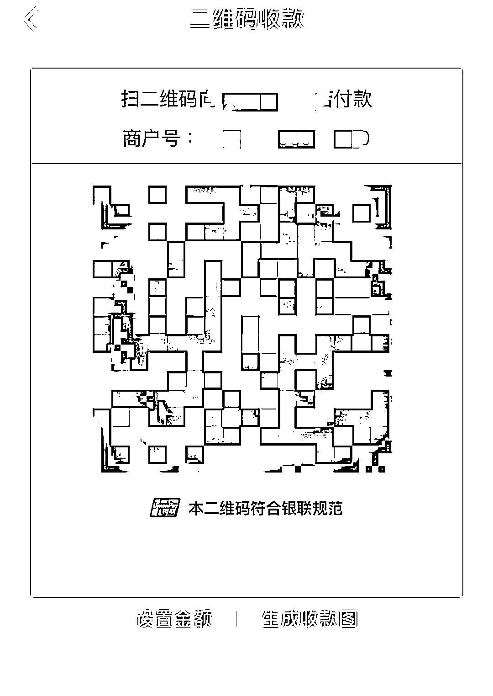

# 注意！暑假刚开始，有孩子因这个被骗了近 4 万元！

> 原文：[`mp.weixin.qq.com/s?__biz=MzIyMDYwMTk0Mw==&mid=2247517414&idx=6&sn=84ee0de23ffd83e7d20903557b04c59c&chksm=97cb4fdea0bcc6c87cee3546f081a9c27dd7e7ef9476b5f8ec650dd6de5a9f95701325d4dc8f&scene=27#wechat_redirect`](http://mp.weixin.qq.com/s?__biz=MzIyMDYwMTk0Mw==&mid=2247517414&idx=6&sn=84ee0de23ffd83e7d20903557b04c59c&chksm=97cb4fdea0bcc6c87cee3546f081a9c27dd7e7ef9476b5f8ec650dd6de5a9f95701325d4dc8f&scene=27#wechat_redirect)

暑假模式开启

在家的“神兽”们

是不是已经抱起手机

快活地打起游戏啦？

然而，诈骗分子也盯上“暑期档”将诈骗之手伸向毫无防备之心的孩子
近日，一名小学生就遭遇了免费领游戏皮肤的诈骗

7 月 7 日，10 岁的小琪（化名）在社交平台上认识了一名陌生网友随后，该网友将小琪拉进一个 QQ 群并以免费送游戏皮肤为幌子发送微信付款码给小琪让小琪用家长的手机扫码领取

小琪信以为真便使用父亲的微信多次通过扫描对方发送的二维码转账 3.7 万余元小琪的母亲发现小琪被骗后第一时间报警目前，案件正在进一步侦办中

不久前还有学生掉进了红包返利骗局

6 月 25 日，学生小蓝（化名）被人拉进一个红包群随后一名群成员要求小蓝添加其为好友表示可以单独给小蓝发红包

成功添加为好友后对方发来一个视频引导小蓝扫描陌生二维码并在弹出的付款页面中输入指定金额 58.8 元进行支付操作对方表示，该金额是虚拟代码支付后不会产生扣费还可返还 588 元的十倍红包

▲嫌疑人利用商户二维码实施诈骗

操作后小蓝却发现钱真的被扣掉了随即追问对方对方表示可用家长的手机进行验证操作并引导小蓝进行视频通话
在视频通话过程中小蓝询问如何退款对方却以此为由不断引导小蓝进行“扫码、输入虚拟代码并支付”的操作导致小蓝家长的账户被扣 1999 元和 9999 元

随后对方向小蓝要了其家长的微信收款码并提供了一个 18888 元的支付凭证称 7 至 15 天后会有退款到账
对此，小蓝要求对方快速退款但未果方才意识到自己被骗，于是报警合计损失 12056.8 元

接报后警方迅速开展侦查工作于 7 月 4 日抓获嫌疑人赖某经审讯，赖某如实供述了其将诈骗所得金额通过商户套现的事实目前，赖某因涉嫌诈骗罪被警方依法刑事拘留

暑期来临

针对学生的电信网络诈骗

家长和学生要注意防范

**01 网购刷单诈骗**

骗子发布虚假广告，招聘兼职刷单员，以做任务赚佣金为诱饵，骗取事主信任后再以缴纳“保证金”“风险金”等理由进行诈骗。

**02 冒充好友诈骗**

骗子发布虚假广告，招聘兼职刷单员，以做任务赚佣金为诱饵，骗取事主信任后再以缴纳“保证金”“风险金”等理由进行诈骗。

**03 低价购物诈骗**

骗子在网络上发布低价买卖信息，引诱事主进行线下交易，收钱后不予发货。

**04 游戏交易诈骗**

骗子以游戏交易为名，引诱事主进入虚假平台交易，从而实施诈骗。

**05 游戏代练诈骗**

骗子以游戏代练为由，骗取事主的微信或 QQ 账号，直接转走事主微信或 QQ 账户里的钱，或利用骗取的账号冒充事主向其好友实施诈骗。

**06 充值返利诈骗**

骗子开设福利群，声称为答谢广大网友充多少钱返多少利，利用事主贪小便宜的心理，用小额返利为诱饵，骗取大额充值款后将事主踢群“拉黑”。

**07 网上求职诈骗**

骗子利用学生想在暑假进行勤工俭学这一心理，在求职网上发布招聘暑期工的虚假信息，以缴纳“培训费”“保证金”等理由，要求前来求职的学生转账汇款，从而实施诈骗。

  **反诈中心提醒** 

涉世未深的学生

对金钱的概念还没有完全建立起来

因而容易被诈骗分子所迷惑

家长要加强对孩子的陪伴和教育

提高孩子的防骗意识

同时，尽量不要让孩子

随意使用微信、支付宝等

已绑定银行卡的手机

如果发现被骗

一定要及时报警

**诈骗手段千千万**

**归根结底向钱看**

**各位家长、学生可千万要注意**

**赶紧转发给身边的人吧！**

文章来源：广东公安，菲凡烽火台

← 向右滑动与灰产圈互动交流 →

