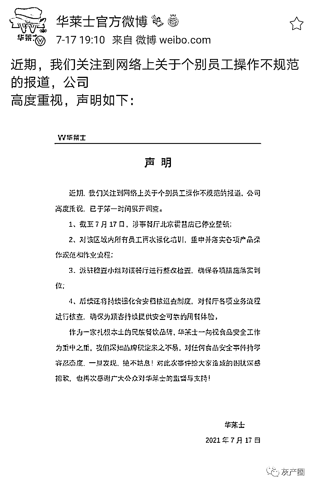

# “喷射战士”华莱士后厨被偷拍曝光，卫生隐患太多，很多人吃完拉肚子

> 原文：[`mp.weixin.qq.com/s?__biz=MzIyMDYwMTk0Mw==&mid=2247517502&idx=2&sn=599110e2190cd5edf7972ee627a910e3&chksm=97cb4e06a0bcc7102b3ac56ad7a1c4f4d0f32e2a6caa303ee7cb13320b80f0e7e0c391943c50&scene=27#wechat_redirect`](http://mp.weixin.qq.com/s?__biz=MzIyMDYwMTk0Mw==&mid=2247517502&idx=2&sn=599110e2190cd5edf7972ee627a910e3&chksm=97cb4e06a0bcc7102b3ac56ad7a1c4f4d0f32e2a6caa303ee7cb13320b80f0e7e0c391943c50&scene=27#wechat_redirect)

**据@内幕纠察局** 调查拍摄，华莱士后厨，工作人员未戴口罩手套制作炸鸡、汉堡；鸡块掉在干地面上，捡起放回去，掉在湿地面上，捡起来重新炸；清洗抽油烟机，洗剂直接滴进油锅…很多顾客评价吃完拉肚子。另一家高销量炸鸡店后厨，炸鸡预先炸好堆在厚油渍墙角，年糕等辅料里苍蝇乱趴，掉在地上、垃圾桶的炸鸡捡起重炸继续卖，每天过滤老油、加入新油继续使用，永不更换……

[`v.qq.com/iframe/preview.html?width=500&height=375&auto=0&vid=k3258x83uvy`](https://v.qq.com/iframe/preview.html?width=500&height=375&auto=0&vid=k3258x83uvy)

7 月 17 日，据@华莱士官方微博 ：近期，我们关注到网络上关于个别员工操作不规范的报道，已于第一时间展开调查。

* * *

是蓝莓味的兔:评论都不敢开的华莱士，笑拉了

几粒话:不处理好根源道歉有啥用？开除人就没了啊？

肖明明教授:这不是华莱士企业文化吗 怎么变成个别员工的错了

事晚小神仙:听说它可以喷射，我还想用一用呢

来源：微博那些事儿

← 向右滑动与灰产圈互动交流 →

