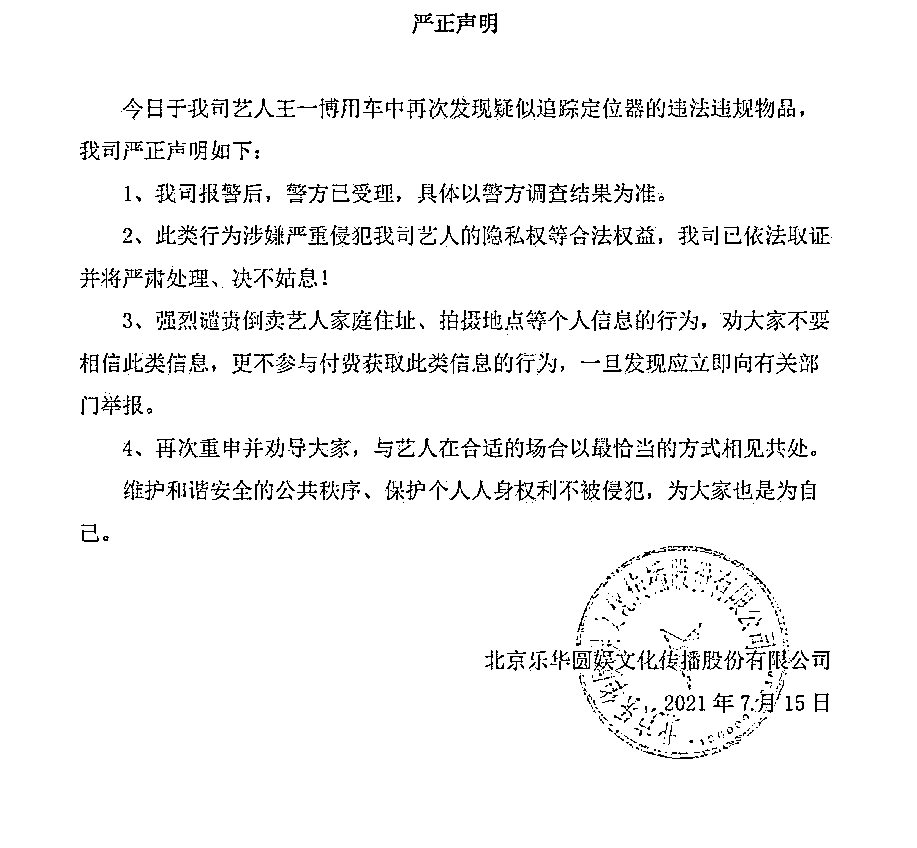
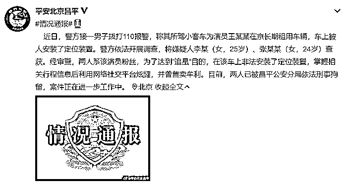
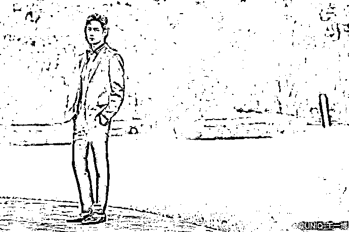
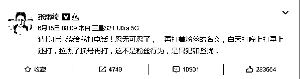
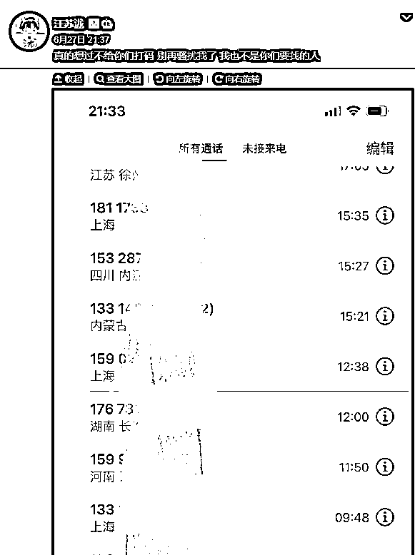

# 王一博车中竟发现追踪定位器！

> 原文：[`mp.weixin.qq.com/s?__biz=MzIyMDYwMTk0Mw==&mid=2247517502&idx=4&sn=c09afc5ad02b329a7d08e3d3b43716a4&chksm=97cb4e06a0bcc7100ed305bf05946fd69f44fdc41e4c784b326132a13d0cd007626f9289f293&scene=27#wechat_redirect`](http://mp.weixin.qq.com/s?__biz=MzIyMDYwMTk0Mw==&mid=2247517502&idx=4&sn=c09afc5ad02b329a7d08e3d3b43716a4&chksm=97cb4e06a0bcc7100ed305bf05946fd69f44fdc41e4c784b326132a13d0cd007626f9289f293&scene=27#wechat_redirect)

当追星星的人，

别去做摘星星的人。

据报道

疑似私生饭

（以极端方式介入明星私生活的粉丝）

在王一博车内安装**追踪定位器**后

7 月 15 日

王一博所属公司乐华娱乐发布声明

称再次发现

疑似追踪定位器的违法违规物品

已经报警处理

乐华娱乐同时还对倒卖艺人家庭地址、拍摄地点等个人信息等行为进行了强烈谴责，劝大家不要相信此类信息甚至参与付费获取此类信息。

7 月 17 日，北京昌平公安官方微博@平安北京昌平 发布最新通报：将嫌疑人李某（女，25 岁）、张某某（女，24 岁）刑事拘留。通报内容如下：

近日，警方接一男子拨打 110 报警，称其所驾小客车为演员王某某在京长期租用车辆，车上被人安装了定位装置。警方依法开展调查，将嫌疑人李某（女，25 岁）、张某某（女，24 岁）查获。

经审查，**两人系该演员粉丝，为了达到“追星”目的，在该车上非法安装了定位装置，掌握相关行程信息后利用网络社交平台炫耀，并曾售卖牟利**。目前，两人已被昌平公安分局依法刑事拘留，案件正在进一步工作中。

[`mp.weixin.qq.com/mp/readtemplate?t=pages/video_player_tmpl&action=mpvideo&auto=0&vid=wxv_1961621028036575238`](https://mp.weixin.qq.com/mp/readtemplate?t=pages/video_player_tmpl&action=mpvideo&auto=0&vid=wxv_1961621028036575238)

开车尾随明星车辆、到明星家门口蹲守、在飞机还未停稳时越舱追拍明星……一些私生粉追星行为越来越出格。但发展到在明星车内安装追踪定位器这一地步，还是突破了人的想象力。

不排除安装追踪定位器的，是某些“粉头”，获得明星活动轨迹后，倒卖给私生粉。但无论怎样，这一行为，都严重侵犯了个人隐私。

图据王一博微博

**其实**

**在刚刚过去的 6 月**

**就有多名艺人明星控诉私生饭的骚扰**

6 月 15 日，演员张雨绮在微博说：“请停止继续给我打电话！忍无可忍了，一再打着粉丝的名义，白天打，晚上打，早上还打，拉黑了换号再打，这不是粉丝行为，是冒犯和骚扰！”

6 月 27 日，歌手汪苏泷在微博曝光了自己被私生饭拨打骚扰电话的截图，并配文称：“真的想过不给你们打码，别再骚扰我了，我也不是你们要找的人”。

个人隐私频频被泄露，令人不胜其扰。相关法律也明确对此类行为予以处罚。 

根据《治安管理处罚法》第四十二条的规定，偷窥、偷拍、窃听、散布他人隐私的，处五日以下拘留或者五百元以下罚款；情节较重的，处五日以上十日以下拘留，可以并处五百元以下罚款。

希望私生饭们能意识到

**追星应有度**

**违法必被罚**

来源：综合广州日报、平安北京昌平、长沙晚报

← 向右滑动与灰产圈互动交流 →

