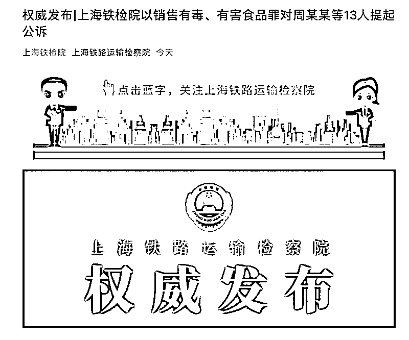

# 郭美美销售减肥糖案，最近进展

> 原文：[`mp.weixin.qq.com/s?__biz=MzIyMDYwMTk0Mw==&mid=2247517502&idx=5&sn=595935bb7cac2c7cf0043cbd830ee266&chksm=97cb4e06a0bcc7106683ac85c8c9b358030dc6216f75a48f428c342d3dbe21298aa0f0be217a&scene=27#wechat_redirect`](http://mp.weixin.qq.com/s?__biz=MzIyMDYwMTk0Mw==&mid=2247517502&idx=5&sn=595935bb7cac2c7cf0043cbd830ee266&chksm=97cb4e06a0bcc7106683ac85c8c9b358030dc6216f75a48f428c342d3dbe21298aa0f0be217a&scene=27#wechat_redirect)

7 月 16 日，上海铁路运输检察院在其官微通报称，近日，该院依法对周某某、郭某某等 13 人以销售有毒、有害食品罪提起公诉。南都记者从上海铁路运输检察院获悉，郭某某即曾因犯开设赌场罪入狱的“网红”郭美美。

上海铁路运输检察院称，经审查，2020 年 9 月起，周某某将生产商曾某某等人生产的减肥糖批发给下级销售代理赵某、李某等人，赵某等人通过微信等渠道销售至全国各地。（此前报道：[郭美美, 二进“宫”！](http://mp.weixin.qq.com/s?__biz=MzIyMDYwMTk0Mw==&mid=2247511146&idx=2&sn=f0fe861a7152ab6582df3c68447c322d&chksm=97cb6752a0bcee4451e52ae9e0175c81f2cecfc207f990817b3f0d18e85ce71c9c2f60b75698&scene=21#wechat_redirect)）

2021 年 1 月，赵某发展郭某某为销售，郭某某通过微信、微博发布广告，销售减肥糖。该系列案中的减肥糖中均检出国家明令禁止添加的西布曲明成分。西布曲明属于“有毒、有害的非食品原料”，非法生产、销售添加西布曲明的减肥糖依法构成生产、销售有毒、有害食品罪。该院工作人员向南都记者证实，郭某某即郭美美。

此前资料图

南都此前报道，3 月 18 日，上海市公安局发布警情通报称，3 月 11 日，浦东警方成功侦破一起生产、销售添加违禁成分（西布曲明）减肥类食品案件，抓获生产人员、销售人员郭某某（女，30 岁）等 32 名犯罪嫌疑人，均已被依法刑拘。

此前资料图

4 月 12 日，上海市公安局再度披露此案侦破过程。2020 年 12 月，浦东公安分局经侦支队收到一条线索。有人在网上销售假减肥药。该制售窝点通过在网上发布广告进行宣传，吸引爱美女性。五花八门的产品、品种多多，消费者被其中的宣传话术所吸引，想通过“特效减肥类保健食品”让自己瘦出完美曲线。

殊不知，自己买的减肥药中里添加了“西布曲明”的违禁成分，虽然有减肥的效果，但会对身体会造成伤害。浦东经侦支队民警经过前期数月的缜密侦查，在多省多地统一开展收网行动，先后抓获涉嫌生产、销售有毒有害减肥类保健食品的嫌疑人曾某某、周某某、郭某某等 75 人。捣毁生产窝点 3 处、销售窝点 24 处，现场查获有毒有害减肥类保健食品 65000 余粒、生产原料约 34 公斤、生产设备 3 台以及外包装 20000 余件，涉案金额达 5000 万余元。

4 月 16 日，上海市铁路运输检察院通报，当天对郭某某等人以涉嫌销售有毒、有害食品罪批准逮捕。

公开资料显示，西布曲明是一种化学药物，早在 2010 年，我国已停止西布曲明制剂和原料药的生产、销售和使用。

来源：南方都市报

← 向右滑动与灰产圈互动交流 →

