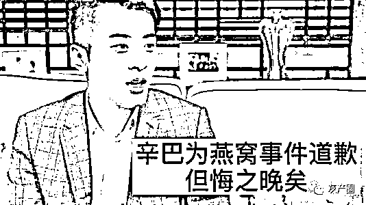

# 辛巴燕窝事件最终裁决

> 原文：[`mp.weixin.qq.com/s?__biz=MzIyMDYwMTk0Mw==&mid=2247517502&idx=6&sn=7e0022a2bef0f64a681e925c965a9b58&chksm=97cb4e06a0bcc7103cded919317b6bd96d73c44f00bd8cdc0e450440423b511b486b5ab80628&scene=27#wechat_redirect`](http://mp.weixin.qq.com/s?__biz=MzIyMDYwMTk0Mw==&mid=2247517502&idx=6&sn=7e0022a2bef0f64a681e925c965a9b58&chksm=97cb4e06a0bcc7103cded919317b6bd96d73c44f00bd8cdc0e450440423b511b486b5ab80628&scene=27#wechat_redirect)

**此前报道：**

[辛巴承认燕窝产品虚假宣传：深表歉意，退一赔三](http://mp.weixin.qq.com/s?__biz=MzIyMDYwMTk0Mw==&mid=2247505194&idx=4&sn=09b8de6fe5ebc92a45cca6bd7787a875&chksm=97cb1e12a0bc97045ce3d02a25f3d4206110aadddf407ce851dfc239c1a686146f8e7113ae67&scene=21#wechat_redirect)

[辛巴或被追究刑事责任？"假燕窝"被立案调查，带货再出问题：镀金充真金？](http://mp.weixin.qq.com/s?__biz=MzIyMDYwMTk0Mw==&mid=2247505785&idx=5&sn=17e6c7f23b4e23c4f1580620b32bcbae&chksm=97cb1c41a0bc9557eed45702d4609a49d96a49692d0953f1a7a1bbec5fec150ec5a11b1a8399&scene=21#wechat_redirect)

半年时间过去，辛巴燕窝事件终于迎来最终结论。

据上游新闻报道，近日广州仲裁委员会已经就沭阳和翊信息有限公司（辛选集团旗下公司，以下简称“和翊公司”）诉广州融昱贸易有限公司（以下简称“融昱公司”）一案做出终局裁决：确认融昱公司故意误导辛选作出虚假、引人误解的宣传行为，裁决融昱公司向和翊公司支付赔偿款约 3035 万元、象征性赔偿损失 1 元。

辛巴团队相关负责人向界面新闻记者确认了上述事实。

“辛巴直播带货即食燕窝”事件从 11 月初开始发酵，当时有网友在购买了辛巴徒弟“时大漂亮”推销的燕窝后，在网上质疑其实是糖水。

随后，11 月 19 日，“打假人”王海在微博中晒出中国广州分析测试中心的一份报告，并下结论称，“时大漂亮”在直播间中所售卖的茗挚品牌“小金碗碗装燕窝冰糖即食燕窝”，就是糖水而非燕窝，指出该产品的定位为风味饮料，不是燕窝。

在遭到网友质疑后，辛巴曾用直播实验的方式试图自证清白，但很快被“打脸”。王海公布的关于燕窝成分检测报告显示，该款燕窝产品蔗糖含量达 4.8%，成分表里碳水化合物为 5%，蛋白质含量为 0，并且 100 克里含有的“功效”物质燕窝酸价值仅有人民币 0.07 元。

11 月 27 日下午，辛巴团队最终在微博上对此次燕窝事件道歉，并发表事件处理方案声明。辛巴承认，由时大漂亮在直播间宣传的茗挚品牌燕窝，经检测该产品中燕窝成分每碗不足 2 克，确实存在夸大宣传的成分。同时，辛巴方宣布了先行赔付计划，对购买了燕窝的消费者承担假一赔三的责任，共计赔付金额将超过六千万。

2020 年 12 月 23 日，广州市场监督管理部门公布对该事件的调查结果：以“存在引人误解的商业宣传行为”，“违反《反不正当竞争法》”为由，对和翊公司罚款 90 万；融昱公司（茗挚）为和翊公司直播活动提供的“卖点卡”，以及在天猫“茗挚旗舰店”网店发布的内容，存在引人误解的商业宣传行为，加上“该商品标签存在瑕疵”，罚款 200 万，吊销营业执照。

因认为融昱公司提供的产品说明、介绍等资料存在虚假，对消费者构成欺诈，误导涉事主播进行了夸大宣传，和翊公司于去年 12 月向广州仲裁委员会提起仲裁申请：要求融昱公司支付其先行承担的赔偿金，并就“夸大宣传”等欺诈行为象征性赔偿损失 1 元。

广州仲裁委员会 6 月 30 日的裁决书认定，融昱公司在履行合同过程中隐瞒了案涉产品的成分比例，对和翊公司进行了误导，和翊公司基于融昱公司的误导作出了引人误解的宣传行为，对和翊公司的主播造成严重的负面影响。根据和翊公司的申请，裁决融昱公司象征性赔偿和翊公司损失 1 元。

来源：界面新闻

← 向右滑动与灰产圈互动交流 →

