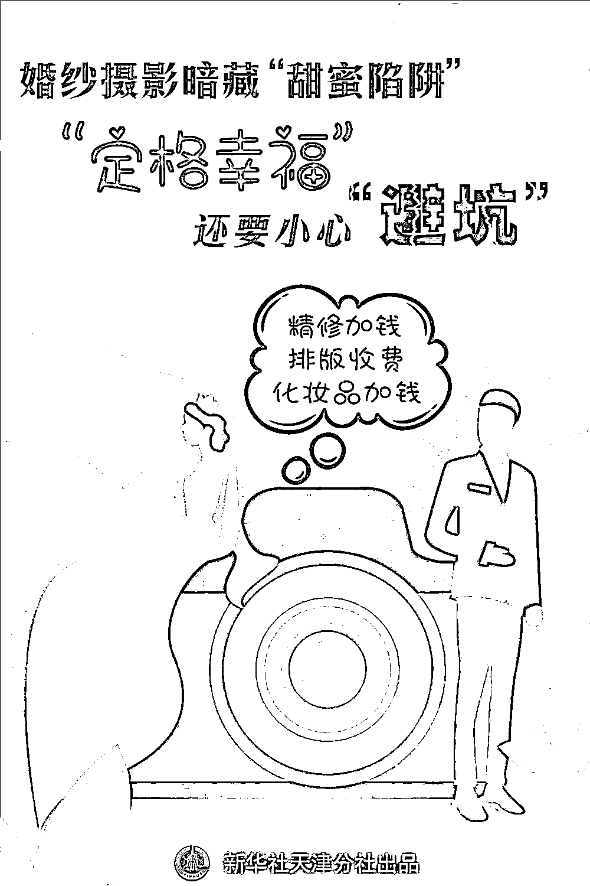
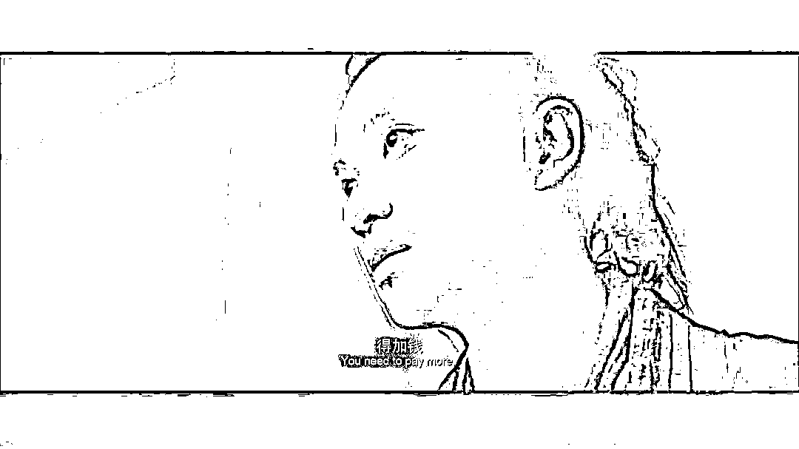

# 婚纱摄影套路多，听我给你细细说

> 原文：[`mp.weixin.qq.com/s?__biz=MzIyMDYwMTk0Mw==&mid=2247517502&idx=8&sn=bb824925769cd5779c48ef90cf98e113&chksm=97cb4e06a0bcc7102b4264d84ec255fbf8bd80ab0908dc0aff8fa5114c84b8b0c9d0db6cd320&scene=27#wechat_redirect`](http://mp.weixin.qq.com/s?__biz=MzIyMDYwMTk0Mw==&mid=2247517502&idx=8&sn=bb824925769cd5779c48ef90cf98e113&chksm=97cb4e06a0bcc7102b4264d84ec255fbf8bd80ab0908dc0aff8fa5114c84b8b0c9d0db6cd320&scene=27#wechat_redirect)

随着国内疫情防控常态化，婚庆市场逐渐回暖。夏季到来，婚纱摄影也呈现一派火热景象。

许多新人在进入婚姻殿堂前都会选择拍摄婚纱照，随着相机“咔嚓”一声，甜蜜瞬间就此定格。然而，不少消费者吐槽，**“拍婚纱照比结婚本身更让人心累”，从化妆到修片，稍不留神就会掉入商家设下的“甜蜜陷阱”。**

美丽新娘沦为“待宰羔羊”

今年 5 月，家在山西大同的李云霞和未婚夫登上了飞往云南丽江的飞机，对于这趟旅行她满心期待，因为她将穿上洁白的婚纱，和爱人一起在镜头前幸福微笑，所有美好都将被定格在一本本精美的相册中。

拍照之前，李云霞做了很多功课，几经筛选后选择了一家专做“旅拍”的影楼，预定了价值 7999 元的拍摄套餐，套餐中共包含 3 个外景，她对其中一个景点不满意，提出调换。工作人员向其推荐名为“雪山玫瑰庄园”的外景，但表示需要支付 1000 元门票，李云霞同意后，第二天一行 5 人进入庄园拍照。

记者在多个旅游购票网站看到，该景点门票标价为每人 50 元。“我都没看见他们买票，只是出示了一下工作证，我们就进去了。”李云霞说。

然而“套路”并未就此终结。李云霞所选套餐共包含 3 本相册、5 套服装，**选片时工作人员却一直劝说最好一套衣服放一本相册。**见李云霞不愿意多加相册，又立马换了一套说辞，**称选片不能删得太狠，要保证照片的连续性，这样后期才好排版。**

**“谁选照片不是哪张好看留哪张，我不可能为了排版选拍得不好的照片，排版问题难道不是应该影楼考虑吗？”**李云霞很气愤，没想到自己期待已久的婚纱照之旅竟“遍布陷阱”，防不胜防。

像李云霞这样“被套路”的消费者不在少数，记者在多个消费者维权平台看到，消费者对于影楼乱收费、隐形消费、诱导消费的吐槽五花八门。

各个环节都有“坑”

只为把钱包掏空

记者在调查中发现，不良商家埋下的“深坑”几乎涵盖了婚纱摄影的各个环节。

**——选影楼，“客片”“样片”傻傻分不清楚。**因为“样片”的拍摄对象多为专业模特，在选择影楼时，消费者一般会选择普通顾客拍的“客片”作为参考，以此衡量影楼的真实拍摄水准。但记者曾发现，两家影楼使用的“客片”完全一样，所谓的“客片”实则是“样片”。

**——选摄影师，“首席”“总监”名头多，水平参差不齐。**一位从事婚礼跟拍的摄影师透露，大多数影楼除固定摄影师外，还会聘用一定数量的兼职摄影师，摄影师水平有很大差别，盲目选择很容易“掉坑”。

**——选服装，表面不限套数，实则暗含“套路”。**有些影楼在拍摄套餐中会将“服装不限套数”或“服装任选”作为卖点，有消费者向记者反映，部分影楼所谓的“不限套数”其实只适用于指定服装区，可以任选的服装大多又脏又破，想穿更好的衣服则需要加钱。

**——拍摄中，门票、捧花、化妆品，收费总在不经意间。**记者发现，部分不良商家与顾客签订合同时并未明确收费项目，与顾客前期沟通时对此也闭口不谈，等到正式进入拍摄环节，便开始对门票、手捧花、化妆品等展开“花式收费”。

**——选片时，多修一张赚一张，力保顾客少删片。**大多数影楼在拍摄套餐中会明确精修照片数量，顾客如果想多修照片，需以每张几十元到上百元的价格支付费用。不少消费者表示，选片环节是“被套路”的“重灾区”。

来自天津的宋敏（化名）在选片时发现，自己套餐里的精修照片根本不够填满所有相册，被迫多修照片。来自北京的李江（化名）和未婚妻在选片时约定绝不多加精修照片，选片师眼看李江要将不修的照片删完，立刻改口说排版要收设计费，如果多修照片，排版免费送，李江无奈多修了 20 张照片。

影楼乱收费或涉嫌欺诈

消费者应理性维权

针对婚纱摄影行业乱象，多位专家表示**影楼乱收费或涉嫌欺诈****，消费者应拿起法律武器合法维权，市场监管部门应加强监管。**

《中华人民共和国消费者权益保护法》规定，消费者享有知悉其购买、使用的商品或者接受的服务的真实情况的权利。经营者向消费者提供有关商品或者服务的质量、性能、用途、有效期限等信息，应当真实、全面，不得作虚假或者引人误解的宣传。经营者提供商品或者服务应当明码标价。

天津市消费者协会投诉部主任陈云奎提示，婚纱照拍摄过程中的收费项目，商家应提前告知消费者，充分保障消费者的知情权。**如商家存在夸大或隐瞒所提供的婚纱摄影服务的数量、质量、性能等与消费者有重大利害关系的信息，误导消费者，则属于欺诈行为。**

天津世川律师事务所高级合伙人李晗表示，消费者享有自主选择商品或者服务的权利，在服务过程中消费者有权购买或不购买某项服务，如果影楼在服务过程中未询问顾客是否需要购买某项服务而直接收费，依然构成欺诈行为。

陈云奎说，消费者要主动了解服务内容、过程以及可能产生的费用，对于商家的优惠要问清问细，**不轻信商家的口头承诺和宣传，要签订正规合同协议，最好把协商事项落实到合同中，并保留相关聊天记录和收款凭证。**

李晗建议，市场监管部门应加强监管，同时婚纱摄影机构应加强行业自律，向消费者提供商品或服务时，不应设定不公平、不合理的交易条件，应明确收费项目的价格，使消费者能清楚认知且自主选择所需服务，从而促进行业的健康发展。

来源：新华社，中国青年网微信

← 向右滑动与灰产圈互动交流 →

