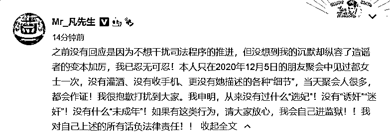
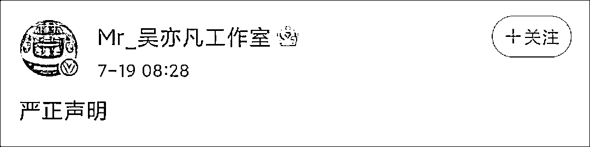
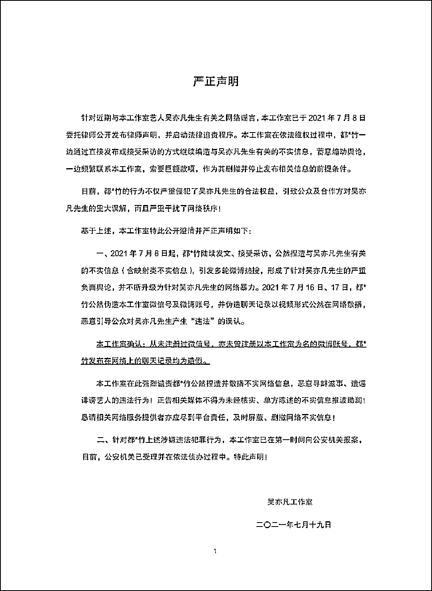
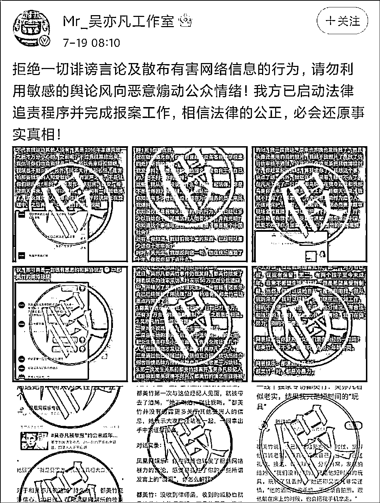
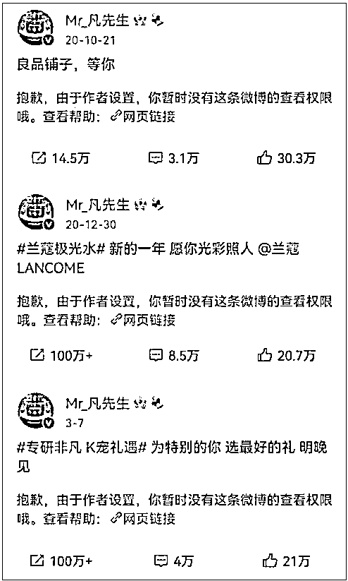
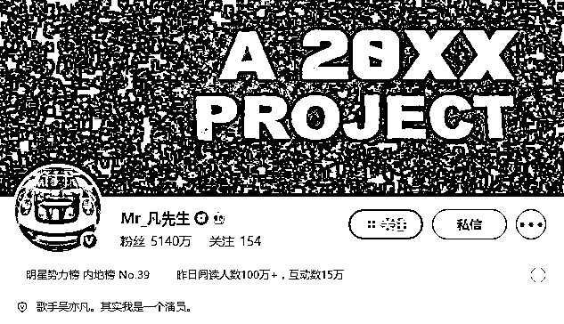
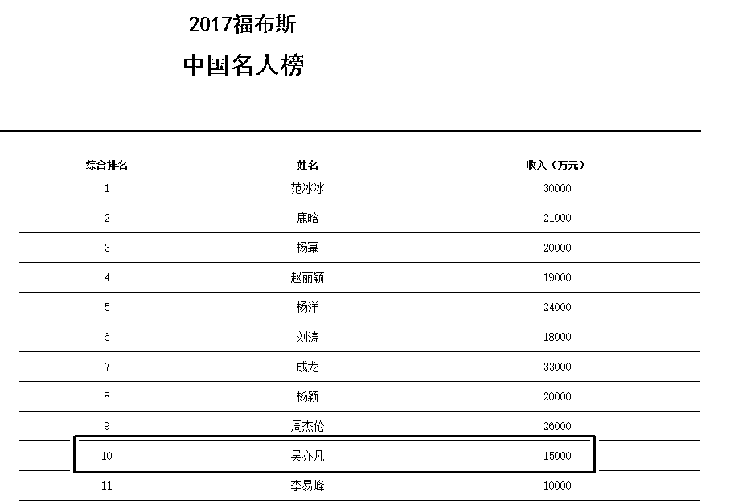

# 吴亦凡：如果有，我自己进监狱

> 原文：[`mp.weixin.qq.com/s?__biz=MzIyMDYwMTk0Mw==&mid=2247517572&idx=3&sn=75fc6bd182cb1823f4cf2c2eef0c5f14&chksm=97cb4ebca0bcc7aa1ad58cdc98338abaef6baa66f9b1a6c6f1740811ebe901c839c2661fb450&scene=27#wechat_redirect`](http://mp.weixin.qq.com/s?__biz=MzIyMDYwMTk0Mw==&mid=2247517572&idx=3&sn=75fc6bd182cb1823f4cf2c2eef0c5f14&chksm=97cb4ebca0bcc7aa1ad58cdc98338abaef6baa66f9b1a6c6f1740811ebe901c839c2661fb450&scene=27#wechat_redirect)

近日因被都美竹指控“被控诱骗未成年女孩”而陷入舆论漩涡的吴亦凡 7 月 19 日上午在微博发文，否认都美竹此前爆料中的种种“细节”。

吴亦凡称：“之前没有回应是因为不想干扰司法程序的推进，但没想到我的沉默却纵容了造谣者的变本加厉，我已忍无可忍！本人只在 2020 年 12 月 5 日的朋友聚会中见过都女士一次，没有灌酒、没有收手机、更没有她描述的各种“细节”，当天聚会人很多，都会作证！我很抱歉打扰到大家。我申明，从来没有过什么“选妃”！没有“诱奸”“迷奸”！没有什么“未成年”！如果有这类行为，请大家放心，我会自己进监狱！！我对自己上述的所有话负法律责任！！”

19 日上午 8 时 28 分，吴亦凡工作室官微@Mr_ 吴亦凡工作室发布声明，称都美竹编造与吴亦凡有关不实信息、蓄意煽动舆论、向工作室索要巨款，上述行为涉嫌违法犯罪，工作室已经向公安机关报案，案件被受理后正在依法侦办。

值得注意的是，在吴亦凡工作室的这份声明中，明确提到都美竹“涉嫌犯罪”，“公安机关已受理并在依法侦办过程中”，这意味着该案为刑事案件，警方已经启动刑事诉讼程序。

结合该声明中提到的都美竹“一边通过直接发布或接受采访的方式继续编造与吴亦凡先生有关的不实信息，蓄意煽动舆论，一边频繁联系本工作室，索要巨额款项，作为其删撤并停止发布相关信息的前提条件”，都美竹的行为在此描述下涉嫌“诽谤罪”和“敲诈勒索罪”。

其中，“诽谤罪”属于“亲告罪”，除非“严重危害社会秩序和国家利益”，否则不在公安机关的管辖范围内。

因此，若公安机关对吴亦凡工作室的报案受理立案，所涉罪名应为“敲诈勒索罪”。 

《中华人民共和国刑法》

第二百四十六条 【侮辱罪】【诽谤罪】以暴力或者其他方法公然侮辱他人或者捏造事实诽谤他人，情节严重的，处三年以下有期徒刑、拘役、管制或者剥夺政治权利。

前款罪，告诉的才处理，但是严重危害社会秩序和国家利益的除外。

通过信息网络实施第一款规定的行为，被害人向人民法院告诉，但提供证据确有困难的，人民法院可以要求公安机关提供协助。

第二百七十四条 【敲诈勒索罪】敲诈勒索公私财物，数额较大或者多次敲诈勒索的，处三年以下有期徒刑、拘役或者管制，并处或者单处罚金；数额巨大或者有其他严重情节的，处三年以上十年以下有期徒刑，并处罚金；数额特别巨大或者有其他特别严重情节的，处十年以上有期徒刑，并处罚金。 

此前，都美竹 18 日在接受网易娱乐采访时表示，吴亦凡“以选演员等为借口，物色、诱骗年轻女性。包括自己在内共有 8 名受害人，其中有两个女孩至今未成年”。都美竹称收到 50 万封口费，正在分批退回。她已经做好走法律程序的准备，用法律“堂堂正正地战斗”。

当天下午，科颜氏、良品铺子等多个品牌隐藏了部分吴亦凡相关代言微博。知名美妆品牌兰蔻也暂时关闭了部分相关贴文。晚上 7 时许，另一品牌韩束率先发文表示，已向吴亦凡方发出《解约告知函》并终止一切品牌合作关系。7 月 19 日早上，立白也发文称，已终止所有与吴亦凡的品牌合作关系。

良品铺子、兰蔻等多个品牌已经隐藏了官宣吴亦凡代言的推广微博

曾一年收入 1.5 亿

公开资料显示，吴亦凡出生于 1990 年，2012 年作为 EXO 组合成员正式出道，曾主演《老炮儿》、《西游伏妖篇》等电影，目前微博粉丝超过 5000 万。 

作为“顶流”明星，吴亦凡的商业价值不菲，代言的产品既有路易威登、宝格丽这样的奢侈品，也有康师傅冰红茶这样的国民品牌。

**2017 福布斯中国名人榜显示，当年吴亦凡的年收入达 1.5 亿，排在榜单的第十位。**2020 福布斯中国名人榜，吴亦凡更进一步，排到了榜单的第 8 位，不过 2020 年的榜单并没有透露名人的收入情况。 

2017 福布斯中国名人榜截图

和众多艺人一样，吴亦凡也曾利用自己的影响力扩展商业版图。

2018 年吴亦凡个人品牌 A.C.E.正式推出，吴亦凡担任该品牌董事、总经理和创意总监。不过，不到一年，吴亦凡便退出 A.C.E.股东之列。

在《中国有嘻哈》播出 4 年后，吴亦凡在 2020 年宣布成立音乐厂牌“20XXCLUB”。 

另外，吴亦凡在 2021 年 5 月 4 日成立“20XX Racing 车队“，并宣布加盟 2021 亚洲保时捷卡雷拉杯。

值得注意的是，2021 年 4 月，新沂亿禾影视文化工作室（有限合伙）新增一条清算信息，清算组成员为吴林、吴亦凡、任雨晴。值得注意的是，该工作室已于 2020 年 9 月注销营业执照。

天眼查 App 显示，新沂亿禾影视文化工作室（有限合伙）成立于 2016 年 11 月，执行事务合伙人为吴林，经营范围包括影视剧本创作、文艺创作与表演；文化艺术经纪代理；影视经纪代理服务等。吴亦凡为该公司最大股东、最终受益人。 

来源：观察者网、中新经纬

← 向右滑动与灰产圈互动交流 →

