# 腾讯赢了！“微信自动抢红包”软件开发者，被判赔偿 475 万

> 原文：[`mp.weixin.qq.com/s?__biz=MzIyMDYwMTk0Mw==&mid=2247517572&idx=4&sn=dee234e2d309457b4b174affc2c7317d&chksm=97cb4ebca0bcc7aa298521dfa3c28ebb630b2ca93b07e459398dce6970d1318436e0334ecad9&scene=27#wechat_redirect`](http://mp.weixin.qq.com/s?__biz=MzIyMDYwMTk0Mw==&mid=2247517572&idx=4&sn=dee234e2d309457b4b174affc2c7317d&chksm=97cb4ebca0bcc7aa298521dfa3c28ebb630b2ca93b07e459398dce6970d1318436e0334ecad9&scene=27#wechat_redirect)

微信群里发的红包总有人会抢到，他可能使用了自动抢红包外挂软件。然而很多人不知道的是，此类软件暗含知识产权侵权风险。

近期北京知识产权法院就审结了一起与“自动抢红包”有关的不正当竞争纠纷案。该款软件的开发及运营者掌上远景公司被判赔腾讯科技公司、腾讯计算机公司 475 万元。

判决一经公布，今天下午，“微信自动抢红包软件被判赔 475 万”立马冲上微博热搜榜单第一！近 300 万人围观关注。

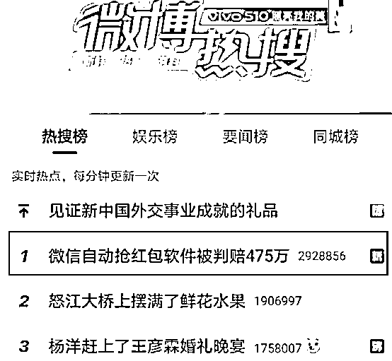

微信自动抢红包软件被判赔 475 万

“微信自动抢红包”软件可以使用户在微信软件后台运行的情况下，自动抢到微信红包，并且设置有“开启防封号保护”应对微信软件的治理措施。

此前，这款软件的开发和运营方掌上远景公司以及提供下载平台的卓易讯畅公司，被微信软件的开发者和运营者腾讯科技公司、腾讯计算机公司以不正当竞争为由诉至北京知识产权法院。

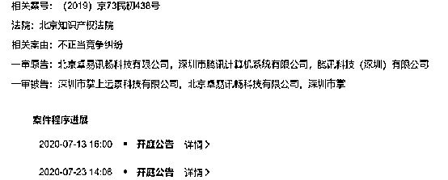

来源：天眼查

值得一提的是，该案中的第二被告卓易讯畅公司是安卓应用豌豆荚的开发公司，腾讯之所以把该公司列入第二被告，是因为豌豆荚上架了掌上远景的“自动抢微信红包”软件。

据北京知产法院 7 月 16 日通告，该院近日审结了这例也是首例与自动抢红包有关的不正当竞争纠纷案。

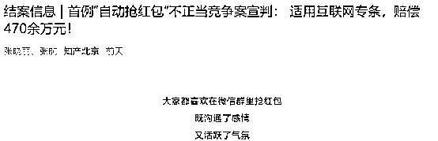

来源：知产北京公众号

因开发“微信自动抢红包”软件，被告掌上远景公司被判构成不正当竞争，赔偿二原告腾讯科技公司、腾讯计算机公司（简称腾讯公司）经济损失 450 万元及合理支出约 25.4 万元。据了解，双方当事人均未提出上诉，目前该案判决结果已生效。

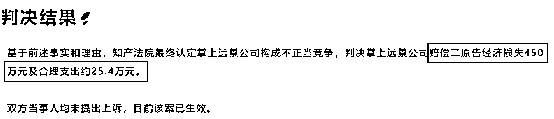

来源：知产北京公众号

累计用户 2000 万

6700 万次下载

**据北京知识产权法院披露，涉案行为自 2016 年 1 月持续至本案审理之时，持续时间长，下载量、用户规模较大。**

**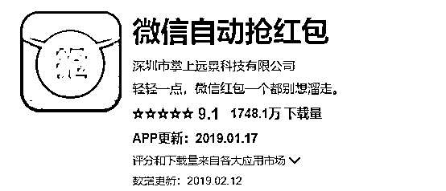**

**涉案软件“微信自动抢红包”在 OPPO 软件商店、PP 助手、“豌豆荚”、华为应用市场、百度手机助手、酷派应用商店等安卓应用分发平台的下载量总计超过 6747.6 万次。**

**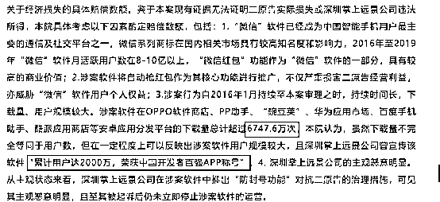**

**来源：知产北京公众号**

**值得一提的是，掌上远景公司还曾宣传该软件“累计用户达 2000 万，荣获中国开发者百强 APP 称号”。**

**此外，该软件还支持语音红包提醒“红包来了”、微信加速秒抢红包、自动回复感谢语等功能。**

**据掌上远景公司官网此前发布的介绍，" 微信自动抢红包 " 软件支持微信红包、QQ 红包、QQ 空间红包、支付宝红包等多种主流红包。同时支持红包锁屏、红包提醒、秒抢红包雨等多种形式。**

**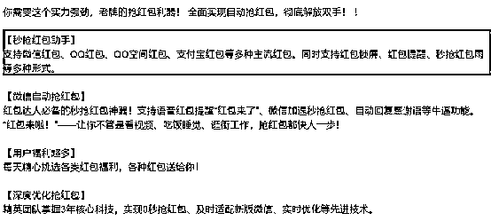**

**天眼查信息显示，这家名为掌上远景的公司成立于 2011 年 7 月，其业务涵盖通讯产品、计算机软硬件技术开发与销售以及信息咨询和服务等。**

**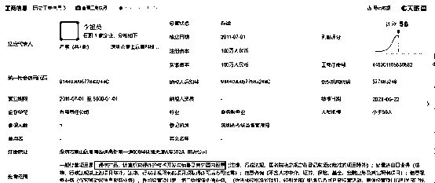**

**2014 年，微信推出收发红包功能，并受到广大用户欢迎。2018 年，掌上远景公司推出被诉软件，并上线应用软件分发平台。此前在招聘网站上还能看到掌上远景关于微信红包方面的软件开发招聘。**

**除微信自动抢红包之外，掌上远景还推出过一款名为红包快手的软件，该软件集成了微信和 qq 的自动抢红包，支持边聊边抢，最后的更新时间为 2019 年 1 月 17 日，据介绍是微信抢红包软件的前身。**

**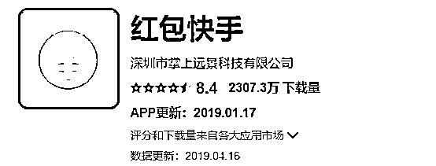**

**腾讯起初索赔 5000 万元******

**事实上，早在 2019 年 4 月份，北京知识产权法院就受理了原告腾讯科技公司、腾讯计算机公司诉“微信自动抢红包”软件运营者不正当竞争纠纷。**

**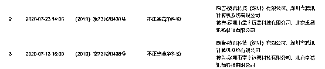**

**来源：天眼查**

**彼时腾讯方面请求法院判令：立即停止开发、宣传、运营“微信自动抢红包”软件的不正当竞争行为；立即停止提供“微信自动抢红包”软件下载服务并停止对该软件进行宣传的不正当竞争行为；连带赔偿原告经济损失及合理支出 5000 万元等。**

**腾讯认为，“微信红包”最具趣味的关键点是“抢”。“抢红包”本身会带来微信群的瞬间活跃并激发传播欲望，具备“钱+游戏+社交”的多重功能，因此一经推出便在市场蹿红。“微信”软件及“微信红包”功能获得的市场竞争优势和商业价值，应依法受到保护。**

**同时腾讯方面认为，首先，在运行“微信自动抢红包”软件时，用户不需要启动“微信”软件，可以自动抢到微信里的红包，破坏微信正常的运行环境和运管秩序。其次，“微信自动抢红包”软件非法监听微信聊天记录，抓取微信聊天记录中涉及红包字样的信息和微信红包中的资金流转情况，严重侵害用户隐私和微信数据安全。**

**最后，“微信自动抢红包”软件运营者是看中“微信”软件超过十亿的用户量和“微信红包”的市场价值，目前已积累了 6000 多万的用户量。这种傍“微信”品牌、搭“微信红包”便车、截取腾讯商业资源的行为，明显违反诚实信用原则和公认的商业道德。**

**更早之前的 2016 年，微信安全中心便首次发布过针对使用用户的“抢红包外挂打击公示”，并对使用账号进行了限制红包功能的处置。2017 年，江苏盐城警方破获全国首例“抢红包外挂软件”案件。**

****掌上远景此前否认侵权************

******对于腾讯公司的起诉，掌上远景公司否认侵权，其在庭审中辩称：首先，被诉软件曾于 2018 年在腾讯应用宝平台上线。******

******该平台系原告所属应用分发平台，其负有事前审核义务，腾讯应用宝平台审核通过了被诉软件，表明腾讯公司已经通过行动确认涉案软件不存在不正当竞争情形。******

******其次，被诉软件与微信软件之间的功能定位不同，二者之间的适度关联性不能推导出二者处于相关市场、存在竞争关系；再次，被诉软件并未改变或破坏微信软件的正常运行，自动抢红包功能只有在获得相关用户授权、许可的情况下才能使用, 并未违反反不正当竞争法的有关规定。******

******五方面认定不正当竞争行为******************

******在该案中，掌上远景公司一直强调被诉软件未改变或破坏微信软件的正常运行，自动抢红包功能只能在获得相关用户授权、许可的情况下才能使用，涉案软件不存在不正当竞争情形。不过，法院对此未予支持。******

******北京知识产权法院经审理认为，判断被诉行为是否构成不正当竞争行为，需要从以下几方面进行分析。******

******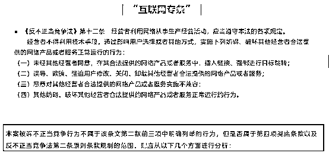******

******来源：知产北京******

******其一，经营者是否利用网络从事生产经营活动，与其他经营者存在竞争关系；其二，经营者是否利用技术手段，通过影响用户选择或者其他方式，实施了妨碍、破坏其他经营者合法提供网络产品或者服务正常运行的行为；其三，该行为是否系扰乱互联网环境中市场竞争秩序，损害其他经营者或者消费者的合法权益的不正当行为；其四，该行为是否违反了诚信原则以及商业道德等。******

******在审理中，法官通过从五方面进行分析，明确争议焦点问题，认定掌上远景不正当竞争行为。******

******首先，二原告与掌上远景公司、卓易讯畅公司均属利用网络从事生产经营活动的经营者，存在市场竞争关系。******

******其次，涉案软件利用技术手段破坏了“微信”软件的正常运行，侵害了二原告的合法权益。此外，批量化、自动化的操作方式也必然会增加“微信”软件运行的数据量和数据流，增加“微信”服务器的运营负担。******

******再次，涉案软件不当地利用了“微信”软件的运营资源和竞争优势，扰乱互联网环境中市场竞争秩序，并损害了软件用户的利益。******

******此外涉案软件亦损害了软件用户的利益。涉案软件相关页面显示，其具有“加速抢红包”“抢大红包功能”等功能项，但实际上涉案软件并没有开发相应功能，点击“加速抢红包”等功能，会显示“优化中”，并在“优化完成”后弹出广告信息。******

******最后，掌上远景公司在实施被诉行为的过程中具有明显恶意，违反了诚信原则以及商业道德。明知二原告对涉案软件持否定态度的前提下，软件未经许可运营涉案软件且设置防封号功能应对二原告的治理措施，违反了诚信原则以及商业道德，主观恶意明显。******

******北京知识产权法院在受理该案后，结合在案证据作出上述判决，一审认定掌上远景公司因开发运营被诉软件而构成对腾讯公司的不正当竞争，须停止侵权并赔偿经济损失等。******

******法院还认为，被告卓易讯畅公司系软件分发平台，提供信息存储空间服务，涉案软件由掌上远景公司自行上传并发布，卓易讯畅公司并未宣传涉案软件，并无证据证明卓易讯畅公司存在帮助他人实施不正当竞争行为的主观意图，不构成不正当竞争。******

******外挂软件侵权频发******************

******事实上，微信抢红包软件只是庞大外挂软件市场的个例之一。******

******在 APP 商场搜索抢红包，红包助手等关键词，便有众多待下载 APP 列表出现。据了解，市场还存在“批量控制微信”“批量控制抖音”“批量控制微博”等外挂软件，不仅可以实现自动抢红包，还能够实现虚拟定位、虚假刷量以及迅速增加粉丝数量等功能。******

******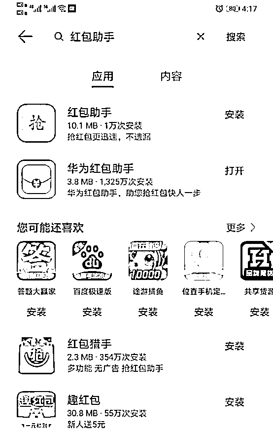******

******人在国内却能发一条定位在国外的微信朋友圈；不用单个查询，就可以批量添加好友……这些看起来“很炫”的功能，其实都能通过“群控软件”实现。******

******在法律人士看来，此类外挂软件存在涉嫌构成不正当竞争等知识产权风险。以微信为例，根据微信服务协议，微信禁止批量注册账号、删减微信以及干扰微信模块和数据等违规行为，微信用户亦不能恶意注册使用微信账号、批量注册账号以及买卖微信账号等行为等。******

******而此前这类软件侵权也已有先例。在抖音起诉“抖管家”“播商管家”等软件不正当竞争纠纷中，广州知识产权法院就曾发布禁令，要求被诉软件开发商广州某梦公司立即停止销售、运营、宣传、推广被诉或者类似的专门针对抖音产品进行功能设置的软件系统等行为。******

******在腾讯公司起诉“红包猎手”“多多抢红包”软件不正当竞争纠纷案中，杭州互联网法院针对腾讯公司提出的申请于今年初作出裁定，要求杭州某科技公司立即停止在网站和应用市场上提供涉案软件及进行相关宣传运营活动等；******

******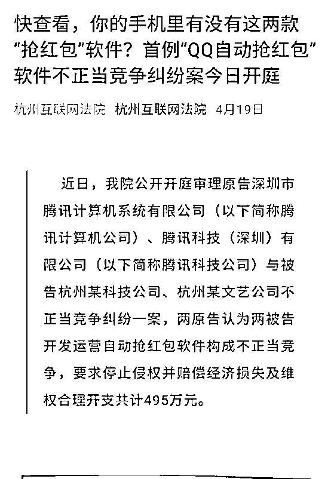******

******来源：中国基金报******

************

******← 向右滑动与灰产圈互动交流 →******

************