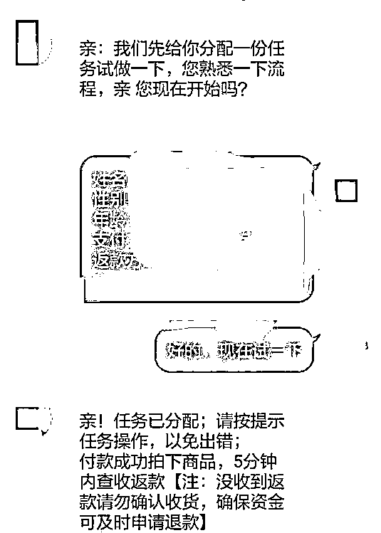

# 任何形式的刷单：都认定为诈骗！

> 原文：[`mp.weixin.qq.com/s?__biz=MzIyMDYwMTk0Mw==&mid=2247517572&idx=5&sn=a041f3ce75a9377035a4b82864517fe7&chksm=97cb4ebca0bcc7aa0cba94ff70aeb9cde28e62a7ee5a03925ce03b93b1d80e83938783ca854c&scene=27#wechat_redirect`](http://mp.weixin.qq.com/s?__biz=MzIyMDYwMTk0Mw==&mid=2247517572&idx=5&sn=a041f3ce75a9377035a4b82864517fe7&chksm=97cb4ebca0bcc7aa0cba94ff70aeb9cde28e62a7ee5a03925ce03b93b1d80e83938783ca854c&scene=27#wechat_redirect)

[`mp.weixin.qq.com/mp/readtemplate?t=pages/video_player_tmpl&action=mpvideo&auto=0&vid=wxv_1950039945327280139`](https://mp.weixin.qq.com/mp/readtemplate?t=pages/video_player_tmpl&action=mpvideo&auto=0&vid=wxv_1950039945327280139)

**一.刷单在生活中很常见** 

新开的奶茶店要火，当然得雇人排队。新开的网店要东西卖出去，也得雇人刷单。如今这种行为在我们的意识里，已经约等同于“常识”。

而这些行为，在几年前还被我们称之为"经营乱象"。

不管是麻木于生活中这种见多不怪的“常识”，还是因为无感于网络上到处出现的刷单兼职广告，有一个严重的盲点就是，我们并没有意识到这是一个违法行为。

**二.这种常见的刷单行为已经是一种违法行为了**

2018 年 1 月 1 日，新修订的《反不正当竞争法》对网络刷单进行了明确规定：

       第八条　经营者不得对其商品的性能、功能、质量、销售状况、用户评价、曾获荣誉等作虚假或者引人误解的商业宣传，欺骗、误导消费者。

　　经营者不得通过组织虚假交易等方式，帮助其他经营者进行虚假或者引人误解的商业宣传。

　　第二十条　经营者违反本法第八条规定对其商品作虚假或者引人误解的商业宣传，或者通过组织虚假交易等方式帮助其他经营者进行虚假或者引人误解的商业宣传的，由监督检查部门责令停止违法行为，处二十万元以上一百万元以下的罚款；情节严重的，处一百万元以上二百万元以下的罚款，可以吊销营业执照。

**你翻译一下，就是——“****刷单犯法，最高罚 200 万****”**

**三.网络招聘兼职刷单 100%是诈骗**

这个世界本没有刷单，骗子发现了，也就招人来刷单了。

现在无论你在哪里搜索“刷单”，搜到的招聘内容 100%是骗子发布的。

因为个人刷单已经被淘宝限制，现在存在的一种刷单形式，也就是商家小量互刷。

而刷单诈骗的目标客户群一般是分三种，一种是涉事未深的大学生，一种是文化程度不高，工资较低的社会青年，还有一种是没有工作的人。 

**四. 每单受骗金额不高，但对受害者打击巨大**

原本就是缺钱用的大学生、社会青年想找兼职，被骗就等于雪上加霜，很容易把这些人推向网络贷款深渊，甚至走上绝路。

**五.刷单套路到底是怎样的？**

**（一）通过 QQ 群，网络小广告吸引目标群体。**

**（二）晒兼职收益，晒付款截图，骗取信任。**

**（三）先甜后苦，先给你糖吃。**

**（四）第二单开始让你付出成本不断加大，最后无路可退。**

**（五）以“任务单未完成”为由拒退本金是刷单诈骗通用手段。由于此时已经付出巨大成本，所以会越陷越深，直到被吃干抹净。**

随着投入的本金越来越多，即使这时受害者已经怀疑受骗，但为了拿回成本，依然会选择再赌一把！而骗子会以批次任务未完成、当天任务未完成、二维码信誉已满无法支付等各种理由搪塞，直到你没钱还借不到钱为止。

反诈中心提醒大家：

 网络刷单诈骗是指犯罪嫌疑人利用招聘网站、兼职类 QQ 群等途径发布虚假兼职(给电商平台商铺刷单以提升信誉度)信息,以高额回报为诱饵,等刷单成功后,再以系统、网络问题等种种借口,要求受害人多次汇款的网络诈骗。

  大家平日要学会提高自己的安全防范意识，对于涉及提前“交纳定金”、“轻松日赚上百”等网络信息要做到“不听、不信、不传”。

来源：雁塔反诈，反诈骗先锋

← 向右滑动与灰产圈互动交流 →

