# 15 个代言，全军覆没

> 原文：[`mp.weixin.qq.com/s?__biz=MzIyMDYwMTk0Mw==&mid=2247517604&idx=2&sn=8b1ea8ea8367ad1eaadb2c84966b1f62&chksm=97cb4e9ca0bcc78aeff2f5de28f2dba2213569b7f4e807aa284a4a355907f9e7cd7056693ce3&scene=27#wechat_redirect`](http://mp.weixin.qq.com/s?__biz=MzIyMDYwMTk0Mw==&mid=2247517604&idx=2&sn=8b1ea8ea8367ad1eaadb2c84966b1f62&chksm=97cb4e9ca0bcc78aeff2f5de28f2dba2213569b7f4e807aa284a4a355907f9e7cd7056693ce3&scene=27#wechat_redirect)

7 月 20 日下午，欧莱雅男士官微发文，表示已终止与吴亦凡的一切合作。至此，吴亦凡总共 15 个代言，14 个终止合作，1 个暂停合作。

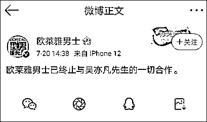

据武汉晨报记者统计，都美竹爆料事件发生之前，吴亦凡名下共 15 个代言，包括高奢品牌路易威登、宝格丽；汽车品牌保时捷；日用护肤品牌兰蔻、欧莱雅男士、滋源、韩束、得宝、立白；食品品牌乐堡啤酒、康师傅冰红茶，以及腾讯视频、华帝、王者荣耀、云听。

此前，宝格丽、保时捷中国、乐堡啤酒、腾讯视频、得宝、康师傅冰红茶、云听 app、韩束、滋源、立白，纷纷发声明宣布与吴亦凡解约。腾讯旗下王者荣耀、华帝、兰蔻声明与吴亦凡合作已到期，不再续约。路易威登则表示已暂停与吴亦凡之合作关系，直至司法调查结果公布。

加之欧莱雅男士 20 日的公告，至此，吴亦凡 15 个商务代言品牌均已暂停或终止与吴亦凡的合作。

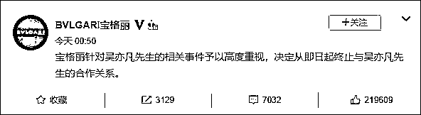

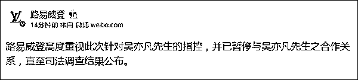

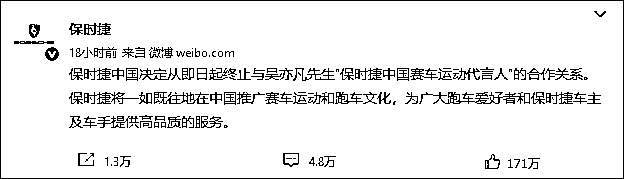

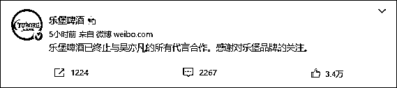

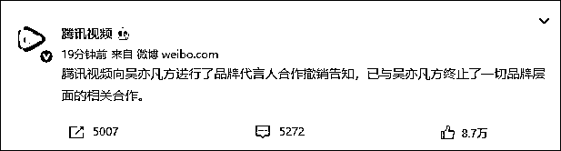

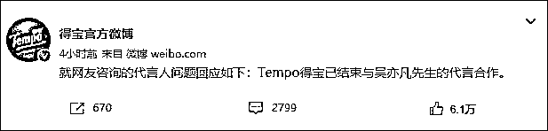

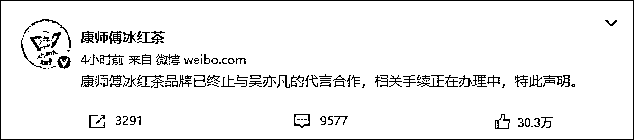

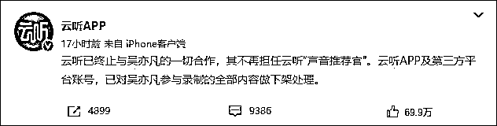

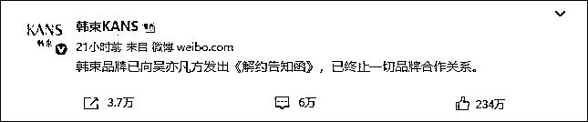

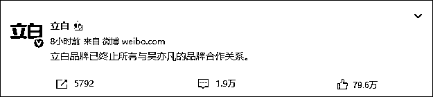

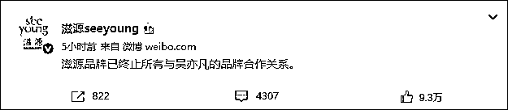

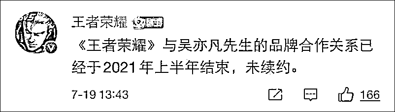

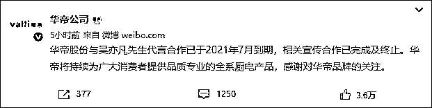

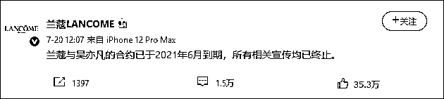

来源：观察者网综合

← 向右滑动与灰产圈互动交流 →

