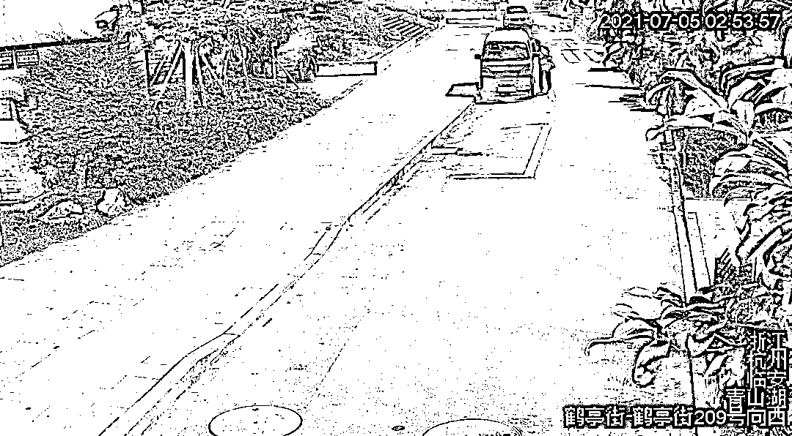
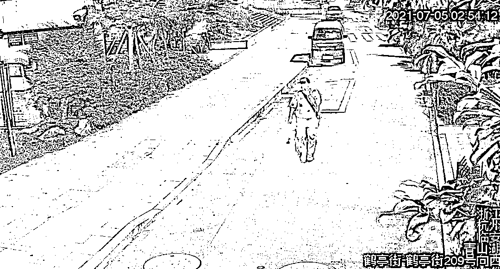
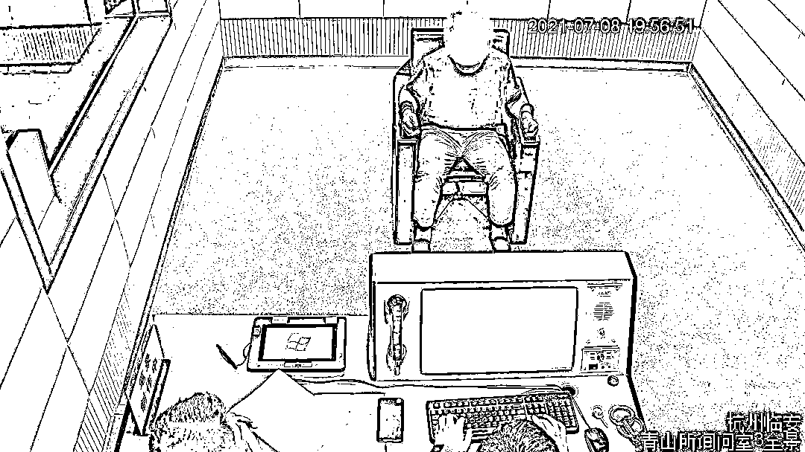
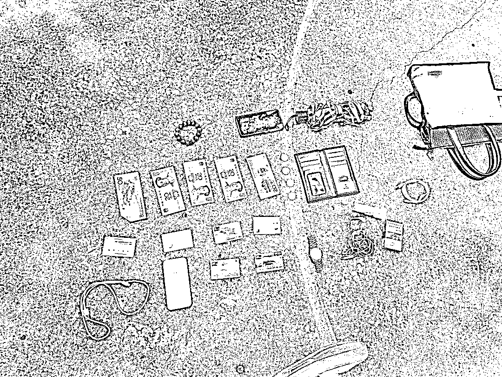
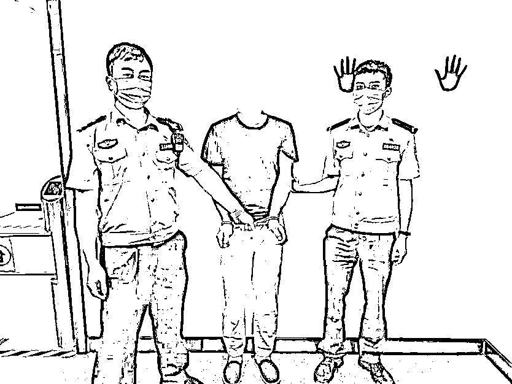

# “我的身体里住着两个灵魂，我控制不住他”，男子盗窃被抓后戏精上线

> 原文：[`mp.weixin.qq.com/s?__biz=MzIyMDYwMTk0Mw==&mid=2247517604&idx=3&sn=00e8bbb271f2f8d932358eab6219b13c&chksm=97cb4e9ca0bcc78a4b772fb260540772332d2bd9880af002b7f144491610cffd67d0abdce1a1&scene=27#wechat_redirect`](http://mp.weixin.qq.com/s?__biz=MzIyMDYwMTk0Mw==&mid=2247517604&idx=3&sn=00e8bbb271f2f8d932358eab6219b13c&chksm=97cb4e9ca0bcc78a4b772fb260540772332d2bd9880af002b7f144491610cffd67d0abdce1a1&scene=27#wechat_redirect)

[`mp.weixin.qq.com/mp/readtemplate?t=pages/video_player_tmpl&action=mpvideo&auto=0&vid=wxv_1964353043613712386`](https://mp.weixin.qq.com/mp/readtemplate?t=pages/video_player_tmpl&action=mpvideo&auto=0&vid=wxv_1964353043613712386)

近日，在浙江杭州的临安青山辖区连续发生两起通过“拉车门”盗窃案件。接警后，民警立即展开调查，通过查看大量视频监控后发现一可疑男子。

监控显示，7 月 5 日凌晨 2 时 50 分，男子游荡在鹤亭街上，一边走一边拉着停在路边的车门，并在青山公园门口时钻进了一辆小货车驾驶室内，一通翻找后走下车，叼着一根烟大摇大摆离开现场。

民警锁定可疑男子的身份和落脚点后，于 7 月 8 日在青山某地将其成功抓获。当民警将男子带回派出所时，他开始了第一波“表演”，笔直躺地上、双目紧闭、不停呻吟，民警将其带到医院检查，经过一系列检查确认男子身体一切正常。民警将其带回派出所后，该男子瞬间清醒。

经调查，该男子叫汤某林，安徽人，今年 45 岁，盗窃前科累累。面对民警的询问，男子开始了第二波“表演”。

**你的个人情况？**

我叫汤某国，45 岁，小学文化，从安徽来临安打工。

**你有无做过违法犯罪的事情？**

我觉得我没有。

审讯时，汤某林一直称自己叫汤某国，并说汤某林是他身体中住着的另一个人，盗窃行为都是汤某林干的，和自己无关。当民警将其盗窃全过程的监控画面给他看时，他的表演又上线了：“这是汤某林的行为，他是无业游民，喜欢好吃懒做，然后去偷点东西。汤某林占用了我的身体去偷东西，我控制不住他，我经常教育他不要去偷了，但是他都不听，就因为这样我之前替他背了好几次锅，我真的恨死他了。”

**“你和汤某林是什么关系？”****“他和我是两个灵魂，但共用一个身体，身份信息也一样的。”****“当时偷了哪些东西？”**“我不清楚，汤某林没有告诉我，我们的记忆是分开的。”**“当时在哪里偷东西？”**“我不清楚，汤某林老是偷东西，害我经常坐牢。”**“你有无精神疾病的既往史？”**“我没有，我不是精神病，我是一个身体有两个灵魂，这无法用科学解释。”面对民警的审讯，该男子表现地越发无厘头。当民警提出带他去安康医院检查时，男子吓得马上承认自己为了躲避公安处罚，谎称有“双重人格”，并如实交代了其两次盗窃车内物品以及盗窃一辆电动自行车的犯罪事实。目前，汤某林因涉嫌多次盗窃已被临安警方依法采取刑事强制措施，案件正在进一步办理中。那些企图以编造谎言“装疯卖傻”来逃避处罚的不法分子，不要心存侥幸！在法律面前人人平等，一旦违法没有人能够逃避法律制裁。**提醒广大车友****停车离开后记得及时锁车****以防财物失窃**来源  临安公安

← 向右滑动与灰产圈互动交流 →

