# 参与活动就返还整形费用？小心！“美丽陷阱”专坑这类人→

> 原文：[`mp.weixin.qq.com/s?__biz=MzIyMDYwMTk0Mw==&mid=2247517604&idx=4&sn=614430da7f70d885d8998eff1d33d076&chksm=97cb4e9ca0bcc78a9ae313b26a014d8ef4e4df67a7e533482de86d33dec635cae57ff9dda1a8&scene=27#wechat_redirect`](http://mp.weixin.qq.com/s?__biz=MzIyMDYwMTk0Mw==&mid=2247517604&idx=4&sn=614430da7f70d885d8998eff1d33d076&chksm=97cb4e9ca0bcc78a9ae313b26a014d8ef4e4df67a7e533482de86d33dec635cae57ff9dda1a8&scene=27#wechat_redirect)

都说奋斗开启成功之门，然而在湖北武汉有这样一家机构，为了怂恿顾客进行消费，不断给顾客灌输一种概念：只要进了他家的大门，你就可以比别人少奋斗很多年，直接走向人生巅峰。

这是一家什么机构，他们又是如何让顾客走向人生巅峰的呢？整件事情，还要从今年三月份，湖北武汉水果湖派出所接到的一宗报案说起。

**1**

**湖北武汉：一医美机构鼓吹变美能使人走向人生巅峰** 

[`mp.weixin.qq.com/mp/readtemplate?t=pages/video_player_tmpl&action=mpvideo&auto=0&vid=wxv_1965717717412282370`](https://mp.weixin.qq.com/mp/readtemplate?t=pages/video_player_tmpl&action=mpvideo&auto=0&vid=wxv_1965717717412282370)

△央视财经《正点财经》栏目视频

报案人小刘今年刚刚大学毕业，在上学期间，她时常会做一些礼仪模特方面的兼职，去年三月份的一天，在一次礼仪模特招工的群聊中，她无意间看到了别人发布的一则广告。

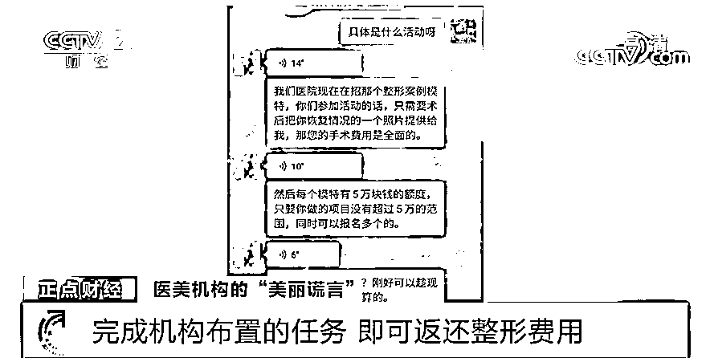

在与发布这则广告的人取得联系后，小刘得知，这是一家名为悦秀医美的整形机构所策划的活动，**顾客只要来到这里，一次性付清整形费用的同时，与他们签署一份协议，保证每个月完成他们所布置的任务，悦秀医美便会将这些费用分期返还给顾客**。这一期间，顾客要充当他们的整形模特，机构方还可以将顾客们整形后的照片用于推广。

  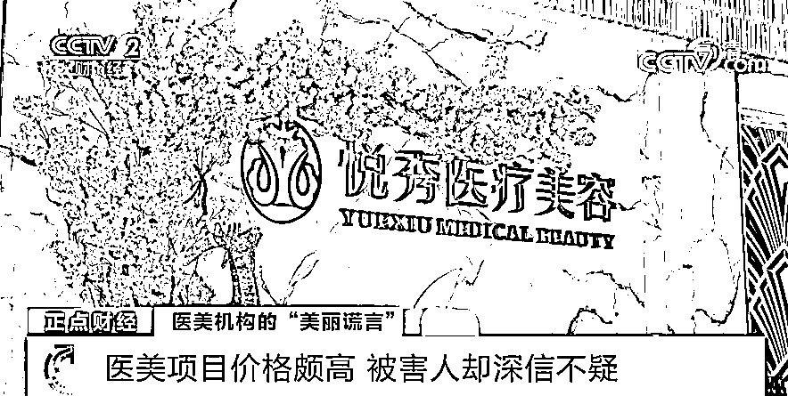

抱着深信不疑的态度，小刘从长沙来到武汉。进入悦秀医美后，工作人员给她介绍了一下项目的价格，她觉得这里的价格似乎高得有些离谱。

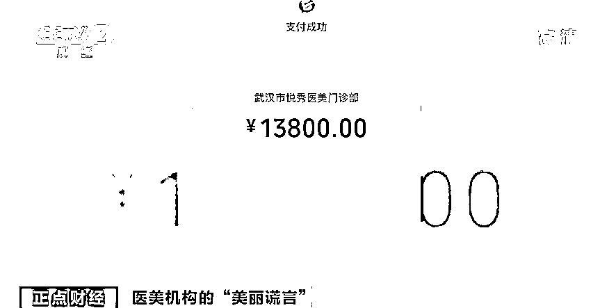

期间，工作人员多次提出希望小刘通过贷款来支付手术的费用，小刘觉得有些麻烦，便没有理会，靠着平日里做兼职所攒下的钱，她一次性付清了手术费用共计一万三千八百元。 

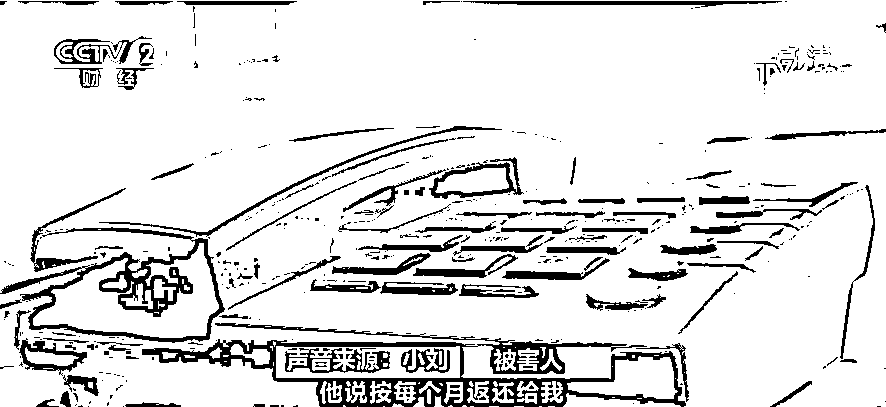

小刘所签署的，正是这样一份名为“兼职推广协议”的合同，甲方是武汉悦秀医疗美容门诊部有限公司，乙方则为顾客。**所谓免费整形，指的正是悦秀医美所推出的一项叫做“分享整形，共享美丽”的活动**，合同中写明了，顾客所兼职的职位为推广大使，**每月兼职的费用，****就是顾客一次性付清整形费用后，医院按照分期返款的方式每月所返还的金额**，绝大多数为 24 期。 

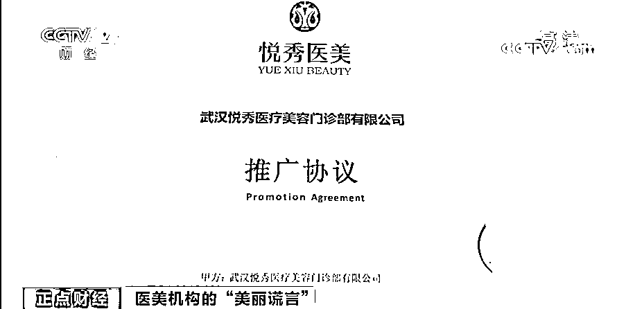

在小刘完成项目回到长沙后，开始按照美容机构的要求每个月完成任务，起初，每个月的确会有钱按时打到小刘的账户，**可在收到返款两个月之后，她却再也没有收到过一分钱**。小刘询问悦秀客服，可得到的反馈却是让她再等一等。 

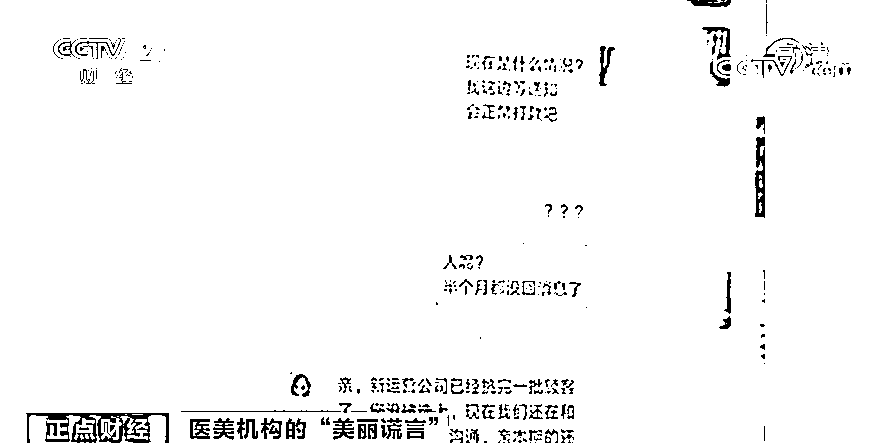

**2**

**医美机构具备正规经营手续 却接连被投诉**

除了小刘以外，当地行政部门还不断地收到关于悦秀医美整形机构的投诉，**其中不少人是通过向这家机构贷款的方式支付费用，因而背上了巨额债务**。

[`mp.weixin.qq.com/mp/readtemplate?t=pages/video_player_tmpl&action=mpvideo&auto=0&vid=wxv_1965718403986292738`](https://mp.weixin.qq.com/mp/readtemplate?t=pages/video_player_tmpl&action=mpvideo&auto=0&vid=wxv_1965718403986292738)

△央视财经《正点财经》栏目视频

在武汉一家商贸公司上班的小韩，平日里总想着能再漂亮一些，她对自己的鼻子一直不太满意，寄希望通过医美做一些整形。和在长沙上学的小刘一样，小韩也是在群聊中看到了医美免费整形的广告，考虑到离得近，小韩来到了悦秀整形机构。

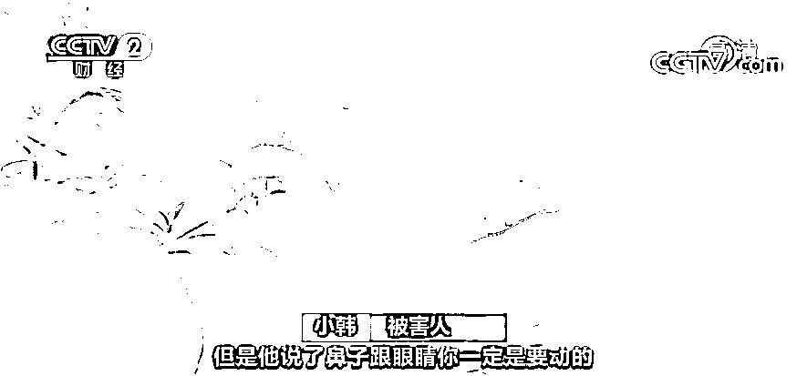

最终，面部多项手术费用共计将近四万五千元钱，小韩通过贷款的方式，付清了所有钱款，并签署了那份兼职推广协议合同。然而，**她没有想到的是，医院并没有按照合同中所写的那样每个月分期返款，她只拿到过一次钱**。

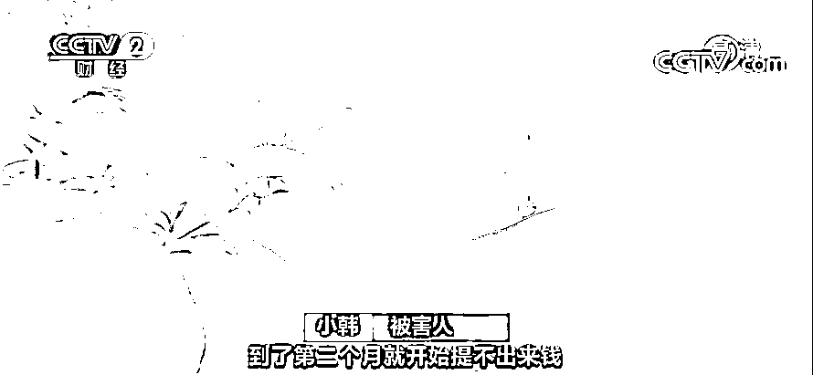

小韩清楚地记得，合同里明明写的是，只要在社交平台发布广告就可以返钱，并不需要拉人消费，她多次咨询客服却始终没有得到实质性的回复。小韩开始每日跑到悦秀医美找负责人理论，**然而最终机构给出的答复竟然是，会把余下的金额兑换成积分，让小韩在悦秀官方商城进行消费**。小韩这才意识到，自己应该是被骗了，就在她想要进行维权的时候，武昌警方联系上了她。 

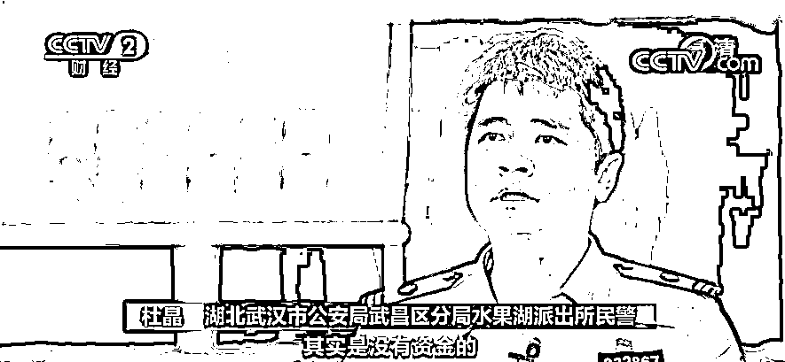

**湖北武汉市公安局武昌区分局水果湖派出所民警 杜晶：**他们大部分人来到医院进行消费其实是没有资金的，就必须通过一个贷款渠道获得资金，然后医院承诺他们帮忙偿还本金，所以我们当时就通过查询贷款公司的情况进行倒查被害人，联系被害人。

警方发现，在全国多地，和小韩有着类似经历的被害人还有很多，这家整形机构通过虚假宣传、套路贷以及违约的方式，让不少被害人身背高额债务。 

**3**

**精挑细选被害人 优先选择外地顾客** 

通过侦查，警方还掌握到，这家医美机构还会组织员工进行话术培训，甚至还编成了顺口溜，例如：印堂有纹，克子伤夫；印堂凹陷，操劳一生等等，他们编造这些莫须有的说法，目的只有一个，那就是让来到这里的被害人尽可能多进行消费。

[`mp.weixin.qq.com/mp/readtemplate?t=pages/video_player_tmpl&action=mpvideo&auto=0&vid=wxv_1965718996188463110`](https://mp.weixin.qq.com/mp/readtemplate?t=pages/video_player_tmpl&action=mpvideo&auto=0&vid=wxv_1965718996188463110)

△央视财经《正点财经》栏目视频

为了防止有朝一日被害人得知真相后找上门来，**这家医美机构在物色被害人时，往往也会精挑细选，优先选择外地的顾客，原因正是，等付了钱、签了合同，就算没有分期返款，外地顾客考虑到成本问题，也不会天天上门要账，给他们造成影响**。加之，客服会承诺给被害人，报销往返机票，不少被害人也因此落入到他们的陷阱当中。 

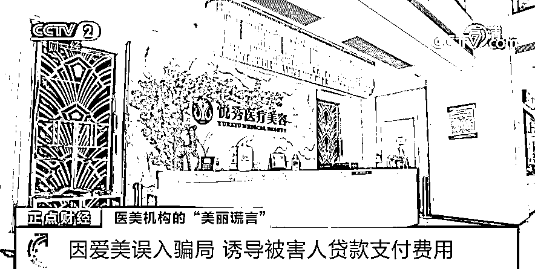

本来，潜在客户因为爱美而入局，殊不知，当他们到了悦秀医美后，便会被接待人员一系列的花言巧语弄得晕头转向，等到犹豫不决之际，这家整容机构便会诱导被害人通过贷款的方式支付整形费用。

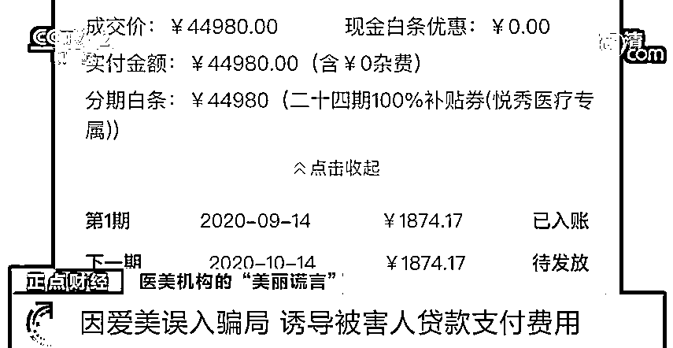

然而，被害人起初不会想到自己贷款的几万元钱，这家医美整形机构根本不会全额返还，她们当中的绝大多数人，从始至终也只收到过寥寥无几的几个月的返款。之后，该整形机构则会以种种借口拒绝继续返款，原因是，被害人没有完成他们所布置的任务。

 经过一段时间细致的调查，**警方获****悉到落****入这次骗局的被害人近 200 人，涉及全国多个省市，涉案金额超过 1000 万元**，2021 年 4 月 12 日，警方决定实施抓捕。

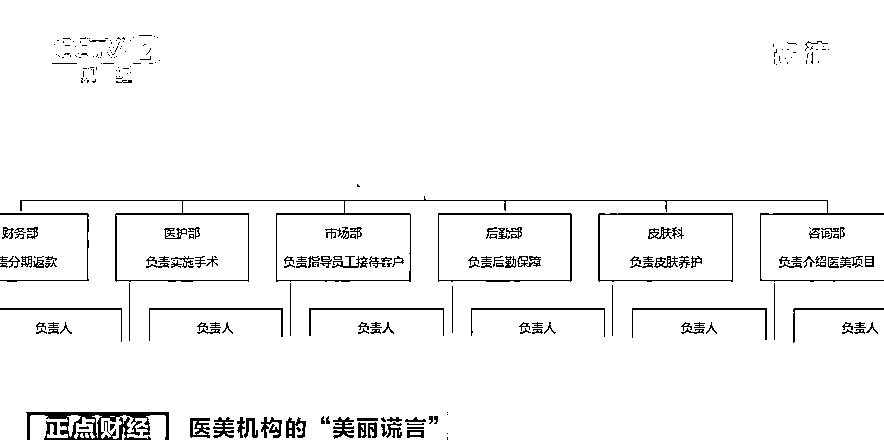

经过审讯，以朱某为首的 12 名犯罪嫌疑人全部如实供述了自己的犯罪行为。这个由他们所制造出来的美丽陷阱被警方成功拆除。目前，12 名犯罪嫌疑人均被武汉警方刑事拘留，案件仍在进一步侦办中。

来源：央视财经

← 向右滑动与灰产圈互动交流 →

