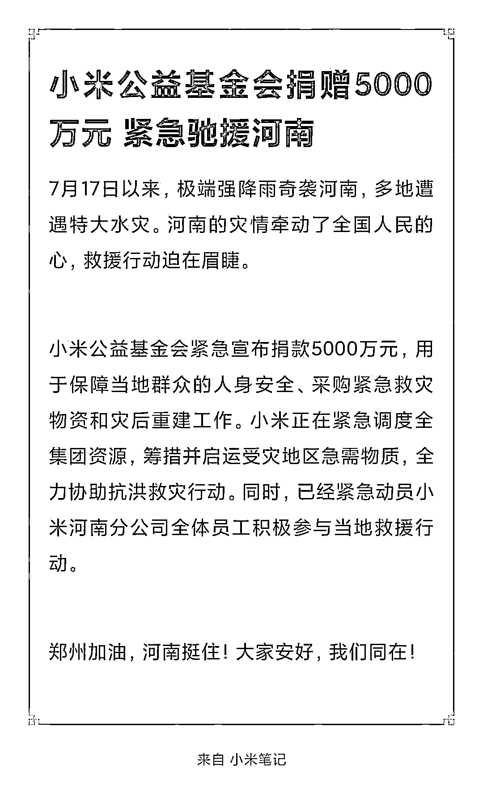
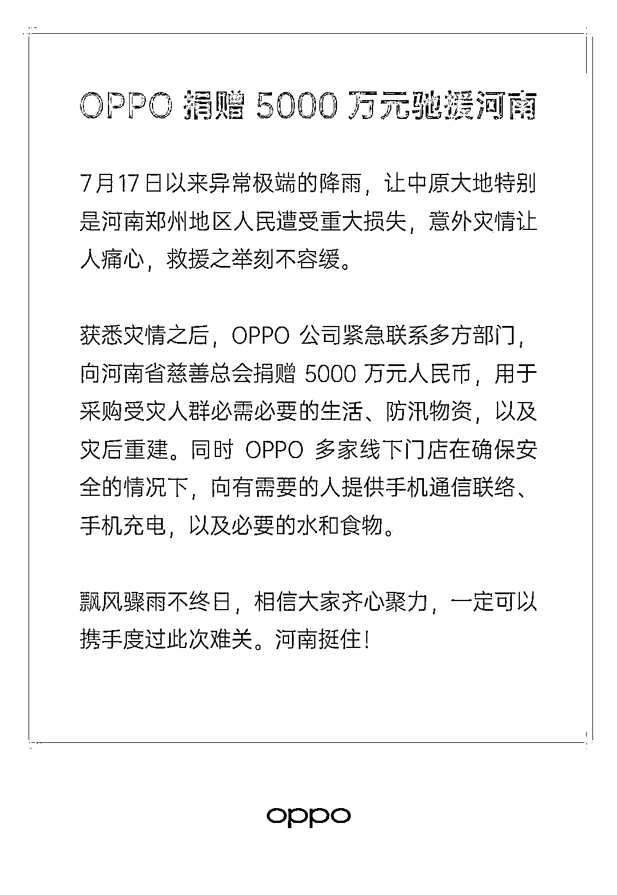

# 危难时大家都在行动，腾讯捐赠 1 亿、拼多多捐赠 1 亿...

> 原文：[`mp.weixin.qq.com/s?__biz=MzIyMDYwMTk0Mw==&mid=2247517661&idx=1&sn=3d6bc68e3a7aa2df7ea6244327eb3aa9&chksm=97cb4ee5a0bcc7f368f56b6e4ddef2fc36aeb6c5511b70c2adee583480720aea8d9b88dcad4b&scene=27#wechat_redirect`](http://mp.weixin.qq.com/s?__biz=MzIyMDYwMTk0Mw==&mid=2247517661&idx=1&sn=3d6bc68e3a7aa2df7ea6244327eb3aa9&chksm=97cb4ee5a0bcc7f368f56b6e4ddef2fc36aeb6c5511b70c2adee583480720aea8d9b88dcad4b&scene=27#wechat_redirect)

**雨还在下！****全国人民的心****都在为河南揪着**据最新消息截至 21 日早上 7 时 郑州全市受灾人口 3.6 万人 紧急转移了近 20 万人7 月 20 日河南遭逢“千年一遇”的极端强降雨 5 个国家级气象观测站日雨量已突破有气象记录以来的极值太多的惊险场景 太多的泪目细节灾难无情人有情越来越多的人向河南伸出援手…… 多家企业也宣布捐赠支援河南河南加油！郑州挺住！ **腾讯捐赠 1 亿元**  

腾讯公益慈善基金会紧急宣布首批捐款 1 亿元，联合前线的救援机构与慈善组织，用于保障当地群众人身安全和紧急采购救灾物资。

腾讯正紧急调动产品技术资源，全力助力政府与社会各界抗洪救灾。

腾讯公司官方公众号发文。

 马云公益基金会、阿里巴巴公益基金会、支付宝

公益基金会联手捐赠 2.5 亿驰援河南 

马云公益基金会紧急捐款 5000 万元，用于受灾地区的紧急赈灾以及灾后恢复和重建。

开展物资救援的同时，阿里巴巴公益基金会和支付宝公益基金会分别紧急捐赠 1 亿元驰援河南。

 蚂蚁集团捐赠 1 亿元 蚂蚁集团通过支付宝公益基金会捐款 1 亿元人民币，同时正在联合公益机构，将善款用于应急救援、灾区防疫、受灾群众生活及心理保障以及灾后重建工作。支付宝“爱心捐赠”平台已联合多家公益机构，开通“驰援河南暴雨灾情”专区。全国网友上支付宝搜“河南加油”，即可通过多家公益机构捐赠善款，支援河南防汛救灾。

 字节跳动捐赠 1 亿元人民币 开通河南暴雨互助通道 北京字节跳动公益基金会宣布捐赠 1 亿元人民币，联合公益机构，优先为受灾地区儿童的安全保障和生活学习提供服务，救助对象包括儿童救助站、孤儿院、安置点等地的儿童。抖音、今日头条紧急开通河南暴雨互助通道，在抖音搜索“河南暴雨互助”，发布视频介绍本人当前情况，或在今日头条搜索“河南暴雨求助”，点击“我要求助”填写相关信息。

 泡泡玛特向河南省慈善总会捐赠 500 万元 

泡泡玛特宣布，向河南省慈善总会捐赠 500 万元定向用于郑州市和新乡市等地防汛救灾工作。其中 350 万元用于购置防汛与灾后重建物资，150 万元用于购置救援设备支持一线社会救援工作。

 小米捐赠 5000 万元 

小米公益基金会宣布捐款 5000 万元，用于保障当地群众的人身安全、采购紧急救灾物资和灾后重建工作。

 拼多多宣布首批捐款一亿元 拼多多宣布首批捐款一亿元，驰援河南抗灾。郑州多多买菜加急盘点本地所有网格站点的食品、药品等救急物资，免费用于保障周边市民救灾及生活需求。目前，多多买菜工作人员正紧急联动河南省内外的供应商，采购救灾及生活物资补充供给，并将通过全市近两万个门店网点，免费提供给受灾群众。拼多多技术团队第一时间开发上线“应急救灾物资反馈入口”，收集受灾地区抗灾需求，提供信息对接和物资支持。

 快手捐赠 5000 万 

据快手官方发布的消息，快手科技决定捐款 5000 万元，并配合河南当地政府，进行救灾紧急举措和灾后恢复工作。同时，快手还在第一时间联系平台各行业主播，进行物资支援。

 百度捐赠 9000 万元 百度基金会紧急捐赠 9000 万元人民币驰援河南抗险救灾。百度 App 紧急开通【河南暴雨互助】通道，搜索河南暴雨、郑州暴雨等关键词即可直达入口。如果需要救助，可在该通道内发布自己当前情况、联系方式、所处地址、所需物资等具体信息。

 喜茶捐款 500 万支援河南 

喜茶已向郑州慈善总会捐款 500 万元，用于防汛救灾。同时，正在紧急调动资源启动物资捐赠，希望能够为防汛救灾工作提供更多支持。

 美团捐赠 1 亿元 

美团公益基金会捐赠 1 亿元人民币，联合中国红十字基金会，优先为受灾群众生活安置、灾后卫生防疫等提供服务。遭遇图中紧急情况的郑州居民，可通过美团紧急上线的救援服务获得帮助。

 滴滴捐赠 1 亿元 

滴滴宣布暂停郑州出行服务，组织防汛救灾保障车队，滴滴郑州车辆交付中心临时升级为紧急避难点（郑州市开发路和丹枫路交叉口）。滴滴公益基金会首批捐款 1 亿元驰援河南，联合前线的救援机构与慈善组织，用于保障当地群众人身安全、紧急采购救灾物资，以及灾后重建。

 360 集团、360 数科宣布捐赠 4000 万 

360 集团宣布，“360 集团及创始人、董事长周鸿祎将捐赠 2000 万，360 数科宣布捐赠 2000 万，并通过 360 公益基金会联合当地救援机构和慈善组织，紧急筹措相关救灾物资，投入一线救灾工作。”

 富士康捐赠 1 亿元 

工业富联宣布代表富士康集团，宣布捐款一亿元，用于河南当地的救灾工作和灾后重建。截至目前，工业富联郑州子公司园区内人员均安全。

 顺丰公益基金会捐赠 2000 万元 

顺丰集团宣布，顺丰公益基金会捐赠 2000 万元，用于当地受灾群众人身安全、紧急救灾物资采购与运输，以及灾后困难群众生活救助。顺丰公益基金会、顺丰各地分公司目前协调到 30000 个编织袋正在抓紧运往前线，抗汛装沙。

 OPPO 捐赠 5000 万元 OPPO 宣布向河南省慈善总会捐赠 5000 万元人民币，用于采购受灾人群必需必要的生活、防汛物资，以及灾后重建。同时 OPPO 表示，多家线下门店在确保安全的情况下，向有需要的人提供手机通信联络手机充电，以及必要的水和食物。

 高途创始人陈向东捐赠 2000 万元 

高途宣布创始人陈向东捐赠 2000 万元驰援河南，用于灾区学校重建。

 水滴公益筹集善款超过 300 万 

水滴公益发起紧急救灾行动，联合前线的救援机构与慈善组织，发起善款筹集与前线紧急救援行动。截至目前，水滴公益“驰援河南等地洪灾”慈善募捐项目已筹集善款超过 300 万，善款将用于保障当地群众人身安全和紧急采购救灾物资。

 理想汽车捐款 1000 万 

理想汽车宣布，向河南省慈善总会捐款 1000 万，用于防汛救灾工作。理想汽车将密切关注灾情的发展，全力支持救灾工作。

 爱尔眼科捐赠 500 万元 

爱尔眼科向中国红十字会总会、河南省红十字会、郑州市红十字会定向捐赠共计 500 万元，用于抢险救灾工作。

 联想集团向河南灾区捐赠 5000 万元 

联想集团宣布，将向河南灾区捐赠 5000 万元人民币，同时集结 500 名专业 IT 服务工程师成立联想 IT 服务救援队驰援河南。

 度小满金融捐款 1000 万元 

度小满金融向河南省慈善总会捐款 1000 万元紧急驰援河南灾区。善款用于灾区的应急救援、物资采购困难群众安置、灾后重建等工作。

 realme 宣布捐赠 500 万元人民币 

realme 将向河南省慈善总会捐赠 500 万元人民币，用于采购防汛物资、应急救援、改善受灾群众生活以及灾后重建工作。

 vivo 捐赠 5000 万元 

vivo 向河南慈善总会捐赠 5000 万人民币，用于开展救灾、安置、重建工作。

 B 站捐赠 2000 万元专项资金 

哔哩哔哩宣布，将向中国扶贫基金会捐赠 2000 万元专项资金，启动紧急驰援河南行动。此次救援专项资金将用于灾区紧急救援和灾后恢复重建。

 悦刻捐款 300 万元 

悦刻发布捐赠和帮扶计划，将捐款 300 万元用于应急物资救援。同时，成立河南受灾门店帮扶基金，用于门店修缮和灾后帮扶计划。

 蔚来捐赠 1500 万 

郑州及河南多地遭受极端强降雨天气引发的内涝灾害，蔚来捐赠 1500 万元人民币，支持抗灾、救灾工作。灾情发生后，蔚来已调动数十辆移动加电车和服务车，尽力为用户提供快捷、全方位的服务，减轻灾害带来的损失与不便。蔚来用户信托基金也正在制定方案，为受灾情影响的用户们提供更多关爱。

 陌陌捐赠 1000 万元 北京陌陌科技有限公司宣布，将捐赠 1000 万元驰援河南，联合前线的慈善组织及救援机构，用于紧急救灾物资采购等方面的工作。同时，陌陌 App 已紧急上线了 “河南暴雨求助&互助通道”，当地用户可以发布自己的具体位置、所需救助或物资信息。

 万科公益基金会捐赠 5000 万元 

7 月 21 日，万科公益基金会通过中国光彩事业基金会向河南省红十字会捐赠 5000 万元，支援河南防汛抢险救灾工作。捐赠主要用于保障当地群众人身安全、采购紧急救灾物资和灾后重建工作。

 龙湖公益基金会捐赠 2000 万元紧急驰援河南 

7 月 21 日，龙湖公益基金会宣布通过重庆光彩事业基金会，向郑州市慈善总会捐赠 2000 万元，紧急驰援河南暴雨灾害，用于保障当地群众的人身、财产安全，采购紧急救灾物资和支援灾后重建工作。

飞猪、携程、去哪儿、同程、途牛、途家等

在线旅游平台宣布

河南省受影响订单免费退订

退订损失将由平台承担

还有更多的爱心企业在行动

**一方有难，八方支援****无论发生什么事情****在你的背后都站着****一个强大的祖国！****愿一切顺利** **平安归来****河南，挺住！** 

来源 | 潇湘晨报综合中央政法委长安剑、微博、各大平台官方微信等

← 向右滑动与灰产圈互动交流 →

