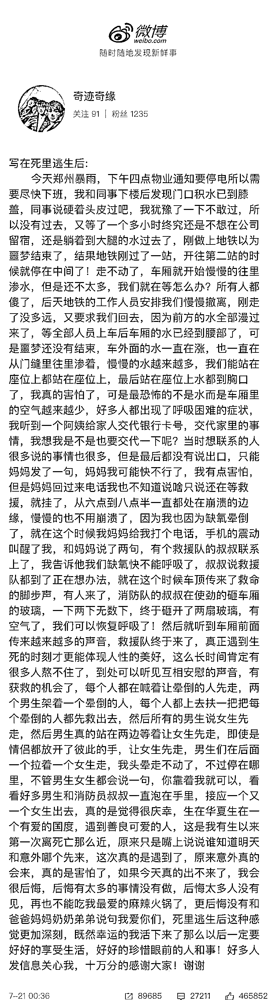

# 网友回顾郑州暴雨被困地铁，“每个人都在喊：让晕倒的先走，让女生先走”

> 原文：[`mp.weixin.qq.com/s?__biz=MzIyMDYwMTk0Mw==&mid=2247517661&idx=2&sn=b1d5b167db1fb9f44981345bf4149eac&chksm=97cb4ee5a0bcc7f3963e23ea209a5449c910cf1f3e57a7a19cd29a3e54fdcc3c1999cf79de44&scene=27#wechat_redirect`](http://mp.weixin.qq.com/s?__biz=MzIyMDYwMTk0Mw==&mid=2247517661&idx=2&sn=b1d5b167db1fb9f44981345bf4149eac&chksm=97cb4ee5a0bcc7f3963e23ea209a5449c910cf1f3e57a7a19cd29a3e54fdcc3c1999cf79de44&scene=27#wechat_redirect)

7 月 21 日凌晨，网友“奇迹奇缘”发布了一篇《写在死里逃生后》的博文:“每个人都在喊着让晕倒的人先走，然后所有的男生说女生先走，即使是情侣都放开了彼此的手，让女生先走，我头晕走不动了，不管男生女生都会说一句，你靠着我就可以。看看好多男生和消防员叔叔一直泡在手里，接应一个又一个女生出去，生在华夏生在一个有爱的国度，真的是觉得很庆幸！”

该网友还表示，“死里逃生后这种感觉更加深刻，既然幸运的我活下来了那么以后一定要好好的享受生活，好好的珍惜眼前的人和事！好多人发信息关心我，十万分的感谢大家！”

这篇博文迅速登上热搜，数百万人点赞转发。

来源 | 潇湘晨报

← 向右滑动与灰产圈互动交流 →

