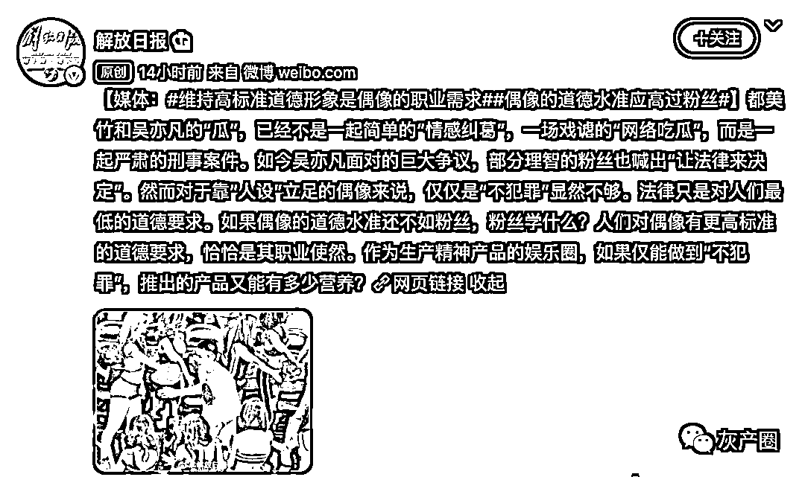

# 吴亦凡被封杀？一封红头文件出现后又神秘消失！

> 原文：[`mp.weixin.qq.com/s?__biz=MzIyMDYwMTk0Mw==&mid=2247517661&idx=3&sn=446dcf60cbc15ed396fd6eeb26618219&chksm=97cb4ee5a0bcc7f345f5138bec7d6b80be2cea7a5cc875c8a93ab413b9baa980834d76534104&scene=27#wechat_redirect`](http://mp.weixin.qq.com/s?__biz=MzIyMDYwMTk0Mw==&mid=2247517661&idx=3&sn=446dcf60cbc15ed396fd6eeb26618219&chksm=97cb4ee5a0bcc7f345f5138bec7d6b80be2cea7a5cc875c8a93ab413b9baa980834d76534104&scene=27#wechat_redirect)

吴亦凡事件发酵后，官媒陆续下场发声
昨天，一封红头文件直指吴亦凡的演艺生涯
青年工作委员会的青刊发布《关于做好劣迹艺人风险控制通知》，对失德演员劣迹艺人“零容忍”。然而文件发布之后不久就删除了网友是这么解读的 

wb8089:已经盖了公章，说明这个文件在这个委员会内部各级是审批通过了的。

春卷 :还有多少此类艺人？一起查一查，晒一晒吧！

_ 小院闭门风露下:这种文件不是儿戏 不会轻易被公关的

来源：微博那些事儿

← 向右滑动与灰产圈互动交流 →

