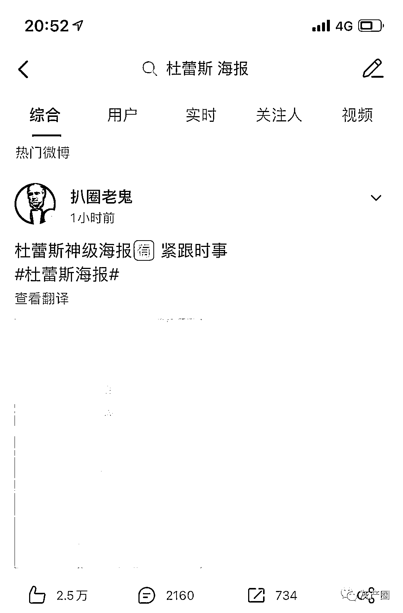

# 网传杜蕾斯的百万文案大师出手了“自命不凡”，杜蕾斯没敢认领！

> 原文：[`mp.weixin.qq.com/s?__biz=MzIyMDYwMTk0Mw==&mid=2247517661&idx=4&sn=e0f7d79f20424045d2aeff944e777f5d&chksm=97cb4ee5a0bcc7f3462ac85d334c0307e467bf536b5d30eb6c3f1f4620c705a70e3117556f6d&scene=27#wechat_redirect`](http://mp.weixin.qq.com/s?__biz=MzIyMDYwMTk0Mw==&mid=2247517661&idx=4&sn=e0f7d79f20424045d2aeff944e777f5d&chksm=97cb4ee5a0bcc7f3462ac85d334c0307e467bf536b5d30eb6c3f1f4620c705a70e3117556f6d&scene=27#wechat_redirect)

都说杜蕾斯有百万文案大师，每逢热点总会出现让人眼前一亮的文案
这次吴亦凡的事，网友们一直在等杜蕾斯的文案 昨天就有营销号声称---杜蕾斯最新海报文案:自命不凡。双关大师虽迟但到 虽然文案很杜蕾斯，但是小编并没有在杜蕾斯官方微博找到这个文案，只找到了一则辟谣： 虽然是假的，但是太“绝”了！（顺便给王思聪也辟个谣）

* * *

怎么才能搞到好多好多钱:杜蕾斯高层是做梦也要笑醒的程度

香菜养香猪:凢凢值得啊

等曾可妮赚大钱养我:我以为，杜蕾斯找吴亦凡代言……………………

来源：微博那些事儿

← 向右滑动与灰产圈互动交流 →

